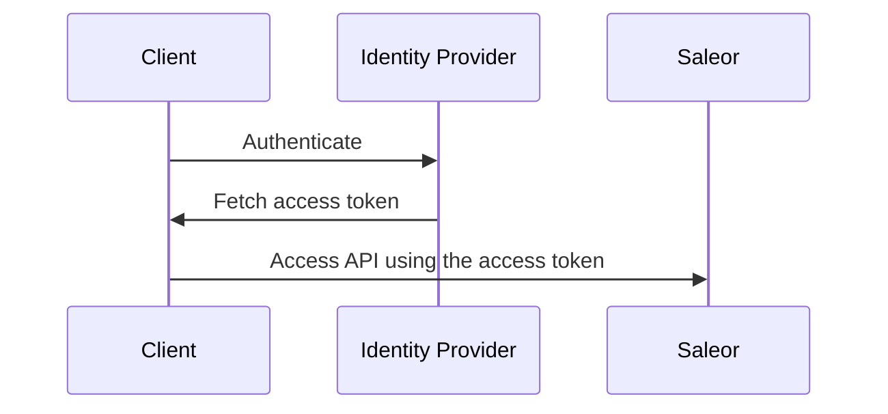
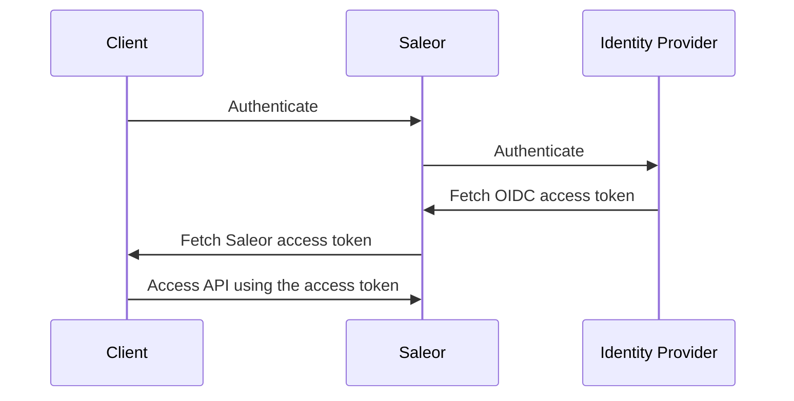

This document describes different ways in which clients can authenticate with the API.

## Authentication vs. authorization

Authentication is the process of verifying the identity of an actor. Authorization is the process of verifying what permissions the actor has to access a resource.

Saleor recognizes two types of actors:

- **Users**: either customers or staff members (humans)
- **Apps**: third-party integrations (programs)

User tokens are short-lived and are used to access resources related to the user, such as their cart or orders.

App tokens are long-lived and are used to access resources related to the app, such as products or orders.

See [permissions](developer/permissions.mdx) for more information on permissions.

## User authentication using email and password

This is the most common way of authenticating users. It is used in the Saleor Storefront and Dashboard.

To authenticate a user, you need to use the [`tokenCreate`](api-reference/mutations/token-create.mdx) mutation. It takes an email and password as input and returns an **access token** that can be used to access resources related to the user and a **refresh token** that can be used to generate future access tokens.

```graphql
mutation {
  tokenCreate(email: "hello@example.com", password: "password") {
    token
    refreshToken
    errors {
      field
      message
    }
  }
}
```

A valid email and password will return a `token` that can be passed to the `authorization` header of subsequent HTTP requests:

```http
POST /graphql/ HTTP/1.1
...
Authorization: Bearer <token>
```

Alternatively, if you already use that header for proxy authentication, you can pass the token in the `authorization-bearer` header:

```http
POST /graphql/ HTTP/1.1
...
Authorization: ...
Authorization-Bearer: <token>
```

### Access token structure

Saleor's access tokens are [JSON Web Tokens](https://jwt.io) signed with RS256.

A decoded token has the following structure:

```json
{
  "iat": 1671039993,
  "owner": "saleor",
  "iss": "http://demo.saleor.io/graphql/",
  "exp": 1671040293,
  "token": "K3IJEFFZgshc",
  "email": "admin@example.com",
  "type": "access",
  "user_id": "VXNlcjo1OQ==",
  "is_staff": true
}
```

You can verify tokens in your code by checking that it's signed with a trusted key. You can find the necessary JSON Web Key Set (JWKS) by visiting `https://<your-saleor-domain>/.well-known/jwks.json`.

### Verifying the access token

To verify a token, use the [`tokenVerify`](api-reference/mutations/token-verify.mdx) mutation:

```graphql {2}
mutation {
  tokenVerify(token: "<token>") {
    isValid
    errors {
      field
      code
    }
  }
}
```

You can also use the [`me`](api-reference/queries/me.mdx) query to retrieve information about the currently authenticated user:

```graphql
{
  me {
    id
    email
  }
}
```

### Refreshing the access token

To refresh the access token, you need to use the `tokenRefresh` mutation. It takes a refresh token as input and returns a new access token.

```graphql
mutation {
  tokenRefresh(refreshToken: "<refresh-token>") {
    token
  }
}
```

### Deactivating all tokens of a particular user

The [`tokensDeactivateAll`](api-reference/mutations/tokens-deactivate-all.mdx) mutation will invalidate all tokens (access and refresh, including the token used to invoke the mutation) that belong to the invoking user.

```graphql
mutation {
  tokensDeactivateAll {
    errors {
      field
      message
      code
    }
  }
}
```

## User authentication using OpenID Connect

OpenID Connect (OIDC) is an [OAuth 2.0](https://oauth.net/2/) extension allowing the transfer of identity information between the client and the authorization server.

Saleor supports OIDC authentication in two modes:

- **Single Sign-On (SSO)**: the client receives the access token directly from the authorization server and uses it to authenticate with Saleor. Implicit flow is the most common way of authenticating users in Single Page Applications (SPAs).

- **Saleor as an OIDC client**: the client uses Saleor as a proxy to the authorization server.

To enable OIDC authentication, you must enable and configure the OpenID Connect plugin using the Saleor dashboard.

### OAuth scopes

The implicit flow requires the following scopes to operate:

- `openid`: required by the OIDC specification
- `profile`: required to retrieve the user's information
- `email`: required to retrieve the user's email address
- `saleor:<permission>`: optional, used to determine user permissions

### Permissions

If **Use OAuth scope permissions** is enabled, any permissions granted to a user on the authentication provider side will be used as the effective permissions on the Saleor side.

If the plugin is configured to manage user permissions, you need to create OAuth scopes corresponding to Saleor permissions on the identity provider side. The plugin will request lowercase scope names based on the [`PermissionEnum`](api-reference/enums/permission-enum.mdx). For example, the `MANAGE_PRODUCTS` corresponds to the `saleor:manage_products` scope.

Saleor will look for supported permissions in the `scope` field of the access token. If the `scope` doesn't contain any Saleor permissions, Saleor will look for permissions in the token's `permissions` field.

Please see the documentation of your authentication server to see how to manage permissions and configure role-based access control (RBAC).

See also:

- [Amazon Cognito documentation on OIDC](https://docs.aws.amazon.com/cognito/latest/developerguide/cognito-userpools-server-contract-reference.html)
- [Auth0 documentation on RBAC](https://auth0.com/docs/manage-users/access-control/rbac)

## OIDC Single Sign-On (SSO) flow

In this mode, Saleor's API only verifies if the token included in the request is valid.

Operations like login, logout, or token refresh have to be handled by your code and are best handled using the identity provider's native SDK.

### Authentication flow



### Setup

To use this flow, you need to configure the OIDC plugin providing values for **JSON Web Key Set URL** and **User info URL**.

Once you obtain the access token, include it in the HTTP `authorization` header when making requests to the API:

```http
POST /graphql/ HTTP/1.1
...
Authorization: Bearer <access-token>
```

## Saleor as an OIDC client (legacy) flow

In this mode, Saleor acts as a proxy between the client and the authorization server. It handles the login, logout, and token refresh operations.

### Authentication flow



### Setup

To use this flow, you need to configure the OIDC plugin by providing values for **JSON Web Key Set URL**, **OAuth Token URL**, and **OAuth Authorization URL**.

Once you obtain the access token, include it in the HTTP `authorization` header when making requests to the API:

```http
POST /graphql/ HTTP/1.1
...
Authorization: Bearer <access-token>
```

### Initiating the authentication flow

To authenticate the user, you will need to redirect them to the identity provider's login page.

Start by calling the [`externalAuthenticationUrl`](api-reference/mutations/external-authentication-url.mdx) mutation passing `"mirumee.authentication.openidconnect"` as the `pluginId` argument and include a `redirectUri` parameter in the `input` argument:

```graphql
mutation {
  // highlight-start
  externalAuthenticationUrl(
    pluginId: "mirumee.authentication.openidconnect"
    input: "{\"redirectUri\":\"https://example.com/callback\"}"
  ) {
  // highlight-end
    authenticationData
    accountErrors {
      field
      message
    }
  }
}
```

The resulting `authenticationData` field will contain the authorization URL:

```json
{
  "data": {
    "externalAuthenticationUrl": {
      // highlight-next-line
      "authenticationData": "{\"authorizationUrl\": \"https://saleor-test.eu.auth0.com/authorize?response_type=code&client_id=RUgv72Cvzd5xjlMtgOEQLJ8QF4eQ3e1U&redirect_uri=https%3A%2F%2Fexample.com%2Fcallback&scope=openid+profile+email+offline_access&state=eyJyZWRpcmVjdFVyaSI6Imh0dHA6Ly8xMjcuMC4wLjE6MzAwMC9jYWxsYmFjayJ9%3A1l1W9H%3AFsxnhejCQKB4JdFL-t0BqNPrHtODh9T0mG2E3KzT-bQ\"}",
      "accountErrors": []
    }
  }
}
```

Next, redirect the user to the identity provider's login page. Once the user is authenticated, the identity provider will redirect them to the `redirectUri` you provided in the `externalAuthenticationUrl` mutation.

### Obtaining an access token

The [`externalObtainAccessTokens`](api-reference/mutations/external-obtain-access-tokens.mdx) mutation will allow you to exchange the token returned by the identity provider for a Saleor access token.

Once again, you will need to pass `"mirumee.authentication.openidconnect"` as the `pluginId` argument, this time including the `code` and `state` received in the query parameters:

```graphql
mutation {
  // highlight-start
  externalObtainAccessTokens(
    pluginId: "mirumee.authentication.openidconnect"
    input: "{\"code\": \"uLB...LJ3\", \"state\": \"eyJ...c-E\"}"
  ) {
  // highlight-end
    token
    refreshToken
    user {
      id
      email
    }
    accountErrors {
      field
      code
      message
    }
  }
}
```

### Refreshing tokens

The [`externalRefresh`](api-reference/mutations/external-refresh.mdx) mutation will generate a new access token when given a valid refresh token.

As with the previous calls, you will need to pass `"mirumee.authentication.openidconnect"` as the `pluginId` argument, this time including the `refreshToken`:

```graphql
mutation {
  // highlight-start
  externalRefresh(
    pluginId: "mirumee.authentication.openidconnect"
    input: "{\"refreshToken\": \"xJc...Uas\"}"
  ) {
  // highlight-end
    token
    refreshToken
    accountErrors {
      field
      message
      code
    }
  }
}
```

### Verifying tokens

To verify the token, use the following [`externalVerify`](api-reference/mutations/external-verify.mdx) mutation.

Once again, you will need to pass `"mirumee.authentication.openidconnect"` as the `pluginId` argument, this time including the `token`:

```graphql
mutation {
  // highlight-start
  externalVerify(
    pluginId: "mirumee.authentication.openidconnect"
    input: "{\"token\": \"eyJ0eXAiOiJK...J1M7tqSzP0\"}"
  ) {
  // highlight-end
    isValid
    user {
      userPermissions {
        code
        name
      }
    }
  }
}
```

The `user` field will contain the user's details if the token is valid.

### Logging out

Logging out requires the user to be redirected to the identity provider's logout page.

You can prepare the logout URL by calling the [`externalLogout`](api-reference/mutations/external-logout.mdx) mutation. Any parameters you pass in the `input` argument will be included in the logout URL.

```graphql
mutation ($input: JSONString!) {
  // highlight-start
  externalLogout(
    pluginId: "mirumee.authentication.openidconnect"
    input: "{\"returnTo\": \"https://example.com\"}"
  ) {
  // highlight-end
    logoutData
    accountErrors {
      field
      message
      code
    }
  }
}
```

The `logoutData` field will contain the logout URL:

```json
{
  "data": {
    "externalLogout": {
      // highlight-next-line
      "logoutData": "{\"logoutUrl\": \"https://saleor-test.eu.auth0.com/v2/logout?returnTo=https%3A%2F%2Fexample.com\"}",
      "accountErrors": []
    }
  }
}
```

Next, redirect the user to the identity provider's logout page.

## App authentication

Unlike regular users, Saleor Apps have long-living tokens they can use to communicate with the API. The tokens are assigned at the App installation time and must be stored securely.

The authorization header for Apps is similar to the one used for users:

```http
POST /graphql/ HTTP/1.1
...
Authorization: Bearer <app-token>
```

### Dashboard extensions

Saleor Apps extending the dashboard will be passed a special JSON Web Token (JWT) with the effective permission set equal to the intersection of user and application permissions. This token allows your frontend part to access the API on behalf of the user.

You can also use this token to authenticate browser calls to your application's API by validating the token in your backend. See the user authentication section for more details on obtaining the necessary JWKS.

See the [Saleor SDK documentation](https://github.com/saleor/saleor-app-sdk/blob/main/docs/app-bridge.md#events) for more details on how to receive the token.

## Authentication with Playground

If you are using [Playground](./developer-tools.mdx#playground) to access the API, you can authorize your requests by providing user or app token in the _HTTP HEADERS_ tab. To do that, paste the following JSON structure into the tab, replacing the token with your real token:

```json
{
  "Authorization": "Bearer <your-access-token>"
}
```

:::note
User tokens are short lived and need to be manually refreshed.
:::
