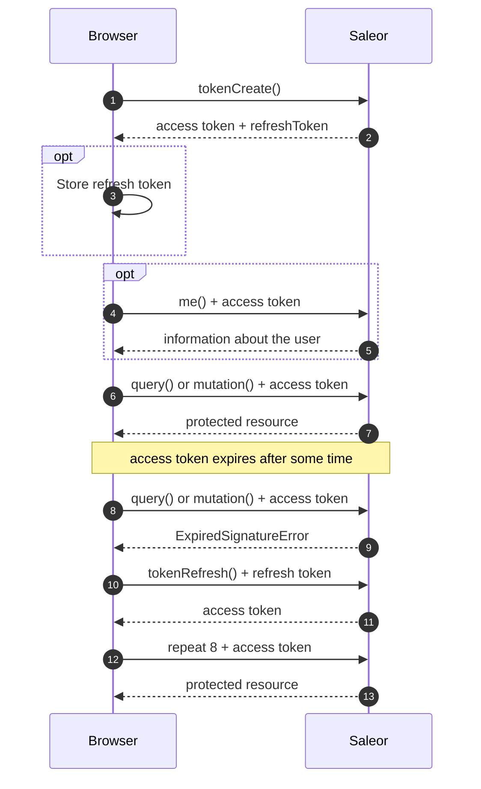
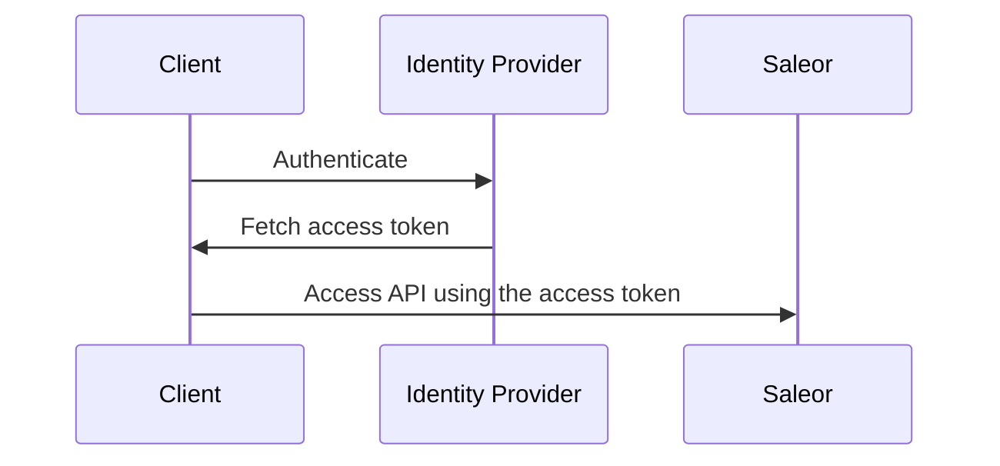
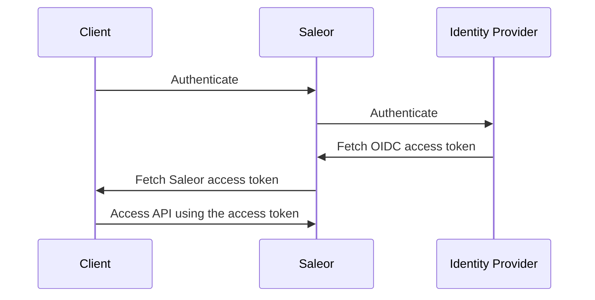

This document describes different ways in which clients can authenticate with the API.

:::info Authentication vs. authorization
Authentication is the process of verifying the identity of an actor. Authorization is the process of verifying what permissions the actor has to access a resource.
:::

Saleor recognizes two types of actors:

- **Users**: either customers or staff members (humans)
- **Apps**: third-party integrations (programs)

User tokens are short-lived and are used to access resources related to the user, such as their cart or orders.

App tokens are long-lived and are used to access resources related to the app, such as products or orders.

See [permissions](developer/permissions.mdx) for more information on permissions.

## Authentication with Auth SDK

[Saleor Auth SDK](https://github.com/saleor/auth-sdk) is a TypeScript library for adding auth functionality to your
TypeScript and JavaScript applications. We also provide tooling to make it easier to use our SDK with React.js and
Next.js applications.

### Next.js App Router

Next.js 13+ App Router is the recommended way to use the Saleor Auth SDK. It is the easiest to set up and provides the best user experience.

In order to use Saleor Auth SDK in React Server Components, the client needs to be created in the following way:

```ts
import { createSaleorAuthClient } from "@saleor/auth-sdk";
import { getNextServerCookiesStorage } from "@saleor/auth-sdk/next/server";

export const getServerAuthClient = () => {
  const nextServerCookiesStorage = getNextServerCookiesStorage();
  return createSaleorAuthClient({
    saleorApiUrl,
    refreshTokenStorage: nextServerCookiesStorage,
    accessTokenStorage: nextServerCookiesStorage,
  });
};
```

Logging in can be implemented via Server Actions:

```tsx
<form
  className="bg-white shadow-md rounded p-8"
  action={async (formData) => {
    "use server";

    await getServerAuthClient().signIn(
      {
        email: formData.get("email").toString(),
        password: formData.get("password").toString(),
      },
      { cache: "no-store" }
    );
  }}
>
  {/* … rest of the form … */}
</form>
```

Then, you can use `getServerAuthClient().fetchWithAuth` for any queries and mutations.

For a full working example, see the [Saleor Auth SDK example](https://github.com/saleor/examples/blob/main/example-auth-nextjs-apollo-urql/app/ssr/page.tsx).

:::caution
Make sure a new instance of auth client is created for each request.
:::

### Next.js (Pages Router) with Apollo Client

Saleor Auth SDK helps you integrate auth functionality into your Next.js application thanks to `SaleorAuthProvider`
that injects the Saleor Auth client into the component tree:

```tsx
import { AppProps } from "next/app";
import {
  ApolloProvider,
  ApolloClient,
  InMemoryCache,
  createHttpLink,
} from "@apollo/client";
import { createSaleorAuthClient } from "@saleor/auth-sdk";
import { SaleorAuthProvider, useAuthChange } from "@saleor/auth-sdk/react";

const saleorApiUrl = "<your Saleor API URL>";

// Saleor Auth Client
const saleorAuthClient = createSaleorAuthClient({ saleorApiUrl });

// Apollo Client
const httpLink = createHttpLink({
  uri: saleorApiUrl,
  fetch: saleorAuthClient.fetchWithAuth,
});

export const apolloClient = new ApolloClient({
  link: httpLink,
  cache: new InMemoryCache(),
});

export default function App({ Component, pageProps }: AppProps) {
  useAuthChange({
    saleorApiUrl,
    onSignedOut: () => apolloClient.resetStore(),
    onSignedIn: () => {
      apolloClient.refetchQueries({ include: "all" });
    },
  });

  return (
    <SaleorAuthProvider client={saleorAuthClient}>
      <ApolloProvider client={apolloClient}>
        <Component {...pageProps} />
      </ApolloProvider>
    </SaleorAuthProvider>
  );
}
```

and the `useSaleorAuthContext` hook for accessing the `signIn` and `signOut` functions:

```tsx
import React, { FormEvent } from "react";
import { useSaleorAuthContext } from "@saleor/auth-sdk/react";
import { gql, useQuery } from "@apollo/client";

const CurrentUserDocument = gql`
  query CurrentUser {
    me {
      id
      email
      firstName
      lastName
      avatar {
        url
        alt
      }
    }
  }
`;

export default function LoginPage() {
  const { signIn, signOut } = useSaleorAuthContext();

  const { data: currentUser, loading } = useQuery(CurrentUserDocument);

  const submitHandler = async (event: FormEvent<HTMLFormElement>) => {
    event.preventDefault();

    const result = await signIn({
      email: "admin@example.com",
      password: "admin",
    });

    if (result.data.tokenCreate.errors.length) {
      // handle errors
    }
  };

  if (loading) {
    return <div>Loading...</div>;
  }

  return (
    <main>
      {currentUser?.me ? (
        <>
          <div>Display user {JSON.stringify(currentUser)}</div>
          <button className="button" onClick={() => signOut()}>
            Log Out
          </button>
        </>
      ) : (
        <div>
          <form onSubmit={submitHandler}>
            {/* You must connect your inputs to state or use a form library such as react-hook-form */}
            <input type="email" name="email" placeholder="Email" />
            <input type="password" name="password" placeholder="Password" />
            <button className="button" type="submit">
              Log In
            </button>
          </form>
        </div>
      )}
    </main>
  );
}
```

Check the [Saleor Auth SDK](https://github.com/saleor/auth-sdk) docs for more details and examples.

You can also check Saleor Auth examples live at [saleor-auth-examples.vercel.app](https://saleor-auth-examples.vercel.app/)
along with the [source code](https://github.com/saleor/examples/tree/main/example-auth-nextjs-apollo-urql).

Follow a complete [video tutorial](https://www.youtube.com/watch?v=t6nxBk7JHCw) on YouTube.

## Authentication with GraphQL

### Email and Password

This is the most common way of authenticating users. It is used in the Saleor Storefront and Dashboard.

:::caution
If you are using a Single Sign-On provider, you will not be able to log in using email and password, 
as no password exists in the environment's database for SSO users. 
:::

To authenticate a user, you need to use the [`tokenCreate`](api-reference/authentication/mutations/token-create.mdx) mutation. It takes an email and password as input and returns an **access token** that can be used to access resources related to the user and a **refresh token** that can be used to generate future access tokens.

```graphql
mutation {
  tokenCreate(email: "hello@example.com", password: "password") {
    token
    refreshToken
    errors {
      field
      message
    }
  }
}
```

A valid email and password will return a `token` that can be passed to the `authorization` header of subsequent HTTP requests:

```http
POST /graphql/ HTTP/1.1
...
Authorization: Bearer <token>
```

Alternatively, if you already use that header for proxy authentication, you can pass the token in the `authorization-bearer` header:

```http
POST /graphql/ HTTP/1.1
...
Authorization: ...
Authorization-Bearer: <token>
```

#### Access token structure

Saleor's access tokens are [JSON Web Tokens](https://jwt.io) signed with RS256.

A decoded token has the following structure:

```json
{
  "iat": 1671039993,
  "owner": "saleor",
  "iss": "https://example.saleor.cloud/graphql/",
  "exp": 1671040293,
  "token": "K3IJEFFZgshc",
  "email": "admin@example.com",
  "type": "access",
  "user_id": "VXNlcjo1OQ==",
  "is_staff": true
}
```

#### Refresh token structure

Saleor's refresh tokens are [JSON Web Tokens](https://jwt.io) signed with RS256.

A decoded token has the following structure:

```json
{
  "iat": 1671039993,
  "owner": "saleor",
  "iss": "https://example.saleor.cloud/graphql/",
  "exp": 1673631993,
  "token": "K3IJEFFZgshc",
  "email": "admin@example.com",
  "type": "refresh",
  "user_id": "VXNlcjo1OQ==",
  "is_staff": true,
  "csrf_token": "cAgshsjNr9AnsMKsAkpq4Q3fb4qBBPQT5mIyDMxShQEyO1fVpwCVzVyNQAJAZfKi"
}
```

:::info
`csrf_token` field is deprecated and is not used in the current authentication flow.
:::

#### Fetching information about the currently authenticated user

You can use the [`me`](api-reference/users/queries/me.mdx) query to retrieve information about the currently authenticated user:

```graphql
query {
  me {
    id
    email
  }
}
```

This query will verify the token and return the current user's data or an error if the token is invalid.

#### Verifying tokens

:::tip
When implementing a storefront, you should probably use the [`me`](#fetching-information-about-the-currently-authenticated-user) query instead.
:::

There are two ways to verify a token: by using the JWKS file or via a GraphQL mutation.

##### Verifying tokens with a JWKS file

You can verify tokens in your code by checking that it's signed with a trusted key. You can find the necessary JSON Web Key Set (JWKS) by visiting `https://<your-saleor-domain>/.well-known/jwks.json`.

Here is an example implemented in TypeScript with the use of the `jose` library:

```ts
const token = `<token>`;

import * as jose from "jose";

const JWKS = jose.createRemoteJWKSet(
  new URL("https://<your-saleor-domain>/.well-known/jwks.json")
);

const result = await jose.jwtVerify(token, JWKS);

console.log(result);
```

##### Verifying tokens with a mutation

You can verify tokens by calling the [`tokenVerify`](api-reference/authentication/mutations/token-verify.mdx) mutation:

```graphql {2}
mutation {
  tokenVerify(token: "<token>") {
    isValid
    errors {
      field
      code
    }
  }
}
```

#### Refreshing the access token

Refresh tokens have a longer lifetime than access tokens. You can generate a new access token by using the `tokenRefresh` mutation. It takes a refresh token as input and returns a new access token.

```graphql
mutation {
  tokenRefresh(refreshToken: "<refresh-token>") {
    token
  }
}
```

:::caution
Keep in mind that you should **not** add the `Authorization` header with an expired access token to this request. It will result in an error.
:::

In the future, `tokenRefresh` mutation will also generate a new refresh token and refresh tokens will be one-time use only.

#### Deactivating all tokens of a particular user

The [`tokensDeactivateAll`](api-reference/authentication/mutations/tokens-deactivate-all.mdx) mutation will invalidate all tokens (access and refresh, including the token used to invoke the mutation) that belong to the invoking user.

```graphql
mutation {
  tokensDeactivateAll {
    errors {
      field
      message
      code
    }
  }
}
```

### Typical authentication flow for a storefront

In the most common scenario, you'll use the `tokenCreate` mutation with the user's email and password when they try logging in inside a storefront.

The mutation will return an access token and a refresh token. Depending on your use case, you might consider **storing refresh token** in `localStorage` so that the token is persisted between page reloads and browser sessions.

You should make sure to [refresh your access token](#refreshing-the-access-token) (generate a new one using refresh token) whenever it's close to its expiration date or expired.

If you make a request with an expired access token, you will receive an `ExpiredSignatureError` ("Signature has expired"). You can implement a flow where your app automatically tries to refresh the access token in such cases, and then repeat the same request with the newly generated access token.

When refreshing the access token fails, you should remove the refresh token from storage and ask the user to log in again.



### Login throttling

To prevent accounts from credential-guessing attacks, Saleor uses login throttling. First, it blocks concurrent login requests originating from the same IP address for the duration of the authentication process.
Next, if the user fails to log in due to an invalid password, the block time will be extended by a power of 2 seconds. In case of an unknown email address, the policy is loosened and the delay of the next login attempt
will be extended after every 10 attempts. The maximum time for a user's IP can be blocked is set to 60 minutes. The throttling mechanism will be reset after a successful login attempt.

## User authentication using OpenID Connect

OpenID Connect (OIDC) is an [OAuth 2.0](https://oauth.net/2/) extension allowing the transfer of identity information between the client and the authorization server.

Saleor supports OIDC authentication in two modes:

- **Single Sign-On (SSO)**: the client receives the access token directly from the authorization server and uses it to authenticate with Saleor. Implicit flow is the most common way of authenticating users in Single Page Applications (SPAs).

- **Saleor as an OIDC client**: the client uses Saleor as a proxy to the authorization server.

To enable OIDC authentication, you must enable and configure the OpenID Connect plugin using the Saleor dashboard. See [OIDC Plugin docs](../developer/app-store/plugins/oidc).

### OAuth scopes

The implicit flow requires the following scopes to operate:

- `openid`: required by the OIDC specification
- `profile`: required to retrieve the user's information
- `email`: required to retrieve the user's email address
- `saleor:<permission>`: optional, used to determine user permissions

### Permissions

If **Use OAuth scope permissions** is enabled, any permissions granted to a user on the authentication provider side will be used as the effective permissions on the Saleor side.

If the plugin is configured to manage user permissions, you need to create OAuth scopes corresponding to Saleor permissions on the identity provider side. The plugin will request lowercase scope names based on the [`PermissionEnum`](api-reference/users/enums/permission-enum.mdx). For example, the `MANAGE_PRODUCTS` corresponds to the `saleor:manage_products` scope.

Saleor will look for supported permissions in the `scope` field of the access token. If the `scope` doesn't contain any Saleor permissions, Saleor will look for permissions in the token's `permissions` field.

Please see the documentation of your authentication server to see how to manage permissions and configure role-based access control (RBAC).

See also:

- [Amazon Cognito documentation on OIDC](https://docs.aws.amazon.com/cognito/latest/developerguide/cognito-userpools-server-contract-reference.html)
- [Auth0 documentation on RBAC](https://auth0.com/docs/manage-users/access-control/rbac)

## OIDC Single Sign-On (SSO) flow

In this mode, Saleor's API only verifies if the token included in the request is valid.

Operations like login, logout, or token refresh have to be handled by your code and are best handled using the identity provider's native SDK.

### Authentication flow



### Setup

To use this flow, you need to configure the [OIDC plugin](../developer/app-store/plugins/oidc) providing values for **JSON Web Key Set URL**, **User info URL**.
If you use OAuth permissions, you will also need to provide **Audience** value.
:::info
Audience claim is a string that identifies the intended recipient of the token. It is used to prevent token misuse across different services. When a service receives a JWT with an audience value that does not match the expected value, the token is rejected.

Your Identity Provider (IdP) might provide a fixed audience value (typically the Client ID) or allow you to set a custom value. If configurable, a good practice is to set it to the public URL of the API or resource the token is intended for.
:::

Once you obtain the access token, include it in the HTTP `authorization` header when making requests to the API:

```http
POST /graphql/ HTTP/1.1
...
Authorization: Bearer <access-token>
```

## Saleor as an OIDC client (legacy) flow

In this mode, Saleor acts as a proxy between the client and the authorization server. It handles the login, logout, and token refresh operations.

### Authentication flow



### Setup

To use this flow, you need to configure the OIDC plugin by providing values for **JSON Web Key Set URL**, **OAuth Token URL**, and **OAuth Authorization URL**.

Once you obtain the access token, include it in the HTTP `authorization` header when making requests to the API:

```http
POST /graphql/ HTTP/1.1
...
Authorization: Bearer <access-token>
```

### Initiating the authentication flow

To authenticate the user, you will need to redirect them to the identity provider's login page.

Start by calling the [`externalAuthenticationUrl`](api-reference/authentication/mutations/external-authentication-url.mdx) mutation passing `"mirumee.authentication.openidconnect"` as the `pluginId` argument and include a `redirectUri` parameter in the `input` argument:

```graphql
mutation {
  // highlight-start
  externalAuthenticationUrl(
    pluginId: "mirumee.authentication.openidconnect"
    input: "{\"redirectUri\":\"https://example.com/callback\"}"
  ) {
  // highlight-end
    authenticationData
    accountErrors {
      field
      message
    }
  }
}
```

The resulting `authenticationData` field will contain the authorization URL:

```json
{
  "data": {
    "externalAuthenticationUrl": {
      // highlight-next-line
      "authenticationData": "{\"authorizationUrl\": \"https://saleor-test.eu.auth0.com/authorize?response_type=code&client_id=RUgv72Cvzd5xjlMtgOEQLJ8QF4eQ3e1U&redirect_uri=https%3A%2F%2Fexample.com%2Fcallback&scope=openid+profile+email+offline_access&state=eyJyZWRpcmVjdFVyaSI6Imh0dHA6Ly8xMjcuMC4wLjE6MzAwMC9jYWxsYmFjayJ9%3A1l1W9H%3AFsxnhejCQKB4JdFL-t0BqNPrHtODh9T0mG2E3KzT-bQ\"}",
      "accountErrors": []
    }
  }
}
```

Next, redirect the user to the identity provider's login page. Once the user is authenticated, the identity provider will redirect them to the `redirectUri` you provided in the `externalAuthenticationUrl` mutation.

### Obtaining an access token

The [`externalObtainAccessTokens`](api-reference/authentication/mutations/external-obtain-access-tokens.mdx) mutation will allow you to exchange the token returned by the identity provider for a Saleor access token.

Once again, you will need to pass `"mirumee.authentication.openidconnect"` as the `pluginId` argument, this time including the `code` and `state` received in the query parameters:

```graphql
mutation {
  // highlight-start
  externalObtainAccessTokens(
    pluginId: "mirumee.authentication.openidconnect"
    input: "{\"code\": \"uLB...LJ3\", \"state\": \"eyJ...c-E\"}"
  ) {
  // highlight-end
    token
    refreshToken
    user {
      id
      email
    }
    accountErrors {
      field
      code
      message
    }
  }
}
```

### Refreshing tokens

The [`externalRefresh`](api-reference/authentication/mutations/external-refresh.mdx) mutation will generate a new access token when given a valid refresh token.

As with the previous calls, you will need to pass `"mirumee.authentication.openidconnect"` as the `pluginId` argument, this time including the `refreshToken`:

```graphql
mutation {
  // highlight-start
  externalRefresh(
    pluginId: "mirumee.authentication.openidconnect"
    input: "{\"refreshToken\": \"xJc...Uas\"}"
  ) {
  // highlight-end
    token
    refreshToken
    accountErrors {
      field
      message
      code
    }
  }
}
```

### Verifying tokens

To verify the token, use the following [`externalVerify`](api-reference/authentication/mutations/external-verify.mdx) mutation.

Once again, you will need to pass `"mirumee.authentication.openidconnect"` as the `pluginId` argument, this time including the `token`:

```graphql
mutation {
  // highlight-start
  externalVerify(
    pluginId: "mirumee.authentication.openidconnect"
    input: "{\"token\": \"eyJ0eXAiOiJK...J1M7tqSzP0\"}"
  ) {
  // highlight-end
    isValid
    user {
      userPermissions {
        code
        name
      }
    }
  }
}
```

The `user` field will contain the user's details if the token is valid.

### Logging out

Logging out requires the user to be redirected to the identity provider's logout page.

You can prepare the logout URL by calling the [`externalLogout`](api-reference/authentication/mutations/external-logout.mdx) mutation. Any parameters you pass in the `input` argument will be included in the logout URL.

```graphql
mutation ($input: JSONString!) {
  // highlight-start
  externalLogout(
    pluginId: "mirumee.authentication.openidconnect"
    input: "{\"returnTo\": \"https://example.com\"}"
  ) {
  // highlight-end
    logoutData
    accountErrors {
      field
      message
      code
    }
  }
}
```

The `logoutData` field will contain the logout URL:

```json
{
  "data": {
    "externalLogout": {
      // highlight-next-line
      "logoutData": "{\"logoutUrl\": \"https://saleor-test.eu.auth0.com/v2/logout?returnTo=https%3A%2F%2Fexample.com\"}",
      "accountErrors": []
    }
  }
}
```

Next, redirect the user to the identity provider's logout page.

## App authentication

Saleor Apps are a primary method for extending Saleor's core functionalities.

Unlike regular users, Saleor Apps have long-living tokens they can use to communicate with the API.  
These tokens are generated when an app is installed or created and must be stored securely. 
To obtain an auth token, you must either [install a third-party app](/developer/extending/apps/installing-apps.mdx) 
or [create a local app](/developer/extending/webhooks/creating.mdx#app-creation).

The authorization header for Apps is similar to the one used for users:

```http
POST /graphql/ HTTP/1.1
...
Authorization: Bearer <app-token>
```

When calling graphQL, you may see `AUTHENTICATED_APP` error - if this happens, ensure you have attached valid token to the request header.

Apart of the authentication, app must also authorize with valid [permissions](../developer/permissions#app-permissions), that are applied once app is created.

### Dashboard extensions

Saleor Apps extending the dashboard will be passed a special JSON Web Token (JWT) with the effective permission set equal to the intersection of user and application permissions. This token allows your frontend part to access the API on behalf of the user.

You can also use this token to authenticate browser calls to your application's API by validating the token in your backend. See the user authentication section for more details on obtaining the necessary JWKS.

See the [Saleor App SDK documentation](../developer/extending/apps/developing-apps/app-sdk/app-bridge#events) for more details on how to receive the token.

## Authentication with Playground

If you are using [Playground](./developer-tools.mdx#playground) to access the API, you can authorize your requests by providing user or app token in the _HTTP HEADERS_ tab. To do that, paste the following JSON structure into the tab, replacing the token with your real token:

```json
{
  "Authorization": "Bearer <your-access-token>"
}
```

:::caution
User tokens are short lived and need to be manually refreshed.
:::
