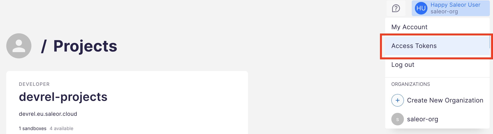

Saleor provides a convenient command-line tool to speed the development around Saleor. Using our CLI you can interact with the Saleor platform using a terminal or through an automated system to quickly create and manage Saleor environments, test storefront installation and deploy to cloud providers such as Vercel or Netlify, and more.

This page contains a complete list of all available Saleor CLI commands with their parameters.

## Installing the CLI

:::important
Saleor CLI requires [`pnpm`](https://pnpm.io/) to work. You can install it with `npm install -g pnpm`.
:::

To download and install Saleor CLI, run the following command:

```
npm i -g @saleor/cli
```

From now on, you can interact with the Saleor CLI using the `saleor` name. If run with no parameters, it will show all available commands

```
saleor
```

```

                                               ░░░░░░░░░░░░░░░░░░░░░░░░░░░░░░░░░░░░
                                            ░░░░░░░░░░░░░░░░░░░░░░░░░░░░░░░░░░░░
                ▄█████████████████████████████████████████▀░░░░░░░░░░░░░░░░
             ▄███▀                 ░░░░░░░░░░░░░░░ ▄███▀░░░░░░░░░░░░░░░
          ▄███▀                ░░░░░░░░░░░░░░░░░▄███▀░░░░░░░░░░░░░░
       ▄███▀               ░░░░░░░░░░░░░░░░░░▄███▀░░░░░░░░░░░░
    ▄███▀                                 ▄███▀
 ▄█████████████████████████████████████████▀         Saleor Commerce CLI v1.10.0


Usage: saleor <command> [options]

Commands:
  saleor info                    Hello from Saleor
  saleor login                   Log in to the Saleor Cloud
  saleor logout                  Log out from the Saleor Cloud
  saleor configure [token]       Configure Saleor CLI
  saleor register                Create Saleor account
  saleor trigger [event]         This triggers a Saleor event
  saleor organization [command]                                   [aliases: org]
  saleor environment [command]                                    [aliases: env]
  saleor backup [command]
  saleor job [command]
  saleor project [command]
  saleor storefront [command]                                   [aliases: store]
  saleor telemetry [command]                                     [aliases: tele]
  saleor webhook [command]                                       [aliases: hook]
  saleor app [command]
  saleor vercel [command]
  saleor github [command]
  saleor checkout [command]

Options:
      --json     Output the data as JSON                               [boolean]
  -V, --version  Show version number                                   [boolean]
  -h, --help     Show help                                             [boolean]

for more information, find the documentation at https://saleor.io
```

## Commands

### `login`

The `saleor login` command allows you to establish the current user session in CLI. This will initiate an OAuth process. A browser window will open with the Saleor Cloud login page. Once authenticated, the CLI will receive an authentication token that will be stored locally for the CLI to access.

### `logout`

The `saleor logout` command allows you to close the current user session in the CLI.

### `configure`

The `saleor configure` command enables setting the defaults for telemetry, organization and environment in Saleor CLI.

This command requires an authentication token, which you can obtain from your Dashboard. Go to your account settings in the upper right corner of the Dashboard screen and select Access Tokens. Then, hit the Create token button.



### `register`

The `saleor register` command starts the account registration process for the Saleor Cloud.

### `trigger`

The `saleor trigger` command is useful for testing your Saleor apps. It allows you to quickly initiate a Saleor event. After you enter the command, you will be asked to select your organisation and a specific environment. Then, you will have the possibility to choose from a list of exisiting Saleor events that you can trigger.

### `organization`

The `saleor organization` command allows you to manage organizations in your Saleor Cloud account. You can use it to list available organizations, remove existing ones or manage permissions for a particular organization.

Type `saleor organization` with no additional parameters to see a list of available sub-commands:

```
saleor organization [command]

Commands:
  saleor org show [slug|organization]         Show a specific organization
  saleor org list                             List organizations
  saleor org remove [slug]                    Remove the organization
  saleor org permissions [slug|organization]  List organization permissions
  saleor org switch [slug]                    Make the provided organization the default one

Options:
  -V, --version  Show version number                                   [boolean]
  -h, --help     Show help
```

### `environment`

The `saleor environment` command allows you to manage environments in your Saleor Cloud account. You can use it to list available environments, create new ones, remove existing ones, upgrade the Saleor engine to a specific version or manage the database for a particular environment.

Type `saleor environment` with no additional parameters to see a list of available sub-commands:

```
saleor environment [command]

Commands:
  saleor env show [key|environment]      Show a specific environment
  saleor env list                        List environments
  saleor env create [name]               Create a new environment
  saleor env switch [key|environment]    Make the provided environment the default one
  saleor env remove [key|environment]    Delete an environment
  saleor env upgrade [key|environment]   Upgrade a Saleor version in a specific
                                         environment
  saleor env clear <key|environment>     Clear database for environment
  saleor env populate <key|environment>  Populate database for environment
  saleor env promote [key|environment]   Promote environment to production

Options:
      --json     Output the data as JSON                               [boolean]
  -V, --version  Show version number                                   [boolean]
  -h, --help     Show help                                             [boolean]
```

### `backup`

The `saleor backup` command allows you to manage backups in your Saleor Cloud account. You can use it to list available backups, create new ones, remove existing ones or restore backups from previously stored ones.

Type `saleor backup` with no additional parameters to see a list of available sub-commands:

```
saleor backup [command]

Commands:
  saleor backup list [key|environment]  List backups of the environment
  saleor backup create <name>           Create a new backup
  saleor backup show [backup]           Show a specific backup
  saleor backup restore [from]          Restore a specific backup

Options:
      --json     Output the data as JSON                               [boolean]
  -V, --version  Show version number                                   [boolean]
  -h, --help     Show help                                             [boolean]
```

### `job`

The `saleor job` command allows you to manage asynchronous jobs in your Saleor Cloud account. You can use it to list available jobs to see their status.

Type `saleor job` with no additional parameters to see a list of available sub-commands:

```
saleor job [command]

Commands:
  saleor job list  List jobs

Options:
  -V, --version  Show version number                                   [boolean]
  -h, --help     Show help
```

### `project`

The `saleor project` command allows you to manage projects in your Saleor Cloud account. You can use it to list available projects, create new ones or remove existing ones.

Type `saleor project` with no additional parameters to see a list of available sub-commands:

```
saleor project [command]

Commands:
  saleor project list            List projects
  saleor project create [name]   Create a new project
  saleor project remove [slug]   Remove the organization
  saleor project show [project]  Show a specific project

Options:
  -V, --version  Show version number                                   [boolean]
  -h, --help     Show help                                             [boolean]
```

### `storefront`

The `saleor storefront` command allows you to quickly create and deploy a storefront application that is pre-configured to use your Saleor environment.

Type `saleor storefront` with no additional parameters to see a list of available sub-commands:

```
saleor storefront [command]

Commands:
  saleor storefront create [name]  Boostrap example [name]
  saleor storefront deploy         Deploy this `react-storefront` to Vercel

Options:
  -V, --version  Show version number                                   [boolean]
  -h, --help     Show help                                             [boolean]
```

### `telemetry`

The `saleor telemetry` command allows you to manage the telemetry status. You can disable the telemetry with `saleor telemetry disable` and enable it with `saleor telemetry enable`. By default, the telemetry is enabled. We only gather essential, anonymous data to help us improve the tool.

### `webhook`

The `saleor webhook` command allows you to manage webooks of a particular environment in your Saleor Cloud account. You can use it to list available webhooks, create new ones, update and remove existing ones.

Type `saleor webhook` with no additional parameters to see a list of available sub-commands:

```
saleor webhook [command]

Commands:
  saleor webhook list    List webhooks for an environment
  saleor webhook create  Create a new backup
  saleor webhook edit    Edit a webhook
  saleor webhook update  Update webhooks for an environment

Options:
  -V, --version  Show version number                                   [boolean]
  -h, --help     Show help                                             [boolean]
```

### `app`

The `saleor app` command allows you to manage Saleor apps. You can use it to list available Saleor apps, create a project structure for a new Saleor app or expose it remotely with our built-in tunneling. It provides the possibility to create tokens for apps and manage app permissions.

Type `saleor app` with no additional parameters to see a list of available sub-commands:

```
saleor app [command]

Commands:
  saleor app list                 List installed Saleor Apps for an environment
  saleor app install              Install a Saleor App by URL
  saleor app create [name]        Create a Saleor App template
  saleor app tunnel [port]        Expose your Saleor app remotely via tunnel
  saleor app token                Create a Saleor App token
  saleor app permission           Add or remove permission for a Saleor App
  saleor app generate <resource>  Generate a resource for a Saleor App

Options:
      --json     Output the data as JSON                               [boolean]
  -V, --version  Show version number                                   [boolean]
  -h, --help     Show help                                             [boolean]
```

With `saleor app generate <resource>` command you can generate a resource for a Saleor App. Typing in `saleor app generate` will print the list of supported resources:

```
Positionals:
  resource
   [string] [required] [choices: "webhook", "query", "mutation", "subscription"]

Options:
      --json     Output the data as JSON                               [boolean]
  -V, --version  Show version number                                   [boolean]
  -h, --help     Show help                                             [boolean]

```

### `vercel`

The `saleor vercel` command allows you to integrate Saleor CLI with your existing account in Vercel.

Type `saleor vercel` with no additional parameters to see a list of available sub-commands:

```
Commands:
  saleor vercel login  Add integration for Saleor CLI

Options:
      --json     Output the data as JSON                           [boolean]
  -V, --version  Show version number                               [boolean]
  -h, --help     Show help                                         [boolean]
```

### `github`

The `saleor github` command allows you to integrate Saleor CLI with your exisitng account in GitHub.com.

Type `saleor github` with no additional parameters to see a list of available sub-commands:

```
Commands:
  saleor github login  Add integration for Saleor CLI

Options:
      --json     Output the data as JSON                           [boolean]
  -V, --version  Show version number                               [boolean]
  -h, --help     Show help                                         [boolean]
```

### `deploy`

The `saleor deploy` command allows you to install the Saleor Checkout in Vercel. It creates a repository with the project in GitHub.com. Then, it deploys this git repository to Vercel and sets up the necessary environment variables. This command prepares the Saleor Checkout for integration with the storefront of your choice.

Type `saleor deploy` with no additional parameters to see a list of available sub-commands:

```
Commands:
  saleor checkout deploy [name]  Deploy `saleor-checkout` to Vercel

Options:
      --json     Output the data as JSON                           [boolean]
  -V, --version  Show version number                               [boolean]
  -h, --help     Show help                                         [boolean]
```
