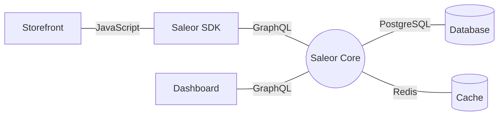
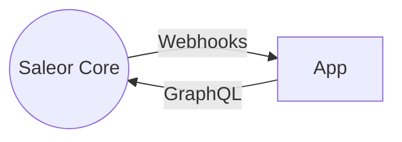

Saleor consists of three distinctive components:

1. First is the **Saleor Core** which is the backend server that exposes the [GraphQL API](developer/getting-started/graphql.mdx). The core is written in Python and does not have a user interface of its own. It maintains its state in a PostgreSQL database and caches some information in Redis where available.

2. Then there's **Saleor Dashboard** which implements the user interface that staff members can use to operate a store. The dashboard is a React application that runs in the browser and talks to the core server. It's a static website so it does not have any backend code of its own.

3. Lastly there's **Saleor React Storefront** which is an example storefront implemented in React. You can customize its code to suit your needs or you can build a custom storefront using the underlying **Saleor SDK**.

All three components communicate using GraphQL over HTTPS.

## Extending Saleor

While you could modify Saleor directly, we advise against this as once your deployment diverges from the upstream Saleor, it becomes hard to keep it updated.

Extending Saleor is best done using external applications that rely on webhooks and GraphQL to communicate with Saleor.

To learn more, see [Extending Saleor](developer/extending.mdx).
