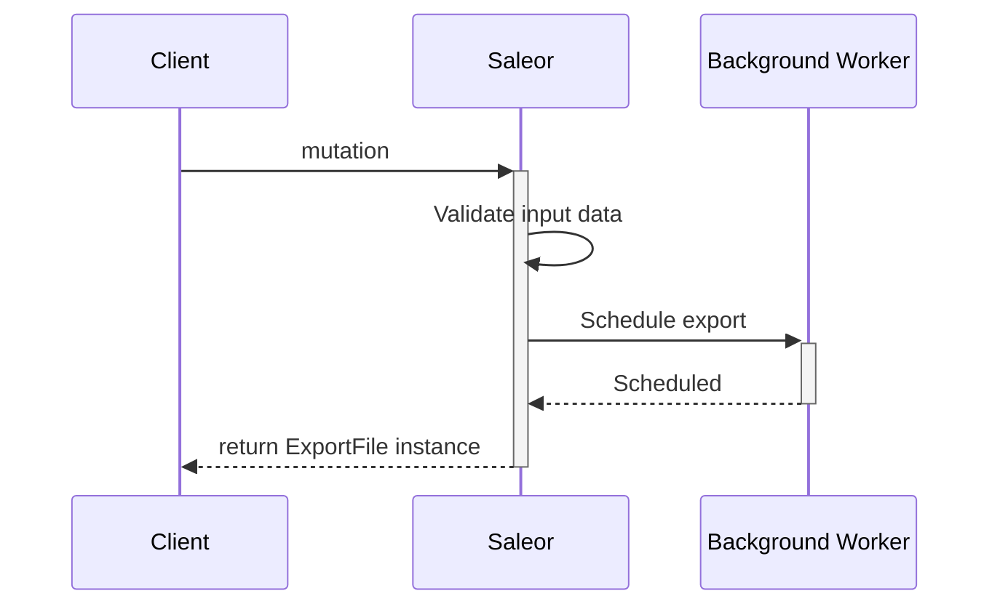
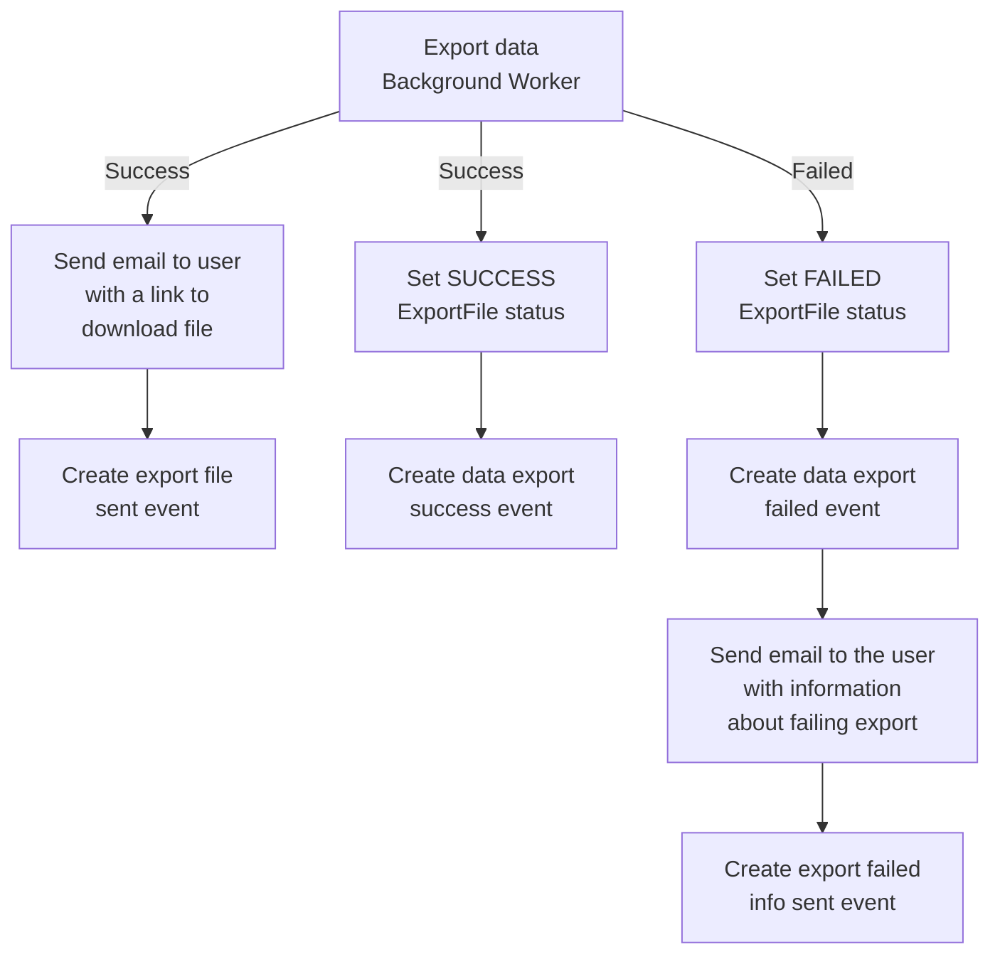

## Introduction
This guide describes information common to all exports.
At this time only products and gift cards export is available.

### Workflow

#### Schedule export
The chart below describes how the workflow looks like for each export.
What changes for each export is a mutation and background worker that is adapted to the data type.



#### Handling background worker result
Background worker result is also handling in the same way for all workers.
The below chart shows what happens in the case of success and failed worker results.



### Mutations
The input data for the mutations may differ a little, but all of them return the same
data type: `ExportFile` object which is a `Job` instance.
It corresponds to running export background worker, keeps task status, and created file.
`ExportFile` object contains the following fields:
- `id`: a unique export file ID. Could be use to check export status.
- `status`: status of running job.
- `user`: instance of `User` who requested exporting products.
Set to `null` if export requested by `App`.
- `app`: instance of `App` which requested exporting products.
Set to `null` if export requested by `User`.
- `createdAt`: the date and time when the export was started.
- `updatedAt`: the date and time when the job was last time updated.
- `url`: URL to the exported file. Set to `null` when the file doesn't exist yet.
- `events`: a list of events associated with the export.

In addition the following field is available on the eery mutation results:
- `errors`: a list of errors that occurred during mutation execution.


### Fetching `ExportFile` instance
Export is doing in asynchronously worker so as a result you might get export file instance
with `PENDING` status. To check if task status has changed you can fetch `ExportFile` 
by `ID` with use of `exportFile` query:

```graphql {2}
  query {
    exportFile(id: "RXhwb3J0RmlsZToxMA==") {
      id
      status
      createdAt
      updatedAt
      url
    }
  }
```

Example response with URL address to the file.
```json
{
  "data": {
    "exportFile": {
      "id": "RXhwb3J0RmlsZToxMA==",
      "status": "SUCCESS",
      "createdAt": "2020-06-05T09:15:42.924676+00:00",
      "updatedAt": "2020-06-05T09:16:27.691838+00:00",
      "url": "http://localhost:8000/media/export_files/product_data_05_06_2020.csv"
    }
  }
}
```
