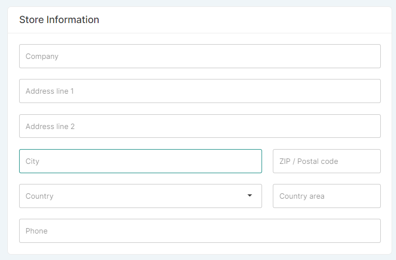

## Introduction

This page allows you to enter the basic information about your store. Some of the information will be visible to your customers. 

## General information

View and update general information about your store. Here, you can control how your site information appears online.

The text you input to the _Name&nbsp;of&nbsp;your&nbsp;store_ field will appear in the web browser tabs.

The _URL&nbsp;of&nbsp;your&nbsp;online&nbsp;store_ should match that which you will send to customers and web browsers.

The _Store&nbsp;Description_ is SEO information that will appear in browser results listing your site, so make sure it has clear, useful copy about your store and its products.

## Mailing information

This card allows you to configure the email address from which automatic emails will be sent to your customers.

## Store information

This card allows you to enter basic information about your company (name, address, phone number). The address provided in this card will be used to generate invoices and calculate shipping rates.

