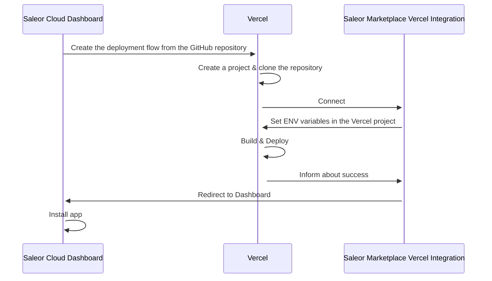

:::info

<!-- todo: change -->

This feature was introduced in **Saleor 3.8**.
:::

:::caution
This feature is currently in **Feature Preview**. This part of Saleor is not complete
and subject to change but is available to experiment and provide feedback.
:::

## What is App Templates Gallery?

Apps are the centerpiece of the [extending Saleor model](../developer/extending/apps/key-concepts.mdx). They are the preferred way of building custom logic on top of Saleor.

Saleor Cloud Marketplace is your headquarters for managing and installing apps.

:::note
You can find Saleor Cloud Marketplace by going to _Apps_ -> _Marketplace_ in your Saleor Dashboard.
:::

There are two types of software you can find in Saleor Cloud Marketplace: **templates** and **apps**.

**A template** serves as a foundation you can build upon. It may need an extra setup to work, and you must host it yourself.

**An app** is off-the-shelf software that you can use without further adjustments. There are two types of apps: 1st party (built and hosted by Saleor) or 3rd party (built by external developers).

We listed all the differences between them here:

| Template                              | App                                                     |
| ------------------------------------- | ------------------------------------------------------- |
| Open source boilerplate               | Can be closed-sourced                                   |
| Not yet an app; setup required        | Ready to be used right away                             |
| Hosted on your Cloud (e.g Vercel)     | Hosted by Saleor (1st party) or App Creator (3rd party) |
| Can be forked and extended            | Owned by App creator. The code may be open source       |
| Can be created by Saleor or community | Can be created by Saleor or community                   |

The left column describes the content of the App Templates Gallery.

---

Summing up, the App Templates Gallery:

- Is a subset of Saleor Cloud Marketplace.
- Offers a library of templates built by the Saleor team or the community.
- Helps you deploy them to Vercel (or other future providers).
- Installs the deployed app in your Dashboard.

## Self-deployment

Using the App Templates, you are responsible for the deployment. The critical part is providing the correct environment variables to your hosting provider.

Here is an example of an integration with Vercel:

