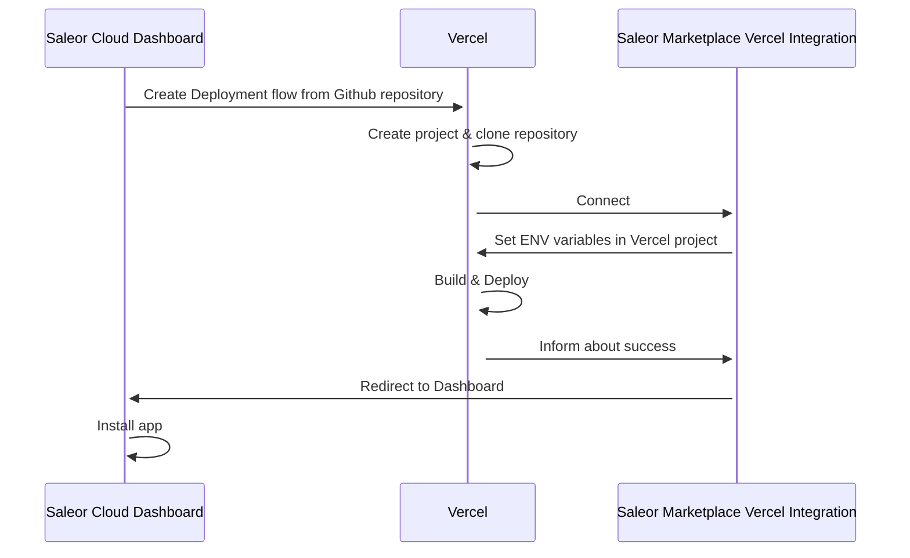

Apps are the centerpiece of the extending Saleor model. If you want to learn more about it, we described it in detail in [Extending Saleor -> Apps](../developer/extending/apps/key-concepts.mdx).

Saleor Cloud Marketplace features two types of entities you can use to extend Saleor: templates and apps.

A template is a publicly available foundation you can build upon. It may require an extra setup to work correctly and you need to host it yourself.

An app is an off-the-shelf software, ready to be used immediately. There are two types of apps: 1st party (built and hosted by Saleor) or 3rd party (built by external developers).

Here is a detailed list of differences between them:

| App Template                          | 1st or 3rd party App                                          |
| ------------------------------------- | ------------------------------------------------------------- |
| Open source boilerplate               | Can be closed sourced                                         |
| Not yet an app; setup required       | Ready to be used right away              |
| Hosted on your Cloud (e.g Vercel)     | Hosted by Saleor (1st party) or App Creator (3rd party)       |
| Can be forked and extended            | Owned by App creator. The code may be open source |
| Can be created by Saleor or community | Can be created by Saleor or community                         |

The left side of the table describes what you can find in the App Templates Gallery.

# Self-deployed apps

Usually, self deployed apps are connected only for your Saleor instance. Templates can be prepared for a Multi-tenant
compatibility, but likely you will configure it to work with your Shop's needs

We created App Templates Gallery so you can:

- Browse a library of templates built by Saleor team or the community
- Deploy them to Vercel (or other future providers) as quickly as possible 
- Automatically install the deployed app in your Dashboard

# How self-deployment works

Here is a simplified diagram of how it works:

# Getting started

Open your dashboard and navigate to Apps -> Marketplace. Browse available apps and try them out
