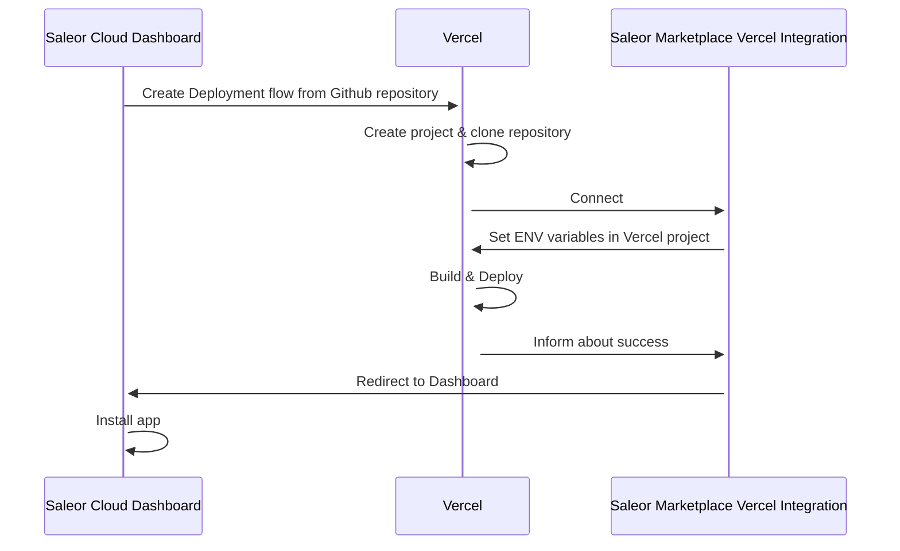

Saleor can be extended with apps - and there are several ways how apps are built.

App Templates Gallery is a part of Saleor Cloud Marketplace. As you can see, it doesn't contain exactly "apps",
but rather templates ready to be spawned on your own instance.

Saleor core is open source and we believe many our users will prefer their code self-hosted and adjusted.

Quick comparison of apps differences:

| App Template                          | 1st or 3rd party App                                          |
| ------------------------------------- | ------------------------------------------------------------- |
| Open source boilerplate               | Can be closed sourced                                         |
| Not yet an app - required setup       | Existing, working solution that can be installed              |
| Hosted on your Cloud (e.g Vercel)     | Hosted by Saleor (1st party) or App Creator (3rd patry)       |
| Can be forked and extended            | Owned by App creator. May be open source, but doesn't have to |
| Can be created by Saleor or community | Can be created by Saleor or community                         |

App templates gallery focuses on the left side of the table.

# Self-deployed apps

Usually, self deployed apps are connected only for your Saleor instance. Templates can be prepared for a Multi-tenant
compatibility, but likely you will configure it to work with your Shop's needs

We created App Templates Gallery so you can:

- Browse a library of templates brought by Saleor team and featured from community
- Quickly as possible deploy it automatically to Vercel (other clouds will be supported in the future)
- Automatically install deployed app to your Dashboard

# How self-deployment works

Here is a simplified diagram how it works

# Getting stated

Open your dashboard and navigate to Apps -> Marketplace. Browse available apps and try them out
