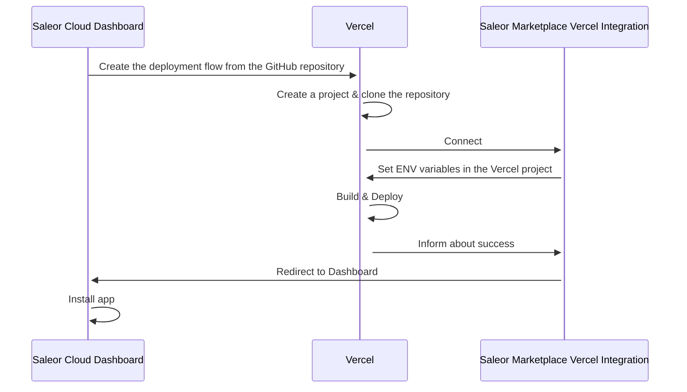

:::info

<!-- todo: change -->

This feature was introduced in **Saleor 3.8**.
:::

:::caution
This feature is currently in **Feature Preview**. This part of Saleor is not complete
and subject to change but is available to experiment and provide feedback.
:::

## What is App Templates Gallery?

The concept of "apps" is the centerpiece of the [extending Saleor model](../developer/extending/apps/key-concepts.mdx). They are the preferred way of building custom logic on top of Saleor.

There may be different types of apps but they will always have two things in common:

- they all communicate with Saleor API
- they are installable in Saleor Dashboard

---

One of the types of apps we currently distinguish is the **App Template**. Its features are:

- it is an open-source boilerplate
- it requires setup
- it is self-hostable
- it can be forked and extended
- it is made by either Saleor or the community

**App Templates Gallery** is a marketplace for all the available app templates.

:::note
You can find App Templates Gallery by going to _Apps_ -> _Marketplace_ in your Saleor Dashboard.
:::

## Self-deployment

Using the App Templates, you are responsible for the deployment. The critical part of that process is providing the correct environment variables to your hosting provider.

Here is an example of an integration with Vercel:

