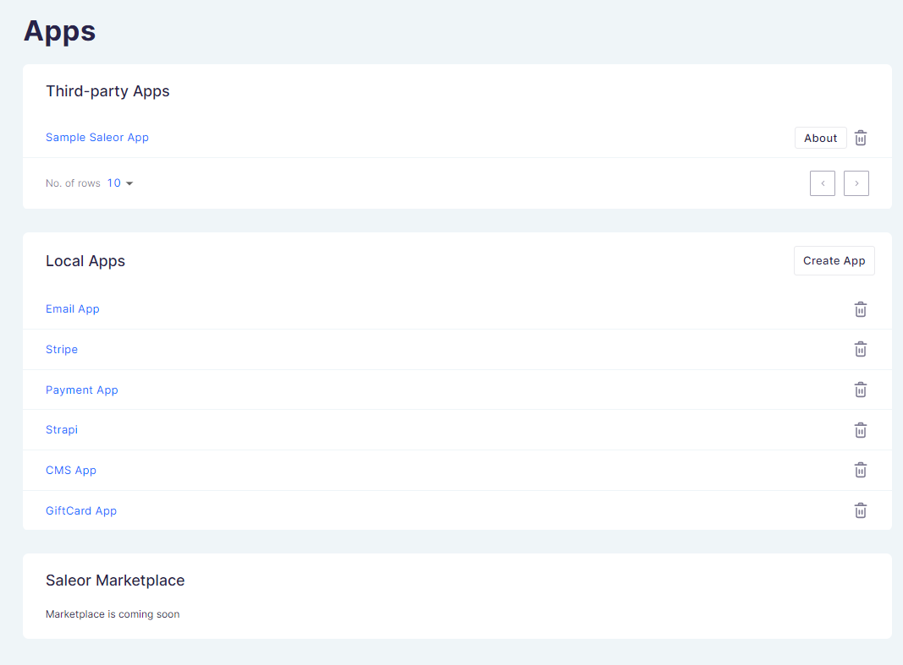
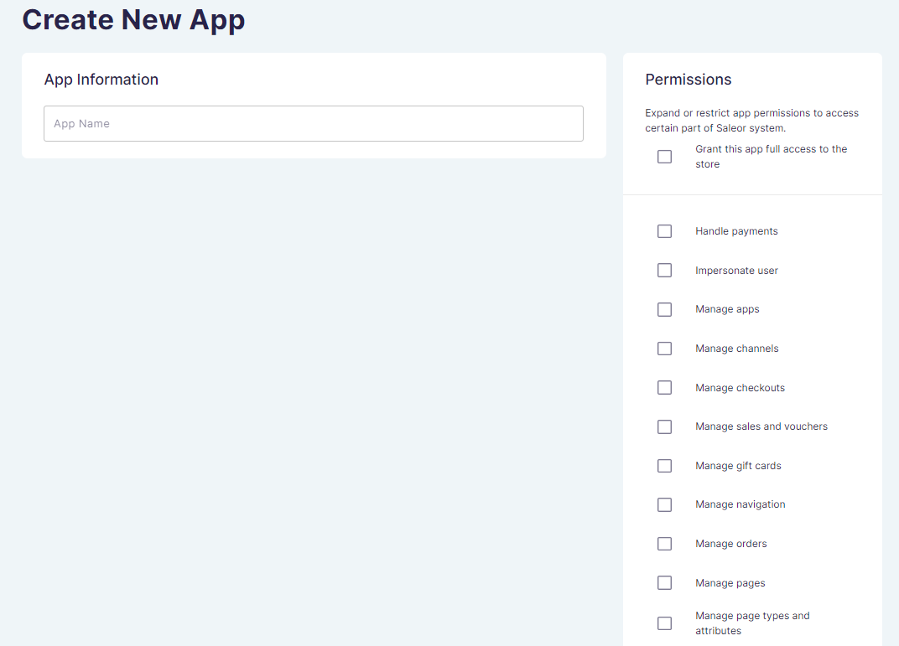
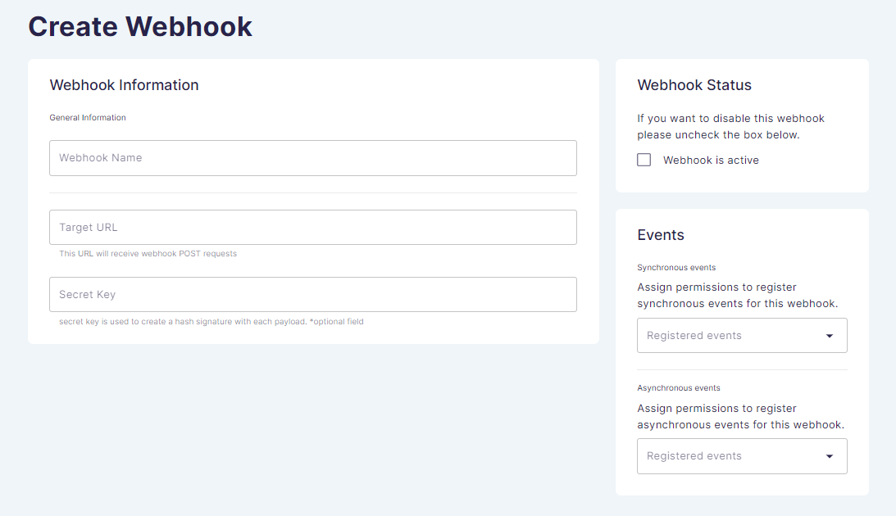

This page gives you an overview of how to manage apps in the dashboard.

You can find the _Apps_ section on the main page of the dashboard. The Apps page allows you to install and manage your apps.

The main page of Apps contains the following sections:

- _Third-Party Apps_ a list of installed third-party apps in your dashboard.

- _Local Apps_ with an option to create a new app.

## Local Apps

In this section, you can see the list of local apps installed. To delete the app, click the bin button.

## Creating new app

You can create a new app by clicking _Create App_ in the _Local Apps_ section on the right side.

In the _Create New App_ information card:

- Assign the name of your app under _App Information_.

- Set permissions that will be assigned to the specific service in the right-hand card. You can select individual permissions or grant the app full access to the store option.

- Set _App Status_ on the bottom right side of the page. If you want to disable this app, please uncheck the box below.

Save your changes by clicking _Save_ in the footer.

You can deactivate the app by clicking the _DEACTIVATE_ button on the top of the right corner of the app details page.

## Tokens

Once you have created the app, a token will be generated. You will need to provide this token to your script. To ensure integrity and security, tokens are only displayed once, so you need to copy the code and save it in a different location. If you need to ensure total security and cannot save the token, you can create a new one for the same service through the _Create Token_ option in the app information card. Tokens can also be deleted in the same place using the trash can icon or using the delete option in the footer.

## Webhooks

Webhooks allow you to set up integrations which subscribe to events. They can then be used to send payloads about activities in Saleor from your platform to other services. Your designated URL will then get the payloads you choose to send from Saleor.

### Creating a webhook

 Once the app has been created, you can create a new webhook by clicking the _Create Webhook_ button in the _Webhooks_ section of the app details page. To create a webhook, you first need to activate your app.

In the _Webhook Specific Information_ section:

- Assign the name of your webhook.

- Input the target URL to which payloads will be sent.

- Optionally, if the service to which you are sending the webhook wants additional validation of the content that is being sent, you need to set a _Secret Key_. After generating the secret key value, you need to pass it to the third-party service so that they can use it to validate content sent from Saleor via webhooks.

To learn more about the webhook protocols, see the [Developer's Guide](developer/extending/apps/key-concepts.mdx#webhook-protocols).

### Events

In the _Events_ card, you can assign singular events that you want to be triggered by the webhook. Alternatively, you can choose the _All events_ option to send notifications about all events, regardless of type. By choosing this option you will send payloads for all events currently assigned, in doing so your range will change as events are added or deleted by the Saleor team. If you want to assign a limited range of events, choose them from the menu of specific items.

### Activating a webhook

By default, your new webhooks will not be active until you click the _Webhook is active_ option in the Webhook Status card.
