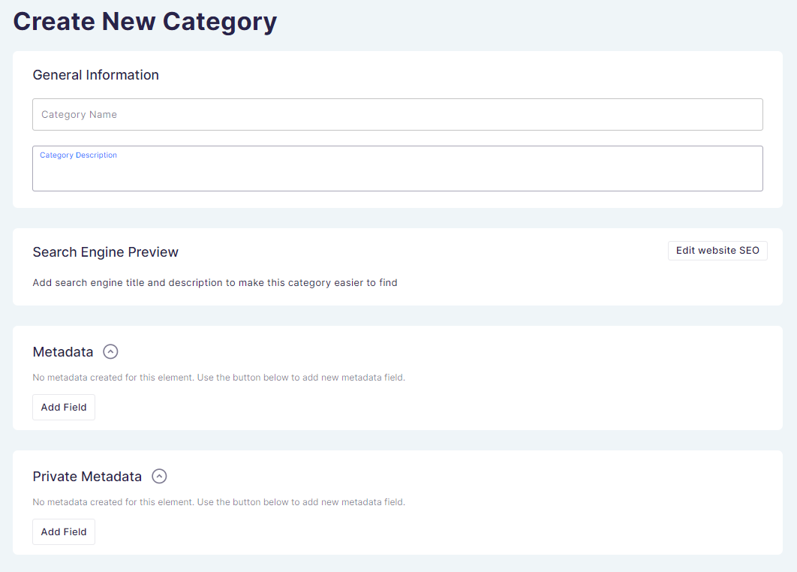

## Introduction

If you sell a range of products on the Saleor platform, they can be conveniently sorted by category. Assigning products to categories helps you to organize your shop and your customers to interact with a clear product structure navigation.

Unlike collections, which are optional, so you can either use them or not, the categories are required. Every product should belong to a category.

### Subcategories

Subcategories break large groups down into smaller subsets that make it easier to manage stores and help customers find the right products.

## How to

### How to add a product category

Adding a new product category is a two-step process:

#### Step 1: Click _Create&nbsp;Category_ to set up a new product category

Enter the category name, description, and SEO-optimized information the same way as you would with an individual product.

When finished, click _Save_ in the bottom right corner.

#### Step 2: Add a category photo and a subcategory

At this stage your new category is already created. You can go back or click _Cancel_ if you do not want to continue with additional setup at this point. You can always come back and finish it later.

Or you can continue and add a widescreen banner photo that will appear at the top of the screen when customers view the category.

At this stage, you can also add Subcategories and Products to your Category. This can be done in the bottom card which consist of two tabs of Subcategories and Products.
Click on each tab to either add a subcategory or assign products.

When finished, click _Save_.

### How to edit categories

Once you have your categories set up, you can edit them at any time by clicking on a category from the list and changing information. When viewing a category, you have a card at the bottom of the page with tabs for viewing and editing products and subcategories.

### How to delete categories

To remove a category, select the category from the main list and click _Delete_ in the footer of the category page.

:::warning Be cautious when deleting categories
Products are mandatorily assigned to categories. Deleting a category will also remove all products it contains. Only remove a category if you are sure that you also want to permanently delete all its products from your catalog.
:::

### How to add a subcategory

Click _Create&nbsp;Subcategory_ in the top right corner of the Subcategories card.

### How to manage metadata in the category setup page

You can add private and public metadata for each category in the category setup page. Use the button _Add Field_ to add a new metadata field.

To learn more about object metadata, see the [Developer's Guide](developer/metadata.mdx).
