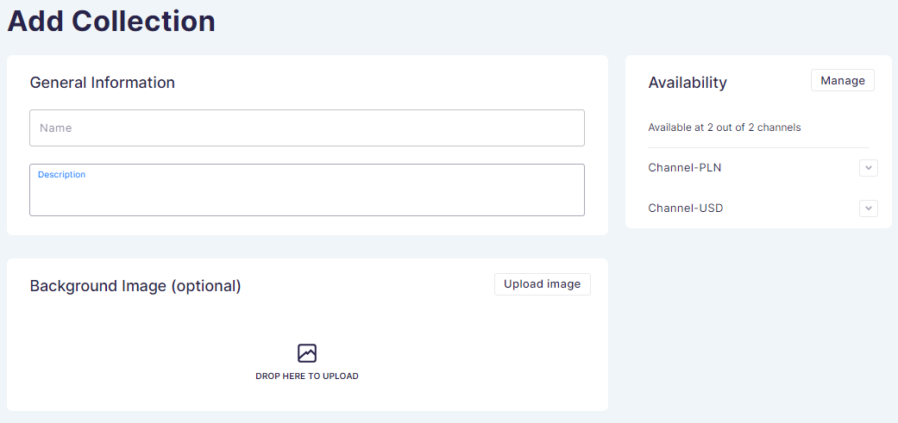
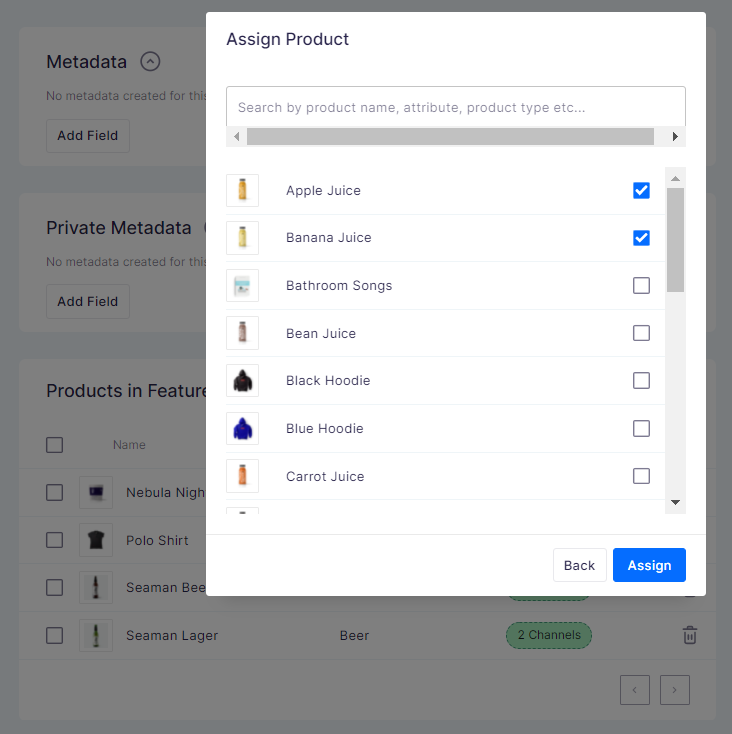

## Introduction

Collections are a great way to increase sales and give your customers better experiences. Group products together to take advantage of seasonal events or link products that are regularly bought in pairs or groups.

Unlike the categories, creating collections is not required.

## Featured collection

- Collections can be easily published and unpublished by clicking on the switch in the Visibility card when viewing a specific collection
- Featuring a collection will make it appear on the front page of your website
- You can only feature one collection at a time. Turning the _Feature&nbsp;on&nbsp;Homepage_ option on for one collection will automatically turn it off for all others

## How to

### How to create and edit a collection

You can add and edit collections in the same way as categories, with a cover photo and SEO content tailored to your collection.

To delete individual products, click on the trash can icon next to the product and confirm removal from the collection.

### How to manage availability

Click the _MANAGE_ button in the right top corner of the availability card, and then assign a [channel](dashboard/configuration/channels.md). You can select multiple channels.

Once the channel has been assigned, the next step is to choose if the collection appears or remains hidden in your store. You can set a publication date. It allows you to hold some of your collections unavailable to your customers until the publication date. They are not listed in your storefront.

### How to add products to existing collection

Once you have created a collection, you can easily add more products by choosing the _Assign&nbsp;Products_ option from the collection overview and selecting products from the list. To find other products, type the name, attribute or product type into the search bar and the list will automatically refresh.

### How to add optional search engine preview content

Click Edit Website SEO to add a SEO title, slug and description. If you do not add unique SEO content, details will be taken from the General Information card.

### How to delete a collection

There are two ways to delete a collection:

- Click the checkbox next to the collection name on the main list. Options to _Publish_, _Unpublish_, and _Delete_ will appear above the list
- Click on the collection name and enter the detailed information, then use the red _Delete_ button in the footer

:::note
Removing a collection will not delete all products from the site; it only disables the grouping of selected products and deletes information about the collection.
:::

### How to manage metadata in the collection setup page

You can add private and public metadata for each collection in the collection setup page. Use the button _Add Field_ to add a new metadata field.

To learn more about object metadata, see the [Developer's Guide](developer/metadata.mdx).
