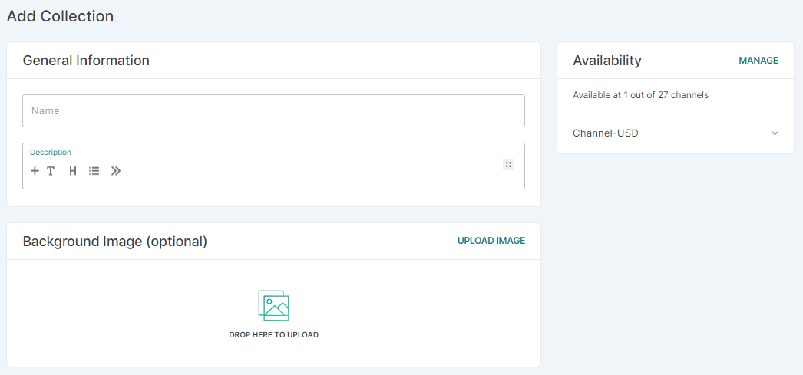

## Introduction

Collections are a great way to increase sales and give your customers a better experience. This feature enables you to group products that are regularly bought together or take advantage of seasonal events.

Unlike the categories, creating collections is not required.

## How to
### How to create and edit a collection

You can add and edit collections in the same way as categories, with a cover photo and tailored SEO content.

To delete individual products, click on the trash can icon next to the product and confirm removal from the collection.

:::tip How to use the CMS editor
In the description tab, click the _+_ button to open the CMS editor. You can edit your description by adding a heading, text, list, and quote.

When you click the button with four dots on the right side of the description tab, you can edit, move up, move down or delete a tuned part of the description.
:::

### How to manage availability

Click the _MANAGE_ button in the right top corner of the availability card, and then assign a [channel](dashboard/configuration/channels.md). You can select multiple channels.

Once you have assigned the channel, the next step is to choose whether the collection should be visible in your store. Another option is setting a publication date for your collection. It allows you to make the collection unavailable to your customers until the date is due.

### How to add products to existing collection

Once you have created a collection, you can easily add more products by choosing the _Assign&nbsp;Products_ option from the collection overview and selecting products from the list. To find other products, type the name, attribute, or product type into the search bar, and the list will automatically refresh.

### How to add optional search engine preview content

Click _Edit Website SEO_ to add a SEO title, slug and description. If you do not supply it, the data will be taken from the General Information card.

### How to delete a collection

There are two ways to delete a collection:

- Click the checkbox next to the collection name on the main list. Options to _Publish_, _Unpublish_, and _Delete_ will appear above it.
- Click on the collection name, enter the detailed information, and then use the red _Delete_ button in the footer.

:::note
Removing a collection will not delete all products from the site; it only disables the grouping of selected products and deletes information about the collection.
:::

### How to manage metadata in the collection setup page

You can add private and public metadata for each collection in the collection setup page. Use the button _Add Field_ to add a new metadata field.

To learn more about object metadata, see the [Developer's Guide](developer/metadata.mdx).
