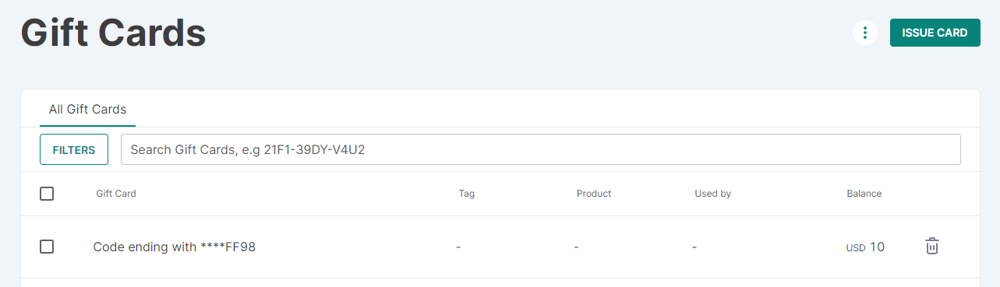
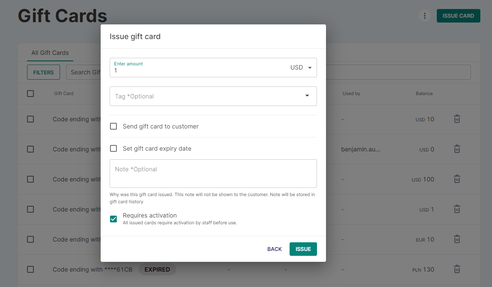
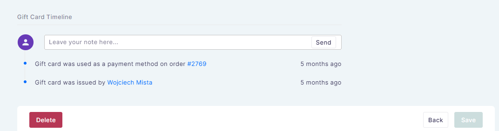
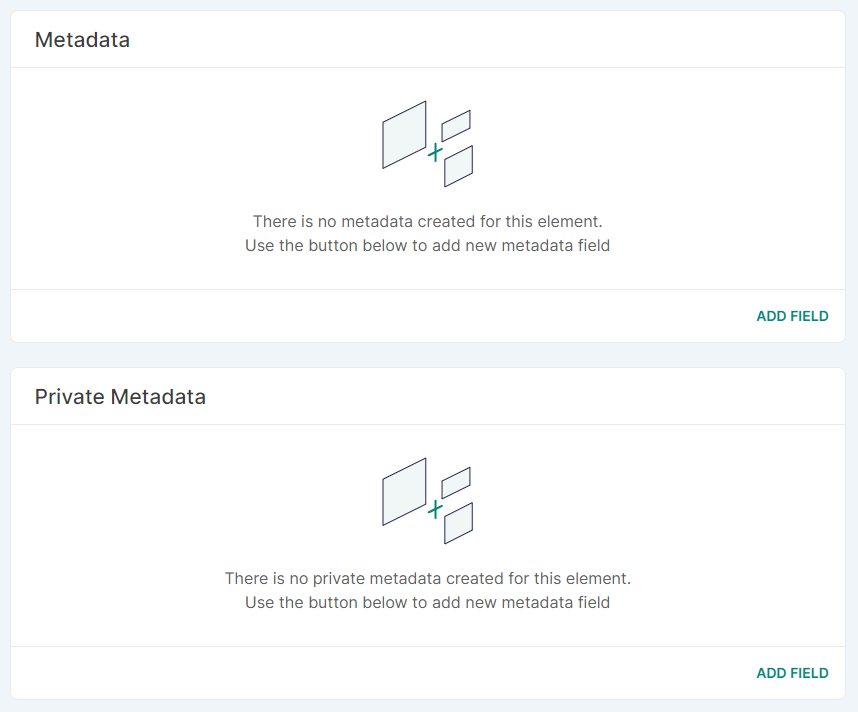
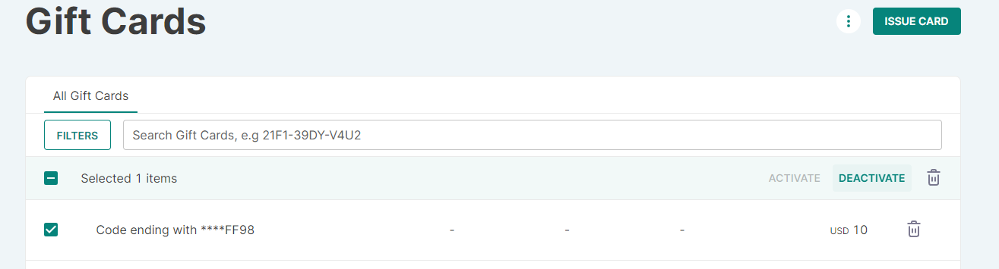
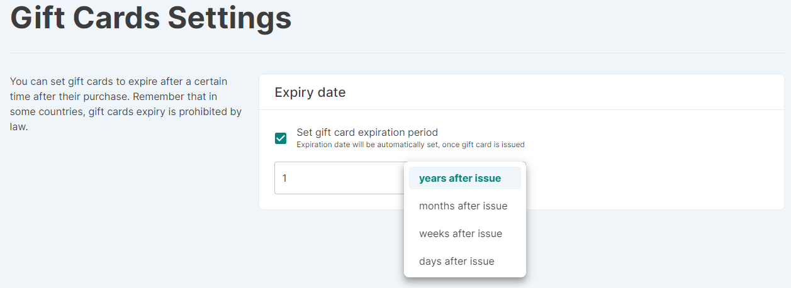

:::note
Gift cards are available in Saleor 3.1.
:::

:::caution
This feature is currently in **Feature Preview**. This part of Saleor is not complete
and subject to change but is available to experiment and provide feedback.
:::

This page contains information on managing gift cards by selecting a specific currency, sending them to customers, or setting expiration dates.

## Introduction
Gift cards are timeless and universal gifts. They are suitable for customers, employees, CEOs, business partners, or family members. Issuing gift cards can increase your sales and provide a better customer experience.

## How to
### How to create a gift card?
:::note
In order to sell a gift card product, you first need to create the gift card [product type](dashboard/configuration/products.md).
:::

Go to the "Gift Cards" page of the "Catalog" section.

Click the *Issue Card* button on the top right corner of the page. A pop-up page will appear where you can carry out the following actions related to the gift card creation:

- Choose currency

- Enter the amount

- Add tags (optional)

- Send gift cards to customer

- Set expiry date

- Write notes

- Assign activation requirement

Once a gift card has been created, you can access the Gift Card details page by clicking on a specific gift card from the gift cards list. You can manage the gift card's balance at the top of the details page. You can also add multiple tags (optional) and set expiry date.

On the right side of the Gift Card details page, you can deactivate a gift card, resend a code, and find basic information about the gift card, such as:

- Creation date

- Link to order in which the gift card was purchased

- Product bought to receive the gift card

- User who issued the gift card

- Customer who used the gift card

At the bottom of the Gift Card details page, you can delete a gift card by clicking the *Delete* button. You will also find the gift card timeline section that shows actions taken on a specific gift card. Those can be: the activation/deactivation of a gift card, its issue, and the order the user has used it on.

### How to create multiple gift cards

You can create multiple gift cards simultaneously by clicking the three dots button on the top right corner of the Gift Cards page, near the *Issue Card* button. Then click the *Bulk Issue* button to carry out actions related to bulk gift card creation. Once you issued multiple gift cards, a pop-up will appear where you can download a list of the newly created gift cards using the *Export to email* button.

### How to manage metadata in the Gift Card details page
Once a gift card has been created, you can add private and public metadata for each gift card in the Gift Card details page. Use the button *Add Field* to add a new metadata field.

### How to activate, deactivate or remove gift cards
Select a single or multiple previously created gift cards from the gift cards list and then click *activate*, *deactivate* or remove it by clicking on the trash bin icon.

### How to set an automatic expiration for gift cards
:::note
Be aware that in some countries the expiration of gift cards is prohibited by law.
:::

Click the three dots button on the top right corner of the Gift Cards page, near the Issue Card button. Click *Settings*, and then you can set gift cards to expire after a certain time after their purchase. Please bear in mind that once you've selected an automatic expiration for gift cards, it will only affect the gift cards created after applying that setting.

### How to export gift card codes
:::note
Only active and unused cards can be exported.
:::

Click the three dots button on the top right corner of the page, near the *Issue Card* button. Click *Export card codes* to export information for specific, or all, gift cards, as a spreadsheet or a CSV file.

