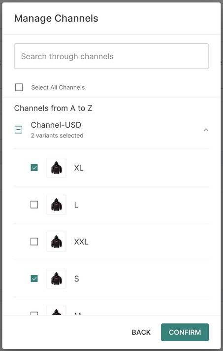
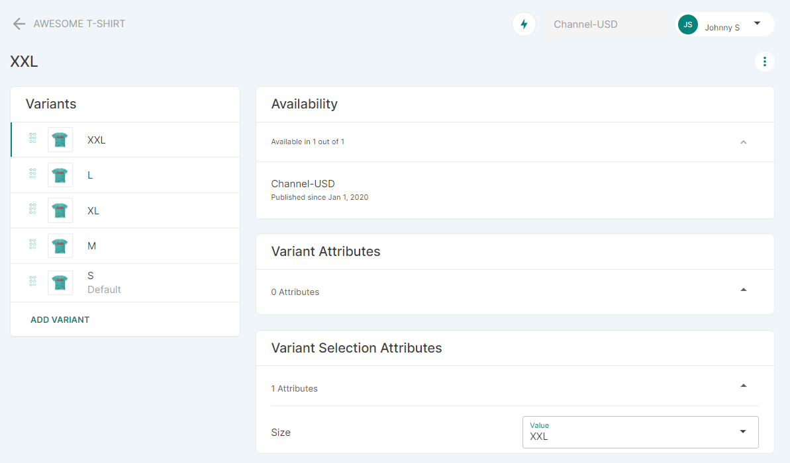

## Introduction

This page contains an alphabetically sorted list of all your products with a picture for each (if set), the product name and type, information on its visibility on your site (if it is published or not), and the product's price.

### Managing the list view

#### Using filters

By default, the page displays all products. You can also use convenient filters to view products by their:

- Categories

- Collections

- Price

- Product Types

- Visibility

- Stock quantity

- Specific attributes, such as size and material

You can also set up and save custom filters which will be unique to your browser (so other users will not see it).

#### Editing columns

Another convenient way to manage the view of the product list and adjust it to your current need, is using the column editing feature.

Click the _Columns_ dropdown to open a list of available attributes and select the ones you want to use as the columns. Once saved, the product list will be adjusted to reflect your column selection.

You can select up to 16 attributes as columns. The following fixed columns will be displayed regardless of the selection you make:

- Checkbox column

- Thumbnail

- Product Name

- Actions column

Use the _Reset_ button on the grid to return to default settings (the above mentioned fixed columns plus the following: Product Type, Stock, Price).

For more information on how to set the attribute so it can be used in the column selection list in the Product page, see the description of the Properties card section in the [Attributes](dashboard/configuration/attributes.md#How-to-add-an-attribute) topic.

#### Sorting by columns

You can also sort your product list by columns. To do that, click on the column header. Clicking the header again will change the sorting order (ascending/descending).

## Product concept

Before filling your shop with products, you need to learn about 3 basic product concepts in Saleor:

- Product type
- Product
- Product variant

### Product type

Think about _product types_ as templates for your products. Multiple products can use the same _product type_.

### Product

The _product_ concept reflects the common details of several product variants. When the shop displays the products in the category view, items on the list are displayed as separate products.
If the _product variant_ has no overridden property (for example: price specifically set for this variant), the default value is taken from the _product_.

### Product variants

Variants are the most important objects in your shop. All operations on cart or stock utilize variants. Even if you do not set up multiple variants for your product, the store will create one under the hood.

To explain the difference, we will use a bookstore example. Let's imagine you are an owner and one of your products is a book titled "Introduction to Saleor".

The book is available in hard and softcover, so there would be _2 product variants_.

To simplify this for the example purposes, let's assume that the _type of cover_ is the only attribute creating separate _variants_ in your store.
You would then use _product type_ called “Book”, enable variants, and use the “Cover type” as your _variant attribute_.

#### Product attributes

Attributes are shared among all product variants.
For example, consider the publisher: all book variants are published by the same company (the publisher is an attribute in this case).
Or being back to the hard-/softcover books: the attribute here is a _Cover Type_ and it is common to its variants.

#### Variant attributes

It’s what distinguishes different variants. For example: for the attribute _cover type_ you will have two variant attributes: _hard cover_ or _soft cover_.

For more information on the product structure in Saleor, see the [Product Types](dashboard/configuration/products.md) topic.

## Stock management

Each product variant has also a stock-keeping unit (SKU).

Each variant holds information about:

- Quantity at hand
- Quantity allocated for already placed orders
- Quantity available

> **Example**
>
> There are five boxes of shoes in your store. Three of them have already been sold to customers but were not yet dispatched for shipment. The stock record is as follows:
>
> - Quantity is 5
> - Quantity allocated is 3
> - Quantity available is 2

Each variant also has a _cost price_ (the price that your store had to pay to purchase it).

Within a variant, stock information is split between warehouses. Use the _Inventory_ card to define which warehouses carry that particular SKU and what quantities they hold.

:::note
Even if your product is set to not track inventory, you need to assign it to some warehouses for the product to become available for purchase.
:::

### Product availability

A variant is in stock, if it has unallocated quantity.

The highest quantity that can be ordered is the available quantity of product variant.

### Allocating stock for new orders

Once a new order is placed, the quantity needed to fulfill each order line is immediately marked as allocated.

> **Example**
>
> A customer places an order for another box of shoes. The stock record is as follows:
>
> - Quantity is 5
> - Quantity allocated is now 4
> - Quantity available becomes 1

### Decreasing stock after shipment

Once order lines are marked as shipped, each corresponding stock record will have both its _quantity at hand_ and _quantity allocated_ decreased by the number of items shipped.

> **Example**
>
> Two boxes of shoes are shipped to a customer. The stock record is now as follows:
>
> - Quantity is 3
> - Quantity allocated becomes 2
> - Quantity available stays at 1.

## How to

### How to create a new product

Click _Create&nbsp;Product_ above the main list to enter the product setup page.

#### Step 1: Fill out the General Information card

Add the name of your product and a description. Use text formatting to make your product descriptions clear and engaging. The eight basic functions are: bold type, italic type, sub-header, second sub-header, quote, bullet point list, numbered list, new text line, and add hyperlink.

:::tip Creating effective product names
Make sure that each product has a unique name so site users can find them easily and your administrators can easily manage your store. If you have five t-shirts, do not call them all ‘t-shirt’. Use more engaging and searchable names like black men’s t-shirt, sparkly unicorn girls’ t-shirt, red ladies t-shirt, sports t-shirt, etc.
:::

:::tip Writing a good description
Your product descriptions can be cool and fun, or just based on the facts. They represent the tone of your store. Be creative if you like, but be clear and make sure that you have all the information that a buyer needs.

:::

#### Step 2: Define pricing

Type the price of your product manually or using the stepper by the currency indicator. If your product is tax-exempt, leave the _Charge&nbsp;taxes&nbsp;for&nbsp;this&nbsp;item_ checkbox empty. If you need to charge taxes, click on the box and a green check mark will appear.

For more information on taxes, see the [Taxes](dashboard/configuration/taxes.md) topic.

:::note Displaying localized prices

Saleor operates and charges in the store’s default currency but is capable of displaying an estimated amount in the user’s local currency.

- Locale database (Unicode CLDR) is used to determine the local currency
- Open Exchange Rates is used to provide up-to-date exchange rates

:::

#### Step 3: Add optional search engine preview content

Click _Edit&nbsp;Website&nbsp;SEO_ to add a description. If you do not add unique SEO content, details will be taken from the General Information card.

:::tip Help search engines find your products
Increase traffic to your store by adding SEO-friendly descriptions for search engines. Write interesting, short content about each product, using keywords that people will use in web searches. Create a unique description for each product so search engines do not think it is duplicated content.
:::

#### Step 4: Organize your product

Categorize your new product using the drop-down menus to assign a relevant Product Type and Category. This is mandatory before you can save the product. You can also optionally assign your product to a Collection.

#### Step 5: Make your product available

Once you have set up all your product details, you need to assign a previously created [channel](dashboard/configuration/channels.md). Click the _MANAGE_ button in the top right corner of the availability card, and then assign a channel. You can assign as many channels as you need for each product.

Each channel gives you fine control over the availability of individual items. You can choose all or specific variants that will be assigned to a channel. Then you can set a product's publication date on a per-channel basis.

:::note Assign a category

If you want to make a product public, you need to assign a category.

:::

You also have to choose the availability for purchasing your product. If you select _unavailable for purchase_, you can set a date when your customers will next be able to buy your product.

To show a product in the product listings, you have to enable the _Show in product listings_ checkbox.

#### Step 6: Save your new product

Once you have input your minimum required product information, click _save_ in the footer to add it to your catalog and continue with further setup.

#### Step 7: Add media

Much the same as on social media or other platforms, there are two ways to add an image:

- Drag and drop a file from a folder on your computer
- Click the _Upload_ button in the top right corner of the media section and choose _Upload Images_. The next step is to select images from your computer.

Saleor also allows users to upload videos through URL links. To upload a video, follow the steps below:

- Publish a video on a service such as YouTube*
- Click the _Upload_ button in the top right corner of the media section and choose _Upload URL_
- Copy and paste the URL link of your video
- To confirm the URL link, click _Upload URL_

You can add an unlimited number of media per product. The main image or video will be the one that is first in line. You can drag and drop media to change the order. Hover over a specific media and click the trash can to delete an unwanted media.

:::note *A full list of supported services

The Saleor validation library supports the following services: Dailymotion, Flickr, Imgur, Instagram, MobyPicture, Photobucket, SmugMug, Scribd, TikTok, Twitter, Vimeo, WordPress.tv, YouTube.

:::

#### Step 8: Add media descriptions

You can also add descriptions of specific product features to your media. Hover over the media and click on the pencil to edit the information.

### How to export products

The CSV export tool allows you to export products from your dashboard to a CSV file. To export products go to _Catalog_ , then on the main _Products_ page click the three dots at the top of the page. You can export the whole product base or select and export specific products to a CSV file. The CSV file will be sent via email.

### How to manage metadata in the product setup page

You can add private and public metadata for each product in the product setup page. Use the button _Add Field_ to add a new metadata field.

To learn more about object metadata, see the [Developer's Guide](developer/metadata.mdx).

### How to delete or edit products

Click on an existing product from the main list. You will be redirected to the same interface as for adding products.

#### Delete

Click _Delete_ at the bottom of the page to permanently remove a product.

#### Edit

To edit product details, click any field and start making changes. The _Save_ button in the footer will activate as soon as you have made amendments that need to be saved before exiting the page.

:::tip Save it for later
Do not remove a product if you just want to temporarily take it away from your inventory. In that case, just select the _Hidden_ option in the Visibility card, as described above.
:::

### How to use the variant creator

When creating a new product, your attributes are assigned automatically once you select a previously created [Product Type](dashboard/configuration/products.md).
Based on these attributes, you can create variants of your product.

Click the _Create Variants_ button in the Variants card to open the 3-step variant creator.

#### 1. Select Values tab

In the Select Values tab, make your selection from the previously set up values assigned to each attribute. Once you make your choice, Saleor cross-matches selected values of attributes and creates appropriate product variants.

Choose the variants of the product that you will stock and click _Next_ to move to the Prices and SKU tab.

:::note

The variant creator page appears when a product does not have any variants assigned.

:::

#### 2. Prices and SKU tab

##### Price section
The first step is to specify how you want your prices to be applied to each variant:

- Apply single price to all SKUs for each channel - All attribute values of this product to have the same price.
- Apply unique prices by attribute to each SKU - Search attribute has a different value differently which you must manually assign.
- Skip pricing for now

##### Stock and Warehousing section 
After filling out the price section, you need to assign a previously created [warehouse](dashboard/configuration/warehouses.mdx):

:::note
You can assign multiple warehouses.
:::

Once specific warehouses have been selected, you can manage your stock:

- Apply single stock to all SKUs - Select this option if you have the same amount of each product.
- Apply unique stock by attribute to each SKU - Use this option if your stock levels are different for each variant.
- Skip stock for now

#### 3. Summary tab

Click _Next_ to progress to the Summary tab containing an overview of the variants you’ve just created. You can still edit price per channel and SKU.

Once saved, you can edit variants through the same steps as described above and then save changes.

### Checking inventory

In this example, when you click on the product, we can see in the product variant details page that the product is still available because there are one hundred thirty eight (138) items in the stock (the _Quantity_ section) and they have been ordered sixty nine (69) times by the customers so far (the _Allocated_ section).

### Managing variants of a product

Click on a specific product from the variants list to edit the size, images, pricing, shipping and inventory.

To add a new variant, click the _Add variant_ button in the _variants_ list. While creating a new variant, you need to fill in all information required and assign to a specific warehouse by clicking the _+_ button in the _Inventory_ section.

You can edit the cost and sale price of an item in the Pricing card.

When you receive new stock, enter the amount in the _Quantity Available_ field in the _Inventory_ section to keep up to date and avoid false out-of-stock messages. Make sure to save your changes before exiting.

To track inventory, you need to enable the _Track Inventory_ checkbox.

You can repeat this process for all sizes or types of the same product by clicking the Variants card on the left side. Each variant has a specific SKU code (Stock Keep Unit) which is unique to specific variants.

Once the product availability is set on the main product page, you will also find information as to which channel a specific variant of a product is assigned to at the top of each variant page.

### How to manage metadata in the variants page

Once the product is created, you can add private and public metadata for each variant in the variants page. Use the button _Add Field_ to add a new metadata field.

To learn more about object metadata, see the [Developer's Guide](developer/metadata.mdx).

### How to manage attributes

When selecting a product record from the main list, click the _Edit&nbsp;Attributes_ label in the top corner of the Variants card to add or change product attributes and variants. For example, a top or t-shirt will have a product attribute such as the material it is made from, and a variant attribute of the sizes or colors in which it is available.

In the Product Attributes card, click the _Assign&nbsp;Attribute_ button. A pop-up will appear where you can select new attributes. Click the _Assign&nbsp;Attribute_ button to confirm and exit.

You can edit existing attributes and variants in the same way, and delete them by clicking the trash can.
