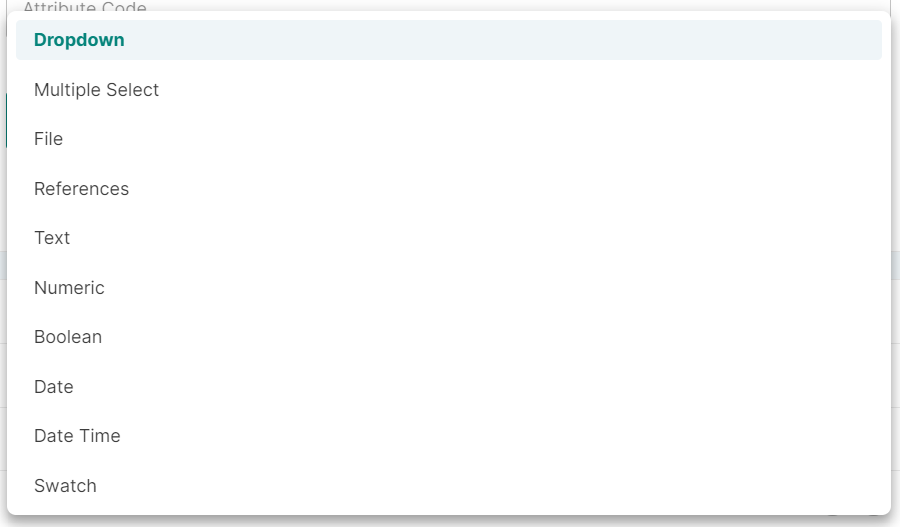
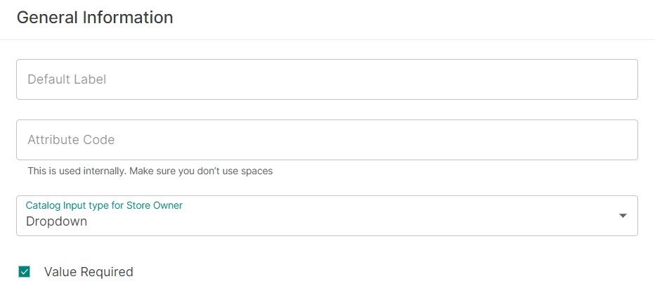

## Introduction

The Attributes page allows you to use the full capacity of the product structure in Saleor. By configuring your products right, product management in Saleor becomes a hassle-free task.

The main Attributes page displays a list of all existing attributes. The list consist of several columns indicating the attribute parameters (such as an attribute code or whether the attribute is visible to your customers).

You can create variations of products you sell to reflect the wide range of colors, sizes, and materials in which the product is available.

For more information on the product structure in Saleor, see the [Products](dashboard/catalog/products.md#product-concept-introduction) topic.

> **Example**
>
> As an illustration of the role Attributes play, consider the following example:
>
> Product Category: Shoes
>
> Product Type: Women's Sport Shoes
>
> Product: NB Women's Running Shoes
>
> At this stage, you sell pink and black NB Women Running Shoes.
>
> Both these colors come in sizes ranging from 36 to 40.
>
> We have then two attributes to handle:
>
> - shoe size
> - color
>
> The available **Attribute Values** in this case are:
>
> - For Attribute _shoe size_: 36, 37, 38, 39, and 40.
> - For Attribute _color_: Pink and black.
>
> The **Variant Attributes** are a combination of an Attribute and its specific Value.
>
> Variant Attributes are created according to the following pattern:
>
> Variant Attribute = Attribute_1 (shoe size: 36) + Attribute Value_1 (color: pink)
>
> This way you can create an entire matrix of colors and sizes and make them available to your customers.

## How to

### How to create an attribute

#### Step 1: Create an attribute

In the main Attribute page, click _Create&nbsp;Attribute_.

#### Step 2: General Information card

In the General Information card, provide the following data:

- Default Label - This is the name of your attribute visible to your customers. For example, size.

- Attribute Code - This is used to distinguish between, for example, _shoe sizes_ (36, 37, etc.) and _t-shirt sizes_ (XS, S, etc.). Any value you enter in this field will only be used internally; your customers will not see it. The attribute code must be a unique value.

- Catalog Input type for Store Owner - Here you can decide how the attribute values are displayed to the admin in the product management views. Available options are: 

1. _Dropdown_ - select one of the available options
2. _Multiple Select_ - select more than one of the available options
3. _File_ - upload a file like a specification sheet or an image
4. _References_ - assign an ordered list of products or pages
5. _Text_ - assign value via the rich-text editor
6. _Numeric_ - assign numbers as values for attributes
7. _Boolean_ - define whether a value is true or false for an attribute
8. _Date/Date time_ - define a date or date and time as a value for the attribute
9. _Swatch_ - define color values or images for an attribute

:::note
Only the attributes with the input type (in the Attribute setup page) set to _Dropdown_ may be used as Variant Attributes.

In other words, when setting up your Product Type, if you select a Variant Attribute which is set up as _Multiselect_, you will receive the following error message: "Variants are disabled in this product type".
:::

- Value Required - If the toggle is active, this attribute is required on the Product setup page. When creating a Product using this attribute, you will be required to provide a value for this attribute.

#### Step 3: Organization card
Choose one of the following attribute classes: _Product Attribute_ or _Content Attribute_. It defines where the attribute should be used in Saleor. 

#### Step 4: Properties card

The Properties card is divided into three properties sections. These sections allow you to define how your attribute should behave from the Storefront and Dashboard perspective.

Use the following fields to complete the properties setup of your attribute:

##### Storefront Properties section

- Use in Faceted Navigation - This refers to filtering layers. If the toggle is active, this attribute will be available as a layer in product filtering.

- Position in Faceted Navigation - Use this field to indicate the order of attributes in the faceted navigation. Type in a number; the lower the number, the higher the position of your attribute.

- Visible on Product Page in Storefront - If the _Public_ toggle is active, your attribute will be visible when viewing the product page.

##### Dashboard Properties section

- Use in Filtering - Indicates if this attribute is also available as a filtering option in the product list page.

- Add to Column Options - Allows to use this attribute as one of the column options on the product list page. See the [Product](dashboard/catalog/products.md#editing-columns) topic for more information on managing the product list view.

#### Step 5: Add values

To add specific values to your attribute, click _Assign&nbsp;Value_ in the Attribute Values card and type in the value. This is visible to your customers.

#### Step 6: Save changes

Click _Save_ once finished.

### How to edit or delete an attribute

Select the specific attribute from the list of existing attributes.

- To edit, enter your changes and click _Save_.

- To delete, click the _Delete_ button and confirm that you wish to proceed with the deletion.

:::warning
Make sure to remove attributes with caution. There may be dependent product types related to them. Inspect the existing dependencies before continuing.
:::

### How to manage metadata in the attribute setup page

You can add private and public metadata for each attribute in the attribute setup page. Use the button _Add Field_ to add a new metadata field.

To learn more about object metadata, see the [Developer's Guide](developer/metadata.mdx).
