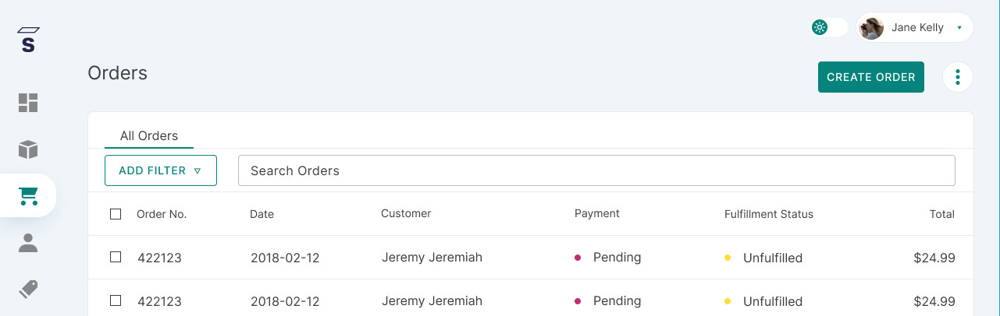

## Introduction

This page allows you to configure the settings that are related to orders.

## How to access order settings page

1. Go into the dashbaord order list
2. Click on the three dots menu on the right

3. Click on order settings to access the settings page

## Confirgurable options

| Option                                | Description                                                                                                                                                                                                             |
| ------------------------------------- | ----------------------------------------------------------------------------------------------------------------------------------------------------------------------------------------------------------------------- |
| Automatically confirm all new orders | When user finish checkout and this setting is enabled, order status will be _Unfulfilled_ without any need for staff confirmation. When disabled, all new orders created from checkouts will have status _Unconfirmed_ and these have to be [manually confirmed by staff](../orders.md#how-to-confirm-an-order) in order to become _Unfulfilled_.
