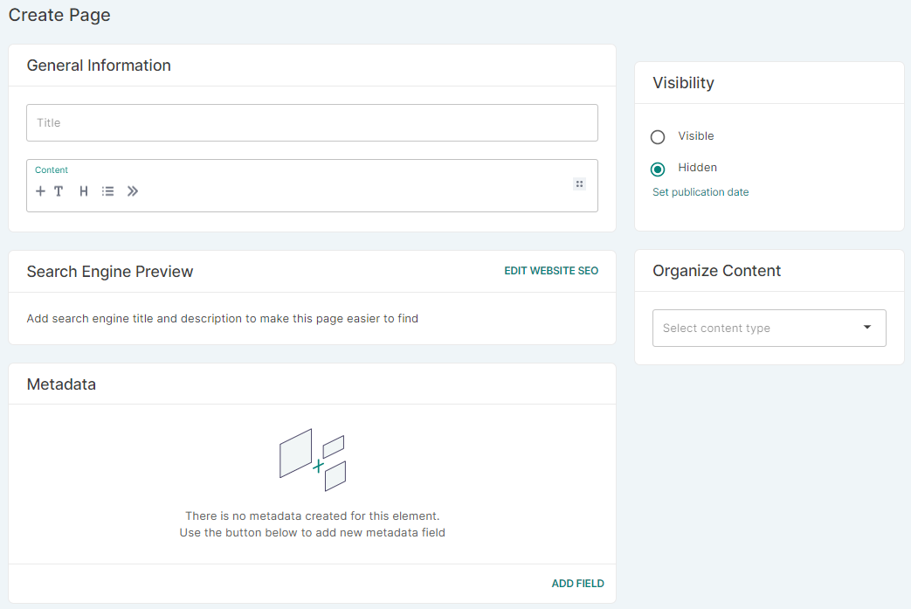

## Introduction

This page allows you to create and display informational content about your store, your team, terms and conditions, privacy information, and other useful details.

This content is usually placed in the footer of your main storefront page.

These simple text pages enhance the image of your business and sometimes contain essential legal information you need to communicate to customers.

## How to

### How to add a page

**1. Adding a page**

To add a page, click the _Pages_ tile in the Configuration section of the dashboard menu. Click _Create&nbsp;Page_ at the top right corner.

**2. Provide general information**

Fill in the title of the page, as it will appear in the footer of your store. Keep it short, preferably just a word or two.

Add the content that the page will contain. This may be a simple description of your store or a full terms and conditions section. Use the word processor formatting tools to adjust font sizes, add hyperlinks, and style the page as you want it to appear.

**3. Search engine preview**

Click _Edit&nbsp;Website&nbsp;SEO_ to fill out the following fields that will appear in web searches:

- Slug
- Search engine title
- Search engine description

:::note
If you leave the fields above empty, the preview will be auto-generated.
:::

**4. Organize content**

Select a previously created [page type](dashboard/configuration/page-types.md).

**5. Visibility**

You can choose if your page is published or not. Use the switch in the Visibility card to make it visible or hidden.

:::tip
You can set a future date when the page will be published. Use the _Publish on_ field to specify a publishing date.
:::

**6. Attributes**

Once the page has been created, you can assign a previously created [content attribute](dashboard/configuration/attributes.md). 

### How to manage metadata in the product type setup page

You can add private and public metadata for each page in the page setup. Use the button _Add Field_ to add a new metadata field.

To learn more about object metadata, see the [Developer's Guide](developer/metadata.mdx).

### How to delete a page

To delete a page, in the main list of existing pages, click the checkbox next to the page name you want to remove, then click the trash can icon.

Alternatively, you can enter the page you want to delete and then click _Remove_ in the footer.
