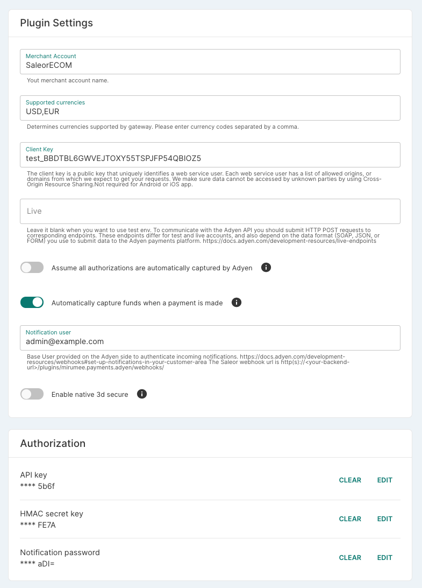
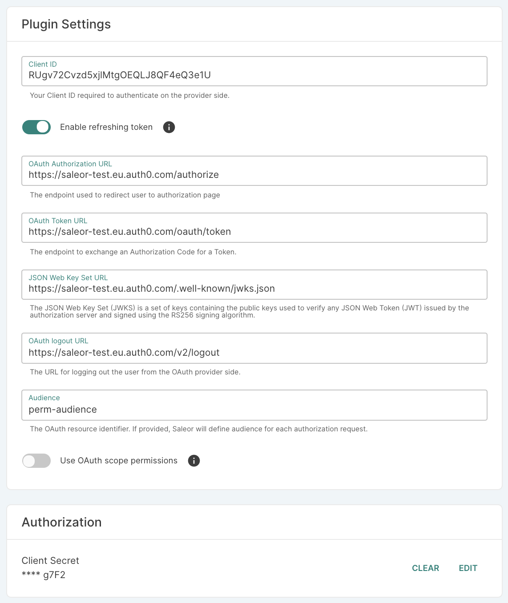

## Introduction

This page gives you a convenient overview of currently installed plugins in Saleor.
Saleor provides the possibility to add various extensions to it so you can create your own configuration.

The plugin page is used to display general information about installed plugins, along with their activation status (active or not active).

If you choose to, you can use the plugin window to display the basic configuration to allow dashboard users to manage the elemental settings of existing plugins.

For more detailed information about plugins and our Extension Manager, see the [Extending](../../developer/extending) topic in the chapter for developers.

Saleor arrives with the following plugins already integrated.

- Used to configure taxes in Saleor:

  - Avalara

  - Vatlayer

- Used to process payments (all supported payment gateways in Saleor come as plugins):

  - Adyen

  - Braintree

  - Razorpay

  - Stripe

- Used to provide certain core features:

  - Invoicing

  - Webhooks

In all cases of plugin configuration, you need to provide your credentials. Depending on the gate you are configuring, there might be additional setup required.

## Adyen

### Enabling the Adyen integration

Go to _Configuration_ -> _Plugins_ -> _Adyen_ and fill in the fields:

- **Merchant Account:** your Adyen account identifier as described in the [getting started with Adyen guide](https://docs.adyen.com/checkout/get-started#step-1-sign-up-for-a-test-account)

- **Supported currencies:** your currency as an ISO 4217 3-letter code (eg. `USD`, `EUR`, `GBP`)

- **Client Key:** The client key is a public key that uniquely identifies a web service. See [Adyen docs](https://docs.adyen.com/user-management/client-side-authentication#get-your-client-key).

- **Live:** Leave it blank if you want to use the test environment. See [Adyen docs for production environments](https://docs.adyen.com/development-resources/live-endpoints).

- **Assume all authorizations are automatically captured by Adyen:** All authorized payments will be marked as captured. This should only be enabled if Adyen is configured to auto-capture payments. Saleor doesn’t support the _delayed capture_ Adyen feature.

- **Automatically capture funds when a payment is made:** If enabled, Saleor will automatically capture funds. If disabled, the funds are blocked but need to be captured manually.

- **HMAC secret key:** key used to check if a received notification comes from Adyen. The key should be the same as on the Adyen side. Generate a new key in the Adyen customer area and copy it here. See [Adyen docs](https://docs.adyen.com/development-resources/webhooks#set-up-notifications-in-your-customer-area).

- **Notification user:** In addition to checking request signatures, you can confirm received notification by checking the provided user in the notification. Provide a user in the _Authentication_ section of your Adyen customer area and copy it here. See [Adyen docs](https://docs.adyen.com/development-resources/webhooks#set-up-notifications-in-your-customer-area).

- **Notification password:** In addition to checking request signatures, you can confirm received notification by checking the provided user’s password in the notification . Provide a password in the _Authentication_ section of your Adyen customer area and copy it here. See [Adyen docs](https://docs.adyen.com/development-resources/webhooks#set-up-notifications-in-your-customer-area).

- **Enable native 3D Secure:** Saleor uses 3D Secure redirect authentication by default. If you want to use native 3D Secure authentication, enable this option. For more details see Adyen documentation: [native 3D Secure 2](https://docs.adyen.com/checkout/3d-secure/native-3ds2), [redirect 3D Secure 1 and 2](https://docs.adyen.com/checkout/3d-secure/redirect-3ds2-3ds1)

Below you can find an example configuration of the Adyen plugin:

### Activating the Adyen notification

Adyen uses a notification system. Enabling it is required for proper work of payment gateway.
1. Follow [the Adyen docs about notifications.](https://docs.adyen.com/development-resources/webhooks#set-up-notifications-in-your-customer-area)
    * For `URL` use `https://<your-backend-url>/plugins/mirumee.payments.adyen/webhooks/`.
    * For `SSL Version` use the newest one.
    * For `Method` use JSON.
2. To protect your notification follow [the Adyen docs about security.](https://docs.adyen.com/development-resources/webhooks/best-practices#security)
    * Copy the HMAC key into the Saleor's **HMAC secret key** field. [(See Saleor configuration fields.)](#enabling-the-adyen-integration)
    * Copy the username from _Authentication_ section and paste it to Saleor field **Notification user**. [(See Saleor configuration fields.)](#enabling-the-adyen-integration)
    * Copy the password from _Authentication_ section and paste it to Saleor field **Notification password**. [(See Saleor configuration fields.)](#enabling-the-adyen-integration)
3. To test your configuration check [the Adyen docs about testing the configuration.](https://docs.adyen.com/development-resources/webhooks#test-your-notifications-server)

## OpenID Connect

### Enabling OpenID Connect plugin
Go to Configuration -> Plugins -> OpenID Connect and fill in the fields:

- **Client ID:** Your client ID, required to authenticate on the OAuth provider side.
- **Client secret:** Your client secret, required to authenticate on the OAuth provider side.
- **Enable refresh token:** Determine if the refresh token should be also fetched from the provider. By disabling it, users will need to re-login after the access token expired. By enabling it, frontend apps will be able to refresh the access token.
- **OAuth authorization url:** Based on the authorization URL, Saleor will generate the redirect URL for the authorization request
- **OAuth token url:** The URL used to exchange received OAuth code to the OAuth token
- **JSON web key set url:** The JSON Web Key Set (JWKS) is a set of keys containing the public 
keys used to verify any JSON Web Token (JWT) issued by the authorization server
- **OAuth logout url:** The logout URL which Saleor will return for frontend's logout request
- **Audience** The Oauth resource identifier. If provided, Saleor will define the audience for each authorization request.  Used to fetch user permissions from OAuth provider and map it to Saleor's permission

:::note
After the user finishes the authentication process, the OAuth provider redirects the user to Saleor to exchange code for the token. Make sure that your OAuth provider has whitelisted Saleor's redirect URL.

`http(s)://<your-saleor-backend>/plugins/mirumee.authentication.openidconnect/callback`
:::

Below you can find an example configuration of the OpenID Connect plugin:

### Using OAuth permissions in Saleor

Saleor will request his own permissions as OAuth scopes.  Each permission has the prefix `saleor:`.  If the user has assigned Saleor's permissions on the OAuth side, Saleor will grant them to the logged-in user.
Your OAuth app needs to have an assigned audience with proper Saleor's permissions with prefix `saleor:`.

>*UserA* has assigned permissions on the OAuth side - `saleor:manage_apps` and `saleor:manage_orders`, *UserB* has assigned 
> permission - `saleor:manage_users`. When *UserA* logs in to the Saleor using *OpenID Connect* plugin, the plugin will grant the *UserA*
> permissions to *MANAGE_APPS* and *MANAGE_ORDERS*. The *UserB* will have access to resources protected by *MANAGE_USERS*

