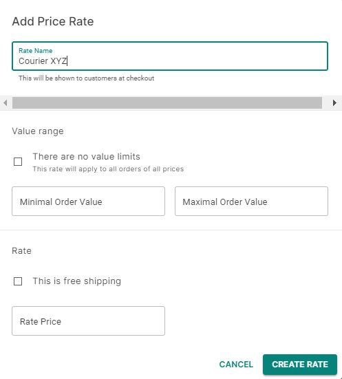

## Defining shipping zones 

On this page you can manage how you ship out orders. The Shipping Methods section contains two main cards: Shipping By Zone and Configuration.

## Weight configuration

You can choose metric or imperial weight units as the default in which your store will display products. In the Configuration card on the right, click on the triangle in the Shipping Weight Unit field to choose between grams (G), kilograms (KG), pounds (LB) and ounces (OZ) as your default weight measurement.

## How to

### How to add a shipping zone and assigning countries

Shipping Zones define the cost of shipping in different areas of the world. Collecting countries together in zones allows you to assign the best shipping and delivery options for customers.

Click _Add&nbsp;Shipping&nbsp;Zone_ in the top right corner of the Shipping by Zone card. Add the name of the shipping zone then click _Assign&nbsp;Countries_ and use one of the three options in the pop-up window that appears:

1. In the Search Countries section at the top, you can search specific countries by name and assign them to the shipping zone
2. The Quick Pick section is an option that allows you create a shipping for all unassigned countries. This is a useful option for defining a final ‘Rest Of The World’ shipping zone to guarantee global coverage 
3. Scroll through the Countries A to Z list and assign countries using the checkboxes

Click _Assign_ to confirm your selection.

### How to remove shipping zones and countries

You can remove individual shipping zones by entering the zone from the list and clicking _Remove_ in the footer. To remove multiple zones, click the checkboxes on the main list and then confirm using the trash can icon that appears above the list.

Remove countries from a shipping zone using the trash can icon next to the country name when you enter a specific zone from the main list.

### How to add shipping rates

Find rates offered by couriers for the delivery of your goods and add them to your shipping zones. When your customers get to the checkout section of the store, they will be presented with these shipment options and prices.

There are two types of shipping:

- Price-based shipping defines the cost based upon the value of goods. Can be used when the order price falls within a certain range. For example, from $0 to $50 - shipping method A, over $50 - shipping method B, etc.
- Weight-based shipping defines cost by weight. Similar to the price based example. 

These two methods cover most of the basic use cases, for example:

* Listing several methods with different prices and shipping time for different countries.
* Offering a free (or discounted) shipping on orders above certain price threshold.
* Increasing the shipping price for heavy orders.

### Postal codes

This section allows you to exclude shipping method for customers with certain postal codes.
If customer shipping address postal code is within any of specified ranges, that shipping method will be unavailable for that customer.

For now the only supported mode for postal codes is *exclude*, support for inclusion will be added in future.

Postal codes are being compared lexicographically (start range < customer postal code < end range) for any country unless it's one from the list:
- Great Britain: lexicographical comparison while keeping area code in mind, for ex: when the range is *BH2 1AA* - *BH4 9ZZ* and the customer postal code is *BH20 2BC*, it **won't** be in that range (so shipping method will still be available for that customer).
- Ireland: lexicographical comparison while keeping routing key in mind.
- Isle of Man, Jersey, Guernsey: same rules as for Great Britain.

### How to add a courier

1. Click _Create&nbsp;Rate_ in the Price Based Rates card.

2. Put the name of the courier in the Rate Name field.

3. Define if there are minimum and/or maximum weight or price values put in place by couriers. 

    * If there are no limitations, select the There are no value limits checkbox. 

    * If there are limitations, input them into the fields as the value range. If you leave the minimum value empty, it means that there is no lower threshold. If you leave the maximum value empty, it means there is no maximum weight or price value.

#### Free or paid shipping

If you offer free shipping, select the _This is free shipping_ checkbox. 

If shipping is charged, input the rate per weight unit in the currency field.

### How to remove couriers

Remove couriers from specific shipping zones by entering the zone and clicking the trash can icon next to the courier you want to remove. 
