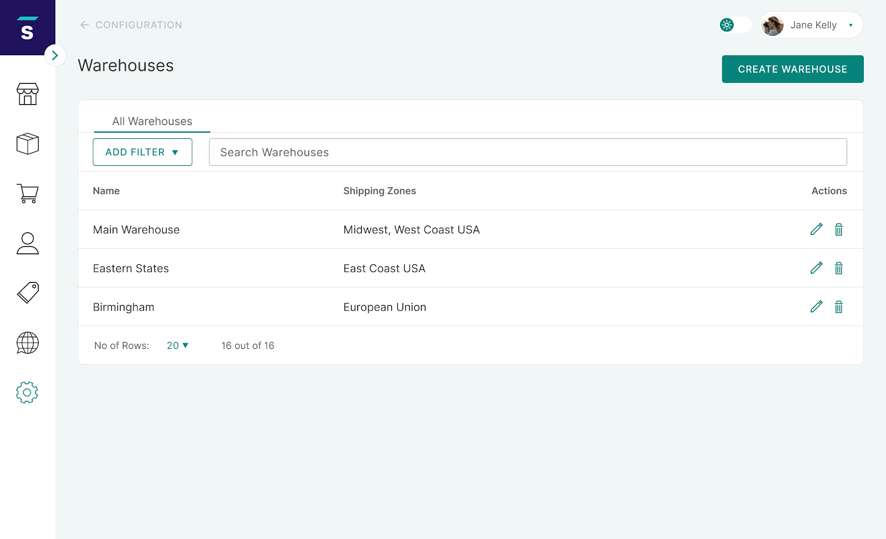
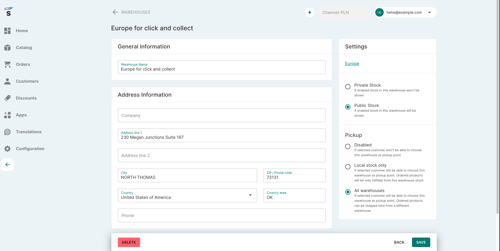

## Introduction

This page presents an overview of managing your multi-warehouse inventory. In short, a multi-warehouse feature is the ability to split inventory among multiple locations. Saleor 2.10 supports the implementation of basic multi-warehouse management. This will enable the platform to more closely follow your existing stock management process.

## Creating a warehouse

To create a warehouse, visit the _Warehouses_ section in the _Configuration_ tab.

Select _Create&nbsp;Warehouse_ and fill in the name and address information.

## Adding a warehouse to a shipping zone

To assign a warehouse to a shipping zone, visit the shipping zone's details page.

## Stock management

See [Products](dashboard/catalog/products.md#stock-management).

## Click & Collect related settings

:::info

This feature was introduced in **Saleor 3.1**.

:::

To enable Click & Collect option in the given `Warehouse`, select `All Warehouses` or `Local stock only`. The `All Warehouses` option indicates that ordered products can be picked up from the selected warehouse even if they need to be shipped from a different warehouse (or multiple warehouses). `Local stock only` means that ordered products can be picked up from a selected warehouse only if there is enough stock in the selected `Warehouse` to fulfill the entire order.

`Public Stock` and `Private Stock` options are used to decide whether warehouse stock levels should be visible to customers. Please note that making the stock information private will disable the `Local stock only` collection option as customers would be unable to check if a particular product is available for pickup or not.

:::note
All Warehouses use `Disabled` and `Private Stock` settings by default.
:::

