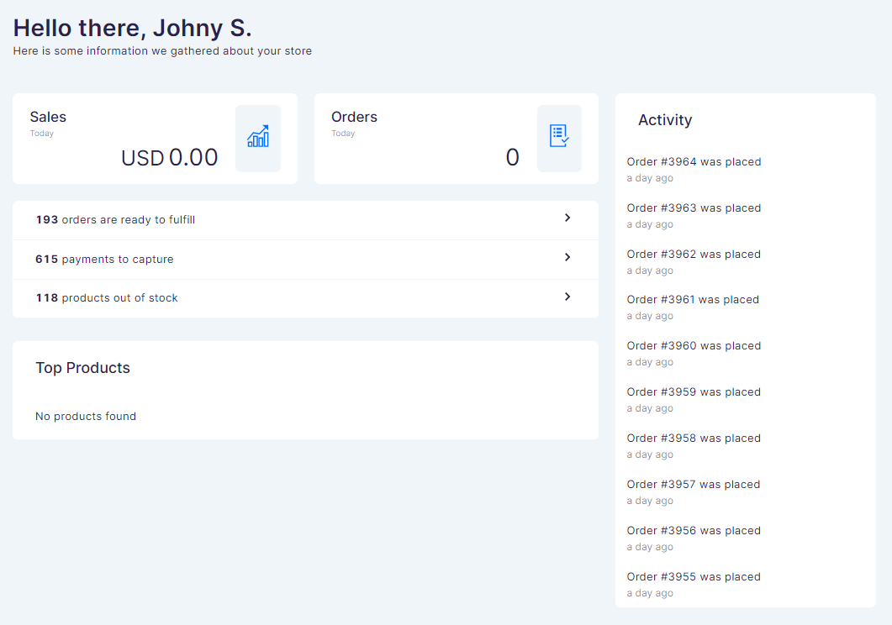

The Home page is the welcome screen of your dashboard. It appears when you log in to the system and gives you a quick overview of recent activity in your store. Refresh your browser to update the statistics.

The page consists of the following cards:

## Sales and orders overview

Get a quick summary of the number of orders for the current day and the running total value of sales.

## Orders, payments, and out of stocks

This card gives an overview of the total number of orders yet to be fulfilled and payments awaiting capture. Clicking each link gives you a breakdown of individual orders and payments. You can also see a total number of products that are out of stock and click the link to see a detailed list.

## Top products

Identify and understand the trends in your product sales through a handy overview of daily top sellers. Click on individual products to manage inventory.

## Activity

The activity card gives you a quick summary of all actions taken by your Saleor system; orders which have been placed, fulfilled and canceled, and details of payment processing.

## How to

### How to switch a channel

Once multiple sales [channels](dashboard/configuration/channels.md) have been created, you can switch between the channels. To switch the channel, click the tab next to your user name in the top right corner of the dashboard page.

### How to change basic information of the staff account

Saleor allows you to change the following information of the staff account:
- First name
- Last name
- E-mail address
- Password
- Preferred language

Once you are logged in to your dashboard staff account, to change the information above, go to the _Account Settings_ by clicking on your account name in the top right corner of the dashboard.

### How to enable dark mode

If you prefer to work in dark mode, click on your account name in the top right corner of the dashboard and then click the _Enable Dark Mode_ button.

### How to log out

To log out, click your account name in the top right corner of the dashboard, and then click the _log out_ button. 
