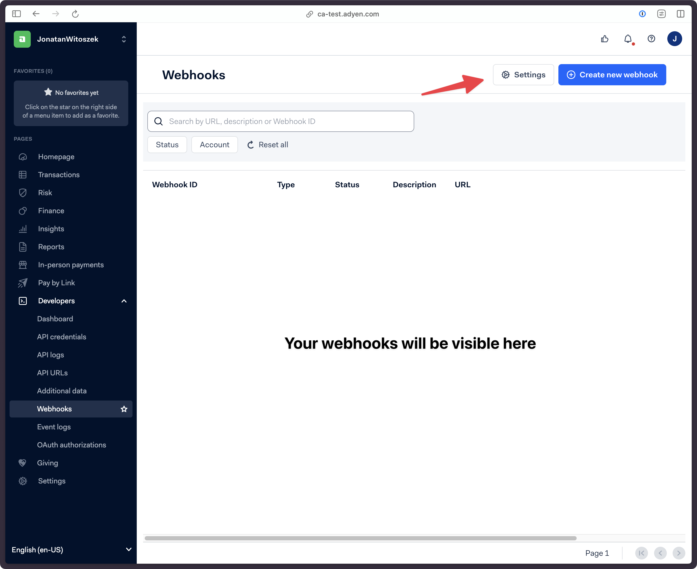
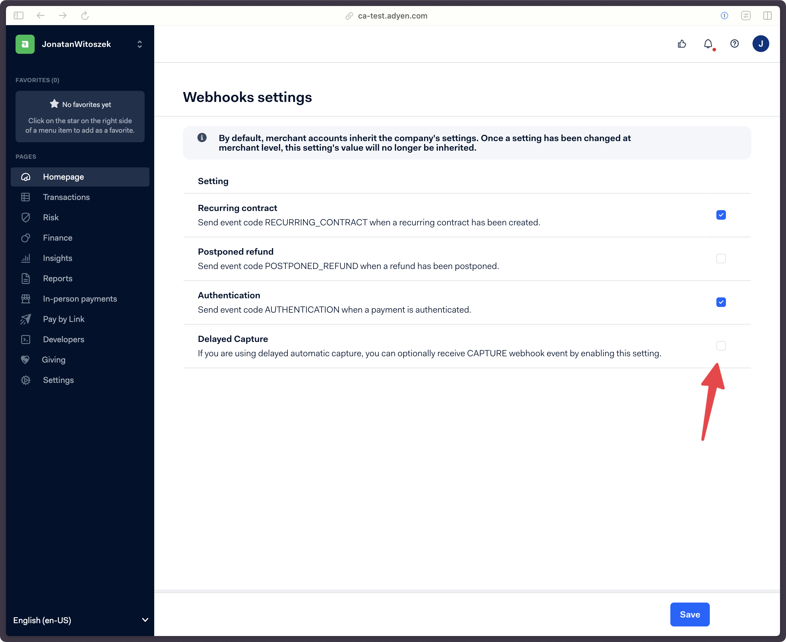

import { AppMetadata } from "/components/AppMetadata/AppMetadata.jsx";
import { Mail } from "lucide-react";

<AppMetadata minSaleorVersion="3.20" />

The Adyen App is a payment integration app that allows merchants using the Saleor e-commerce platform to accept online payments from customers using Adyen as their payment processor. In addition to processing payments, the Saleor App Payment Adyen provides merchants with tools for managing refunds and chargebacks.

:::caution

To configure the Adyen App, you must have an account with [Adyen](https://www.adyen.com).

:::

The Adyen App uses the [Adyen Drop-in Advanced Flow](https://docs.adyen.com/online-payments/build-your-integration/advanced-flow/) and allows for integrations with the following Adyen flows:

- Web (drop-in and components)
- iOS (drop-in and components)
- Android (drop-in and components)
- Cross-platform (React Native drop-in and React Native components)

## Features

- Can be configured per channel
- Split refunds and payments
- Givex gift card support

:::info

Adyen App uses Adyen [Checkout API v70](https://docs.adyen.com/api-explorer/#/CheckoutService/v70/overview) and [Management API v1](https://docs.adyen.com/api-explorer/#/ManagementService/v1/overview).

:::

If you want to self-host the Adyen app, reach out to [our team <Mail size={12}/>](mailto:hello@saleor.io).

### Adyen notifications

:::caution
If notification event is not listed below it will be **ignored** by the app.
:::

:::info
Notifications for payments made without using Adyen app will be ignored. This happens because they do not have required `metadata` ([see more details](#receiving-notifications-for-transactions-not-started-in-adyen-app))
:::

App supports following notification events from Adyen:

  - [`Authorisation`](https://docs.adyen.com/api-explorer/Webhooks/1/post/AUTHORISATION)
  - [`AuthorisationAdjustment`](https://docs.adyen.com/api-explorer/Webhooks/1/post/AUTHORISATION_ADJUSTMENT)
  - [`Cancellation`](https://docs.adyen.com/api-explorer/Webhooks/1/post/CANCELLATION)
  - [`CancelOrRefund`](https://docs.adyen.com/api-explorer/Webhooks/1/post/CANCEL_OR_REFUND)
  - [`Capture`](https://docs.adyen.com/api-explorer/Webhooks/1/post/CAPTURE)
  - [`CaptureFailed`](https://docs.adyen.com/api-explorer/Webhooks/1/post/CAPTURE_FAILED)
  - [`Expire`](https://docs.adyen.com/api-explorer/Webhooks/1/post/EXPIRE)
  - [`OrderClosed`](https://docs.adyen.com/api-explorer/Webhooks/1/post/ORDER_CLOSED)
  - [`Refund`](https://docs.adyen.com/api-explorer/Webhooks/1/post/REFUND)
  - [`RefundFailed`](https://docs.adyen.com/api-explorer/Webhooks/1/post/REFUND_FAILED)
  - [`RefundedReversed`](https://docs.adyen.com/api-explorer/Webhooks/1/post/REFUNDED_REVERSED)
  - [`RefundWithData`](https://docs.adyen.com/api-explorer/Webhooks/1/post/REFUND_WITH_DATA)
  - [`VoidPendingRefund`](https://docs.adyen.com/api-explorer/Webhooks/1/post/VOID_PENDING_REFUND)
  - [`Chargeback`](https://docs.adyen.com/api-explorer/Webhooks/1/post/CHARGEBACK)
  - [`SecondChargeback`](https://docs.adyen.com/api-explorer/Webhooks/1/post/SECOND_CHARGEBACK)
  - [`ChargebackReversed`](https://docs.adyen.com/api-explorer/Webhooks/1/post/CHARGEBACK_REVERSED)

Following events will be mapped to `INFO` event in Saleor, it will not change amounts on `TransactionItem`:
  - `HandledExternally`
  - [`PostponedRefund`](https://docs.adyen.com/api-explorer/Webhooks/1/post/POSTPONED_REFUND)
  - [`NotificationOfFraud`](https://docs.adyen.com/api-explorer/Webhooks/1/post/NOTIFICATION_OF_FRAUD)
  - [`NotificationOfChargeback`](https://docs.adyen.com/api-explorer/Webhooks/1/post/NOTIFICATION_OF_CHARGEBACK)
  - [`PrearbitrationLost`](https://docs.adyen.com/api-explorer/Webhooks/1/post/PREARBITRATION_LOST)
  - [`PrearbitrationWon`](https://docs.adyen.com/api-explorer/Webhooks/1/post/PREARBITRATION_WON)
  - [`RequestForInformation`](https://docs.adyen.com/api-explorer/Webhooks/1/post/REQUEST_FOR_INFORMATION)
  - [`ManualReviewAccept`](https://docs.adyen.com/api-explorer/Webhooks/1/post/MANUAL_REVIEW_ACCEPT)
  - [`ManualReviewReject`](https://docs.adyen.com/api-explorer/Webhooks/1/post/MANUAL_REVIEW_REJECT)

## Assumptions

- If Adyen doesn't respond to app request for [initialize transaction session](/developer/extending/webhooks/synchronous-events/transaction#initialize-transaction-session) or [process transaction session](/developer/extending/webhooks/synchronous-events/transaction#process-transaction-session) with `pspReference`:
  - App will return `CHARGE_ACTION_REQUIRED` or `AUTHORIZATION_ACTION_REQUIRED` as the transaction result. This is because Saleor doesn't require `pspReference` in app response for these transaction results.
  - App can also return this status if an action is required to be performed on the storefront, this is indicated by an `action` object being included in the Adyen response.
- App might not return `pspReference` for:
  - [Transaction refund webhook](/developer/extending/webhooks/synchronous-events/transaction#transaction-refund) with transaction status of `REFUND_FAILURE`
  - [Transaction charge webhook](/developer/extending/webhooks/synchronous-events/transaction#transaction-charge) with transaction status of `CHARGE_FAILURE`
  - [Transaction cancellation webhook](/developer/extending/webhooks/synchronous-events/transaction#transaction-cancelation) with transaction status of `CANCEL_FAILURE`
  - [Initialize transaction session webhook](/developer/extending/webhooks/synchronous-events/transaction#initialize-transaction-session) with transaction status of:
    - `CHARGE_ACTION_REQUIRED`
    - `AUTHORIZATION_ACTION_REQUIRED`
    - `CHARGE_FAILURE`
    - `AUTHORIZATION_FAILURE`
  - [Process transaction session webhook](/developer/extending/webhooks/synchronous-events/transaction#process-transaction-session) with transaction status of:
    - `CHARGE_ACTION_REQUIRED`
    - `AUTHORIZATION_ACTION_REQUIRED`
    - `CHARGE_FAILURE`
    - `AUTHORIZATION_FAILURE`
- [Webhook settings > Delayed Capture](#duplicated-chargedamount-in-saleor) is disabled in Adyen Dashboard
- Webhook in Adyen was created with all options (additional settings) described in [Saleor docs](./configuration.mdx#webhook-configuration)
- Before [user cancels a payment](./storefront.mdx#onordercancel), App will update `TransactionItem` in Saleor, so that it has either `REFUND_REQUEST` or `CANCEL_REQUEST` event. If update in Saleor fails, user won't be able to cancel payment. This prevents fraudulent orders from being created.

## Limitations & troubleshooting

### Changing channel to configuration mapping in production

App stores its configuration assigned to specific Saleor channel.

Each payment in Adyen stores `channelId` in its metadata, in order to get proper configuration from the app once app receives notification from Adyen.

If you change the channel to configuration mapping, all enqueued notifications (pending notifications from Adyen) that were related such channel will be not handled properly by the app, causing the request to fail.

Before you change the configuration mapping, make sure that you do one of the following (listed in order of the least intrusive changes):
- **Create new channel in Saleor** and create a new config so that you don't change mappings at all. This way you can gradually accept new orders on new merchant account and keep handling changes related to orders created on old merchant account.
- **Use the same webhook settings** for the new configuration (HMAC key, username, password).
  - You can re-use old HMAC key in Adyen webhook, by choosing it from the list while creating the webhook.
  - Keep in mind that if you change merchant account app will not be able to request changes on existing Transactions, but it will report changes made in Adyen Dashboard. To do that webhook needs to have selected previous merchant account in ["include specific merchant account" setting](https://docs.adyen.com/development-resources/webhooks/#set-up-webhooks-in-your-customer-area).
  - If you want to use new HMAC key, remember to first create new configuration in app with the old HMAC key, and then change it in both new and old configuration, then you can save changes in Adyen. This way no notification will be rejected by app due to invalid HMAC signature
- **Not recommended**: Make sure you **don't have any pending notifications** in the Adyen queue. You can achieve that by disabling payments for your merchant account for a while and then migrating it.
  - Keep in mind that if you request _any_ action on already created Transactions (refund, charge, cancel), they will fail.
  - Any payment modifications requested in Adyen Dashboard will also not be reflected in Saleor.

### Rejected Adyen webhook

Adyen webhook notifications might get rejected by Adyen app for various reasons. You can investigate them by checking response returned by app in Adyen webhook logs.

Here are some common reasons for rejected Adyen webhook

#### Invalid HMAC signature or username or password

Adyen's notifications content is signed using the HMAC key generated at the time of webhook configuration (to learn more about configuration see [Configuration docs page](./configuration.mdx)).

App stores each HMAC key in its configuration that's based on `channelId` which in turn is stored in Adyen payment metadata.

```
Adyen payment -> Notification item -> Metadata channelId -> Channel x configuration mapping in app settings -> Configuration -> HMAC key
```

When signature is invalid, it can mean either that:
- You've changed HMAC key in your Adyen webhook settings, but didn't update it in app settings
- You've changed HMAC key in your app configuration, but HMAC wasn't changed on Adyen side
- You've changed a channel to configuration mapping in app, but new configuration has different HMAC key configured

Same principle applies to webhook's `username` and `password`.

If you detect such issue, we recommend you to check current configuration if it matches your expectations (accidental mapping change). If so then you can rotate HMAC key by going to Adyen settings, generating new HMAC key and updating it in Adyen app.

Once you save changes, app will now store two (or more) HMAC keys which will be used to check incoming notifications.

Note that notifications which were already queued by Adyen, will still be rejected by app, as they were signed using old HMAC key. You'll need to update Transaction status manually in Saleor and ignore these notifications on Adyen side.

If number of enqueued webhooks is too high for manual ignore, you can also create brand-new webhook, and new configuration in Adyen app. See [Configuration docs page](./configuration.mdx) to see how this can be done.

#### Missing configuration for channel

As described in [Invalid HMAC signature section](#invalid-hmac-signature-or-username-or-password) notifications are dependent on your channel to configuration mapping. If you do one of the following:
- delete configuration that was assigned to a channel
- unset channel to configuration mapping

Any notification for Transactions created in that channel will be rejected by app.

To fix this, assign correct channel to configuration mapping.

Keep in mind that if you decide to create new configuration and use a new HMAC key, previously enqueued notifications in Adyen will still be rejected, as they were signed using old HMAC key.

#### Receiving notifications for transactions not started in Adyen app

If you use the same merchant account in Adyen for multiple purposes (e.g. multiple Saleor instances, subscription payments done by other app, in store POS payments) Adyen app might reject these notifications, which will impact delivery of other notifications that were meant for Adyen app.

In order to prevent this from happening you should:
- Treat merchant account used for Adyen app payments as dedicated only to the app, meaning if you want to process other payments, you will create new merchant accounts for any other use case
- **Only if above cannot be done**: make sure that you do not include any metadata in Adyen payment that could be used to identify it as a Saleor payment. This way Adyen app will not be able to identify it as a Saleor payment and will not reject it. Here are some common fields that are used to identify Saleor payment:
    - `metadata.channelId`
    - `metadata.transactionId`

#### Changed `saleorApiUrl`

If you change your Saleor instance domain, then you should also update webhook URL in Adyen app. To do that go to Adyen app settings, copy new webhook URL and update it in Adyen dashboard.

### Flooded Adyen webhook queue

Adyen uses a queue to deliver notifications to the app. The more unexpected error occur (app returning non-200 to Adyen), the more events will be marked as "error" in the Adyen queue. Adyen will keep retrying notifications delivery up to 30 days.

After some arbitrary limit set by Adyen is reached for specific webhook events, there is a risk that Adyen will stop sending notifications until error is fixed or notification dropped manually in Adyen Dashboard.

This situation is abnormal, but to ensure smooth process, you should regularly monitor Adyen's webhook queue and drop broken events if needed

In order to drop notifications (e.g. due to a change in channel to configuration mapping in App) refer to [Adyen Docs](https://docs.adyen.com/development-resources/webhooks/troubleshoot/#ignore-notification). Keep in mind that if notification is dropped its current status won't be reflected in Saleor. You need to drop each broken notification separately by refreshing page in Adyen Dashboard.

### Duplicated `chargedAmount` in Saleor

If you have `chargedAmount` that's duplicated due to two `CHARGE_SUCCESS` event being created in Transaction history, make sure that you've disabled "Delayed capture" webhook setting in Adyen Dashboard.

:::info
This setting causes app to receive two webhooks for each payment that uses `CHARGE` flow (capture delay in merchant account settings is set to "immediate" or "x days" and [`channel.paymentSettings.defaultTransactionFlowStrategy`](/api-reference/payments/inputs/payment-settings-input.mdx) is set to [`TransactionFlowStrategyEnum.CHARGE`](/api-reference/payments/enums/transaction-flow-strategy-enum.mdx)):

- First `AUTHORIZED` webhook is sent when payment is first created, it's an authorization (funds locked on customer payment method)
- Then `CAPTURE` webhook is sent when transaction is charged (this happens automatically by Adyen) and funds are transferred to you.

Adyen app currently assumes that `AUTHORIZED` webhook is used for both charge and captures and identifies which flow was used based on your Saleor and Adyen merchant account settings.

`CHARGE` webhook is currently used only when reporting charges on previously authorized payment when you use either [`TransactionFlowStrategyEnum.AUTHORIZATION`](/api-reference/payments/enums/transaction-flow-strategy-enum.mdx) in your Saleor channel or you set Capture delay to "manual" in merchant account settings.
:::

To disable this setting that go to the `Dashboard > Developers > Webhooks`. In upper corner click `Settings` button:



On the Webhook settings page make sure to uncheck "Delayed Capture" setting:



### Transactions rejected due to fraud

Adyen app sends [`customerIpAddress`](api-reference/payments/objects/transaction-initialize-session.mdx#transactioninitializesessioncustomeripaddressstring--) it receives from Saleor `TRANSACTION_INITIALIZE_SESSION` and `TRANSACTION_PROCESS_SESSION` to Adyen as [`shopperIP` field](https://docs.adyen.com/api-explorer/Checkout/71/post/sessions#request-shopperIP).

If Adyen detects that IP address is suspicious, it might reject the payment. In such case, you should investigate the IP address and make sure that it's not included in your Adyen's ["Block list"](https://docs.adyen.com/risk-management/configure-manual-risk/referral-rules/#referral-shopper).

#### Using proxy

Keep in mind that if you use proxy for making request to Saleor on your customers behalf, you need to specify `customerIpAddress` field on your own in the `transactionInitialize` and `transactionProcess` mutation input:


`transactionInitialize` mutation:
```graphql
mutation TransactionInitialize($checkoutId: ID!, $data: JSON, $customerIpAddress: String!) {
  transactionInitialize(
    id: $checkoutId
    paymentGateway: {id: "app.saleor.adyen", data: $data}
    customerIpAddress: $customerIpAddress # <-- provide customer IP address in your proxy implementation
  ) {
    data
    transactionEvent {
      pspReference
      type
    }
    errors {
      field
      message
      code
    }
  }
}
```

`transactionProcess` mutation:

```graphql
mutation TransactionProcess($transactionId: ID!, $data: JSON, $customerIpAddress: String!) {
  transactionProcess(
    id: $transactionId
    data: $data
    customerIpAddress: $customerIpAddress
  ) {
    data
    transactionEvent {
      pspReference
      type
    }
    errors {
      field
      message
      code
    }
  }
}
```

## Data processing

The app transmits and processes PII and sensitive data but does not store any information it processes. Following data is send to Adyen:

- The IP address of the customer
- Browser data that Adyen drop-in is gathering (app is receiving it from the Storefront and sending it to Adyen). See [Adyen docs](https://docs.adyen.com/online-payments/analytics-and-data-tracking/) for more information
- Saleor customer ID
- Checkout / order language
- Line items from checkout / order (SKUs, descriptions, etc)
- Customer email
- Customer name, surname
- Customer phone
- Customer billing and shipping address

The app does not process any Cardholder Data ([CHD](https://www.pcisecuritystandards.org/glossary/cardholder-data/)) or Sensitive Authentication Data ([SAD](https://www.pcisecuritystandards.org/glossary/sensitive-authentication-data/)), as defined by the [PCI DSS](https://www.pcisecuritystandards.org/) regulations. Such information is exchanged directly between the Adyen storefront components and the Adyen servers.

## Application logs

App stores logs (for 14 days) for debugging purposes. Logs are not used by Saleor employees, but are useful for staff users to debug transactional operations.

Logs contain following data:
- Saleor Checkout ID / Order ID
- Saleor Transaction ID
- Saleor Channel ID
- Type of object (Checkout or Order) connected to log
- Information if the user was logged in while paying for Checkout / Order
- Adyen PSP reference
- Adyen response result code
- Adyen response amount
