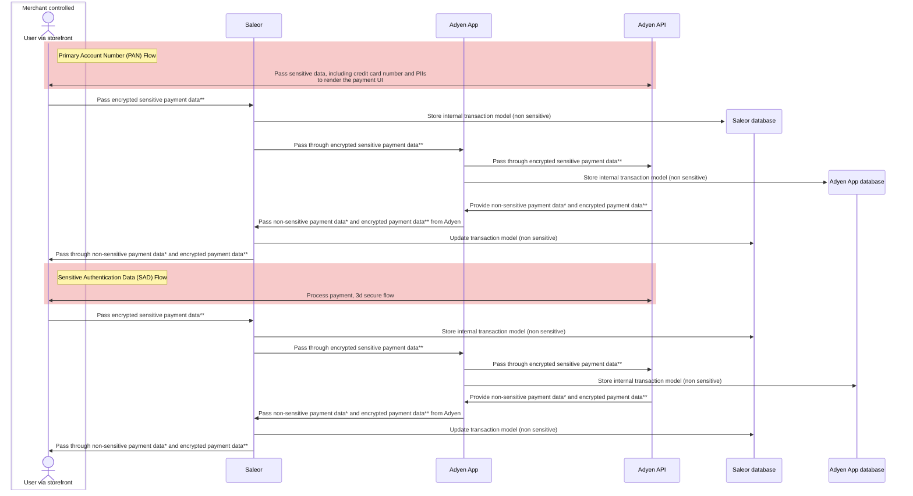

The following diagram shows the flow of sensitive data between services when using the Adyen App:

*Passes non-PCI DSS regulated payment information, such as customer IP address, delivery address fields (street, city, state/province, postal code, country), additional data about freight amount, duty amount with total tax amount

**Passes encrypted credit card number and other encrypted information (cardholder data and sensitive authentication data), the decryption key is only accessible by Adyen, data is impossible for Saleor to read.

For more information about Adyen PCI DSS compliance - see their [guide](https://docs.adyen.com/development-resources/pci-dss-compliance-guide/).
