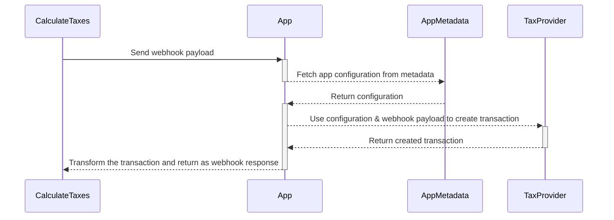
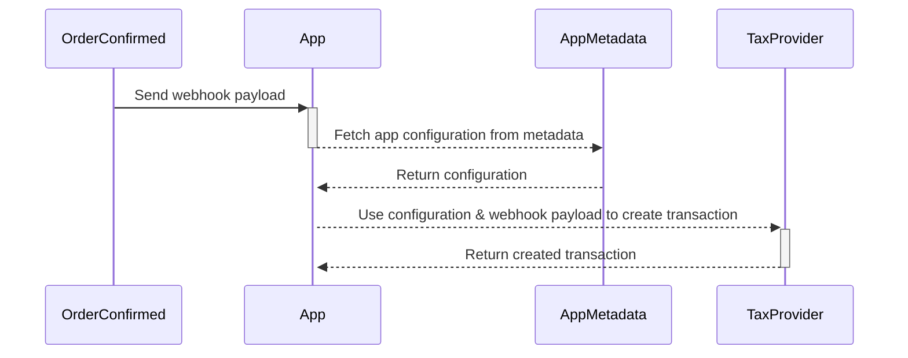
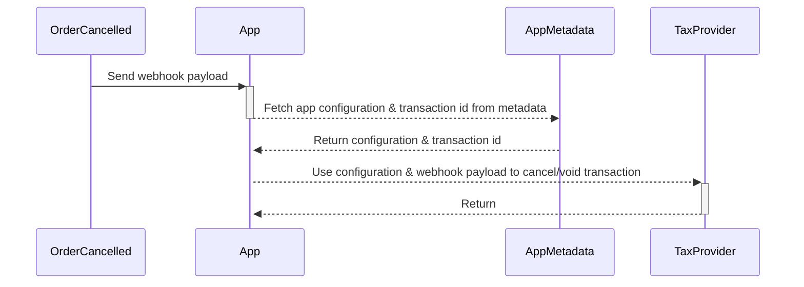

## Webhook events

The AvaTax App uses the following webhook events for tax reporting and calculations:

- [`OrderCalculateTaxes`](api-reference/taxes/objects/calculate-taxes.mdx)
- [`CheckoutCalculateTaxes`](api-reference/taxes/objects/calculate-taxes.mdx)
- [`OrderConfirmed`](api-reference/orders/objects/order-confirmed.mdx)

## Calculating taxes

Calculating taxes using external tax providers happens through a synchronous [`CalculateTaxes`](api-reference/taxes/objects/calculate-taxes.mdx) webhook event. A [synchronous webhook](developer/extending/webhooks/synchronous-events/overview.mdx) awaits a response from the app before continuing.

While the app is waiting for the values of the calculated taxes, the sequence of actions is as follows:

During tax calculation, the transactions on the AvaTax side are not recorded. They will not appear in the tax provider's dashboard.

## Recording transactions

Once the order is finalized, we want to send a transaction to the tax provider for tax reporting. This is done through [asynchronous webhook](developer/extending/webhooks/asynchronous-events.mdx) events that fire on different order lifecycle actions.

Committing transactions will happen during the transaction creation based on the provider configuration.

For example, the transaction is committed on `OrderConfirmed` if the `isAutocommit` flag is set to `true` in the configuration.

## Canceling transactions

