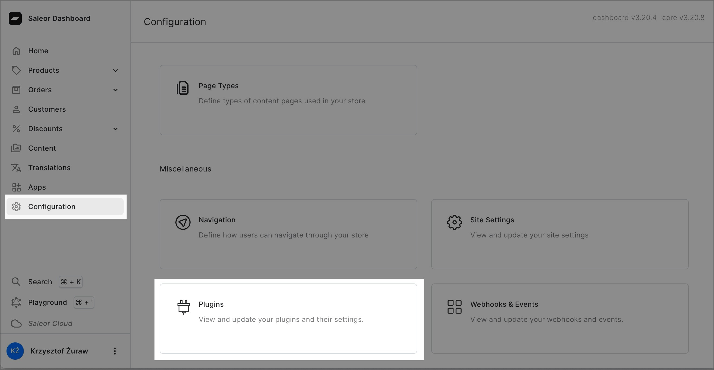
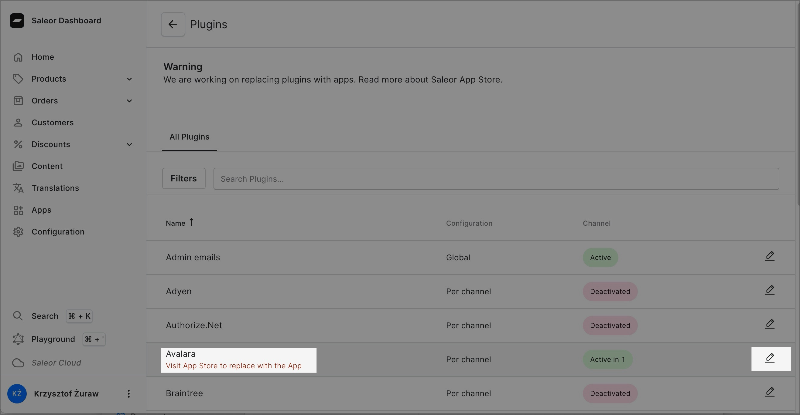
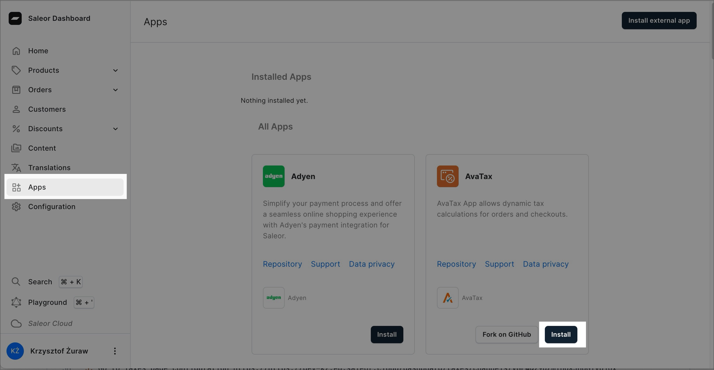
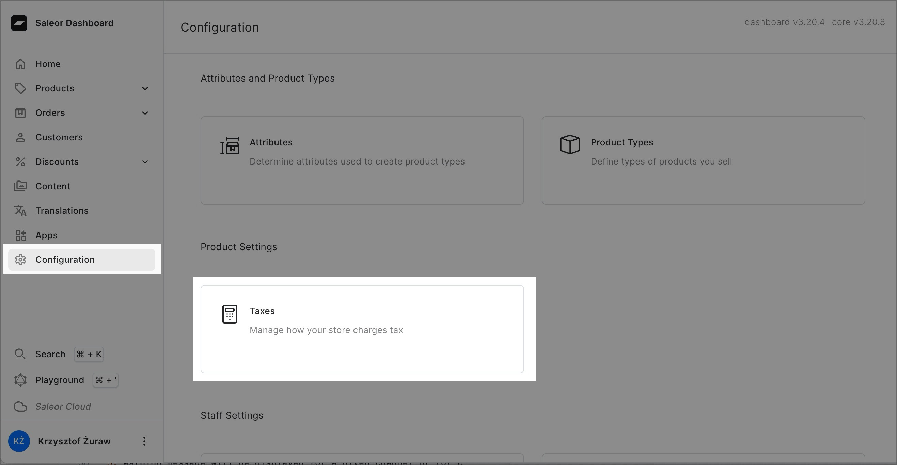
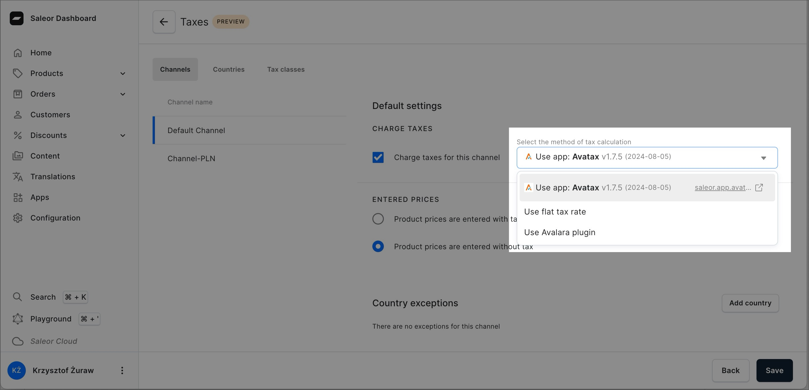
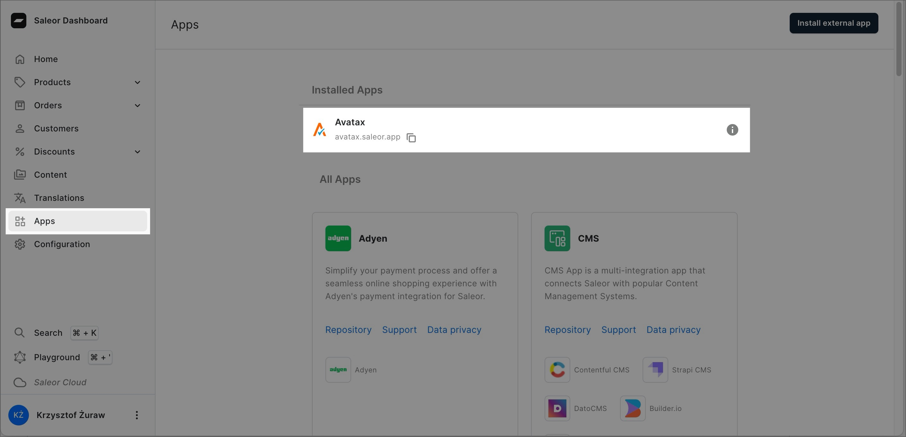
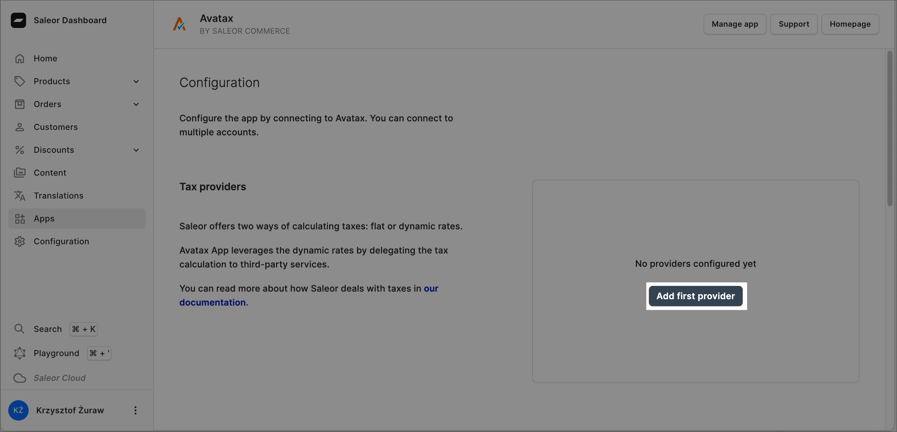
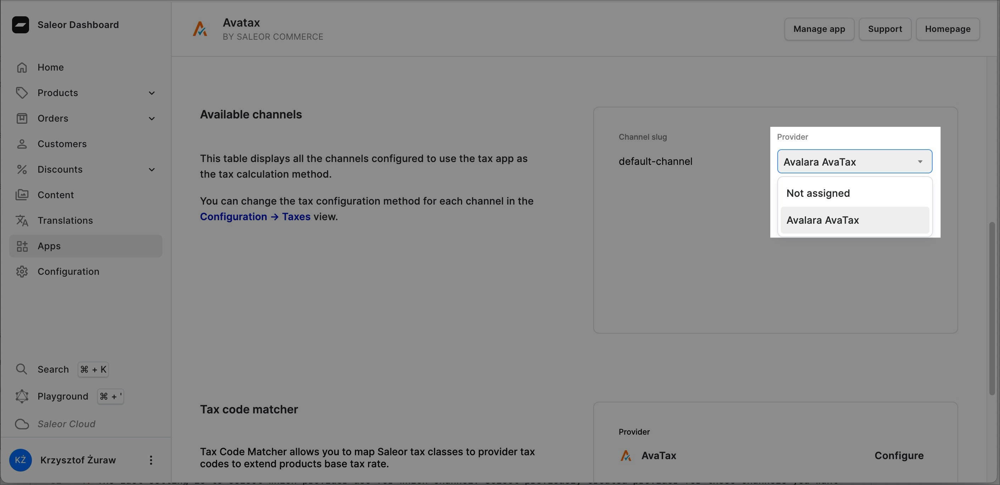

:::info

If you are using Saleor Cloud - create snapshot of your environment. Follow our [Cloud Quickstart](https://docs.saleor.io/quickstart/cloud#next-steps) to learn more.

:::

## Note Down Avalara Plugin Configuration

1. Login to your Saleor Dashboard
2. Go to Plugin configuration
   
3. Find Avalara plugin and go to its details
   
4. For every configured channel note down plugin settings:
   - username or account
   - use sandbox
   - company name
   - autocommit
   - ship from - city
   - ship from - country
   - ship from - country area
   - ship from - postal code
   - shipping tax code
   - authorization (password / license)

## Select AvaTax App Tax Calculation Method

1. Install AvaTax app via Saleor appstore
   
2. Go to Taxes configuration
   
3. For every channel you want to use AvaTax app - change method of tax calculation to app. If you have country exceptions - select app there as well
   

There is possibility that you will see warning banner above dropdown that selects method of tax calculation. It mean that you need to explicitly select which method you want to use:

- `Use flat tax rate` - it uses Saleor build-in [tax flow](/developer/taxes#flat-rates)
- `Use app: AvaTax` - if you have installed [AvaTax app](/developer/app-store/apps/avatax/overview) in your dashboard

## Configure AvaTax App

1. Go to AvaTax app details
   
2. Configure your first provider by clicking button `Add first provider` and select AvaTax
   
3. Fill out the form based on values you previously noted down. You can see table below to old and new settings mappings:

| Old setting              | New setting       |
| ------------------------ | ----------------- |
| username or account      | username          |
| company name             | company code      |
| use sandbox              | use sandbox mode  |
| autocommit               | autocommit        |
| shipping tax code        | shipping tax code |
| ship from - street       | address - street  |
| ship from - city         | address - city    |
| ship from - country area | address - state   |
| ship from - country      | address - country |
| ship from - postal code  | address - zip     |

4. The last setting is to select which provider use for which channel. Select previously created provider for those channels you want to use AvaTax app for.
   

That is it! You are ready to start collecting taxes using AvaTax app.
