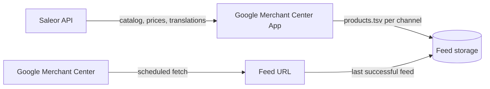

import { AppMetadata } from "/components/AppMetadata/AppMetadata.jsx";

<AppMetadata minSaleorVersion="3.23" />

The Google Merchant Center App generates a product feed for each of your sales channels and serves it at a stable URL that you register in [Google Merchant Center](https://support.google.com/merchants/answer/1219255) as a scheduled fetch.

The app builds feeds **in the background, on a schedule**. Opening a feed URL never triggers generation — it always returns the last feed that finished successfully. That is what lets the app support large catalogs.

:::info

This app replaces the [Product Feed App](./product-feed.mdx). If you use Product Feed today, see [Migrating from Product Feed](#migrating-from-product-feed).

:::

## Features

- **One feed per sales channel**, with per-channel storefront URLs, language, and status.
- **Scheduled regeneration** — feeds refresh on their own, with a "Regenerate all channels" button when you need them sooner.
- **Large catalog support** — a run is split into chunks and streamed to storage, so it can cover catalogs of any size.
- **Translated feeds** — pick a language per channel and the app writes titles and descriptions from Saleor translations.
- **Safety guard** — a run that produces no rows, or far fewer than the last one, does not replace the feed that Google is currently fetching.
- **Category mapping** — map Saleor categories to the Google product taxonomy.
- **Attribute mapping** — fill the `brand`, `gtin`, `color`, `material`, `pattern`, and `size` columns from Saleor attributes.
- **Per-channel reporting** — how many products were published, how many were left out, and which field each was missing.

## How it Works



1. When you install the app, it schedules a first run right away.
2. A run walks your whole catalog once and fans out to every configured channel, writing one `products.tsv` file per channel.
3. Long runs are cut into chunks. Each chunk continues where the previous one stopped, so a run can take as long as the catalog needs.
4. When the walk finishes, each channel's file is checked by the [publish guard](#publish-guard) and then published — or discarded, leaving the previous feed in place.
5. Google fetches the feed URL on its own schedule and receives the last published file.

Feeds refresh roughly **every 12 hours**. A failed run is retried sooner, after about 30 minutes. Both are service-side settings, not options in the app UI.

The app uses no webhooks. A product you edit in Saleor reaches the feed on the next run, not immediately. Use **Regenerate all channels** when you want a change picked up now.

### Feed URL

Every configured channel gets its own URL:

```
https://<app-host>/api/feed/<installation-hash>/<channel-slug>/products.tsv
```

Copy it from the channel row on the configuration page. Notes:

- The URL returns **404 until the channel's first feed has been published**. Wait for the first run to finish before registering it in Merchant Center.
- The URL is stable for the lifetime of the installation. **Reinstalling the app changes it**, so you have to update the data source in Merchant Center.
- The URL redirects to short-lived, signed storage links. Feed files are never public.

### Publish Guard

Before a channel's new file replaces the live one, the app compares it to the previous run:

| Situation                                                  | What happens                                                                   |
| ---------------------------------------------------------- | ------------------------------------------------------------------------------ |
| The run produced **zero rows**                             | Not published. The previous feed keeps serving. This check cannot be disabled. |
| The run read **less than half** of the last run's products | Not published. The channel shows _Incomplete data_ with an explanation.        |
| Products were dropped for missing required fields          | Published anyway. The channel reports how many rows were left out and why.     |

A partial API response looks exactly like a shrinking catalog and is far more common, so the app treats a sudden drop as suspect. When a reduction is real, enable **Allow smaller feeds** on that channel, let one run publish, then turn it off again.

### Channel States

| State                 | Meaning                                                                                        |
| --------------------- | ---------------------------------------------------------------------------------------------- |
| **Not configured**    | The channel has no storefront URLs, so no feed is generated for it.                            |
| **Not generated yet** | Configured, but no feed has been published. The feed URL returns 404.                          |
| **Queued**            | A run is due and waiting to start.                                                             |
| **Generating**        | A run is walking the catalog.                                                                  |
| **Published**         | The channel has a feed. The row shows when it was generated and how many products it contains. |
| **Incomplete data**   | The publish guard held the run back. The previous feed keeps serving.                          |
| **Failed**            | The run could not finish. It is retried automatically.                                         |

## Permissions

The app requests `MANAGE_PRODUCTS`. It uses it to read the catalog for the feed and to write the Google category mapping onto Saleor categories.

To open and change the app's configuration, a staff user needs both `MANAGE_APPS` and `MANAGE_PRODUCTS`.

## Configuration

Open the app from **Extensions → Installed → Google Merchant Center**. A setup checklist on the configuration page walks you through the same steps.

### Channel Configuration

Expand a channel row to configure its feed. A channel is included in a run only when **both** URLs are filled — Merchant Center rejects a data source whose `link` column is blank, so a half-configured channel is skipped entirely.

| Field                    | Required | Description                                                                                                                                                                                                              |
| ------------------------ | -------- | ------------------------------------------------------------------------------------------------------------------------------------------------------------------------------------------------------------------------ |
| **Storefront URL**       | Yes      | The storefront this channel sells through, for example `https://shop.example.com`.                                                                                                                                       |
| **Product URL template** | Yes      | The template used for the `link` column. `{productSlug}` is the only placeholder, and it is substituted literally — this field is not a Handlebars template. Example: `https://shop.example.com/products/{productSlug}`. |
| **Feed language**        | No       | The language the feed is written in. See [Languages and translations](#languages-and-translations).                                                                                                                      |
| **Allow smaller feeds**  | No       | Lets this channel publish a run the [publish guard](#publish-guard) would otherwise hold back.                                                                                                                           |

Channels you create in Saleor later appear in the app automatically.

### Title and Image

These settings apply store-wide, to every channel's feed.

- **Product title template** — a [Handlebars](https://handlebarsjs.com/) template for the `title` column. The default is `{{ product.name }} - {{ variant.name }}`.
- **Image size** — the pixel width requested from Saleor for feed images. Merchant Center wants at least 250px; the default is 1024.

#### Title Template Variables

| Variable                                                  | Value                                                          |
| --------------------------------------------------------- | -------------------------------------------------------------- |
| `{{ product.name }}`                                      | Product name, translated when the channel has a feed language. |
| `{{ product.slug }}`                                      | Product slug.                                                  |
| `{{ product.seoDescription }}`                            | Product SEO description, untranslated.                         |
| `{{ product.categoryName }}`                              | Name of the Saleor category the product belongs to.            |
| `{{ variant.name }}`                                      | Variant name, translated when the channel has a feed language. |
| `{{ variant.sku }}`                                       | Variant SKU.                                                   |
| `{{ variant.weight.value }}`, `{{ variant.weight.unit }}` | Variant weight, when it is set.                                |

Standard Handlebars block helpers such as `{{#if}}` work. No extra helper library is registered, so helpers like `{{uppercase}}` are not available.

Avoid `{{ product.description }}` — it holds the raw rich-text JSON, not readable text.

### Attribute Mapping

Six Google columns have no Saleor equivalent and can be filled from an attribute:

| Google column | Label in the app |
| ------------- | ---------------- |
| `brand`       | Brand            |
| `gtin`        | GTIN             |
| `color`       | Color            |
| `material`    | Material         |
| `pattern`     | Pattern          |
| `size`        | Size             |

Rules:

- Only **product-type attributes** are offered, and only those whose values become a plain string: dropdown, multiselect, plain text, swatch, and numeric. File, reference, rich-text, boolean, and date attributes are not offered, because they would put a URL, an object ID, or a JSON blob into the feed.
- A **variant** attribute value wins over a **product** attribute value for the same attribute.
- An unmapped column is left out of the file entirely rather than shipped empty — Merchant Center reports a declared-but-always-blank column as a problem.
- Only these six columns can be mapped. A mapping naming a computed column such as `price` or `link` is rejected and never overwrites the computed value.
- Attributes you have not mapped never reach the feed, even when products carry them.

### Category Mapping

Open **Category mapping** from the page header to map Saleor categories to the Google product taxonomy. The value is written to the Saleor category's public metadata under `google_category_id`, so it applies to every channel's feed at once, and each row saves on its own.

Mapping is optional, but Merchant Center rejects some product types without it.

### Languages and Translations

Set **Feed language** on a channel when that channel's catalog is translated. Merchant Center matches a data source to a country _and_ a language, and Google expects your landing pages to be in the feed's language — that is why language sits next to the storefront URL rather than being a store-wide setting.

With a language set:

- Titles and descriptions come from Saleor translations into that language.
- Mapped attribute columns are translated too. `color`, `material`, `pattern`, and `size` are words a shopper reads, and Google matches them against search terms in the language of the landing page.
- A missing translation falls back **per field**, not per product: a product with a translated name and an untranslated description publishes with both, rather than being dropped. Attribute values fall back **per value**, so a half-translated colour palette keeps the translations it has.
- The channel row reports how many rows were published in their original language. Google may disapprove products when most of a feed does not match its declared language.

Leave the field empty for a single-language store. No translations are then requested at all.

## What Ends Up in the Feed

The file is a TSV export following the Google Merchant Center product data specification. One row is generated per **product variant**; variants of one product share an `item_group_id`.

### Columns

| Column                                 | Source                                                                                                                              |
| -------------------------------------- | ----------------------------------------------------------------------------------------------------------------------------------- |
| `id`                                   | Variant ID.                                                                                                                         |
| `item_group_id`                        | Product ID.                                                                                                                         |
| `title`                                | Rendered from the title template, using translations when the channel has a language.                                               |
| `description`                          | Product SEO description, falling back to the rich-text description rendered as plain text.                                          |
| `link`                                 | Product URL template with `{productSlug}` substituted.                                                                              |
| `image_link`                           | First variant image, falling back to the product's images and then its thumbnail.                                                   |
| `additional_image_link`                | The remaining images.                                                                                                               |
| `availability`                         | `out_of_stock` when the channel reports zero available quantity, otherwise `in_stock`.                                              |
| `price`                                | Gross price in the channel's currency. The undiscounted price when the variant is on sale.                                          |
| `sale_price`                           | Gross price, only when it is lower than the undiscounted price.                                                                     |
| `brand`, `gtin`                        | From [attribute mapping](#attribute-mapping). Omitted from the file when unmapped.                                                  |
| `mpn`                                  | Variant SKU.                                                                                                                        |
| `condition`                            | Always `new`.                                                                                                                       |
| `google_product_category`              | From [category mapping](#category-mapping).                                                                                         |
| `product_type`                         | Saleor category name.                                                                                                               |
| `shipping_weight`                      | Variant weight, when the product type requires shipping and the weight is above zero.                                               |
| `identifier_exists`                    | `no` when the row has neither a GTIN nor an MPN paired with a brand.                                                                |
| `color`, `material`, `pattern`, `size` | From [attribute mapping](#attribute-mapping), translated when the channel has a feed language. Omitted from the file when unmapped. |

### Which Products Are Included

- A product reaches a channel's feed only when it is **published, past its publication date, visible in listings, and available for purchase in that channel**. Publication is a per-channel setting, so a product live in one channel and unpublished in another appears in the first channel's feed only.
- A variant appears only when it **has a price in that channel**. A variant that is not sold in the channel is left out silently. Saleor has no variant-level publication flag; a priced channel listing is the only variant-level gate.
- Neither exclusion is reported as a problem — an unpublished or unsold product is not a data error.
- A row is dropped when it is missing any field Google requires: `id`, `title`, `description`, `link`, `image_link`, `availability`, or `price`. Merchant Center reports an invalid row against the whole data source, so the app keeps such rows out rather than risk the feed's standing.
- Because `description` and `image_link` come from the product, a product-level gap drops **all** of that product's variants.
- Dropped rows do not fail the run. The good rows publish, and the channel row shows a count per missing field, such as `missing image_link (24), description (21)`, so you know which field to fix in the catalog.

## Assumptions and Limitations

- **Feeds are not real time.** There are no webhooks and no incremental updates. Catalog changes reach Google on the next scheduled run, or after you press **Regenerate all channels**.
- **Regeneration is all-or-nothing.** A run is one catalog walk that fans out to every configured channel, so there is no cheaper per-channel rebuild to offer. The button is disabled while a run is in flight.
- **Configuration changes apply to the next run.** A run in flight keeps the language, URLs, title template, and attribute mapping it started with, because the earlier part of the file is already written. The exception is **Allow smaller feeds**, which is read when the run decides whether to publish.
- **Only six columns are mappable.** `brand`, `gtin`, `color`, `material`, `pattern`, and `size` come from attributes; every other column is computed from catalog data and cannot be overridden.
- **TSV only.** The app does not produce the XML feed format.
- **One feed per channel**, always the full catalog for that channel. There is no filtering by category, collection, or product type.
- **No infrastructure to provide.** Unlike the Product Feed App, this app hosts the generated files for you, so there is no S3 bucket or IAM credentials to configure.

## Troubleshooting

**The feed URL returns 404.** The channel has not published a feed yet. Check its state on the configuration page — until it reaches _Published_, there is nothing to serve.

**A channel shows "Incomplete data".** The [publish guard](#publish-guard) held the run back and the previous feed is still serving. The message on the row explains why. If the reduction is intentional, enable **Allow smaller feeds** for that channel.

**Products are missing from the feed.** Either they have no price in that channel, or they are missing a field Google requires. The channel row lists the missing fields with a count for each.

**Merchant Center reports products in the wrong language.** Those products have no translation into the channel's feed language and were published in their original language. The channel row shows how many.

**A channel shows "Failed".** The run could not finish — usually a temporary Saleor or storage error. It is retried automatically, and the previous feed keeps serving in the meantime.

## Migrating from Product Feed

The [Product Feed App](./product-feed.mdx) is deprecated in favour of this app, and Saleor 3.23 is the last version it supports — if you are on Saleor 3.24 or newer, this app is the only option. When you move over:

- **Category mapping carries over.** Both apps store it in the same `google_category_id` metadata key on the Saleor category, so mapped categories keep working.
- **Feed URLs change.** Register the new per-channel URLs in Merchant Center as scheduled fetches and remove the old data sources once the new feeds publish.
- **The feed format changes** from XML to TSV. Merchant Center accepts both; you just create the data source anew.
- **You no longer provide an S3 bucket.** Drop the IAM user you created for the Product Feed App once you stop using it.
- **Attribute mappings have to be set up again**, but every column the Product Feed App could map — `brand`, `gtin`, `color`, `material`, `pattern`, and `size` — is mappable here too.
