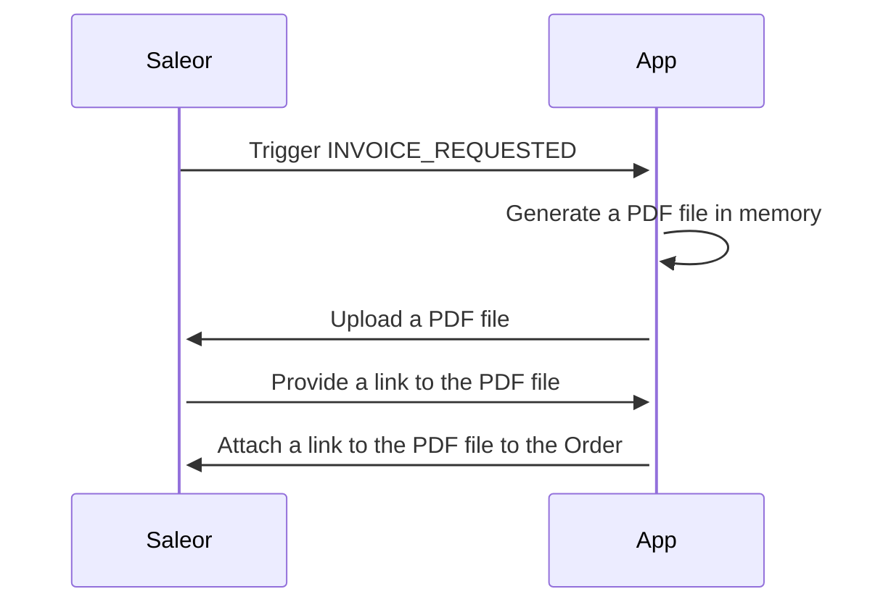

import { AppMetadata } from "/components/AppMetadata/AppMetadata.tsx";

# Invoices

<AppMetadata
  minSaleorVersion="3.10"
  roadmapUrl="https://github.com/saleor/apps/labels/App%3A%20Invoices"
  githubUrl="https://github.com/saleor/apps/tree/main/apps/invoices"
/>

## Introduction

The Invoices app allows you to generate simple PDF invoice files for every order in your store.

## Features

Generates a PDF file when an invoice is requested (in Dashboard or with an API). Then attaches it to the order.

The invoice shop address can be inherited from the [Shop](../../../api-storefront/miscellaneous/objects/shop) settings or configured manually per channel.

## Assumptions & limitations

- The PDF template is fixed and can't be changed by the user.
- The PDF template is in English only.

## Permissions

The App requires `MANAGE_ORDERS` permission to be able to:

- Receive the `INVOICE_REQUESTED` webhook
- Read order data to generate the invoice
- Attach the invoice to the order

The staff user configuring the App must have `MANAGE_APPS` and `MANAGE_ORDERS` permissions.

## Application flow

The App reacts on a single webhook, and it ends its flow once a PDF file is attached to the order.

See the detailed flow below:

## Configuration

The app allows to configure a shop address per each channel separately.

If the channel is not configured, the app will fetch the Shop address from settings and use it.

### Testing

To verify if the app works:

1. Ensure the "Invoices" plugin is disabled; otherwise, duplicated invoices can be generated.
2. Ensure the App is installed and enabled.
3. Optionally configure the custom address. If the custom address is not configured, fill [Shop address](../../../api-storefront/miscellaneous/objects/shop) in the Dashboard settings.
4. Find any order in the Dashboard, find the "Invoices" section, and click the "Generate" button.
5. Wait a couple of seconds and refresh the dashboard.
6. The invoice should be attached to the order in the "Invoices" section.

## Troubleshooting

- During development with Saleor running locally, there are file uploading issues; see [this issue](https://github.com/saleor/apps/issues/285).

Check [Github issues](https://github.com/saleor/apps/labels/App%3A%20Invoices) to see up to date list of known issues or to report a new one.

## Development

Visit the [development guide](../../extending/apps/developing-apps/app-examples) to learn more about App Store app development.

### Env variables

Apart from common env variables, the Invoice app accepts the following:

- `TEMP_PDF_STORAGE_DIR=` - a temp directory where the PDF files will be stored. In Vercel, set `/tmp`. Add it to `.gitignore`
