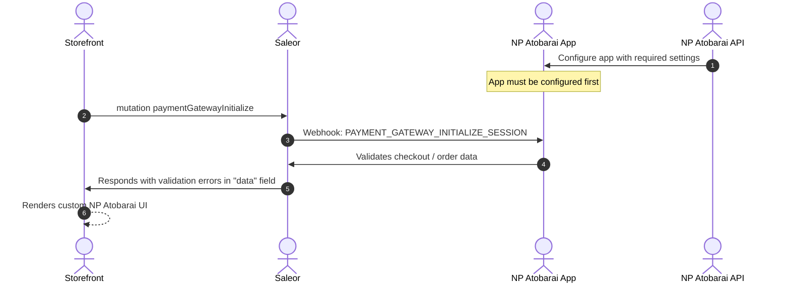
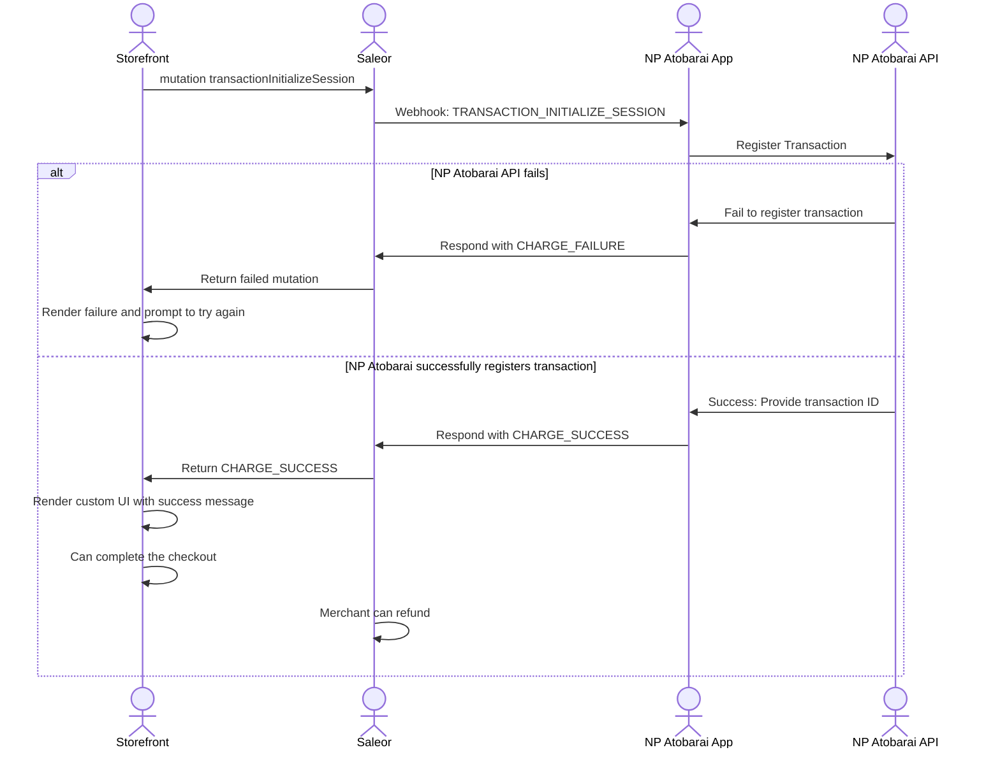
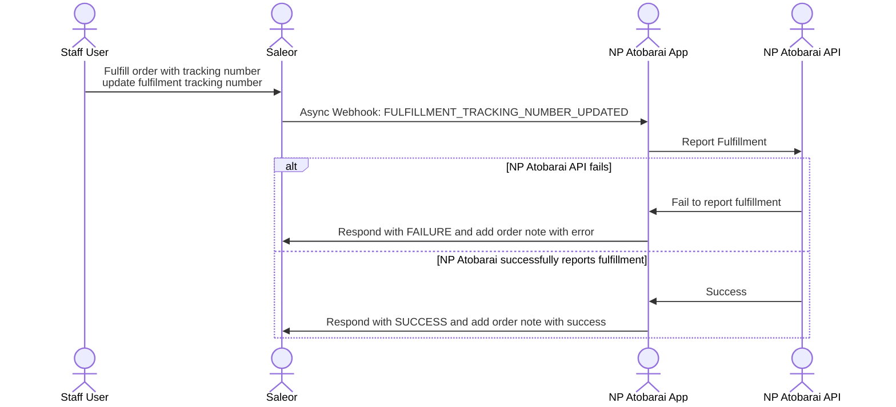
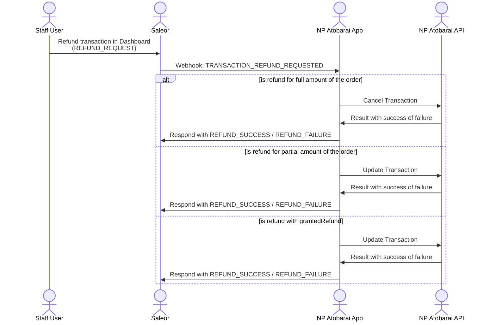
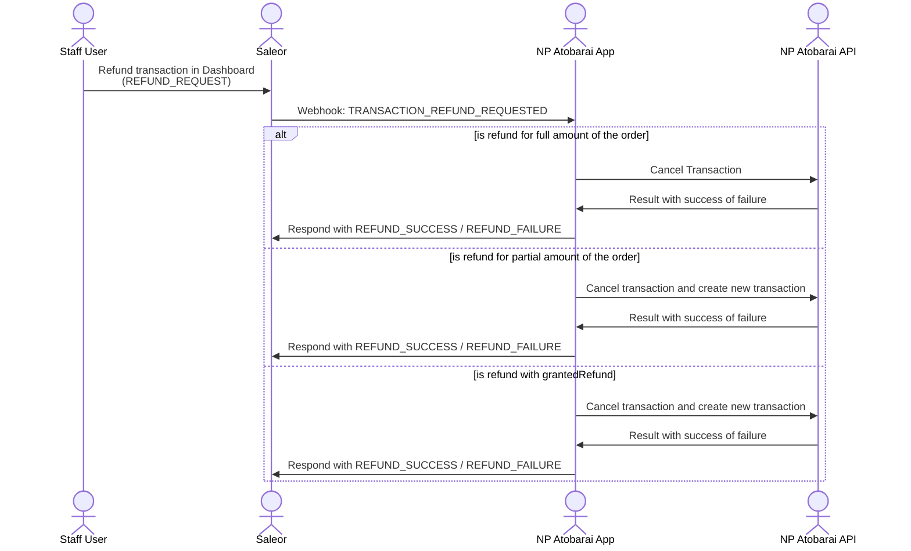

## Assumptions

First, lets highlight the assumptions that the app is based on. These are decisions made by Saleor product team. We may add more assumptions when we add more features,
but the ones already set are pretty much final.

That means:
- You can rely on them when building your Store, and they will not change.
- You should not use this App if you do not agree with them.
- Once we decide to change them, the new major version will be released.

## Supporting Charge flow

App supports only Charge flow that can be set in Saleor channel settings. Saleor has limitation to allow fulfillments only when the order is fully charged.

App will proceed following flows (simplified)

#### Charge Flow

`CHARGE_REQUEST` → `CHARGE_SUCCESS`

## Supported payment flows

This chapter lists flows possible to execute, including Storefront, Saleor, App and NP Atobarai.

Note: Flows that assume operation in Saleor Dashboard can be also executed with graphQL

Note: For brevity, diagrams highlight the most important parts of the flow and do not duplicate operations that are not relevant to the flow.

### Render payment UI

### Payment

### Reporting fulfillment to NP Atobarai

### Refunding funds from Saleor Dashboard

#### Before fulfillment has been reported in NP Atobarai

#### After fulfillment has been reported in NP Atobarai

