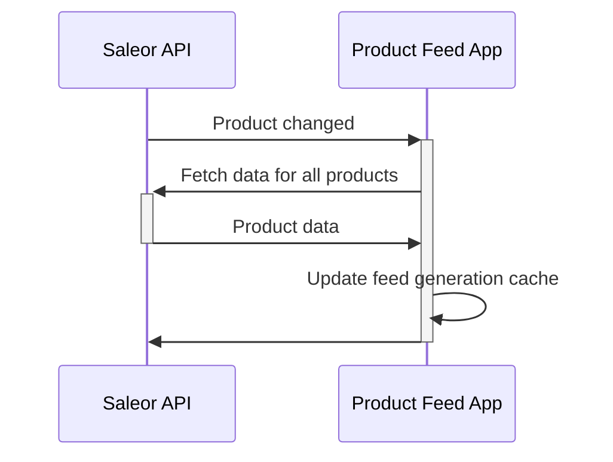
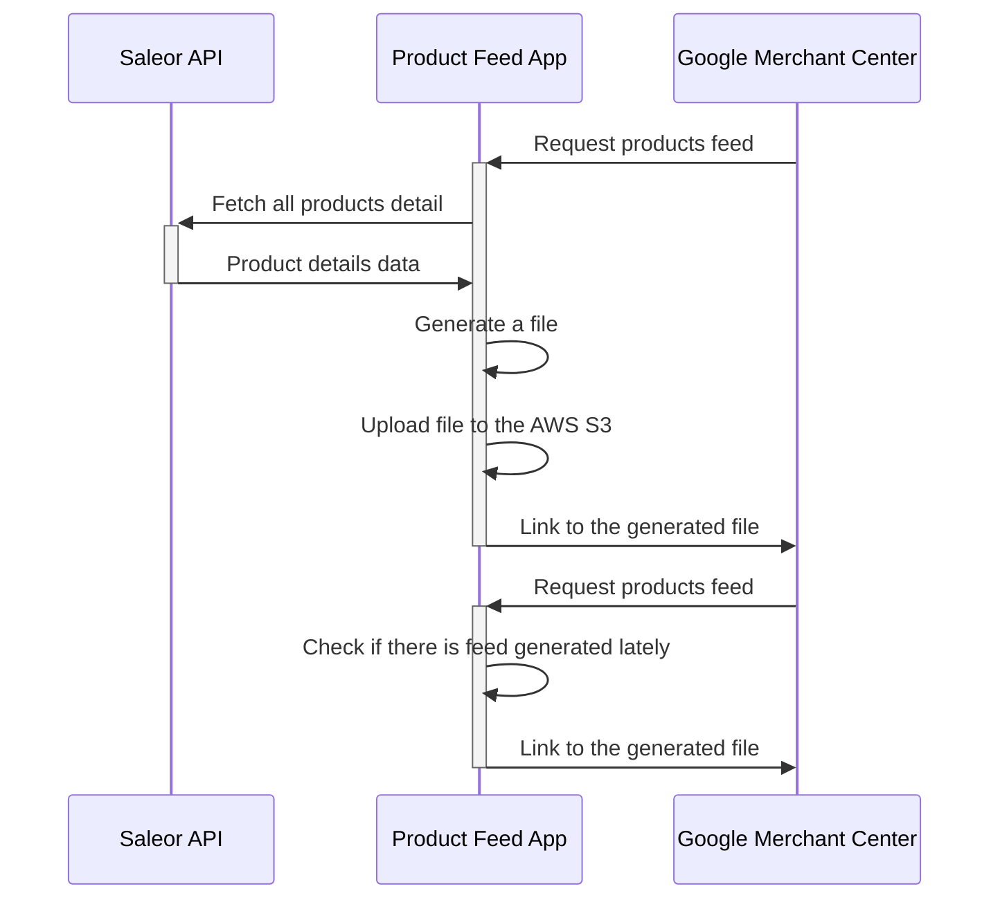

import { AppMetadata } from "/components/AppMetadata/AppMetadata.tsx";

# Product feed

## Metadata

<AppMetadata
  minSaleorVersion="3.10"
  roadmapUrl="https://github.com/saleor/apps/labels/App%3A%20Product%20Feed"
  githubUrl="https://github.com/saleor/apps/tree/main/apps/products-feed"
/>

## Introduction

The app generates XML files in Google Merchant feed format.

## Features

- Generate feed in the [Google Merchant format](https://support.google.com/merchants/answer/7439882)
- Map your catalog structure to Google Merchant format
- Upload files to the AWS S3 bucket
- Separate feed for each of the channels

## Assumptions & limitations

- Each item in the feed is equivalent to a single Product Variant in Saleor
- For catalogs bigger than 200 product variants an AWS S3 bucket is recommended
- Translations are not supported - product data are generated using the default language
- Only the public data are used to generate the feed. It means that not published products will not be included
- The feed is generated upon visiting the feed URL, which can be found in the app configuration
- Once generated feed, it will be cached for one day. [Update your scheduled fetches accordingly](https://support.google.com/merchants/answer/7371671).
- Data displayed in Google Merchant Center do not update in real-time. It may take [up to 3 business days](https://support.google.com/merchants/answer/188477) to update.

## Glossary

- [**Google Merchant Center**](https://www.google.com/intl/en_us/retail/solutions/merchant-center/): Service used to share product data in search results and ads
- [**AWS S3 Bucket**](https://aws.amazon.com/s3/): File hosting service created by Amazon
- [**Handlebars**](https://handlebarsjs.com/): Language used for creating templates. The app uses it for generating dynamic titles and URLs based on product data

## Permissions

The app requires `MANAGE_PRODUCTS` permission to be able to subscribe to webhooks triggered upon changes in your catalog.

The staff user configuring the App must have `MANAGE_APPS` permission.

## Application flow

The app will subscribe for webhooks:

- Product created
- Product deleted
- Product updated
- Product variant created
- Product variant deleted
- Product variant updated

When the webhook is received, the application will update it's cache:

The cache is used for faster feed generation when a request for a feed file is received. If the feed was generated last time no longer than 5 minutes ago, the app will return the link to the existing file:

## Pre-requisites

- AWS S3 bucket with write access token
- Google Merchant account

## Configuration

### AWS S3 bucket

### URL configuration

- using handlebars

### Item title

- using handlebars

### Item attributes

- which attributes can be used
- multi-value attributes

### Using the Handlebars templating

Example data:
// Put JSON here

// Example template

// Where to test
[playground](https://handlebarsjs.com/playground.html#format=1&currentExample=%7B%22template%22%3A%22%7B%7B%20variant.product.name%20%7D%7D%20-%20%7B%7B%20variant.name%20%7D%7D%5Cn%22%2C%22partials%22%3A%5B%5D%2C%22input%22%3A%22%7B%5Cn%20%20variant%3A%20%7B%5Cn%20%20%20%20id%3A%20%5C%22UHJvZHVjdFZhcmlhbnQ6MzYx%5C%22%2C%5Cn%20%20%20%20name%3A%20%5C%22M%5C%22%2C%5Cn%20%20%20%20sku%3A%20%5C%22218223580%5C%22%2C%5Cn%20%20%20%20pricing%3A%20%7B%5Cn%20%20%20%20%20%20price%3A%20%7B%5Cn%20%20%20%20%20%20%20%20gross%3A%20%7B%5Cn%20%20%20%20%20%20%20%20%20%20currency%3A%20%5C%22USD%5C%22%2C%5Cn%20%20%20%20%20%20%20%20%20%20amount%3A%2045%2C%5Cn%20%20%20%20%20%20%20%20%7D%2C%5Cn%20%20%20%20%20%20%7D%2C%5Cn%20%20%20%20%7D%2C%5Cn%20%20%20%20quantityAvailable%3A%2050%2C%5Cn%20%20%20%20attributes%3A%20%5B%5Cn%20%20%20%20%20%20%7B%5Cn%20%20%20%20%20%20%20%20attribute%3A%20%7B%5Cn%20%20%20%20%20%20%20%20%20%20id%3A%20%5C%22QXR0cmlidXRlOjM4%5C%22%2C%5Cn%20%20%20%20%20%20%20%20%7D%2C%5Cn%20%20%20%20%20%20%20%20values%3A%20%5B%5Cn%20%20%20%20%20%20%20%20%20%20%7B%5Cn%20%20%20%20%20%20%20%20%20%20%20%20value%3A%20%5C%22%5C%22%2C%5Cn%20%20%20%20%20%20%20%20%20%20%20%20name%3A%20%5C%22M%5C%22%2C%5Cn%20%20%20%20%20%20%20%20%20%20%7D%2C%5Cn%20%20%20%20%20%20%20%20%5D%2C%5Cn%20%20%20%20%20%20%7D%2C%5Cn%20%20%20%20%5D%2C%5Cn%20%20%20%20product%3A%20%7B%5Cn%20%20%20%20%20%20id%3A%20%5C%22UHJvZHVjdDoxMzc%3D%5C%22%2C%5Cn%20%20%20%20%20%20name%3A%20%5C%22Blue%20Polygon%20Shirt%5C%22%2C%5Cn%20%20%20%20%20%20slug%3A%20%5C%22blue-polygon-shirt%5C%22%2C%5Cn%20%20%20%20%20%20description%3A%5Cn%20%20%20%20%20%20%20%20'%7B%5C%22time%5C%22%3A%201653425319677%2C%20%5C%22blocks%5C%22%3A%20%5B%7B%5C%22id%5C%22%3A%20%5C%22sMEIn2NR8s%5C%22%2C%20%5C%22data%5C%22%3A%20%7B%5C%22text%5C%22%3A%20%5C%22%3Cb%3EEver%20have%20those%20days%20where%20you%20feel%20a%20bit%20geometric%3F%3C%2Fb%3E%20Can%5C%5C't%20quite%20shape%20yourself%20up%20right%3F%20Show%20your%20different%20sides%20with%20a%20Saleor%20styles.%5C%22%7D%2C%20%5C%22type%5C%22%3A%20%5C%22paragraph%5C%22%7D%5D%2C%20%5C%22version%5C%22%3A%20%5C%222.22.2%5C%22%7D'%2C%5Cn%20%20%20%20%20%20seoDescription%3A%20%5C%22%5C%22%2C%5Cn%20%20%20%20%20%20attributes%3A%20%5B%5Cn%20%20%20%20%20%20%20%20%7B%5Cn%20%20%20%20%20%20%20%20%20%20attribute%3A%20%7B%5Cn%20%20%20%20%20%20%20%20%20%20%20%20id%3A%20%5C%22QXR0cmlidXRlOjM2%5C%22%2C%5Cn%20%20%20%20%20%20%20%20%20%20%7D%2C%5Cn%20%20%20%20%20%20%20%20%20%20values%3A%20%5B%5Cn%20%20%20%20%20%20%20%20%20%20%20%20%7B%5Cn%20%20%20%20%20%20%20%20%20%20%20%20%20%20value%3A%20%5C%22%5C%22%2C%5Cn%20%20%20%20%20%20%20%20%20%20%20%20%20%20name%3A%20%5C%22Cotton%5C%22%2C%5Cn%20%20%20%20%20%20%20%20%20%20%20%20%7D%2C%5Cn%20%20%20%20%20%20%20%20%20%20%5D%2C%5Cn%20%20%20%20%20%20%20%20%7D%2C%5Cn%20%20%20%20%20%20%5D%2C%5Cn%20%20%20%20%20%20thumbnail%3A%20%7B%5Cn%20%20%20%20%20%20%20%20url%3A%20%5C%22https%3A%2F%2Fexample.eu.saleor.cloud%2Fmedia%2Fthumbnails%2Fproducts%2Fsaleor-blue-polygon-tee-front_thumbnail_256.png%5C%22%2C%5Cn%20%20%20%20%20%20%7D%2C%5Cn%20%20%20%20%20%20category%3A%20%7B%5Cn%20%20%20%20%20%20%20%20id%3A%20%5C%22Q2F0ZWdvcnk6Mzk%3D%5C%22%2C%5Cn%20%20%20%20%20%20%20%20name%3A%20%5C%22T-shirts%5C%22%2C%5Cn%20%20%20%20%20%20%20%20googleCategoryId%3A%20%5C%2242%5C%22%2C%5Cn%20%20%20%20%20%20%7D%2C%5Cn%20%20%20%20%7D%2C%5Cn%20%20%7D%5Cn%7D%22%2C%22output%22%3A%22Blue%20Polygon%20Shirt%20-%20M%5Cn%22%2C%22preparationScript%22%3A%22%22%2C%22handlebarsVersion%22%3A%224.7.8%22%7D)

## Troubleshooting

- Accessing the feed URL results in a configuration error

  - you have to configure URLs in the channel configuration

- Can't access the file uploaded to the S3

  - test S3 credentials in the App configuration. If the token is no longer valid, the test will fail
  - check S3 bucket configuration - the files generated by the feed should be assigned as availably publicly

- Some products are not displayed in the feed
  - make sure products are available in the channel assigned to this feed

## Development

Visit the [development guide](../../extending/apps/developing-apps/app-examples) to learn more about App Store app development.
