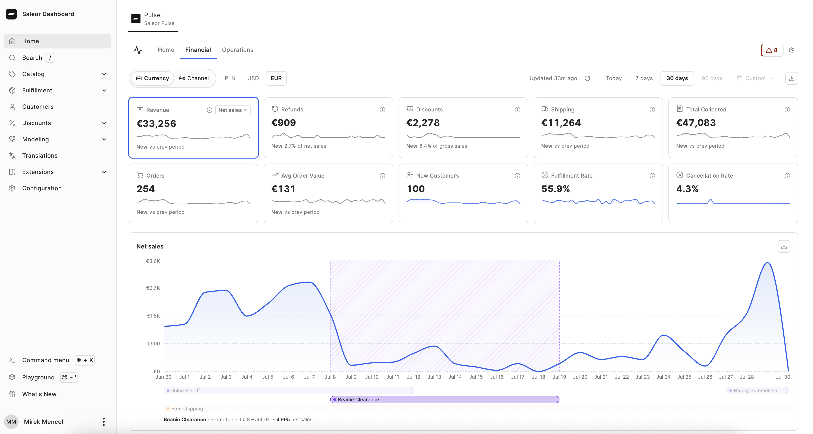
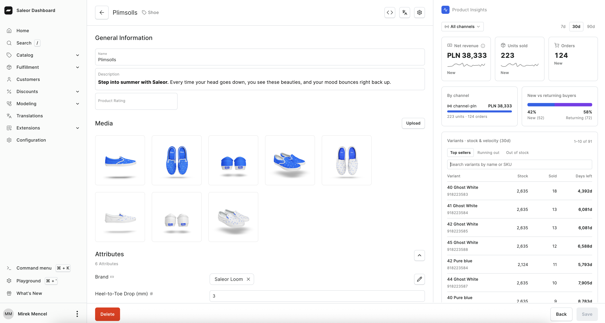

import { AppMetadata } from "/components/AppMetadata/AppMetadata.jsx";
import { PulseSurface } from "/components/PulseSurface/index.jsx";
import Video from "@site/components/Video";

<AppMetadata minSaleorVersion="3.23" />

Saleor Pulse is the analytics app for your store. It lives inside the Saleor Dashboard and answers the following questions: how sales are trending, whether fulfillment is healthy, which products and customers matter, and what deserves a look right now.

Pulse is built for speed and freshness. After the first import, charts stay near real-time as orders, catalog, and related store activity change. You open it like any other Dashboard surface — not as a separate BI project.

Pulse mounts on the main Dashboard home as a **Pulse** tab — that is usually the easiest place to open it. You can also open it from **Extensions → Installed → Saleor Pulse**, and **Product Insights** appears on product pages.

:::tip Try it out

[Create a free Saleor Cloud sandbox](https://cloud.saleor.io/signup?utm_source=docs&utm_medium=referral&utm_campaign=pulse), then install Pulse from **Extensions → Explore**.

:::

<Video
  src={require("./assets/pulse-tour.mp4").default}
  poster={require("./assets/pulse-tour-cover.png").default}
  title="Saleor Pulse quick tour"
/>

## Where to Go in Pulse

We aim to organize Pulse around how merchants work — explore the numbers, then notice what matters.

:::note Feedback needed
Does this split match how you think about the store? Tell us what lands and what does not — especially if a place is missing, or if Financial / Operations / Attention feel in the wrong order. Share feedback on [Discord](https://saleor.io/discord).
:::

| Place                                           | What it addresses                                                                                                             | Ask it when you want to know…                                   |
| ----------------------------------------------- | ----------------------------------------------------------------------------------------------------------------------------- | --------------------------------------------------------------- |
| <PulseSurface name="financial" strong />        | Commercial performance for one currency at a time (across all channels using that currency), optionally narrowed to a channel | Are we making money the way we expect, and what is driving it?  |
| <PulseSurface name="operations" strong />       | Cross-channel operational health                                                                                              | Is fulfillment, cancellation, stock, and order mix healthy?     |
| <PulseSurface name="attention" strong />        | Insights that surface what matters in your store’s data                                                                       | What is worth noticing without digging through every chart?     |
| <PulseSurface name="settings" strong />         | Preferences that shape the views                                                                                              | Timezone, alert preferences, and refresh if numbers look behind |
| <PulseSurface name="product-insights" strong /> | One product, on the product page                                                                                              | How is _this_ product selling, and are variants at risk?        |

**Financial** and **Operations** are the data layer: clear KPIs, trends, and breakdowns you can explore. **Attention** sits on top of that layer — insights that surface what matters in your store’s data, so you do not have to dig through every chart.

## Financial

Financial is for commercial performance in one currency at a time (across all channels using that currency). Pick a currency, narrow to a channel when you want storefront-level detail, choose a time window, and work from the KPIs outward.

You get:

- Net sales (with an after-returns view), refunds, discounts, shipping, total collected, orders, average order value, new customers, fulfillment rate, and cancellation rate — each with a sparkline and a period comparison
- A trend for the KPI you care about, with promotions and vouchers on the timeline so a spike has context
- On **Today**: pace versus yesterday and which promotions are live — more useful than a one-day line chart
- Top products and top customers (customer names and emails need the right staff permission)
- Sales by country (shipping or billing address)
- When orders land during the day
- Named discount attribution when that split helps explain the Discounts KPI

Use Financial when you are reviewing revenue, comparing periods, or explaining _why_ a number moved.

## Operations

Operations is for run-the-store health across channels. You do not pick a currency here — the view is meant to stay useful when you sell in more than one.

You get:

- Fulfillment rate, cancellation rate, average fulfillment hours, and refund rate
- Order volume by channel and order status mix
- Zero-total order rate
- Orders by country and net sales by currency at a glance
- New versus returning buyers over time
- Variants that look at risk of stocking out

Use Operations when you care about fulfillment, cancellations, stock risk, or mix — not about a single currency P&L.

## Attention

Attention is where Pulse turns your store’s analytics into timely insights: helpful signals merchants can act on, not another wall of charts.

It sits above Financial and Operations. Those tabs let you explore; Attention highlights what is worth your time.

Today that includes:

- **Operational alerts** you can tune in Settings — for example zero-total order spikes, cancellation spikes, and unpaid fulfillments — with severity, sample orders, and dismiss when handled
- **Worth noting** cues such as a record order day, a shift in new versus returning mix, a change in top shipping country, or a product that went quiet or came back after a gap

Open Attention when you want the store to surface issues and notable shifts before you hunt for them.

## Product Insights

On a product page, **Product Insights** answers product questions without leaving the catalog.

You get revenue, units, and orders for that product; a channel split when you are looking across channels; new versus returning buyers; and variant-level stock and sell-through context.

## Shared Controls

Across Financial and Operations you can:

- Switch time windows: Today, 7 days, 30 days, 90 days, or a custom range
- On Financial: pick a currency (across channels using that currency), and optionally narrow to a channel
- See how fresh the data is and refresh
- Export widgets as CSV or JSON (Top Customers defaults to customer IDs; names and emails are an explicit opt-in per download)

The first time you open Pulse after install, it imports your store history so you do not land on empty zeros. See [Configuration](./configuration.mdx).

## Assumptions and Limitations

- Pulse analytics cover Saleor commerce data: orders, catalog, customers, fulfillment, and promotions. It does not replace session analytics, ads platforms, or storefront traffic tools.
- How far back you can look depends on your plan. Sandbox keeps a shorter history; Production supports longer windows and custom ranges.
- Financial is one currency at a time (across all channels using that currency). Operations spans currencies.
- Staff permissions control who sees customer identity, Product Insights, and who can change Settings. Details are in [Configuration](./configuration.mdx).

## Next Steps

- [Try Pulse on Saleor Cloud](https://cloud.saleor.io/signup?utm_source=docs&utm_medium=referral&utm_campaign=pulse) — free sandbox, then install from Extensions → Explore
- [Install and configure Pulse](./configuration.mdx)
- [How Pulse handles customer data](./data-and-privacy.mdx)
