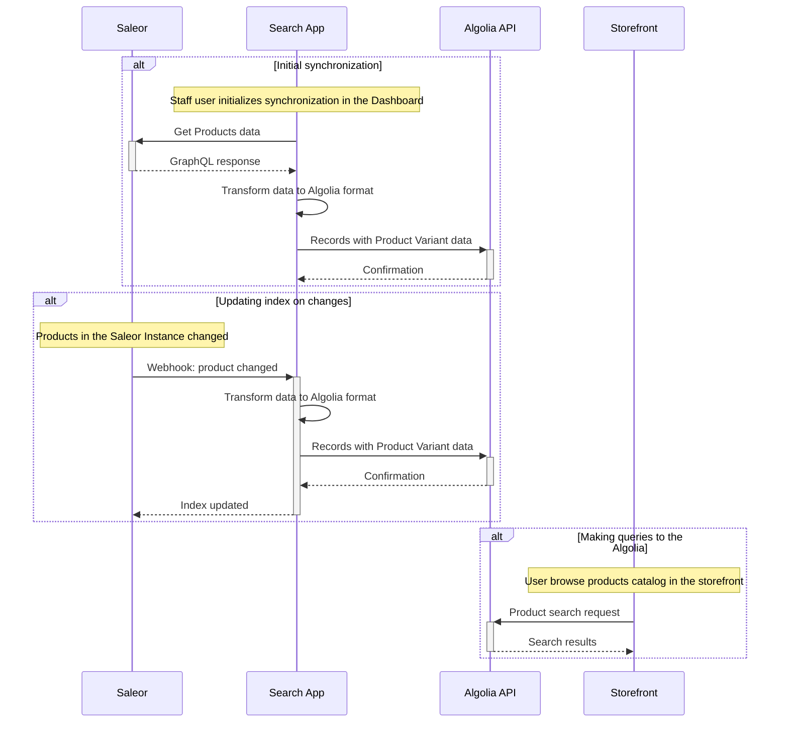

import { AppMetadata } from "/components/AppMetadata/AppMetadata.jsx";

<AppMetadata
  minSaleorVersion="3.10"
  githubUrl="https://github.com/saleor/apps/tree/main/apps/search"
/>

The application provides integration with [Algolia](https://www.algolia.com/) search engine. It allows you to index your products and search them using Algolia's API.

## Features

- Synchronize the whole catalog with Algolia
- Update Algolia index on product changes

## Assumptions & limitations

- Initial synchronization has to be done manually in the App
- The application creates a separate record for each variant
- A single variant size is limited due to [Algolia record size constraint](https://www.algolia.com/doc/guides/sending-and-managing-data/prepare-your-data/how-to/reducing-object-size/). That means the data attached to your variants such as the number of attributes or wrong field filtering configuration in the app settings can lead to exceeding that limitation. In that case, the app cannot store your record. 
- Each of the channels is indexed separately
- At this moment translations are not supported
- The exact state of the product quantity is not indexed, only the boolean value (in stock / out of stock)
- The app will synchronize product variants on the following [events](../../../developer/extending/webhooks/asynchronous-events):
  - `PRODUCT_CREATED`
  - `PRODUCT_UPDATED`
  - `PRODUCT_DELETED`
  - `PRODUCT_VARIANT_CREATED`
  - `PRODUCT_VARIANT_UPDATED`
  - `PRODUCT_VARIANT_DELETED`
  - `PRODUCT_VARIANT_OUT_OF_STOCK`
  - `PRODUCT_VARIANT_BACK_IN_STOCK`

## Glossary

- Algolia record: single entry in the Algolia index. Each Product Variant is a separate record.
- Index: a collection of Algolia records. We are creating separate indices for each of the channels.

## Permissions required by the app

- `MANAGE_PRODUCTS`
- `MANAGE_PRODUCT_TYPES_AND_ATTRIBUTES`

## Application flow



## Pre-requisites

- [Algolia](https://www.algolia.com/) account. The free account will be sufficient, but has additional limitations, like maximum record size.
- Saleor user with `MANAGE_APPS`, `MANAGE_PRODUCTS` and `MANAGE_PRODUCT_TYPES_AND_ATTRIBUTES` permissions.

## Configuration

- Go to [API Keys](https://dashboard.algolia.com/account/api-keys/all) section in the Algolia dashboard to obtain API credentials
- Go to the Search App dashboard and fill required fields:
  - Application ID
  - Admin API Key
  - Index name prefix is optional, but recommended if you want to use the same Algolia account for multiple Saleor instances
- Click `Save`

The application is now connected to your Algolia account. You can start synchronizing your products:

- Click on the `Start importing` button in the `Index products` section
- Wait for the synchronization to finish.
- After the process is finished, apply recommended settings to the indices using the `Update indices configuration` button in the `Set indices settings` section

:::caution

Products synchronization **works on the frontend side**, which means the App **must remain open** during this operation.
In large shops, this operation can take a few seconds.

:::

The application should now be configured and synchronized. You can start making queries using the Algolia API or browse the data in the Algolia dashboard. Changes to the products will be automatically synchronized.

### Fields configuration

Due to performance reasons, Algolia enforces a limit on the maximum size of the record. This means that not all of the product data can be indexed. The application allows you to configure which fields should be used.

The configuration is done in the `Algolia fields filtering` section of the App dashboard. By default, all are enabled. You can disable fields that you don't need in your search (for example product metadata or descriptions).

## Data model

### Indices

Each channel creates a separate index. The index name is formatted as follows: `OPTIONAL_PREFIX.CHANNEL_SLUG.CURRENCY_CODE_CODE.products`. For example: `dev.default-channel.USD.products`. The `OPTIONAL_PREFIX` is used to distinguish between different Saleor instances, so you can use the same Algolia account for multiple data sources (e.g. staging and production).
Values for the price and availability are chosen according to the chosen channel.

### Record fields

- `productId`: Product ID
- `variantId`: Product Variant ID
- `name`: Joined product and variant name. The field is used for the search
- `productName`: Product name. The field is used for the search
- `variantName`: Variant name. The field is used for the search
- `attributes`: List of product and variant attributes with their values. The field is used for search and faceting.
- `media`: List of product media
  - `url`: URL of the media file
  - `type`: Type of the media file. Possible values: `IMAGE`, `VIDEO`
- `description`: Product description in the EditorJS format
- `descriptionPlaintext`: Product description in the plaintext. The field is used for the search
- `slug`: Product slug
- `thumbnail`: URL for the Product thumbnail
- `grossPrice`: Base price of the product in the channel's currency. The field is used for faceting
- `inStock`: Boolean value indicating if the product is in stock. The field is used for faceting
- `categories`: Hierarchical list of product categories, formatted according to the [Algolia guidelines](https://www.algolia.com/doc/guides/managing-results/refine-results/faceting/#hierarchical-facets). The field is used for faceting
- `collections`: List of collection names the product belongs to. The field is used for faceting
- `metadata`: Key-value pairs of product metadata
- `variantMetadata`: Key-value pairs of variant metadata
- `otherVariants`: List of other variant IDs of the product
- `objectID`: Unique ID of the record, used by Algolia. It's a concatenation of the `productId` and `variantId` fields, separated by `_`

## Making queries

The Search App is responsible only for indexing the data. To make queries you need to use the Algolia API directly. You can use the [Algolia JavaScript client](https://www.algolia.com/doc/api-client/getting-started/install/javascript/?client=javascript). The example below shows how to make a simple search query using it:

```javascript
const algoliasearch = require("algoliasearch");

// Replace with your own values
const APP_ID = "APP_ID";
const API_KEY = "API_KEY";
const INDEX_NAME = "dev.default-channel.USD.products";

// Initialize the client
const client = algoliasearch(APP_ID, API_KEY);
const index = client.initIndex(INDEX_NAME);

// Example search query
index.search("squeezed juice").then(({ hits }) => {
  console.log(hits);
});
```

Running the example above will return the following results:

```json
[
  {
    "productId": "UHJvZHVjdDoxNTU=",
    "variantId": "UHJvZHVjdFZhcmlhbnQ6Mzg3",
    "name": "Carrot Juice",
    "productName": "Carrot Juice",
    "variantName": "UHJvZHVjdFZhcmlhbnQ6Mzg3",
    "attributes": {
      "Flavor": "Carrot"
    },
    "media": [
      {
        "url": "https://example.saleor.cloud/media/thumbnails/products/saleor-carrot-drink_thumbnail_4096.png",
        "type": "IMAGE"
      }
    ],
    "description": {
      "time": 1652790989820,
      "blocks": [
        {
          "id": "VWVrSI_Cza",
          "data": {
            "text": "Improve your eyesight the natural way with <b>100% pure, squeezed carrot juice</b>. The sweet, orange nectar of <i>Mother Earth</i>."
          },
          "type": "paragraph"
        }
      ],
      "version": "2.22.2"
    },
    "descriptionPlaintext": "Improve your eyesight the natural way with 100% pure, squeezed carrot juice. The sweet, orange nectar of Mother Earth.",
    "slug": "carrot-juice",
    "thumbnail": "https://example.saleor.cloud/media/thumbnails/products/saleor-carrot-drink_thumbnail_256.png",
    "grossPrice": 1.99,
    "inStock": true,
    "categories": {
      "lvl0": "Groceries",
      "lvl1": "Groceries > Juices"
    },
    "collections": [],
    "metadata": {},
    "variantMetadata": {},
    "otherVariants": [],
    "objectID": "UHJvZHVjdDoxNTU=_UHJvZHVjdFZhcmlhbnQ6Mzg3",

    "_highlightResult": {
      "name": {
        "value": "Carrot <em>Juice</em> - UHJvZHVjdFZhcmlhbnQ6Mzg3",
        "matchLevel": "partial",
        "fullyHighlighted": false,
        "matchedWords": ["juice"]
      },
      "productName": {
        "value": "Carrot <em>Juice</em>",
        "matchLevel": "partial",
        "fullyHighlighted": false,
        "matchedWords": ["juice"]
      },
      "variantName": {
        "value": "UHJvZHVjdFZhcmlhbnQ6Mzg3",
        "matchLevel": "none",
        "matchedWords": []
      },
      "descriptionPlaintext": {
        "value": "Improve your eyesight the natural way with 100% pure, <em>squeezed</em> carrot <em>juice</em>. The sweet, orange nectar of Mother Earth.",
        "matchLevel": "full",
        "fullyHighlighted": false,
        "matchedWords": ["squeezed", "juice"]
      }
    }
  }
]
```

### Grouping results

Since each variant is a separate record in the Algolia index, our recommended settings apply grouping to the results. This means that the results are grouped by the Product ID, and the variant with the highest score is returned as the main result.

Read more about grouping in the [Algolia recordation](https://www.algolia.com/doc/guides/managing-results/refine-results/grouping).

### Custom faceting

The application pre-configures faceting settings for indexes. You can modify their visibility and other settings in the Algolia dashboard. Read more about faceting in the [Algolia recordation](https://www.algolia.com/doc/guides/managing-results/refine-results/faceting/).

Examples of building interfaces with faceting can be found in the [Inspiration Library](https://www.algolia.com/search-inspiration-library/).

## Development

To run the application locally, follow the [_Running Saleor Apps locally_ article](/developer/extending/apps/developing-apps/running-saleor-apps-locally).
