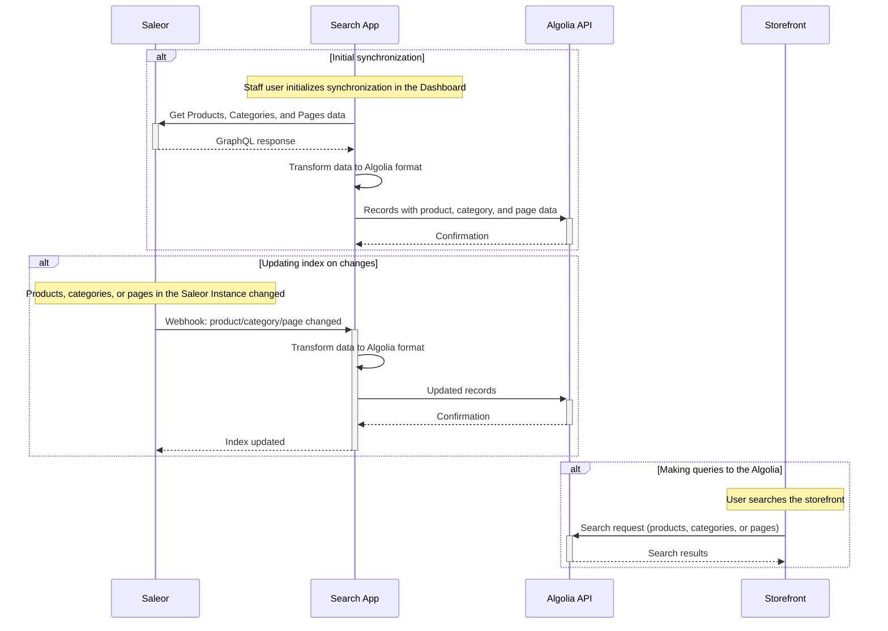

import { AppMetadata } from "/components/AppMetadata/AppMetadata.jsx";

<AppMetadata
  minSaleorVersion="3.20"
  githubUrl="https://github.com/saleor/apps/tree/main/apps/search"
/>

The application provides integration with [Algolia](https://www.algolia.com/) search engine. It allows you to index your products, categories, and pages — then search them using Algolia's API.

## Features

- Synchronize products, categories, and pages with Algolia
- Update Algolia indices on product, category, and page changes
- Selective page indexing — choose which page types to sync
- Skip large attributes on pages to keep the index lean

## Assumptions & limitations

- Initial synchronization has to be done manually in the App
- The application creates a separate record for each product variant
- A single record size is limited due to [Algolia record size constraint](https://www.algolia.com/doc/guides/sending-and-managing-data/prepare-your-data/how-to/reducing-object-size/). That means the data attached to your records such as the number of attributes or wrong field filtering configuration in the app settings can lead to exceeding that limitation. In that case, the app cannot store your record.
- Each of the channels is indexed separately
- At this moment translations are not supported
- The exact state of the product quantity is not indexed, only the boolean value (in stock / out of stock)
- Page indexing is selective — you choose which page types to sync. Large attributes can be excluded to keep records within the size limit.
- The app will synchronize data on the following [events](../../../developer/extending/webhooks/asynchronous-events):
  - `PRODUCT_CREATED`
  - `PRODUCT_UPDATED`
  - `PRODUCT_DELETED`
  - `PRODUCT_VARIANT_CREATED`
  - `PRODUCT_VARIANT_UPDATED`
  - `PRODUCT_VARIANT_DELETED`
  - `PRODUCT_VARIANT_OUT_OF_STOCK`
  - `PRODUCT_VARIANT_BACK_IN_STOCK`
  - `CATEGORY_CREATED`
  - `CATEGORY_UPDATED`
  - `CATEGORY_DELETED`
  - `PAGE_CREATED`
  - `PAGE_UPDATED`
  - `PAGE_DELETED`

## Glossary

- Algolia record: single entry in the Algolia index. Each product variant, category, and page is a separate record.
- Index: a collection of Algolia records. Separate indices are created for products, categories, and pages within each channel. Each products channel creates separate index, but pages and categories have their own single indices.

## Permissions required by the app

- `MANAGE_PRODUCTS`
- `MANAGE_PRODUCT_TYPES_AND_ATTRIBUTES`
- `MANAGE_PAGES`


## Application flow


```mermaid
sequenceDiagram
    participant Saleor
    participant Search App
    participant Algolia API
    participant Storefront


    alt Initial synchronization
        Note over Search App: Staff user initializes synchronization in the Dashboard

        Search App->>+Saleor: Get Products, Categories, and Pages data
        Saleor-->>-Search App: GraphQL response
        Search App->>Search App: Transform data to Algolia format
        Search App->>+Algolia API: Records with product, category, and page data
        Algolia API-->>-Search App: Confirmation
    end

    alt Updating index on changes
        Note over Saleor: Products, categories, or pages in the Saleor Instance changed

        Saleor->>+Search App: Webhook: product/category/page changed
        Search App->>Search App: Transform data to Algolia format
        Search App->>+Algolia API: Updated records
        Algolia API-->>-Search App: Confirmation
        Search App-->>-Saleor: Index updated
    end

    alt Making queries to the Algolia
        Note over Storefront: User searches the storefront

        Storefront->>+Algolia API: Search request (products, categories, or pages)
        Algolia API-->>-Storefront: Search results
    end

```

## Pre-requisites

- [Algolia](https://www.algolia.com/) account. The free account will be sufficient, but has additional limitations, like maximum record size.
- Saleor user with `MANAGE_APPS`, `MANAGE_PRODUCTS`, `MANAGE_PRODUCT_TYPES_AND_ATTRIBUTES` and `MANAGE_PAGES` permissions.

If you have installed the app before indexing pages and categories have been introduced, you need to reinstall the app to grant new permissions

## Configuration

- Go to [API Keys](https://dashboard.algolia.com/account/api-keys/all) section in the Algolia dashboard to obtain API credentials
- Go to the Search App dashboard and fill required fields:
  - Application ID
  - Admin API Key
  - Index name prefix is optional, but recommended if you want to use the same Algolia account for multiple Saleor instances
- Click `Save`

The application is now connected to your Algolia account. You can start synchronizing your data:

- Click on the `Start importing` button to bulk-import products, categories, and pages
- Wait for the synchronization to finish.
- After the process is finished, apply recommended settings to the indices using the `Update indices configuration` button in the `Set indices settings` section

:::caution

Synchronization **works on the frontend side**, which means the App **must remain open** during this operation.
In large shops, this operation can take a few seconds.

:::

The application should now be configured and synchronized. You can start making queries using the Algolia API or browse the data in the Algolia dashboard. Changes to products, categories, and pages will be automatically synchronized via webhooks.

### Page type selection

Not every page belongs in search results. In the App configuration, you can select which **page types** should be indexed. Only pages of the selected types will be synced to Algolia.

Additionally, you can mark larger attributes to skip syncing — useful for pages with heavy content blocks that would bloat the index without adding search value.

### Fields configuration

Due to performance reasons, Algolia enforces a limit on the maximum size of the record. This means that not all data can be indexed. The application allows you to configure which fields should be used.

The configuration is done in the `Algolia fields filtering` section of the App dashboard. By default, all are enabled. You can disable fields that you don't need in your search (for example product metadata or descriptions).

## Data model

### Indices

Each channel creates separate indices for products, categories, and pages. The index names are formatted as follows:

- **Products**: `OPTIONAL_PREFIX.CHANNEL_SLUG.CURRENCY_CODE.products` — e.g. `dev.default-channel.USD.products`
- **Categories**: `OPTIONAL_PREFIX.categories` — e.g. `dev.categories`
- **Pages**: `OPTIONAL_PREFIX.pages` — e.g. `dev.pages`

The `OPTIONAL_PREFIX` is used to distinguish between different Saleor instances, so you can use the same Algolia account for multiple data sources (e.g. staging and production).
Values for the price and availability in the product index are chosen according to the chosen channel.

### Product record fields

- `objectID`: Unique ID of the record, used by Algolia. It's a concatenation of the `productId` and `variantId` fields, separated by `-`
- `productId`: Product ID
- `variantId`: Product Variant ID
- `productTypeId`: Product Type ID. The field is used for faceting
- `categoryId`: Category ID. The field is used for faceting
- `categorySlug`: Category slug. The field is used for search and faceting
- `name`: Joined product and variant name (format: `Product Name - Variant Name`). The field is used for the search
- `productName`: Product name. The field is used for the search
- `variantName`: Variant name. The field is used for the search
- `sku`: Variant SKU
- `attributes`: List of product and variant attributes with their values. The field is used for search and faceting
- `media`: List of product media
  - `url`: URL of the media file
  - `type`: Type of the media file. Possible values: `IMAGE`, `VIDEO`
- `description`: Product description in the EditorJS format
- `descriptionPlaintext`: Product description in the plaintext. The field is used for the search
- `slug`: Product slug
- `thumbnail`: URL for the Product thumbnail
- `grossPrice`: Base price of the product in the channel's currency. The field is used for faceting
- `pricing`: Detailed pricing object with the following nested fields, all used for faceting:
  - `pricing.price.net`, `pricing.price.gross`: Current price
  - `pricing.discount.net`, `pricing.discount.gross`: Discount amount
  - `pricing.priceUndiscounted.net`, `pricing.priceUndiscounted.gross`: Price before discount
  - `pricing.onSale`: Boolean indicating if the variant is on sale
- `inStock`: Boolean value indicating if the product is in stock. The field is used for faceting
- `categories`: Hierarchical list of product categories, formatted according to the [Algolia guidelines](https://www.algolia.com/doc/guides/managing-results/refine-results/faceting/#hierarchical-facets). The field is used for faceting
- `collections`: List of collection names the product belongs to. The field is used for faceting
- `metadata`: Key-value pairs of product metadata
- `variantMetadata`: Key-value pairs of variant metadata
- `otherVariants`: List of other variant IDs of the product
- `_type`: Always `"product"`. Useful for distinguishing record types in unified search results

### Category record fields

Categories are stored in a dedicated index with the following fields:

- `objectID`: Category ID, used by Algolia
- `name`: Category name. The field is used for search
- `slug`: Category slug. The field is used for search
- `level`: Depth in the category tree. The field is used for faceting
- `ancestors`: Flat array of parent categories, each containing `id`, `name`, and `slug` — useful for breadcrumb rendering. The field is used for search and faceting
- `metadata`: Key-value pairs of category metadata. The field is used for faceting
- `_type`: Always `"category"`. Useful for distinguishing record types in unified search results

### Page records

Pages are stored in a dedicated index. You choose which **page types** to sync in the App configuration — only pages of the selected types will be indexed.

Larger attributes can be marked to skip syncing, which is useful for pages with heavy content blocks that would bloat the index without adding search value. The exact set of indexed fields depends on your configuration.

Every page record includes a `_type` field set to `"page"` and a `pageTypeId` field (used for faceting), so you can distinguish page results and filter by page type in your storefront.

## Making queries

The Search App is responsible only for indexing the data. To make queries you need to use the Algolia API directly. You can use the [Algolia JavaScript client](https://www.algolia.com/doc/api-client/getting-started/install/javascript/?client=javascript). The example below shows how to make a simple search query using it:

```javascript
const algoliasearch = require("algoliasearch");

// Replace with your own values
const APP_ID = "APP_ID";
const API_KEY = "API_KEY";
const INDEX_NAME = "dev.default-channel.USD.products";

// Initialize the client
const client = algoliasearch(APP_ID, API_KEY);
const index = client.initIndex(INDEX_NAME);

// Example search query
index.search("squeezed juice").then(({ hits }) => {
  console.log(hits);
});
```

Running the example above will return the following results:

```json
[
  {
    "objectID": "UHJvZHVjdDoxNTU=-UHJvZHVjdFZhcmlhbnQ6Mzg3",
    "productId": "UHJvZHVjdDoxNTU=",
    "variantId": "UHJvZHVjdFZhcmlhbnQ6Mzg3",
    "productTypeId": "UHJvZHVjdFR5cGU6OQ==",
    "categoryId": "Q2F0ZWdvcnk6MTQ=",
    "categorySlug": "juices",
    "name": "Carrot Juice - UHJvZHVjdFZhcmlhbnQ6Mzg3",
    "productName": "Carrot Juice",
    "variantName": "UHJvZHVjdFZhcmlhbnQ6Mzg3",
    "sku": "CJ-001",
    "attributes": {
      "Flavor": "Carrot"
    },
    "media": [
      {
        "url": "https://example.saleor.cloud/media/thumbnails/products/saleor-carrot-drink_thumbnail_4096.png",
        "type": "IMAGE"
      }
    ],
    "description": {
      "time": 1652790989820,
      "blocks": [
        {
          "id": "VWVrSI_Cza",
          "data": {
            "text": "Improve your eyesight the natural way with <b>100% pure, squeezed carrot juice</b>. The sweet, orange nectar of <i>Mother Earth</i>."
          },
          "type": "paragraph"
        }
      ],
      "version": "2.22.2"
    },
    "descriptionPlaintext": "Improve your eyesight the natural way with 100% pure, squeezed carrot juice. The sweet, orange nectar of Mother Earth.",
    "slug": "carrot-juice",
    "thumbnail": "https://example.saleor.cloud/media/thumbnails/products/saleor-carrot-drink_thumbnail_256.png",
    "grossPrice": 1.99,
    "pricing": {
      "price": { "net": 1.99, "gross": 2.45 },
      "discount": { "net": 0, "gross": 0 },
      "priceUndiscounted": { "net": 1.99, "gross": 2.45 },
      "onSale": false
    },
    "inStock": true,
    "categories": {
      "lvl0": "Groceries",
      "lvl1": "Groceries > Juices"
    },
    "collections": [],
    "metadata": {},
    "variantMetadata": {},
    "otherVariants": [],
    "_type": "product",

    "_highlightResult": {
      "name": {
        "value": "Carrot <em>Juice</em> - UHJvZHVjdFZhcmlhbnQ6Mzg3",
        "matchLevel": "partial",
        "fullyHighlighted": false,
        "matchedWords": ["juice"]
      },
      "productName": {
        "value": "Carrot <em>Juice</em>",
        "matchLevel": "partial",
        "fullyHighlighted": false,
        "matchedWords": ["juice"]
      },
      "variantName": {
        "value": "UHJvZHVjdFZhcmlhbnQ6Mzg3",
        "matchLevel": "none",
        "matchedWords": []
      },
      "descriptionPlaintext": {
        "value": "Improve your eyesight the natural way with 100% pure, <em>squeezed</em> carrot <em>juice</em>. The sweet, orange nectar of Mother Earth.",
        "matchLevel": "full",
        "fullyHighlighted": false,
        "matchedWords": ["squeezed", "juice"]
      }
    }
  }
]
```


### Grouping results

Since each variant is a separate record in the Algolia index, our recommended settings apply grouping to the results. This means that the results are grouped by the Product ID, and the variant with the highest score is returned as the main result.

Read more about grouping in the [Algolia recordation](https://www.algolia.com/doc/guides/managing-results/refine-results/grouping).

### Custom faceting

The application pre-configures faceting settings for indexes. You can modify their visibility and other settings in the Algolia dashboard. Read more about faceting in the [Algolia recordation](https://www.algolia.com/doc/guides/managing-results/refine-results/faceting/).

Examples of building interfaces with faceting can be found in the [Inspiration Library](https://www.algolia.com/search-inspiration-library/).

## Troubleshooting

### Record size limit exceeded

If you see an error like this in your Saleor Dashboard webhook deliveries:

```
Product variant UHJvZHVjdFZhcmlhbnQ6MTIz exceeds Algolia's record size limit (10KB).
Current size: 15000 bytes, limit: 10000 bytes.
```

**Cause**: Algolia enforces a maximum record size of 10KB (or more depending on your plan). Products with large descriptions, many attributes, or extensive metadata can exceed this limit. Pages with heavy content blocks can also hit this limit.

**Solution**: Go to Search App settings in Saleor Dashboard and disable fields you don't need in the "Algolia fields filtering" section:

- `description` / `descriptionPlaintext` - often the largest fields, especially for products with rich HTML content
- `metadata` / `variantMetadata` - can contain large amounts of custom data
- `media` - if you don't need media URLs in search results

For pages, you can mark larger attributes to skip syncing in the page type configuration.

**Alternative**: If you still need a searchable description, create a shorter product attribute (e.g., `algoliaDescription`) with a condensed version of your description. Product attributes are automatically synced to Algolia and can be used for search.

## Development

To run the application locally, follow the [_Running Saleor Apps locally_ article](/developer/extending/apps/developing-apps/running-saleor-apps-locally).
