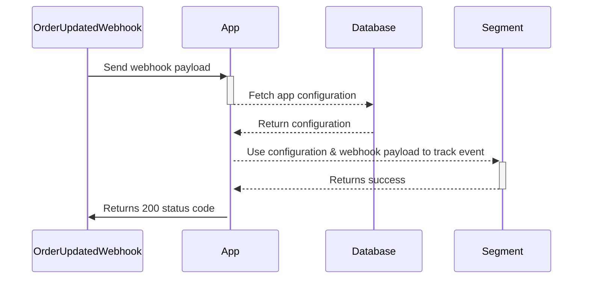

import { AppMetadata } from "/components/AppMetadata/AppMetadata.jsx";

<AppMetadata
  minSaleorVersion="3.20"
  githubUrl="https://github.com/saleor/apps/tree/main/apps/segment"
/>

This application integrates with [Twilio Segment](https://segment.com/). It tracks events occurring in Saleor and sends them to Twilio Segment.

## Features

- Send information about order-related events to Segment.
- Events send to Segment have identity set to user ID or email.

## Assumptions & limitations

-  Currently, only order-related events are supported. Events sent to Segment are in format defined by [V2 E-commerce Events](https://segment.com/docs/connections/spec/ecommerce/v2/) Segment specification.
-  Order webhooks are asynchronous, meaning events may not be sent to Segment immediately.  
-  The app uses the [`track` API](https://segment.com/docs/connections/sources/catalog/libraries/server/node/#track). 
-  The app attempts to retrieve user information using the user ID or email. If that fails, it will send an anonymous ID.  
-  The app has its webhooks initially disabled; configuring the app will activate the webhooks.  

## Permissions

- `MANAGE_ORDERS`

## Application flow

The application subscribes to the following webhooks and sends coresponding event to Segment:

| Saleor webhook event      | Segment event     |
| ------------------------- | ----------------- |
| `ORDER_CONFIRMED`         | `Order Completed` |
| `ORDER_CANCELLED`         | `Order Cancelled` |
| `ORDER_REFUNDED`          | `Order Refunded`  |
| `ORDER_UPDATED`           | `Order Updated`   |
  

Each event sent to Segment will have properties defined in Segment E-commerce Event spec:

* [`Order Completed`](https://segment.com/docs/connections/spec/ecommerce/v2/#order-completed)
* [`Order Cancelled`](https://segment.com/docs/connections/spec/ecommerce/v2/#order-cancelled)
* [`Order Refunded`](https://segment.com/docs/connections/spec/ecommerce/v2/#order-refunded)
* [`Order Updated`](https://segment.com/docs/connections/spec/ecommerce/v2/#order-updated)

App will also add `channel_id` field with Saleor channel id for given order.

Events sent to Segment will have `Saleor` suffix set in `event` [field](https://segment.com/docs/connections/spec/track/#event) e.g `Order Completed` will be tracked as `Saleor Order Completed`.

Example of successful handling of `ORDER_UPDATED` webhook:

## Pre-requisites

- Create an account on [Twillo Segment](https://segment.com/).
- Create a HTTP API [source](https://segment.com/docs/partners/sources/) in the Segment Dashboard UI and note down the Write Key for this source.

## Installation

- Go to the Apps section in your Saleor Dashboard. Pick Twilio Segment and Install.

## Configuration

- Paste [Write Key](https://segment.com/docs/connections/find-writekey/) into the main configuration form in the app and click `Save`.

### Testing

To test if your app is working, create an order and update its address or shipping in the Saleor Dashboard. Then, go to the Segment Dashboard; you should see the `Saleor Order Updated` event in Segment.

## Troubleshooting

- **Events are not showing in Segment Dashboard**
    - Ensure you have set your Write Key in the app configuration screen.
    - Trigger one of the supported events (see [application flow section](#application-flow) for more details).

## Development

To run the application locally, follow the [_Running Saleor Apps locally_ article](/developer/extending/apps/developing-apps/running-saleor-apps-locally).

Segment app specific instructions can be found inside app GitHub [repository](https://github.com/saleor/apps/tree/main/apps/segment).
