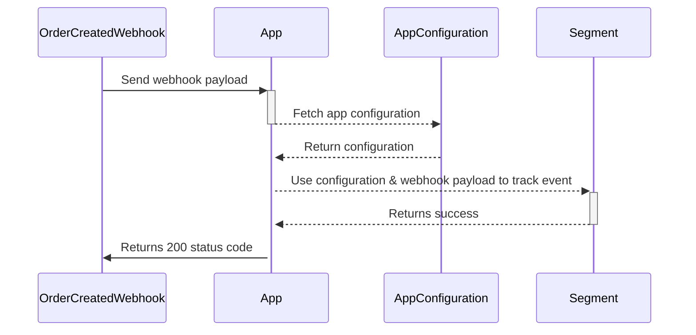

import { AppMetadata } from "/components/AppMetadata/AppMetadata.jsx";

<AppMetadata
  minSaleorVersion="3.20"
  githubUrl="https://github.com/saleor/apps/tree/main/apps/segment"
/>

This application integrates with [Twilio Segment](https://segment.com/). It tracks events occurring in Saleor and sends them to Twilio Segment.

## Features

- Send information about order-related events to Segment.
- Events send to Segment have identity set to user ID or email.

## Assumptions & limitations

-  Currently, only order-related events are supported.  
-  Order webhooks are asynchronous, meaning events may not be sent to Segment immediately.  
-  The app uses the [`track` API](https://segment.com/docs/connections/sources/catalog/libraries/server/node/#track). 
-  The app attempts to retrieve user information using the user ID or email. If that fails, it will send an anonymous ID.  
-  The app has its webhooks initially disabled; configuring the app will activate the webhooks.  

## Permissions

- `MANAGE_ORDERS`

## Application flow

The application subscribes to the following webhooks:

- `ORDER_CREATED`
- `ORDER_CANCELLED`
- `ORDER_FULLY_PAID`
- `ORDER_REFUNDED`
- `ORDER_UPDATED`

For each webhook, the application will send the following information to Segment:

- Order `id`
- User information:
    - User `id`
    - User email
- Channel information for the order:
    - Channel `id`
    - Channel slug
    - Channel name
- Name of the shipping method used for the order
- Total amount of the order, including:
    - Total gross (amount & currency)
    - Total net (amount & currency)
- Order number
- All lines of the order with:
    - Line `id`
    - Name of [product variant](/developer/products/overview#product-and-variants)
    - Id of [product variant](/developer/products/overview#product-and-variants)
    - SKU of product

Example of successful handling of `ORDER_CREATED` webhook:

## Pre-requisites

- Create an account on [Twillo Segment](https://segment.com/).
- Create a [source](https://segment.com/docs/partners/sources/) in the Segment Dashboard UI and note down the `writeKey` for this source.

## Configuration

- Paste [`writeKey`](https://segment.com/docs/connections/find-writekey/) into the main configuration form in the app and click `Save`.

### Testing

To test if your app is working, create an order in the Saleor Dashboard. Then, go to the Segment Dashboard; you should see the `Saleor Order Created` event in Segment.

## Troubleshooting

- **Events are not showing in Segment Dashboard**
    - Ensure you have set your `writeKey` in the app configuration screen.
    - Trigger one of the supported events (see [application flow section](#application-flow) for more details).

## Development

To run the application locally, follow the [_Running Saleor Apps locally_ article](/developer/extending/apps/developing-apps/running-saleor-apps-locally).
