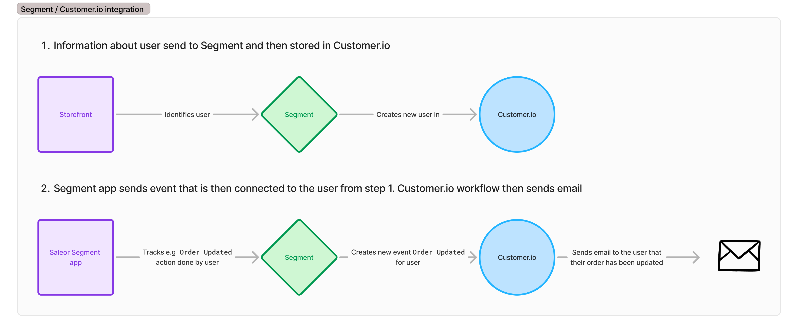
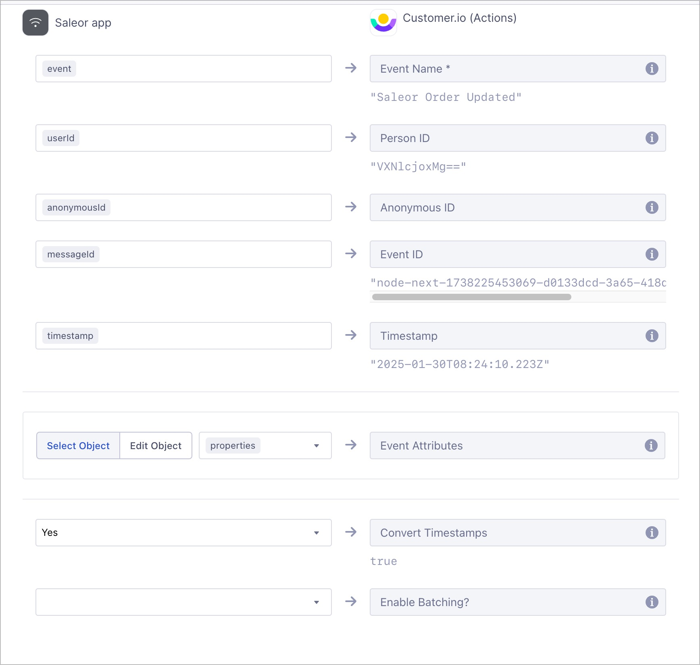
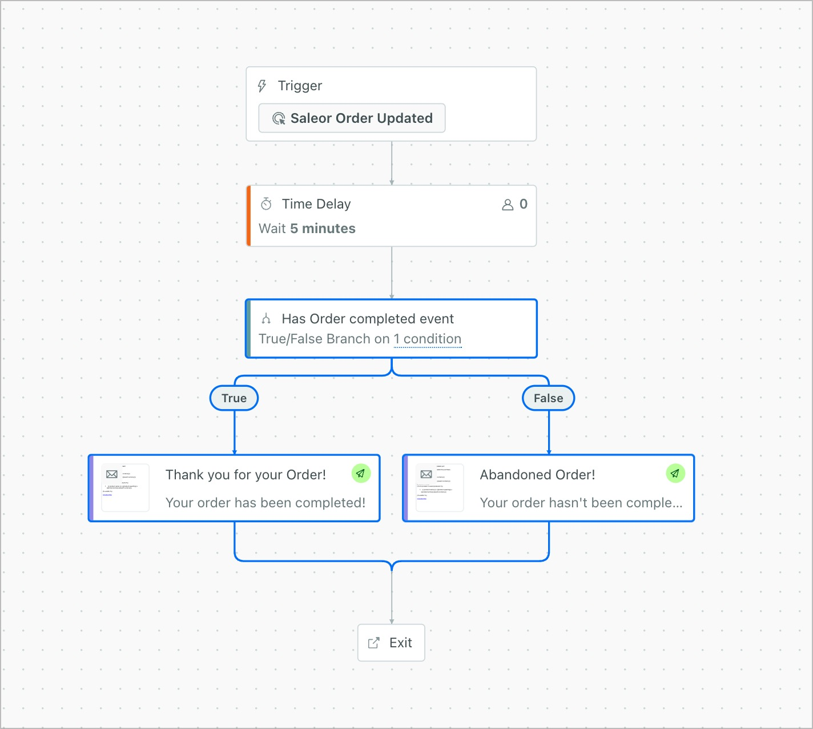

# Segment.io with Saleor and example destinations

A great example of Segment.io's strength is how easily you can build a workflow with external tools without writing a single line of code.

## Abandoned baskets workflow with Segment.io & customer.io
Below you will find an example of an e-mail campaign for abandoned baskets. Usually companies want to build a workflow like that
to be able to bring back customers who might have forgotten to finish their shopping. This involves waiting some time after someone
has started adding products to their basket and sending an e-mail unless the order has been finalized.

Note: in Saleor we use the concept of checkout instead of a basket.


<iframe width="560" height="315" src="https://www.youtube.com/embed/eRdtWMaIX6g?si=lnIaxd8s0EJhSRik" title="YouTube video player" frameborder="0" allow="accelerometer; lipboard-write; encrypted-media; gyroscope; picture-in-picture; web-share" referrerpolicy="strict-origin-when-cross-origin"></iframe>

The steps required to get the workflow running.

### Overview


### Install Segment
Setup Segment with Saleor using the steps from (/developer/app-store/apps/segment/configuration.mdx).

### Storefront → Segment
You first want to make sure Segment is able to receive events from the storefront.
There is an [example implementation of storefront that sends data to Segment that you can check: ](https://github.com/saleor/adyen-app-testclient/tree/segment-analitics).

Similarly you would want to add it in your storefront config.
        
```
NEXT_PUBLIC_INITIAL_ENV_URL=
NEXT_PUBLIC_INITIAL_CHANNEL_SLUG=default-channel
NEXT_PUBLIC_INITIAL_CHECKOUT_COUNTRY_CODE=US

NEXT_PUBLIC_SEGMENT_WRITE_KEY=
NEXT_PUBLIC_STOREFRONT_USER_EMAIL=
NEXT_PUBLIC_STOREFRONT_USER_PASSWORD=
```
        

### Customer.io event mapping in Segment
In order for Customer.io to "understand" the data sent from Segment we need to configure the field mappings. Below is an example mapping of fields in Segment destination for Customer.io.
    

    b. [Customer.io](http://Customer.io) campaign workflow
    
### Customer.io campaign workflow
In customer.io you want to setup a campaign with the following workflow



### Customer.io e-mail template
And in the e-mail template you can use the fields related to the basket someone has has in progress.

Example e-mail template for completed order:
```
Your order has been completed!

Order id: {{event.order_id}}

Total: {{event.total}} {{event.currency}}

Shipping: {{event.shipping}} {{event.currency}}

Products in order:

   {{ product.name }} x {{product.quantity}} x {{product.price}} {{event.currency}}

```

Example template for order that hasn't been completed yet:
```
Your order hasn't been completed yet!

Go back to our store to complete the purchase.

Products in basket:

   {{ product.name }} x {{product.quantity}} x {{product.price}} {{event.currency}}

```