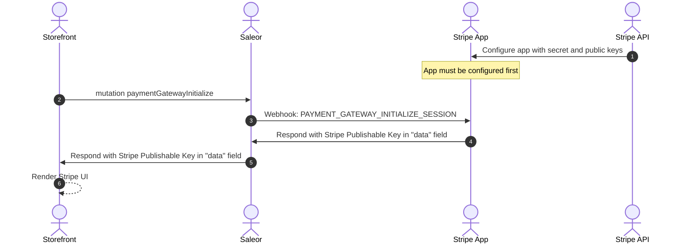
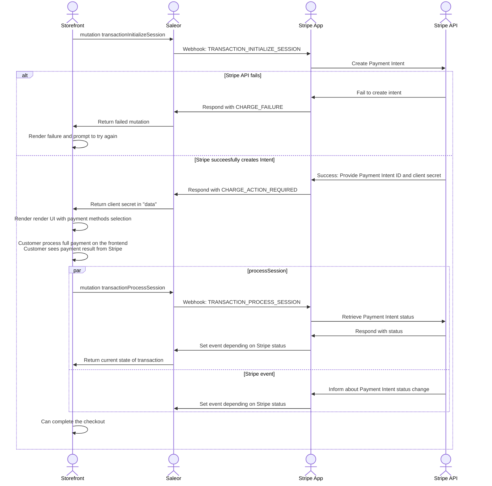
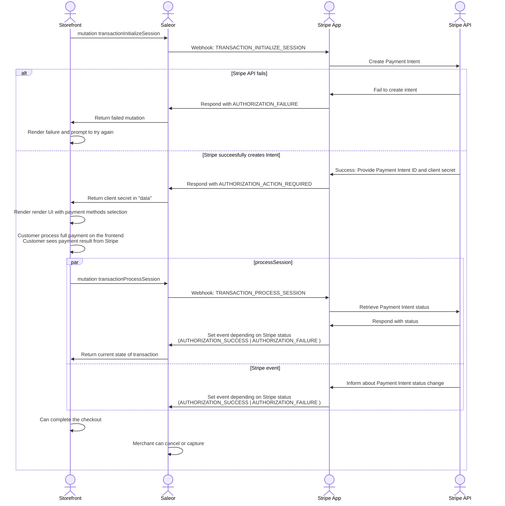
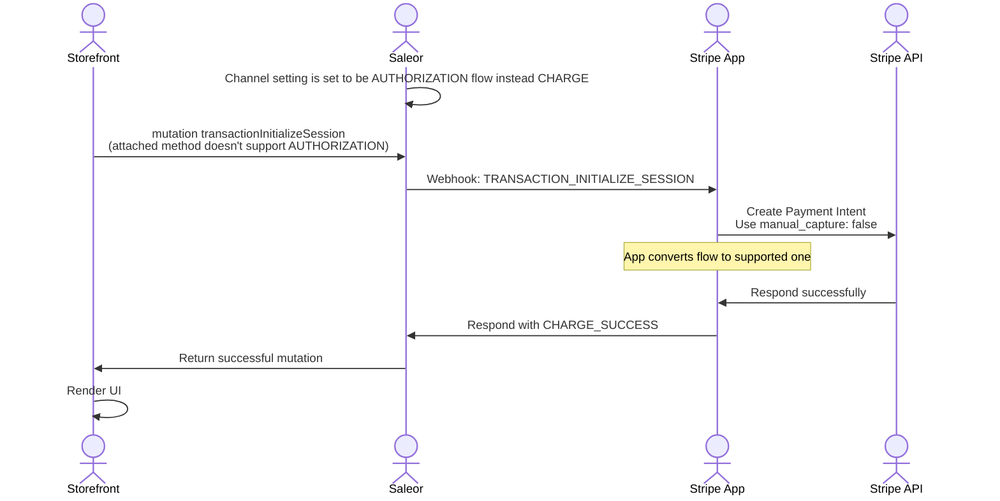
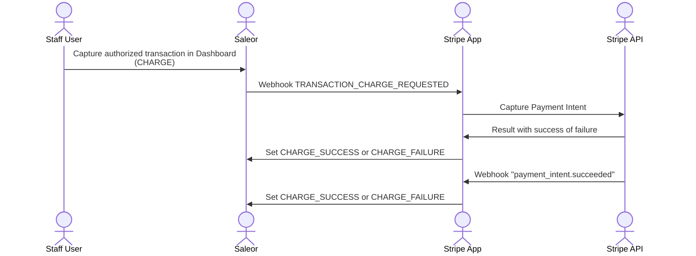
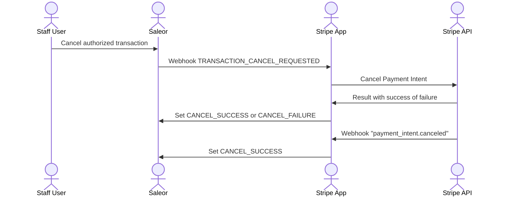
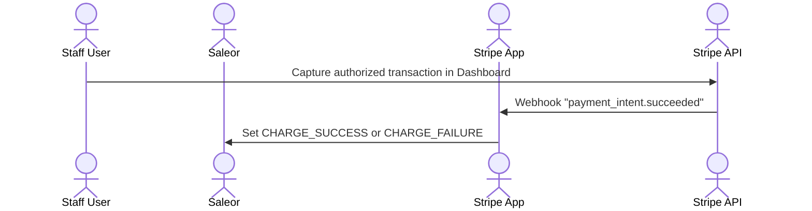
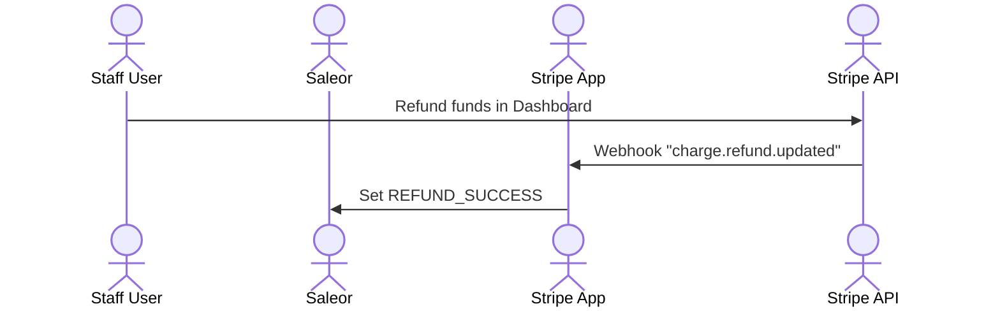

## Assumptions

App uses the assumptions below to make decisions about it's behavior. Changing them will usually mean breaking change, so it's not likely they will change in the future.

### Supporting Authorization flow

App supports both Authorization and Charge flow that can be set in Saleor channel settings. However, not every payment method supports Authorization.

Some methods support both Authorization and Charge, some - only Charge.

App will proceed following flows (simplified)

#### Charge Flow

`CHARGE_REQUEST` → `CHARGE_SUCCESS`

#### Authorization Flow + method supports Authorization

`AUTHORIZATION_REQUEST` → `AUTHORIZATION_SUCCESS` → `CHARGE_REQUEST` → `CHARGE_SUCCESS`

#### Authorization Flow + method does not support Authorization

`AUTHORIZATION_REQUEST` → `CHARGE_SUCCESS`

To wrap up, the app can make a decision to make a shortcut from AUTHORIZATION to CHARGE if method doesn’t allow to authorize first.

To make this work, app requires payment method to be provided in `data` of TransactionInitializeSession - see storefront integration.

See charts below for more details about the flow.

### Stripe event deduplication

Stripe doesn’t guarantee their webhooks will be delivered once and recommend deduplicate events.

App itself doesn’t de-duplicate - Saleor does. In case of duplicated event, app will resolve the same result (PSP Reference, amount, type) and report it to Saleor again. Saleor will reject this event with an ALREADY_REPORTED error, which app gracefully handles.

### Stripe metadata

At this point app is not setting anything on Stripe’s Payment Intent metadata.

In the future app may store there additional fields but will not rely on these fields and do not guarantee these fields will be written.

It is fine to use metadata for additional, user-targeted information but do not build automated logic based on its existence.

## Supported flows

This chapter lists flows possible to execute, including Storefront, Saleor, App and Stripe.

Note: Flows that assume operation in Saleor Dashboard can be also executed with graphQL

Note: For brevity, diagrams highlight most important parts of the flow and do not duplicate operations that are not relevant to the flow.
To fully understand the flow, please study all diagrams.

### Render payment UI




### Payment with CHARGE flow



### Payment with AUTHORIZATION flow



### Payment with AUTHORIZATION flow for payment method that does not support authorization




### Capturing funds from Saleor Dashboard





### Cancelling authorization from Saleor Dashboard



### Capturing funds from Stripe




### Cancelling authorized transaction from Stripe

```mermaid
sequenceDiagram
    %% actor Storefront
    actor Staff User
    actor Saleor
    actor Stripe App
    actor Stripe API

    Staff User->>Stripe API: Cancel authorized transaction in Dashboard
    Stripe API ->> Stripe App: Webhook "payment_intent.canceled"
    Stripe App ->> Saleor: Set CANCEL_SUCCESS
````

### Refunding amount from Saleor Dashboard

```mermaid
sequenceDiagram
    %% actor Storefront
    actor Staff User
    actor Saleor
    actor Stripe App
    actor Stripe API

    Staff User->>Saleor: Refund authorized transaction in Dashboard <br/>(CHARGE)
    Saleor ->> Stripe App: Webhook TRANSACTION_REFUND_REQUESTED
    Stripe App ->> Stripe API: Create refund
    Stripe API ->> Stripe App: Result with success of failure
    Stripe App ->> Saleor: Set REFUND_SUCCESS or REFUND_FAILURE
    Stripe API ->> Stripe App: Webhook "charge.refund.updated"
    Stripe App ->> Saleor: Set REFUND_SUCCESS or REFUND_FAILURE
```

### Refunding amount from Stripe


