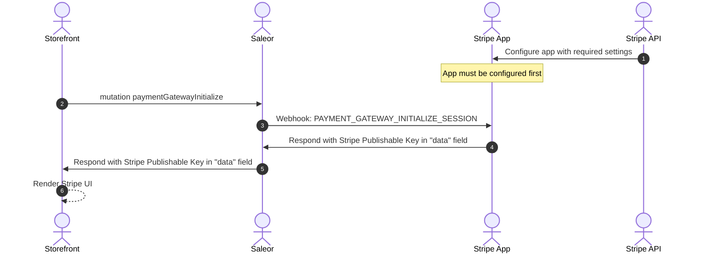
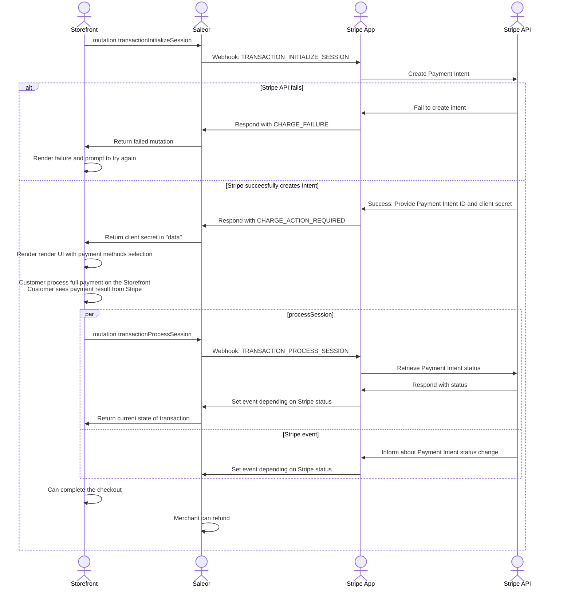
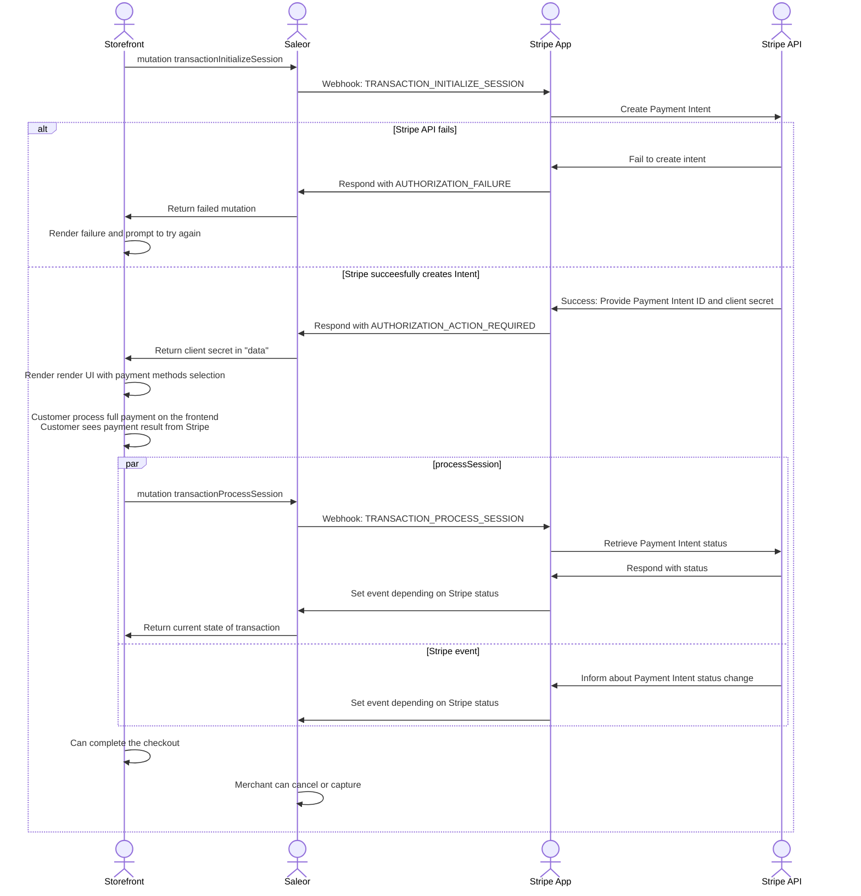
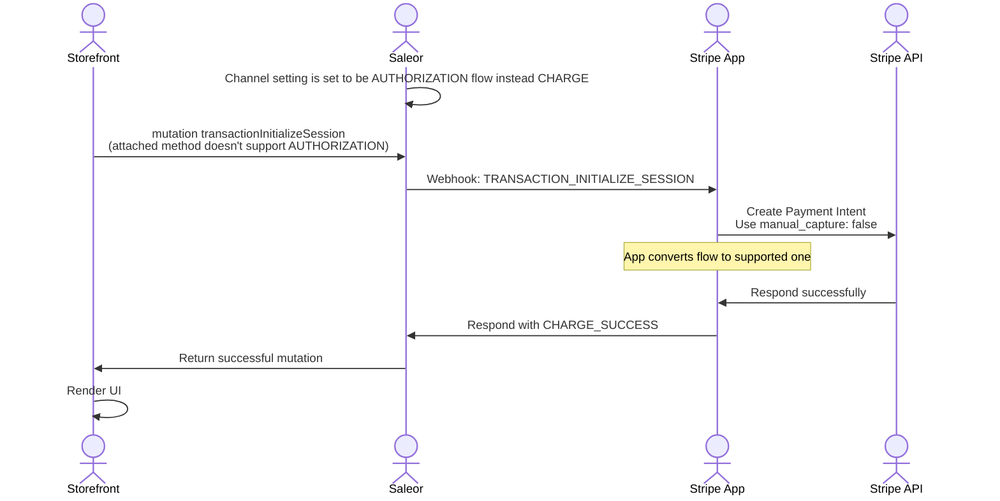
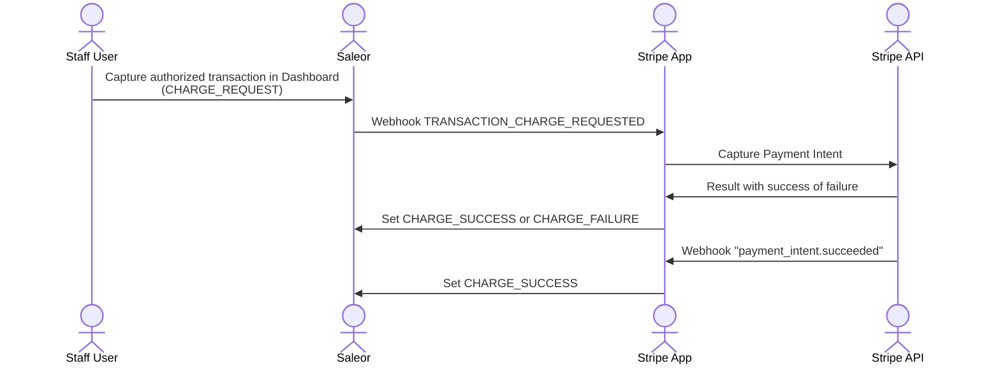
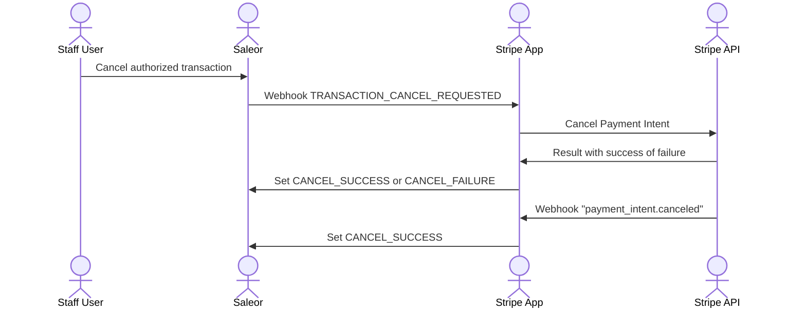
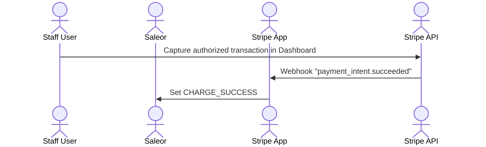
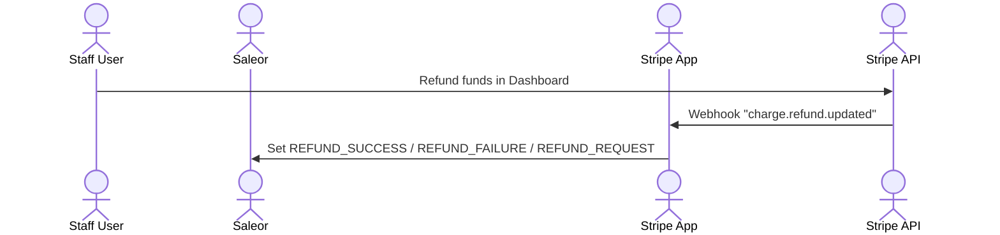

## Assumptions

First, lets highlight the assumptions that the app is based on. These are decisions made by Saleor product team. We may add more assumptions when we add more features,
but the ones already set are pretty much final.

That means:
- You can rely on them when building your Store, and they will not change.
- You should not use this App if you do not agree with them.
- Once we decide to change them, the new major version will be released.


### Supporting Authorization flow

App supports both Authorization and Charge flow that can be set in Saleor channel settings. However, not every payment method supports Authorization.

Some methods support both Authorization and Charge, some - only Charge. You can read more in [Stripe docs](https://docs.stripe.com/payments/place-a-hold-on-a-payment-method)

App will proceed following flows (simplified)

#### Charge Flow

`CHARGE_REQUEST` → `CHARGE_SUCCESS`

#### Authorization Flow + method supports Authorization

`AUTHORIZATION_REQUEST` → `AUTHORIZATION_SUCCESS` → `CHARGE_REQUEST` → `CHARGE_SUCCESS`

#### Authorization Flow + method does not support Authorization

`AUTHORIZATION_REQUEST` → `CHARGE_SUCCESS`

To wrap up, the app can make a decision to make a shortcut from AUTHORIZATION to CHARGE if the method doesn’t allow authorizing first.

To make this work, app requires payment method to be provided in `data` of TransactionInitializeSession - see storefront integration.

See the charts below for more details about the flow.

### Stripe event deduplication

Stripe doesn’t guarantee their webhooks will be delivered once and recommend deduplicate events.

App itself doesn’t de-duplicate - Saleor does. In case of duplicated event, the app will resolve the same result (PSP Reference, amount, type) and report it to Saleor again.
Saleor will reject this event with an ALREADY_REPORTED error, which the app gracefully handles.

### Stripe metadata

Stripe App is setting following metadata on Payment Intent once it's created:
- `saleor_transaction_id` - which is `Transaction.id` in Saleor
- `saleor_source_type` - which is `Checkout` or `Order` depending on the source of the payment flow
- `saleor_source_id` - which is `Checkout.id` or `Order.id` depending on the source of the payment flow

In the future app may store there additional fields but will not rely on these fields and do not guarantee these fields will be written.

It is fine to use metadata for additional, user-targeted information but do not build automated logic based on its existence.

### Payment methods detection

You should rely on [automatic (dynamic)](https://docs.stripe.com/payments/payment-methods/dynamic-payment-methods) payment methods detection.

In this approach, you don't select methods on the Storefront but enable them in the Stripe Dashboard.
This approach allows you to have zero-downtime (and zero deployment) adding and removing methods depending on the needs.

Additionally, when App adds support to the new payment method, you don't have to redeploy the Storefront (or the mobile app); you enable a new method in the Stripe Dashboard.

If you try to overwrite payment methods on the UI, the payment flow will not work as expected.

## Supported flows

This chapter lists flows possible to execute, including Storefront, Saleor, App and Stripe.

Note: Flows that assume operation in Saleor Dashboard can be also executed with graphQL

Note: For brevity, diagrams highlight the most important parts of the flow and do not duplicate operations that are not relevant to the flow.
To fully understand the flow, please study all diagrams.

### Render payment UI




### Payment with CHARGE flow



### Payment with AUTHORIZATION flow



### Payment with AUTHORIZATION flow for payment method that does not support authorization




### Capturing funds from Saleor Dashboard





### Cancelling authorization from Saleor Dashboard



### Capturing funds from Stripe




### Cancelling authorized transaction from Stripe

```mermaid
sequenceDiagram
    %% actor Storefront
    actor Staff User
    actor Saleor
    actor Stripe App
    actor Stripe API

    Staff User->>Stripe API: Cancel authorized transaction in Dashboard
    Stripe API ->> Stripe App: Webhook "payment_intent.canceled"
    Stripe App ->> Saleor: Set CANCEL_SUCCESS
````

### Refunding funds from Saleor Dashboard

```mermaid
sequenceDiagram
    %% actor Storefront
    actor Staff User
    actor Saleor
    actor Stripe App
    actor Stripe API

    Staff User->>Saleor: Refund authorized transaction in Dashboard <br/>(REFUND_REQUEST)
    Saleor ->> Stripe App: Webhook TRANSACTION_REFUND_REQUESTED
    Stripe App ->> Stripe API: Create refund
    Stripe API ->> Stripe App: Result with success of failure
    Stripe App ->> Saleor: Set REFUND_FAILURE or return PSP Reference (refund ID)
    Saleor ->> Saleor: Set REFUND_FAILURE or REFUND_REQUEST
    Stripe API ->> Stripe App: Webhook "charge.refund.updated"
    Stripe App ->> Saleor: Set REFUND_SUCCESS / REFUND_FAILURE / REFUND_REQUEST
```

### Refunding funds from Stripe


