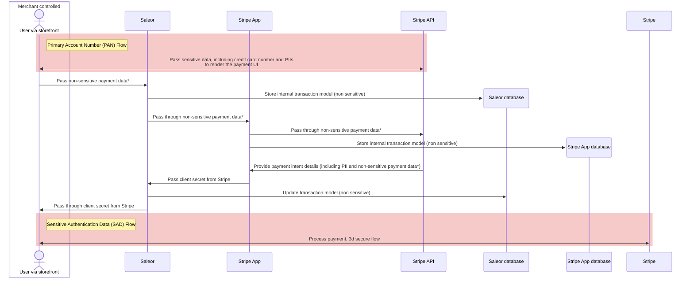

The following diagram shows the flow of sensitive data between services when using the Stripe App:

*Passes non-PCI DSS regulated payment information, such as payment method type

For more information about Stripe PCI DSS compliance - see their [docs](https://docs.stripe.com/security).
