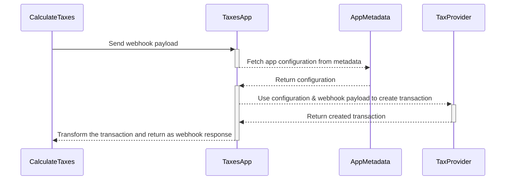
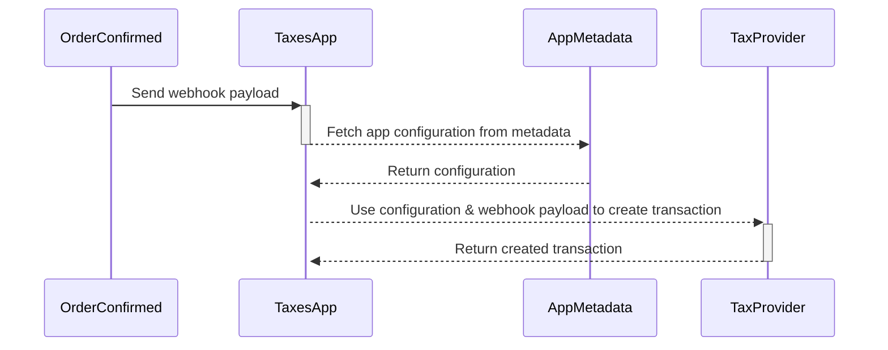
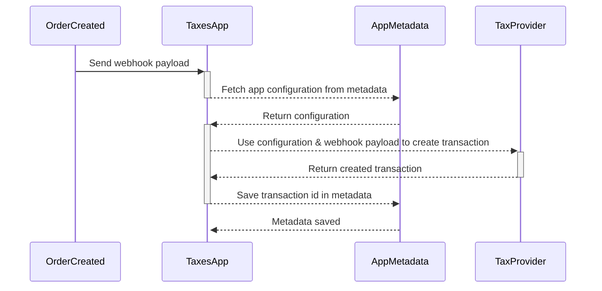
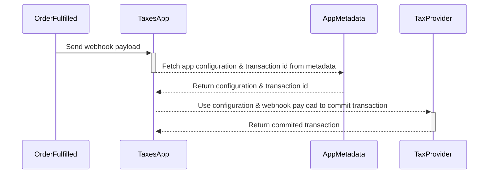
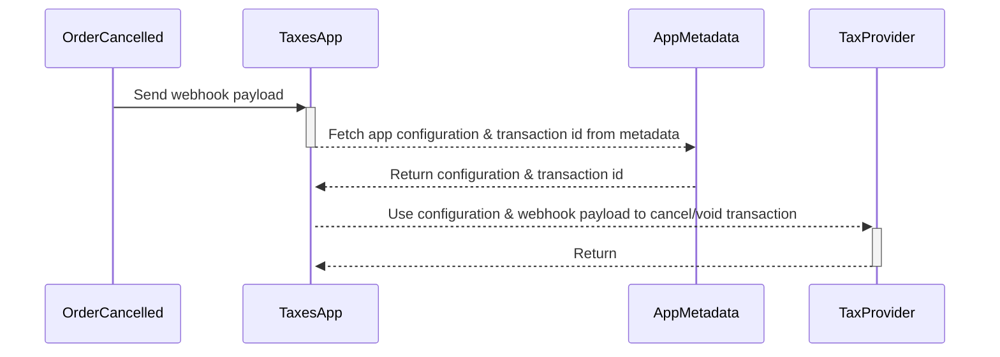

## Webhook events

The Taxes App uses the following webhook events for tax reporting and calculations:

- [`OrderCalculateTaxes`](docs/api-reference/taxes/objects/calculate-taxes.mdx)
- [`CheckoutCalculateTaxes`](docs/api-reference/taxes/objects/calculate-taxes.mdx)
- [`OrderConfirmed`](docs/api-reference/orders/objects/order-confirmed.mdx)
- [`OrderCreated`](docs/api-reference/orders/objects/order-created.mdx) (_deprecated in the Taxes App_)
- [`OrderFulfilled`](docs/api-reference/orders/objects/order-fulfilled.mdx) (_deprecated in the Taxes App_)

## Calculating taxes

Calculating taxes using external tax providers happens through a synchronous [`CalculateTaxes`](docs/api-reference/taxes/objects/calculate-taxes.mdx) webhook event. A [synchronous webhook](docs/developer/extending/webhooks/synchronous-events/overview.mdx) awaits a response from the app before continuing.

While the app is waiting for the values of the calculated taxes, the sequence of actions is as follows:

During tax calculation, the transactions on the tax providers' side are not recorded. They will not appear in the tax provider's dashboard.

## Recording transactions

Once the order is finalized, we want to send a transaction to the tax provider for tax reporting. This is done through [asynchronous webhook](docs/developer/extending/webhooks/asynchronous-events.mdx) events that fire on different order lifecycle actions.

Currently, we are maintaining two flows for this. The first one is the `OrderConfirmed` flow, which is the recommended one. The second one is the `OrderCreated` and `OrderFulfilled` flow, which **is deprecated and will be removed in the future**.

### OrderConfirmed flow

If the tax provider has a concept of committing or confirming transactions, it will happen during the transaction creation based on the provider configuration.

For example, in the case of AvaTax, the transaction is committed on `OrderConfirmed` if the `isAutocommit` flag is set to `true` in the configuration.

### OrderCreated and OrderFulfilled flow (deprecated)

The described flow is deprecated and will be removed in the future. The Taxes App will automatically move to the `OrderConfirmed` flow instead.

In the [Migration](#migration) section, you can find more information on whether you need to do anything regarding this change.

If the tax provider has a concept of committing or confirming transactions, this is done through the `OrderFulfilled` webhook event:

### Migration

The migration to the `OrderConfirmed` flow will complete on **23 August 2023**. After that date, the `OrderCreated` and `OrderFulfilled` handlers will be removed from the Taxes App code along with their corresponding webhooks.

The only scenario where you, as the user, may need to do something regarding this migration is the following:

1. You use AvaTax.
2. You created an order that still needs to be fulfilled (therefore, the corresponding AvaTax transaction is not committed).
3. You are planning to fulfill the order after August 24 (which is the date when we will complete the migration).

In that case, **remember you will not be able to commit the transaction by fulfilling the order in Saleor**. In the new flow, the transactions are committed in AvaTax while confirming the Saleor order based on the "isAutocommit" flag. What you have to do is the following:

1. Make sure "isAutocommit" is set to true.
2. Trigger the `OrderConfirmed` event by [`orderConfirm` mutation](https://docs.saleor.io/docs/3.x/api-reference/orders/mutations/order-confirm).

The AvaTax transaction created on the `OrderCreated` event should then be updated with `commit` set to `true`.

If you missed the migration date and you want to commit a transaction created on the `OrderCreated` event, you can do it manually in the AvaTax dashboard.

## Canceling transactions

