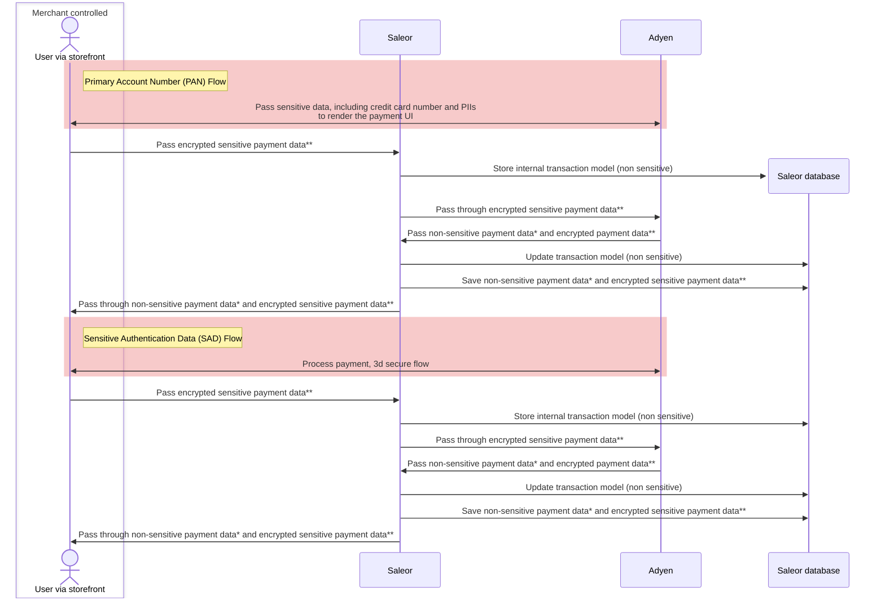

<head>
  <meta name="rank" content="1" />
</head>

:::warning
This plugin is deprecated!

If you plan on building a new integration with Saleor, we recommend using the [Adyen](developer/app-store/apps/adyen/overview.mdx) app instead.
:::

# Adyen

The Adyen plugin allows you to process customer transactions via [Adyen](https://www.adyen.com) with support for many [payments methods](https://docs.adyen.com/payment-methods).

## Configuration

Go to _Configuration_ -> _Plugins_ -> _Adyen_ and fill in the following fields:

- **Merchant Account:** your Adyen account identifier as described in the [getting started with Adyen guide](https://docs.adyen.com/checkout/get-started#step-1-sign-up-for-a-test-account)

- **Supported currencies:** your currency as an ISO 4217 3-letter code (eg. `USD`, `EUR`, `GBP`)

- **Client Key:** The client key is a public key that uniquely identifies a web service. See [Adyen docs](https://docs.adyen.com/user-management/client-side-authentication#get-your-client-key).

- **Live:** Leave it blank if you want to use the test environment. See [Adyen docs for production environments](https://docs.adyen.com/development-resources/live-endpoints).

- **Assume all authorizations are automatically captured by Adyen:** All authorized payments will be marked as captured. This should only be enabled if Adyen is configured to auto-capture payments. Saleor doesn’t support the _delayed capture_ Adyen feature.

- **Automatically capture funds when a payment is made:** If enabled, Saleor will automatically capture funds. If disabled, the funds are blocked but need to be captured manually.

- **HMAC secret key:** key used to check if a received notification comes from Adyen. The key should be the same as on the Adyen side. Generate a new key in the Adyen customer area and copy it here. See [Adyen docs](https://docs.adyen.com/development-resources/webhooks#set-up-notifications-in-your-customer-area).

- **Notification user:** In addition to checking request signatures, you can confirm received notification by checking the provided user in the notification. Provide a user in the _Authentication_ section of your Adyen customer area and copy it here. See [Adyen docs](https://docs.adyen.com/development-resources/webhooks#set-up-notifications-in-your-customer-area).

- **Notification password:** In addition to checking request signatures, you can confirm received notification by checking the provided user’s password in the notification . Provide a password in the _Authentication_ section of your Adyen customer area and copy it here. See [Adyen docs](https://docs.adyen.com/development-resources/webhooks#set-up-notifications-in-your-customer-area).

- **Enable native 3D Secure:** Saleor uses 3D Secure redirect authentication by default. If you want to use native 3D Secure authentication, enable this option. For more details see Adyen documentation: [native 3D Secure 2](https://docs.adyen.com/checkout/3d-secure/native-3ds2), [redirect 3D Secure 1 and 2](https://docs.adyen.com/checkout/3d-secure/redirect-3ds2-3ds1)

- **Webhook endpoint:** Endpoint which should be used to activate Adyen's webhooks. More details can be find [here](https://docs.adyen.com/development-resources/webhooks)

- **Apple Pay certificate:** Apple pay certificate in .pem format. Required to activate ApplePay payment method in `web` channel. See [Adyen docs](https://docs.adyen.com/payment-methods/apple-pay/enable-apple-pay).

### Activating the Adyen notification

Adyen uses a notification system. Enabling it is required for proper work of payment gateway.

1. Follow [the Adyen docs about notifications.](https://docs.adyen.com/development-resources/webhooks#set-up-notifications-in-your-customer-area)

- For `URL` use value from `Webhook endpoint` field.
- For `SSL Version` use the newest one.
- For `Method` use JSON.

2. To protect your notification follow [the Adyen docs about security.](https://docs.adyen.com/development-resources/webhooks/best-practices#security)

- Copy the HMAC key into the Saleor's **HMAC secret key** field. [(See Saleor configuration fields.)](#configuration)
- Copy the username from _Authentication_ section and paste it to Saleor field **Notification user**. [(See Saleor configuration fields.)](#configuration)
- Copy the password from _Authentication_ section and paste it to Saleor field **Notification password**. [(See Saleor configuration fields.)](#configuration)

3. To test your configuration check [the Adyen docs about testing the configuration.](https://docs.adyen.com/development-resources/webhooks#test-your-notifications-server)

### Activating ApplePay

- Follow the [Adyen docs](https://docs.adyen.com/payment-methods/apple-pay/enable-apple-pay) for enabling Apple Pay.
  - For enabling Apple Pay on the `web` channel follow all steps as described [here](https://docs.adyen.com/payment-methods/apple-pay/enable-apple-pay#process-overview).
  - For enabling Apple Pay only for the `iOS` app, follow steps described as required for the app [here](https://docs.adyen.com/payment-methods/apple-pay/enable-apple-pay#process-overview).
- In section [register merchant domain](https://docs.adyen.com/payment-methods/apple-pay/enable-apple-pay#register-merchant-domain), for registration and verification, the domain uses your storefront domain.
- Upload the [converted .pem certificate](https://docs.adyen.com/payment-methods/apple-pay/enable-apple-pay#create-merchant-identity-certificate) to the `Apple Pay certificate` field on the Saleor side.

:::note
Saleor uses Adyen's checkout API in version [64](https://docs.adyen.com/api-explorer/#/CheckoutService/v64/overview).
If you're using [drop-in](https://docs.adyen.com/online-payments/web-drop-in/integrated-before-5-0-0) or
[components](https://docs.adyen.com/online-payments/web-components/integrated-before-5-0-0) integrations make sure that
you're using Adyen's packages in a version lower than 5.0.0.
:::

:::note
To use the Adyen plugin, make sure that you have configured the plugin.
:::

## Adding a payment form

Adding a payment form for Adyen requires Saleor to provide available payment methods and a client-key.
Both of these values can be fetched by calling `checkout.availablePaymentGateways.config`.
The query returns all required fields to prepare a payment form with methods available for the checkout.

```graphql
{
  checkout(token: "14f11c1c-9bc7-4145-89f7-67b60ef943f2") {
    availablePaymentGateways {
      id
      config {
        field
        value
      }
    }
  }
}
```

As a result, we get the details required to render a payment form.

```json
{
  "data": {
    "checkout": {
      "availablePaymentGateways": [
        {
          "id": "mirumee.payments.adyen",
          "config": [
            {
              "field": "client_key",
              "value": "test_BBDTBL6GWVEJTOXY55TSPJFP54QBIOZ5"
            },
            {
              "field": "config",
              "value": "{\"groups\": [{\"name\": \"Credit Card\", \"types\": [\"visa\", \"mc\", \"amex\", \"diners\", \"discover\"]}], \"paymentMethods\": [{\"brands\": [\"visa\", \"mc\", \"amex\", \"diners\", \"discover\"], \"details\": [{\"key\": \"encryptedCardNumber\", \"type\": \"cardToken\"}, {\"key\": \"encryptedSecurityCode\", \"type\": \"cardToken\"}, {\"key\": \"encryptedExpiryMonth\", \"type\": \"cardToken\"}, {\"key\": \"encryptedExpiryYear\", \"type\": \"cardToken\"}, {\"key\": \"holderName\", \"optional\": true, \"type\": \"text\"}], \"name\": \"Credit Card\", \"supportsRecurring\": true, \"type\": \"scheme\"}, {\"configuration\": {\"intent\": \"capture\"}, \"name\": \"PayPal\", \"supportsRecurring\": true, \"type\": \"paypal\"}, {\"name\": \"Paysafecard\", \"supportsRecurring\": true, \"type\": \"paysafecard\"}, {\"configuration\": {\"merchantDisplayName\": \"SaleorECOM\", \"merchantIdentifier\": \"1000\"}, \"details\": [{\"key\": \"applepay.token\", \"type\": \"applePayToken\"}], \"name\": \"Apple Pay\", \"supportsRecurring\": true, \"type\": \"applepay\"}, {\"configuration\": {\"merchantId\": \"1000\", \"gatewayMerchantId\": \"SaleorECOM\"}, \"details\": [{\"key\": \"paywithgoogle.token\", \"type\": \"payWithGoogleToken\"}], \"name\": \"Google Pay\", \"supportsRecurring\": true, \"type\": \"paywithgoogle\"}]}"
            }
          ]
        }
      ]
    }
  }
}
```

## Creating a payment in Saleor

To create a payment properly, you need to follow the steps described in
[Creating a checkout session](developer/checkout/overview.mdx) and
[Selecting a shipping method](developer/checkout/address.mdx).

The next step is to choose Adyen as the payment gateway we want to use to process the checkout.
For the Adyen payment gateway, we need to provide:

- `checkoutId`: ID of the checkout, for which new payment should be created.

- `input.gateway`: ID of the payment gateway which should be assigned to this payment. For Adyen, it will be: `mirumee.payments.adyen`.

- `input.amount`: Amount of payment to process. Must be equal to `checkout.totalPrice`.

- `input.returnUrl`: URL to where the customer should be taken back to after a redirection.

```graphql
mutation {
  checkoutPaymentCreate(
    checkoutId: "Q2hlY2tvdXQ6MWZiMmM1OGUtN2JhMy00YmY5LWI2ZDItNWY2ZWJiN2U3ZWJj"
    input: {
      gateway: "mirumee.payments.adyen"
      amount: 45.61
      returnUrl: "https://127.0.0.1:3001/checkout/payment-confirm"
    }
  ) {
    payment {
      id
      chargeStatus
    }
    errors {
      field
      message
    }
  }
}
```

## Completing the checkout

After we create a payment object for the Adyen payment gateway,
we can call the `checkoutComplete` mutation.

`checkoutComplete` can accept additional parameters for Adyen as fields in the `paymentData` input.
The following fields in `paymentData` will be directly passed to Adyen's [payments endpoint](https://docs.adyen.com/api-explorer/#/CheckoutService/v64/post/payments):

- Required:

  - `paymentMethod` - Received from the front-end payment form as a `state.data.paymentMethod` when a customer provides payment details.
    [Adyen's docs](https://docs.adyen.com/api-explorer/#/CheckoutService/v64/post/payments__reqParam_paymentMethod).

- Optional:
  - `channel` - The platform where a payment transaction takes place. Default `web`.
    [Adyen's docs](https://docs.adyen.com/api-explorer/#/CheckoutService/v64/post/payments__reqParam_channel).
  - `originUrl` - Required for the 3D Secure 2 channel `web` integration.
    Value assigned to `origin` field. [Adyen's docs](https://docs.adyen.com/api-explorer/#/CheckoutService/v64/post/payments__reqParam_origin).
  - `browserInfo` - The customer's browser information.
    [Adyen's docs](https://docs.adyen.com/api-explorer/#/CheckoutService/v64/post/payments__reqParam_browserInfo).
  - `billingAddress` - The billing address of the customer. If empty or missing,
    Saleor will fill out the field based on the checkout billing address.
    [Adyen's docs](https://docs.adyen.com/api-explorer/#/CheckoutService/v64/post/payments__reqParam_billingAddress).
  - `deliveryAddress` - The delivery address of the customer. If empty or missing,
    Saleor will fill out the field based on the checkout shipping address.
    [Adyen's docs](https://docs.adyen.com/api-explorer/#/CheckoutService/v64/post/payments__reqParam_deliveryAddress).
  - `shopperIP` - The customer's IP address. [Adyen's docs](https://docs.adyen.com/api-explorer/#/CheckoutService/v64/post/payments__reqParam_shopperIP).
  - `deviceFingerprint` - A string containing the customer's device fingerprint.
    [Adyen's docs](https://docs.adyen.com/api-explorer/#/CheckoutService/v64/post/payments__reqParam_deviceFingerprint).
  - `shopperName` - The customer's full name. [Adyen's docs](https://docs.adyen.com/api-explorer/#/CheckoutService/v64/post/payments__reqParam_shopperName).

```graphql
mutation {
  checkoutComplete(
    token: "14f11c1c-9bc7-4145-89f7-67b60ef943f2"
    paymentData: "{\"paymentMethod\": {\"type\": \"scheme\", \"encryptedCardNumber\": \"adyenjs_0_1_25$OneNKwaAZqAGM2Ksi7PLVw...\", \"encryptedExpiryMonth\": \"adyenjs_0_1_25$uablDTOYKywxbeeBdnkS...\", \"encryptedExpiryYear\": \"adyenjs_0_1_25$u8XBJQ92a//ZnAQtEvTDYqugoYtuYVmU14wEcl7DAjUS3OPcjj+hMvBlWctyKuG0aYG18L790...\", \"encryptedSecurityCode\": \"adyenjs_0_1_25$e7fZqa+exKs8ovFFPGLz+...\"}}"
  ) {
    order {
      id
    }
    confirmationNeeded
    confirmationData
  }
}
```

The checkoutComplete mutation has the following fields:

- `order` - Optional Order object. `Null` when Saleor cannot finalize checkout or when additional action is required from the customer.
- `confirmationNeeded` - Set to `true` when finalizing a checkout requires more action from the customer.
- `confirmationData` - Action data that need to be processed on the frontend side before finalizing the payment. [Adyen doc's](https://docs.adyen.com/api-explorer/#/CheckoutService/v64/post/payments__resParam_action).
- `errors` - Saleor's errors related to the `checkoutComplete` action.

### Completing the checkout without requiring any additional action

When payment doesn't require any additional action from the customer, Saleor will finalize a checkout, return an order, set `confirmationNeeded` to `false` and `confirmationData` as an empty dict.

```json
{
  "data": {
    "checkoutComplete": {
      "order": {
        "id": "T3JkZXI6MjkxMw=="
      },
      "confirmationNeeded": false,
      "confirmationData": "{}"
    }
  }
}
```

:::note

To create an order, the payment must cover the order total. However, we do not verify if an overpayment occurs.
In such cases, the order will still be created, and the excess amount must be handled manually.

:::

### Processing the checkout payment with additional actions required

When payment requires additional action from the customer like authentication payment with 3D Secure,
logging in to their bank's website or a redirect to the payment provider page, Saleor will set `confirmationNeeded` to `true`
and provide all Adyen's action data required to finalize payment as a `confirmationData`.

```json
{
  "data": {
    "checkoutComplete": {
      "order": {
        "id": "T3JkZXI6MjkxMw=="
      },
      "confirmationNeeded": false,
      "confirmationData": "{\"paymentData\": \"Ab02b4c0!BQABAgA1Xk1nQmoiOJCEtVVds....4n8OzNsVJGN3XHg7kMg=\",\"paymentMethodType\": \"scheme\",\"url\": \"https:\\/\\/checkoutshopper-test.adyen.com\\/checkoutshopper\\/threeDS2.shtml\",\"data\": {\"MD\": \"M2RzM...DRi\",\"PaReq\": \"BQABAg....Rz3hacE\",\"TermUrl\": \"http:\\/\\/mirumee.com\\/plugins\\/mirumee.payments.adyen\\/additional-actions?payment=UGF5bWVudDoxMDM%3D&checkout=08546530-4718-422c-a912-9a1642a9031c\"},\"method\": \"POST\",\"type\": \"redirect\"}"
    }
  }
}
```

After processing additional action by the customer, call `checkoutComplete` a second time and pass data received from Adyen (`state.data`) as a `paymentData` field:

```graphql
mutation {
  checkoutComplete(
    token: "14f11c1c-9bc7-4145-89f7-67b60ef943f2"
    paymentData: "{\"additional-action\": \"data received from onAdditionalDetails\" ...,\"}"
  ) {
    order {
      id
    }
    confirmationNeeded
    confirmationData
  }
}
```

The response of the mutation will contain a created order or extra data required for the following additional action from a customer.
In case, when more actions are required, process them in the same way as the second `checkoutComplete` call.

#### Processing a redirect additional action

If `action.type` is `redirect`, Adyen will redirect a customer to a page where the customer can finalize the payment.
After that, the customer will be redirected back. The request will go through the Saleor, which will confirm the current status of payment.
In the next step, Saleor will use `returnUrl` provided in the `checkoutPaymentCreate` mutation to redirect the shopper to the store page.
The `returnUrl` will have attached the following parameters attached:

- Required:
  - `checkout` - the ID of processed checkout.
  - `payment` - the ID of processed payment.
  - `resultCode` - status of the payment received from Adyen. Can be used to determine the current status of the payment. [Docs](https://docs.adyen.com/online-payments/payment-result-codes)
- Optional:
  - `action` - action data if an additional action is required by customer.

If payment was successfully processed, Saleor will create an order. The next mutation `checkoutComplete` call will return `order` in the response.

:::caution
When the notification is received for an inactive payment or, there will be an issue
with order creation, the payment is refunded or voided (in case it wasn't charged yet).
:::

## Enabling native 3DS2

Saleor uses redirect 3D Secure 1 and 2 by default. Enabling native 3D Secure will add the `additionalData.allow3DS2: true` flag
to all card transactions.
Make sure that you provide all required fields for native 3D Secure in `checkoutComplete.input.paymentData`.
The mandatory fields for enabling native 3D Secure 2 can be found [here](https://docs.adyen.com/online-payments/3d-secure/native-3ds2).
Specific channel (`iOS`, `Android`, `Web`) or solution type (`Drop-in`, `Components`) can require different fields.

### Enabling on web channel

Each usage of Apple Pay on the web requires the initialization of the payment session.
Adyen's form([Drop-in](https://docs.adyen.com/payment-methods/apple-pay/web-drop-in?tab=_code_payments_code__2#drop-in-configuration),
[Components](https://docs.adyen.com/payment-methods/apple-pay/web-component?tab=_code_payments_code__2#step-2-create-an-instance-of-the-component)) has handler `onValidateMerchant`. To request the Apple Pay session,
call mutation `paymentInitialize` inside `onValidateMerchant`.

Mutation `paymentInitialize` accepts the following fields:

- `channel`: channel slug, where the Apple Pay session should be initialized
- `gateway`: - the `gateway` is the id of the plugin, which for Adyen is - `mirumee.payments.adyen`
- `paymentData`: JSONString with all data required to initialize session.

`PaymentData` for initializing Apple Pay session should contain the below structure.

```json
{
  "merchantIdentifier": "<your-apple-merchant-id>",
  "displayName": "Merchant ID for Saleor and Adyen",
  "domain": "The registered storefront domain",
  "validationUrl": "<validationUrl>",
  "paymentMethod": "applepay"
}
```

As a response, you will get `initializedPayment` object. The `initializedPayment.data` contains the session object which should be converted to JSON (from JSONString) and passed to the resolve method.

## Testing Apple Pay

To use the test card with Apple Pay on the web, you need to follow the [Apple's docs](https://developer.apple.com/apple-pay/sandbox-testing/).


## PCI DSS compliance

The following diagram shows the flow of sensitive data between services when using the Adyen plugin:



*Passes non-PCI DSS regulated payment information, such as customer IP address, delivery address fields (street, city, state/province, postal code, country), additional data about freight amount, duty amount with total tax amount


**Passes encrypted credit card number and other encrypted information (cardholder data and sensitive authentication data), the decryption key is only accessible by Adyen, data is impossible for Saleor to read.

For more information about Adyen PCI DSS compliance - see their [guide](https://docs.adyen.com/development-resources/pci-dss-compliance-guide/).
