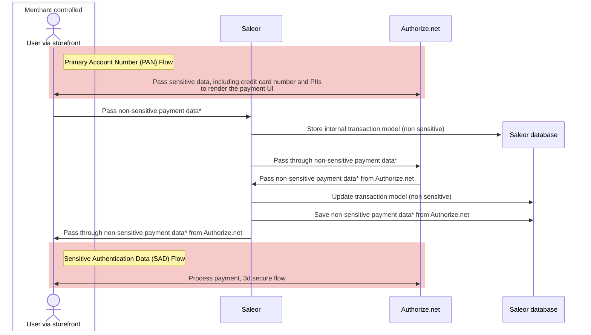

:::warning
This plugin is deprecated!

If you plan on building a new integration with Saleor, we recommend checking [Authorize.net](https://github.com/saleor/examples/tree/main/example-app-authorize.net) example.
:::

## PCI DSS compliance

The following diagram shows the flow of sensitive data between services when using the Authorize.net plugin:

*Passes non-PCI DSS regulated payment information, such as customer email, customer billing address.

For more information about Authorize.net PCI DSS compliance - see their [docs](https://support.authorize.net/knowledgebase/Knowledgearticle/?code=000001339)
