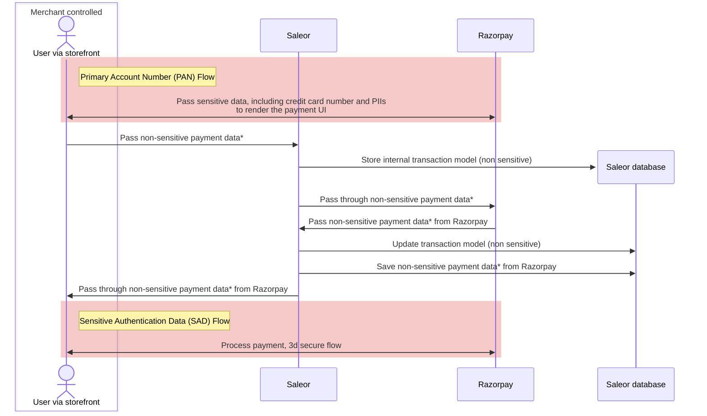

:::warning
This plugin is deprecated!

We are moving towards supporting the most popular payment gateways. For India, we recommend using the [Adyen App](developer/app-store/apps/adyen/overview.mdx) or [Stripe](developer/app-store/apps/stripe/overview.mdx) instead.
:::

## PCI DSS compliance

The following diagram shows the flow of sensitive data between services when using the Razorpay plugin:

*Passes non-PCI DSS regulated payment information, such as payment amount and identifier.

For more information about Razorpay PCI DSS compliance - see their [docs](https://razorpay.com/docs/security/)
