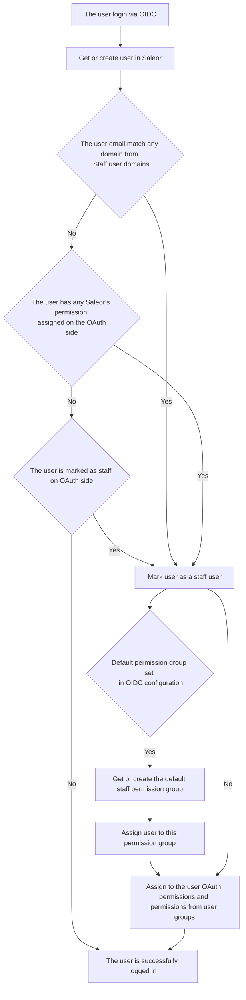

# OpenID Connect Plugin

The OIDC plugin supports two-way of integrations:

- _Saleor as a client for authorization server_ - uses authorization code flow to authorize user.
- _Saleor as a resource server_ - grant access users to Saleor by using the OAuth access token

## Configuration

Go to Configuration -> Plugins -> OpenID Connect and fill in the fields:

- **Client ID:** Your client ID, required to authenticate on the OAuth provider side.
- **Client secret:** Your client secret, required to authenticate on the OAuth provider side.
- **Enable refresh token:** Determine if the refresh token should be also fetched from the provider. By disabling it, users will need to re-login after the access token expired. By enabling it, frontend apps will be able to refresh the access token (Optional for flow: _Saleor as a client for authorization server_).
- **OAuth authorization URL:** Based on the authorization URL, Saleor will generate the redirect URL for the authorization request (Required for flow: _Saleor as a client for authorization server_).
- **OAuth token URL:** The URL used to exchange received OAuth code to the OAuth token (Required for flow: _Saleor as a client for authorization server_).
- **JSON web key set URL:** The JSON Web Key Set (JWKS) is a set of keys containing the public
  keys used to verify any JSON Web Token (JWT) issued by the authorization server (Required for both integration flows).
- **User info URL:** The URL which can be used to fetch user details by using an access token (Required for flow: _Saleor as a resource server_).
- **OAuth logout URL:** The logout URL which Saleor will return for frontend's logout request (Optional for flow: _Saleor as a client for authorization server_).
- **Audience:** The Oauth resource identifier. If provided, Saleor will define the audience for each authorization request. Used to fetch user permissions from OAuth provider and map it to Saleor's permission (Optional for both flows, but required if you use OAuth permissions).
- **Use OAuth scope permissions:** Use OAuth scope permissions to grant a logged-in user access to protected resources. Your OAuth provider needs to have defined Saleor's permission scopes in format \_saleor:&lt;saleor-permission&gt; (Required for both integration flows).
- **Staff user domains:** The domains of the user emails, separated by commas, that should be treated as staff users.
- **Default permission group name for new staff users:** The name of the default permission group to which the new staff user should be assigned to.
  When the provided group doesn't exist, the new group without any permissions and any channels is created.

## Using OAuth permissions in Saleor

If `Use OAuth scope permissions` is enabled, Saleor will request his own permissions as OAuth scopes. Each permission has the prefix `saleor:`. If the user has assigned Saleor's permissions on the OAuth side, Saleor will grant them to the logged-in user.

:::note

Your OAuth provider needs to have an assigned audience with proper Saleor's permissions with prefix `saleor:`.

List of all available permissions can be checked in the [Permissions Enum](/api-reference/users/enums/permission-enum.mdx)

:::

Example:
> _UserA_ has assigned permissions on the OAuth side - `saleor:manage_apps` and `saleor:manage_orders`, _UserB_ has assigned
> permission - `saleor:manage_users`. When _UserA_ logs in to the Saleor using _OpenID Connect_ plugin, the plugin will grant the _UserA_
> permissions to _MANAGE_APPS_ and _MANAGE_ORDERS_. The _UserB_ will have access to resources protected by _MANAGE_USERS_

If a user logs in via OAuth and is a staff member, they will be assigned to the default
permission group if one has been set. The user's permissions will be the sum of the permissions
granted by the OAuth and the Saleor groups to which the user has been assigned.

The user is considered as staff when:

- the user email domain matches any domain from `Staff user domains`,
- the user has any Saleor's permission assigned on the OAuth side,
- the user is marked as staff on OAuth side by `saleor:staff`.

:::important
The data in Saleor is protected by channel permissions. Therefore, to ensure that staff
members logged into Saleor via OAuth have the correct permissions, you should create
a permission group on the Saleor side without channel restrictions.
Set this group as the `default permission group name for new staff users`.
:::

The flow is shown in the chart below:

## Limitations
### Email change
Currently, the OIDC plugin does not support updating a user's email address while retaining the same identity. If the email address is changed at the identity provider, Saleor will treat it as a new account, resulting in the creation of a separate user profile. To maintain order history, addresses, and other associated data, a manual migration is required.