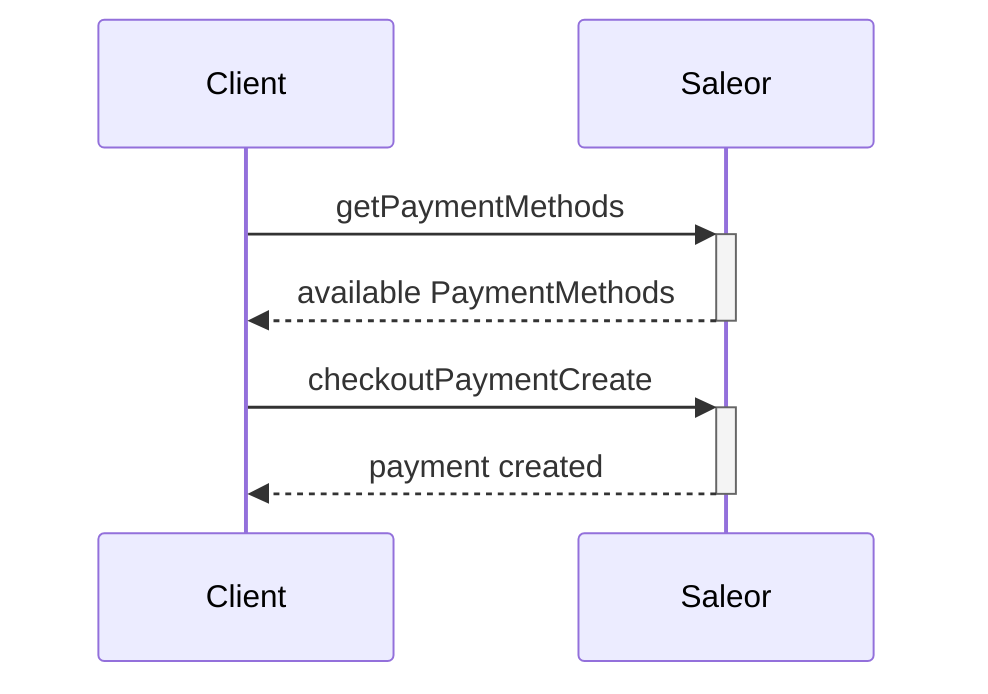
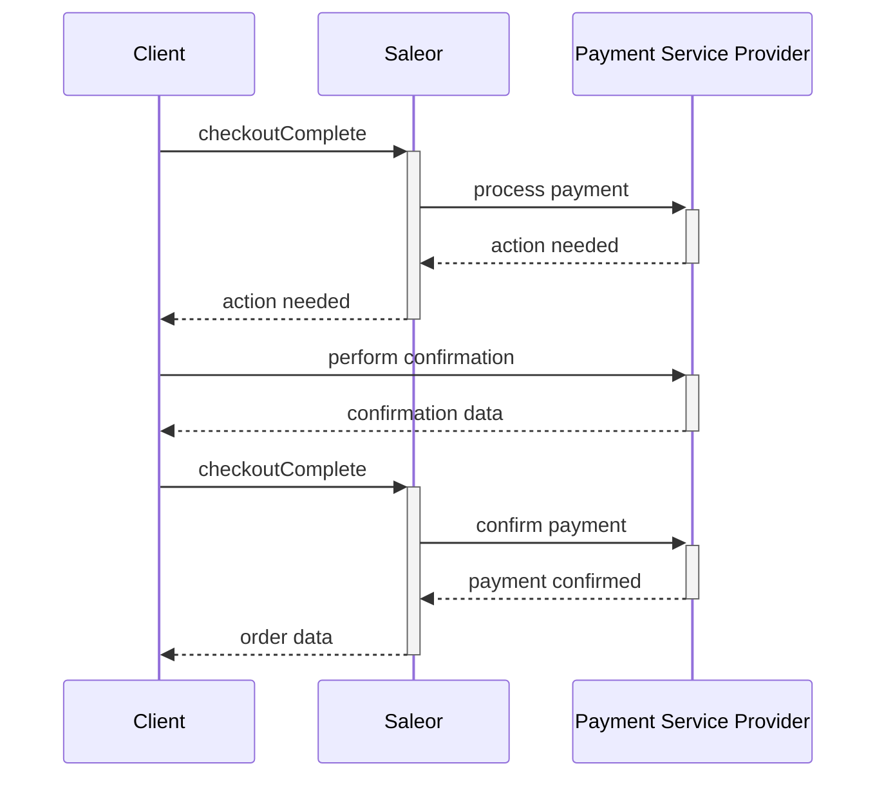

:::warning
Stripe plugin is deprecated and will be removed. Please migrate to the [Stripe App](../apps/stripe/overview.mdx) instead.
:::


:::warning
From June 2025, Stripe is charging an extra fee for using Stripe Secret Key in the connected integrations. To avoid these, you should generate Restricted Key and replace it in the Saleor dashboard or use the App

Your Restricted Key must contain following permissions:
- **Payment Intent:** Write
- **Customers:** Write
- **All Webhook:** Write
- **Charges:** Write

Read more [in Stripe Announcement](https://support.stripe.com/questions/plugin-user-migration-guide)
:::

Stripe plugin uses [custom payment flow](https://stripe.com/docs/payments/accept-a-payment?platform=web&ui=elements) to process customer transactions.

:::note
Saleor uses Stripe API version [2020-08-27](https://stripe.com/docs/upgrades#2020-08-27)
:::

## Configuration

Go to _Configuration_ -> _Plugins_ -> _Stripe_ and fill in the fields:

- **Public API key:** your Stripe public API key. See [Stripe's docs](https://stripe.com/docs/keys#obtain-api-keys)

- **Supported currencies:** your currency as an ISO 4217 3-letter code (eg. `USD`, `EUR`, `GBP`)

- **Automatic payment capture:** If enabled, Saleor will automatically capture funds. If disabled, the funds are blocked but need to be captured manually.

- **Restricted API key:** your Stripe restricted API key. See [Stripe's docs](https://docs.stripe.com/keys#create-restricted-api-secret-key). It should contain following permissions to work:
  - **Payment Intent:** Write
  - **Customers:** Write
  - **All Webhook:** Write
  - **Charges:** Write

:::warning
If enabled, automatic capture happens only on confirmed orders. 
:::

### Activating Stripe webhooks

By activating Stripe integration, Saleor will automatically subscribe to Stripe's webhooks, as a result **Webhook endpoint** field will receive an id of the subscription which allows identifying a webhook on Stripe's dashboard side.

:::note

You need to provide your backend domain in _Site Settings_. Saleor will not subscribe to the Stripe endpoint if you provide `localhost` or `127.0.0.1`. If you want to test it locally, use tools like [ngrok](developer/running-saleor/exposing-instance.mdx#using-ngrok)

:::

## Creating payment in Saleor

To create a payment properly, you need to follow the steps described in
[Creating a checkout session](developer/checkout/overview.mdx) and
[Selecting a shipping method](developer/checkout/address.mdx).

The payment flow would follow these steps:



Available payment gateways can be listed from the `Checkout.availablePaymentGateways` field:

```graphql
query {
  checkout(id: "Q2hlY2tvdXQ6ZTEzZDFjOTItOWJkNi00ODViLTgyMDctZTNhM2I5NjVkZTQw") {
    availablePaymentGateways {
      id
      name
      config {
        field
        value
      }
    }
  }
}
```

Response:

```json
{
  "data": {
    "checkout": {
      "availablePaymentGateways": [
        {
          "id": "mirumee.payments.stripe",
          "name": "Stripe",
          "config": [
            {
              "field": "api_key",
              "value": "pk_test_SkWEusCNFdSgxGGmd23z7JC1FHh3uNufNuX"
            },
            {
              "field": "store_customer_card",
              "value": "false"
            }
          ]
        },
        {
          "id": "mirumee.payments.dummy",
          "name": "Dummy",
          "config": [
            {
              "field": "store_customer_card",
              "value": "false"
            }
          ]
        }
      ]
    }
  }
}
```

```graphql
mutation {
  checkoutPaymentCreate(
    checkoutId: "Q2hlY2tvdXQ6MWZiMmM1OGUtN2JhMy00YmY5LWI2ZDItNWY2ZWJiN2U3ZWJj"
    input: { gateway: "saleor.payments.stripe", amount: 45.61 }
  ) {
    payment {
      id
      chargeStatus
    }
    errors {
      field
      message
    }
  }
}
```

:::note

The provided `amount` in `checkoutPaymentCreate.input` must be equal to `checkout.totalPrice`.

:::

## Completing the checkout

The purpose of the operation is to ensure this checkout is correct. The validation consists of checking:

1. The required addresses are valid.

2. All selected products are in stock (while making the purchase, another user could already buy the last available item), except variants that have disabled stock tracking which can have zero or negative stock.

3. The payment creation succeeded.

4. No additional actions are required by the PSP.

If these are satisfied, the checkout is transformed into an order, and the customer receives a confirmation email.

After we create a payment object for the Stripe payment gateway,
we can call the `checkoutComplete` mutation. The first call of `checkoutComplete` for checkout
creates [Stripe payment intent object](https://stripe.com/docs/api/payment_intents/object).

Optionally, `checkoutComplete` can accept additional parameters for Stripe as fields in `paymentData` input:

- `paymentData.setup_future_usage` - Store payment method in Stripe for [future usage](https://stripe.com/docs/api/payment_intents/object#payment_intent_object-setup_future_usage). **DEPRECATED**: This field will be removed in Saleor 4.0.
- `paymentData.off_session` - When [off_session](https://stripe.com/docs/api/payment_intents/create#create_payment_intent-off_session) is set to True, [confirm](https://stripe.com/docs/api/payment_intents/create#create_payment_intent-confirm)=True will be also attached to request.
- `paymentData.payment_method_id` - [ID of the payment method](https://stripe.com/docs/api/payment_intents/create#create_payment_intent-payment_method) which should be used for this payment.
- `paymentData.payment_method_types` - [List of payment method types that should be supported by this payment](https://stripe.com/docs/api/payment_intents/create#create_payment_intent-payment_method_types). Default: `["card"]`

:::note
`paymentData.payment_method_types` - accepts all standard payment method types which use standard PaymentIntent flow to process a payment. [For more details check Stripe docs.](https://stripe.com/docs/payments/payment-methods/overview)
:::

```graphql
mutation {
  checkoutComplete(
    checkoutId: "Q2hlY2tvdXQ6YjBhYTUzMWItYjc3NS00MzM3LTkxNzEtYTgzOTYwYThjMmVk"
  ) {
    order {
      id
      userEmail
      created
    }
    confirmationNeeded
    confirmationData
    errors {
      field
      message
      code
    }
  }
}
```

As a result, we get details required to finalize a payment.

```json
{
  "data": {
    "checkoutComplete": {
      "order": null,
      "confirmationNeeded": true,
      "confirmationData": "{\"client_secret\": \"pi_1J2Yh3H1Vac4G4dbfuBvQhTe_secret_DkwP8jcdenirqazGpjPvSaPtV\", \"id\": \"pi_1J2Yh3H1Vac4G4dbfuBvQhTe\"}",
      "checkoutErrors": []
    }
  }
}
```

`client_secret` is required to process a customer payment.
Steps required to finalize a payment transaction are described in [Stripe documentation](https://stripe.com/docs/payments/accept-a-payment?platform=web&ui=elements).

:::warning
If your checkout is transformed into an order during this step, please make sure that in a given channel, [`allowUnpaidOrders`](api-reference/miscellaneous/objects/order-settings.mdx#ordersettingsallowunpaidordersboolean---) setting is turned off.
This setting is only compatible with Transaction API and will not work with the Stripe Plugin.
:::

### Finalizing a payment

When the customer finalizes a payment, Stripe sends a webhook notification with all details
related to this payment. Saleor asynchronously receives the notification and
completes checkout process.

On client-side, when `stripe.confirmCardPayment` doesn't return an error as
[described here](https://stripe.com/docs/payments/accept-a-payment?platform=web&ui=elements#web-submit-payment),
client-side can call `checkoutComplete` one more time.
Saleor confirms that the payment has success status and returns an order object.

```graphql
mutation {
  checkoutComplete(
    checkoutId: "Q2hlY2tvdXQ6YjBhYTUzMWItYjc3NS00MzM3LTkxNzEtYTgzOTYwYThjMmVk"
  ) {
    order {
      id
      userEmail
      created
    }
    confirmationNeeded
    confirmationData
    errors {
      field
      message
      code
    }
  }
}
```

As a result we get order object.

```json
{
  "data": {
    "checkoutComplete": {
      "order": {
        "id": "T3JkZXI6MjI0Mw==",
        "userEmail": "m...@saleor.io",
        "created": "2021-06-04T09:24:44.552881+00:00"
      },
      "confirmationNeeded": false,
      "confirmationData": "{}",
      "checkoutErrors": []
    }
  }
}
```

### Payment requiring additional action



An example of additional action is 3D Secure confirmation required by payment providers.

An example of a complete mutation where the payment gateway requires additional steps from the user:

```graphql {2-5}
mutation{
  checkoutComplete(
    id: "Q2hlY2tvdXQ6ZTEzZDFjOTItOWJkNi00ODViLTgyMDctZTNhM2I5NjVkZTQw",
    paymentData: "{\"encryptedAdditionalAction\": \"eka...\"}"
){
     confirmationNeeded
     confirmationData
     order
     errors{
       field
       message
       code
     }
}
```

A response would look like this:

```json
{
  "data": {
    "checkoutComplete": {
      "order": null,
      "confirmationNeeded": true,
      "confirmationData": "{\"paymentData\":\"Ab02b4c...\", \"paymentMethodType\":\"scheme\", \"token\":\"eyJ0aHJlZURTTWV0aG9kTm9...\", \"type\":\"threeDS2Fingerprint\"}",
      "errors": []
    }
  }
}
```

:::caution

When any error is raised during the checkout completion or the payment
will become inactive, processed payment will be refunded or voided (in case the payment wasn't charged yet).

Here are the example scenarios that may end up with payment refunding:

- the shipping method became invalid
- the checkout is not fully paid
- some products became unavailable od there is not enough stock of them
- the processed payment became inactive

:::

:::note

To create an order, the payment must cover the order total. However, we do not verify if an overpayment occurs.
In such cases, the order will still be created, and the excess amount must be handled manually.

:::

## Saving card in Stripe for future payments

Use `input.storePaymentMethod` to store payment method for future payments with `checkoutPaymentCreate`.
Metadata in `input.metadata` will be stored with the payment

```graphql
mutation {
  checkoutPaymentCreate(
    checkoutId: "ID"
    input: {
      gateway: "saleor.payments.stripe"
      token: "tokencc_bh_s3bjkh_24smq8_6c6zhq_w4v6b9_8vz"
      amount: 33.33
      storePaymentMethod: OFF_SESSION
      metadata: [{ key: "key", value: "value" }]
    }
  ) {
    payment {
      id
      chargeStatus
    }
    errors {
      field
      message
    }
  }
}
```

## Using stored payment method

Use `paymentData.payment_method_id` and `paymentData.off_session` to use stored payment method.
You can retrieve

```graphql
mutation {
  checkoutComplete(
    checkoutId: "ID"
    storeSource: true
    paymentData: "{\"payment_method_id\": \"pm_id\", \"off_session\": false}"
  ) {
    order {
      id
      userEmail
      created
    }
    confirmationNeeded
    confirmationData
    errors {
      field
      message
      code
    }
  }
}
```

## Stripe webhooks

`ENABLE_SSL` variable should be set to True in case of using the Stripe plugin in production. Without the SSL, Stripe will not allow to create the webhook.

By activating a plugin, Saleor automatically subscribes the following Stripe webhook events:

- `payment_intent.succeeded`
- `payment_intent.processing`
- `payment_intent.payment_failed`
- `payment_intent.amount_capturable_updated`
- `payment_intent.canceled`
- `charge.refunded`

## PCI DSS compliance

The following diagram shows the flow of sensitive data between services when using the Stripe plugin:

```mermaid
sequenceDiagram
    box Merchant controlled
    actor User via storefront
    end
    participant Saleor
    participant Stripe

    rect rgba(240,150,150,0.5)
        note right of User via storefront: Primary Account Number (PAN) Flow
        User via storefront <<->> Stripe: Pass sensitive data, including credit card number and PIIs<br/>to render the payment UI
    end

    User via storefront ->> Saleor: Pass non-sensitive payment data*
    create participant Saleor database
    Saleor ->> Saleor database: Store internal transaction model (non sensitive)
    Saleor ->> Stripe: Pass through non-sensitive payment data*

    Stripe ->> Saleor: Pass non-sensitive payment data* with client secret from Stripe
    Saleor ->> Saleor database: Update transaction model (non sensitive)
    Saleor ->> Saleor database: Save non-sensitive payment data* without client secret from Stripe
    Saleor ->> User via storefront: Pass through non-sensitive payment data* with client secret from Stripe

    rect rgba(240,150,150,0.5)
        note right of User via storefront: Sensitive Authentication Data (SAD) Flow
        User via storefront <<->> Stripe: Process payment, 3d secure flow
    end
  ```


*Passes non-PCI DSS regulated payment information, such as payment method type, payment method id, information if Saleor should reuse payment method and if Saleor should store payment method for [future usage](https://docs.stripe.com/payments/payment-intents#future-usage).

For more information about Stripe PCI DSS compliance - see their [docs](https://docs.stripe.com/security).
