## Key Concepts

The OpenID Connect plugin allows you to integrate with your OAuth provider. 
This will allow you to move the authentication process to an external provider.

Saleor will require the scopes:
 - openid
 - profile
 - email
 - offline\_access - _optionally, when you enable refreshing the token_
 - saleor:_permission_ - _optionally when you enable mapping OAuth permissions to Saleor_

## Type of integration

The OIDC plugin supports two ways of integration:
 - Saleor as a client for authorization server - Saleor follows Authorization Code Flow to authenticate the user.
 - Saleor as a resource server - requests are authenticated with OAuth access token provided in `Authorization` header.

## Saleor as a client for authorization server

### Configuration

To use this flow you, need to configure the plugin by providing values for `JSON Web Key Set URL`, `OAuth Token URL` and `OAuth Authorization URL` on the Saleor Dashboard. 

### Generating authentication URL

#### Workflow


Executing [`externalAuthenticationUrl`](developer/api-reference/mutations/external-authentication-url.mdx) mutation will prepare special URL which will redirect user to requested page after successfull authentication. After redirection `state` and `code` fields will be added to the URL. [`externalObtainAccessTokens`](developer/api-reference/mutations/external-obtain-access-tokens.mdx) will require both.

#### Mutation
The mutation takes the following input fields:
- `pluginId`: the ID of the authentication plugin
- `input` [`JSONString`](developer/api-reference/scalars/json-string.mdx)
    - `redirectUrl`: the URL where the user should be redirected after successful authentication

```graphql
mutation{
  externalAuthenticationUrl(
    pluginId:"mirumee.authentication.openidconnect", 
    input:"{\"redirectUri\":\"http://127.0.0.1:3001/callback\"}"
  ){
    authenticationData
    accountErrors{
      field
      message
    }
  }
}
```

A successful response:

```json
{
  "data": {
    "externalAuthenticationUrl": {
      "authenticationData": "{\"authorizationUrl\": \"https://saleor-test.eu.auth0.com/authorize?response_type=code&client_id=RUgv72Cvzd5xjlMtgOEQLJ8QF4eQ3e1U&redirect_uri=http%3A%2F%2F127.0.0.1%3A3000%2Fcallback&scope=openid+profile+email+offline_access&state=eyJyZWRpcmVjdFVyaSI6Imh0dHA6Ly8xMjcuMC4wLjE6MzAwMC9jYWxsYmFjayJ9%3A1l1W9H%3AFsxnhejCQKB4JdFL-t0BqNPrHtODh9T0mG2E3KzT-bQ\"}",
      "accountErrors": []
    }
  }
}
```

### Obtaining access token

#### Workflow


#### Mutation
The [`externalObtainAccessTokens`](developer/api-reference/mutations/external-obtain-access-tokens.mdx) mutation will generate requested access tokens. The mutation takes the following input fields:
- `pluginId`: the ID of the authentication plugin
- `input`: [`JSONString`](developer/api-reference/scalars/json-string.mdx)
    - `code`: the authorization code received from the OAuth provider
    - `state`: the state value received from the OAuth provider


```graphql
mutation{
  externalObtainAccessTokens(
    pluginId:"mirumee.authentication.openidconnect", 
    input:"{\"code\": \"uLBlqQwnmKTIDLJ3\", \"state\": \"eyJyZWRpcmVjdFVyaSI6Imh0dHA6Ly8xMjcuMC4wLjE6MzAwMC9jYWxsYmFjayJ9:1l1lXU:93CE6SScisZNX4T93_7VM-JGlUDZa_EflH4RSUAtc-E\"}"
  ){
    token
    refreshToken
    csrfToken
    user{
      id
      email
    }
    accountErrors{
      field
      code
      message
    }
  }
}
```

A successful response:
```json
{
  "data": {
    "externalObtainAccessTokens": {
      "token": "eyJ0eXAiOiJKV1QiL....SzVVNO6oTVMCTbpgFhqo-yRzsq0Q5ZK2GVn3R_KTjmc",
      "refreshToken": "eyJ0eXAiOiJKV1QiLCJ...bi5vcGVuaWRjb25uZWN0In0.o_ZDrQYOImCg1ne7pJKdKB-DNyuW6OKkjNwP05lyPNw",
      "csrfToken": "qRLs15tbipqOfZuFs8kQYzpj927vfhBPqWj4jg0Uc9D1WPPpUbw2jEP1R7p7gVL4",
      "user": {
        "id": "VXNlcjoyNA==",
        "email": "saleor.user@saleor.io"
      },
      "accountErrors": []
    }
  }
}
```

### Refreshing token

#### Workflow



```mermaid
sequenceDiagram
  Web ->>+ Saleor: ExternalRefresh mutation with<br> refreshToken and CSRF token as input ¹
  Saleor ->>+ OpenIDConnectPlugin: call <br>PluginManager.external_refresh
  OpenIDConnectPlugin ->> OpenIDConnectPlugin: validate CSRF and <br>refresh token structure
  OpenIDConnectPlugin ->>+ OAuthProvider: refresh tokens
  OAuthProvider -->>- OpenIDConnectPlugin: new tokens
  OpenIDConnectPlugin ->> OpenIDConnectPlugin: create new internal tokens
  OpenIDConnectPlugin -->>- Saleor: new tokens
  Saleor ->>- Web: return access_token<br> and refresh_token
```

> ¹ refresh token can also be passed as a cookie named `refreshToken`

#### Mutation

The [`externalRefresh`](developer/api-reference/mutations/external-refresh.mdx) mutation will generate new access tokens when provided with a valid refresh token. 
If the refresh token is not provided as an argument, the plugin will try to read it from a cookie set by the [`tokenCreate`](developer/api-reference/mutations/token-create.mdx) mutation. In that case, a matching CSRF token is required.

The mutation takes the following input fields:
- `pluginId`: the ID of the authentication plugin
- `input`: [`JSONString`](developer/api-reference/scalars/json-string.mdx)
    - `refreshToken`: the refresh token which should be used to refresh the access tokens
    - `csrfToken`: required when `refreshToken` is not provided as an input


```graphql
mutation{
  externalRefresh(
    pluginId:"mirumee.authentication.openidconnect", 
    input:"{\"refreshToken\": \"ABCDE\"}"
  ){
    token
    refreshToken
    csrfToken
    accountErrors{
      field
      message
      code
    }
  }
}
```

A successful response:
```json
{
  "data": {
    "externalRefresh": {
      "token": "eyJ0eXAiOiJKV1QiLCJhbGci....-pk-qCvbJ1M7tqSzP0",
      "refreshToken": "eyJ0eXAiOiJKV1QiLCJhbGciOiJIU...sBboyMFcWTIe92NcWlqEI9AYlJL6o",
      "csrfToken": "Ejdvo8PTLG0M9YAGHCnBvyldmDrd6SjmhfQDWBIaCymZzW8eRUAL4sz4Cx91q0yR",
      "accountErrors": []
    }
  }
}
```

### Token verification
#### Mutation
To verify the token, use the following [`externalVerify`](developer/api-reference/mutations/external-verify.mdx) mutation.

The mutation takes the following input fields:
- `pluginId`: the ID of the authentication plugin
- `input`: [`JSONString`](developer/api-reference/scalars/json-string.mdx)
    - `refreshToken`: the refresh token which should be used to refresh the access token
    - `csrfToken`: required when `refreshToken` is not provided as an input

```graphql
mutation{
  externalVerify(
    pluginId:"mirumee.authentication.openidconnect", 
    input:"{\"token\": \"eyJ0eXAiOiJK...J1M7tqSzP0\"}"
  ){
    isValid
    verifyData
    user{
      userPermissions{
        code
        name
      }
    }
  }
}
```

A successful response:
```json
{
  "data": {
    "externalVerify": {
      "isValid": true,
      "verifyData": "{\"iat\": 1602143144, \"token\": \"xgS4ZELKlUHQ\", \"email\": \"admin@example.com\", \"type\": \"access\", \"user_id\": \"VXNlcjoyNQ==\", \"is_staff\": false, \"exp\": 1602179144, \"oauth_access_key\": \"tM-LHXMbxP5IANhPUd24_y5jjv0SCSj2\", \"owner\": \"mirumee.authentication.openidconnect\"}",
      "user": {
        "email": "admin@example.com",
        "userPermissions": []
      },
      "accountErrors": []
    }
  }
}
```
#### Workflow


### Logout

#### Workflow


You can prepare the logout URL by calling [`externalLogout`](developer/api-reference/mutations/external-logout.mdx) mutation. 
All values passed in field `input` will be added as GET parameters to the logout request.

- `pluginId`: the ID of the authentication plugin
- `input`: [`JSONString`](developer/api-reference/scalars/json-string.mdx)
    - `returnTo`: the URL where a user should be redirected

#### Mutation
```graphql
mutation {
  externalLogout(
    pluginId:"mirumee.authentication.openidconnect", 
    input:"{\"returnTo\": \"http://localhost:3001\"}"
  ){
    logoutData
    accountErrors{
      field
      message
      code
    }
  }
}
```
A successful response:
```json
{
  "data": {
    "externalLogout": {
      "logoutData": "{\"logoutUrl\": \"https://saleor-test.eu.auth0.com/v2/logout?returnTo=http%3A%2F%2Flocalhost%3A3000\"}",
      "accountErrors": []
    }
  }
}
```

## Saleor as a resource server

In resource server flow, Saleor API only verifies if the token included in the request is valid. Operations like login, logout or token refresh have to be handled directly by auth provider API.

The authorization header has the following format:

`Authorization: Bearer <your-OAuth-access-token>`

### Configuration
To use this flow you need to provide values for `JSON Web Key Set URL` and `User info URL` on 
the Saleor Dashboard side.

### Access token permissions
When [OAuth permissions](dashboard/configuration/plugins/oidc.md#using-oauth-permissions-in-saleor) are enabled, 
Saleor will try to fetch [own's permissions](developer/available-plugins/openid-connect.mdx#oauth-permissions) from `access_token.scope`. In case when token's `scope` doesn't have any Saleor's permissions, 
it will try to find permissions in `access_token.permissions`.

## User authentication flow


## OAuth permissions
Saleor can use OAuth permissions assigned to a user. It maps internal permissions to OAuth scopes and attaches it to the authorization request.


### OAuth permission scopes
| OAuth scope name                                | Saleor Name                          | Description                                                                                                                      |
| ----------------------------------------------- | ------------------------------------ | -------------------------------------------------------------------------------------------------------------------------------- |
| saleor:manage_apps                              | MANAGE_APPS                          | Manage apps                                                                                                                      |
| saleor:manage_channels                          | MANAGE_CHANNELS                      | Manage Saleor's channels                                                                                                         |
| saleor:manage_checkouts                         | MANAGE_CHECKOUTS                     | Manage checkout                                                                                                                  |
| saleor:manage_discounts                         | MANAGE_DISCOUNTS                     | Manage discounts                                                                                                                 |
| saleor:manage_gift_card                         | MANAGE_GIFT_CARD                     | Manage gift cards                                                                                                                |
| saleor:manage_menus                             | MANAGE_MENUS                         | Manage the structure of menus                                                                                                    |
| saleor:manage_orders                            | MANAGE_ORDERS                        | Access to orders data                                                                                                            |
| saleor:manage_pages                             | MANAGE_PAGES                         | Manage pages                                                                                                                     |
| saleor:manage_page_types_and_attributes         | MANAGE_PAGE_TYPES_AND_ATTRIBUTES     | Manage page types and attributes                                                                                              |
| saleor:manage_plugins                           | MANAGE_PLUGINS                       | Manage plugins                                                                                                                   |
| saleor:manage_products                           | MANAGE_PRODUCTS                      | Manage products                                                                                                                  |
| saleor:manage_product_types_and_attributes      | MANAGE_PRODUCT_TYPES_AND_ATTRIBUTES  | Manage products and attributes                                                                                              |
| saleor:manage_settings                          | MANAGE_SETTINGS                      | Manage shop settings                                                                                                             |
| saleor:manage_shipping                          | MANAGE_SHIPPING                      | Manage shipping                                                                                                                  |
| saleor:manage_staff                             | MANAGE_STAFF                         | Access to staff users data                                                                                                       |
| saleor:manage_translations                      | MANAGE_TRANSLATIONS                  | Manage tranlsations                                                                                                              |
| saleor:manage_users                             | MANAGE_USERS                         | Access to customers data                                                                                                         |
| saleor:staff                                    |   -                                  | User is marked as a staff user                                                                                                   |


If _Use OAuth scope permissions_ is enabled, any permissions granted to a user on the 
authentication provider side will be used as the effective permissions on the Saleor side. 
Please see the documentation of your authentication server to see how to manage permissions 
and how to configure role-based access control (RBAC).

:::note

Before enabling this feature, make sure that your OAuth provider has enabled role-based access control (RBAC).

:::

# External links

- [Official OAuth2 standard documentation](https://oauth.net/2/)
- [Auth0 provider documentation](https://auth0.com/docs/)
