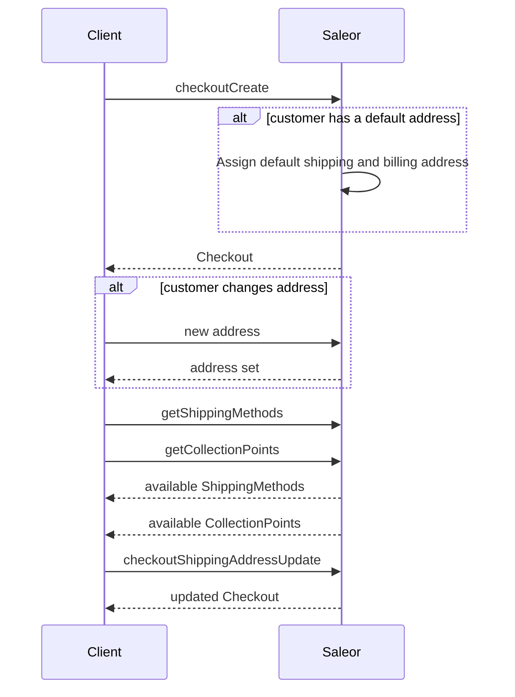
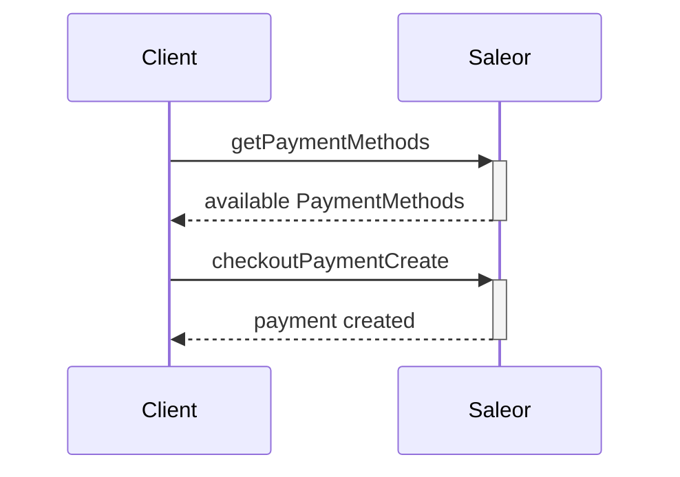
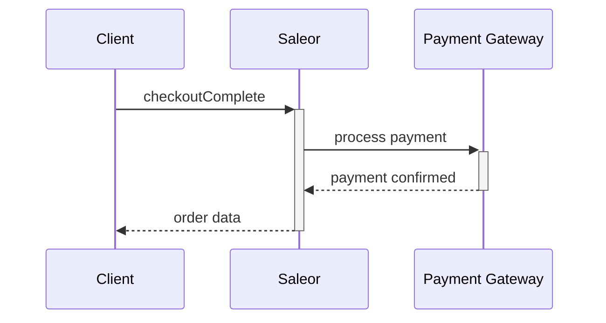
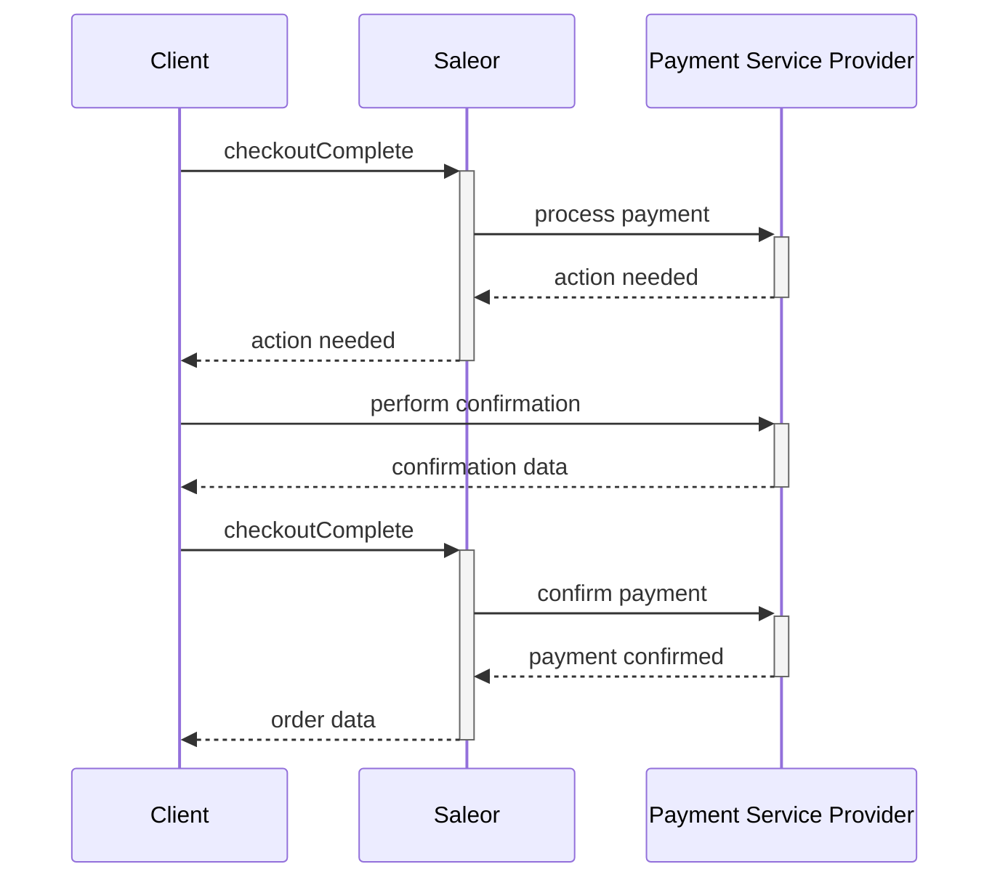

## Introduction

The below process describes the key milestones in the checkout process flow in Saleor. There are also additional steps that may occur along the way; however, the purpose of this instruction is to deliver a base reference for the user to work with. We assume that at this stage, you have already completed the steps included in the [Getting Started](getting-started/graphql.mdx) section of this chapter and that you are familiar with the basic setup of the Saleor GraphQL API.

The code snippets included in this section may be run in [Playground](getting-started/graphql) or your preferred HTTP client.

### Why is there no cart model?

Saleor has no separated object type for shopping carts and baskets. We wanted the same features—like discounts, vouchers, address-specific taxes, and shipping estimates—to be available in the cart and the checkout, so we've decided to use the same object type for both.
Checkout provides the interface for usual cart operations like adding products or promo codes. It can also be completed in almost any order, for example, saving a billing address before adding any items. 

### Glossary

- **Checkout**: an object which groups all the data needed for the checkout process and creating an order.
- **Checkout Line**: items added to the checkout with quantity data. Each added variant has a separate line.
- **Checkout Completion**: during this step, payments are processed and stocks reserved. If requirements are met, the order is created.
- **Payment Method**: a payment provider. E.g., Stripe, Adyen.
- **Payments**: this object contains status and additional data about payment.
- **Shipping Methods**: the way orders will be sent. E.g., DHL courier, postal service.
- **Collection Points**: places, where orders can be self-picked.
- **Delivery Methods**: set, which is an union of shipping methods and collection points.

## Multiple channels and checkout

Depending on the chosen channel, the user will have access to different objects. This will impact available:
- Products and Product Variants
- Payment Methods
- Shipping Methods
- Collection Points
- Discounts

[Learn more about using multiple channels](developer/channels.mdx).

## Permissions

If the checkout permission is assigned to the user, only this user and staff users with permission `MANAGE_CHECKOUTS` can query its data. Checkouts without assigned users can be queried modified using the token without additional permissions.

## Creating a checkout session

:::note
A [`Checkout`](developer/api-reference/objects/checkout.mdx) object can be created for logged in users and for anonymous (guest) users.

- If you use the [`checkoutCreate`](developer/api-reference/mutations/checkout-create.mdx) mutation including the authentication token, this checkout is assigned to the user who is authenticated by this token. For more information on how to authenticate with our API, see the [Authentication](users.mdx#authentication) topic.

- If no authentication token is provided, the checkout is created for an anonymous user,
and an email address is used to identify such a [`Checkout`](developer/api-reference/objects/checkout.mdx) object,
linking it with the anonymous user.
User email is not required at this stage but must be set before adding promo code, creating a payment, and checkout completing.
:::

To create a [`Checkout`](developer/api-reference/objects/checkout.mdx) object, use the [`checkoutCreate`](developer/api-reference/mutations/checkout-create.mdx) mutation.

This mutation takes the following [input](developer/api-reference/inputs/checkout-create-input.mdx):

- `channel`: Slug of a channel in which to create checkout.
- `email`: the user's email address.
- `shippingAddress`: the shipping address (if needed).
- `billingAddress`: the billing address.
- `lines`: a list of checkout lines, each checkout line contains a product variant ID and its quantity.

As a result, this mutation returns the following fields:

The resulting [`Checkout`](developer/api-reference/objects/checkout.mdx) object contains the following fields:

- `id`: a unique checkout ID.
- `token`: similar to `id`, a unique identifier suitable for inclusion in emails and URLs, required by most checkout operations.
- `totalPrice`: the total price of the checkout lines and shipping costs.
- `isShippingRequired`: denotes whether shipping is required for this checkout.
- `availablePaymentGateways`: a list of payment gateways that are currently configured on your Saleor server and can be used to pay for the checkout. Only gateways which support the checkout currency are returned. For each gateway, API returns an ID, a name, and a config object, which for some gateways may return additional information required to process the payment in the frontend.
- `shippingMethods`: a list of all shipping methods for this checkout. If the items in the cart require shipment.
- `availableCollectionPoints`: a list of available places of self-pickup. It is calculated based on the given country and available Stocks (for Warehouses which `clickAndCollectOption` field is not set to `DISABLED`). For further Click & Collect feature explanation see [Warehouse settings](dashboard/configuration/warehouses.mdx#clickcollect-related-settings).

In addition the following fields are available on the mutation results:

- `created`: a boolean flag indicating whether a new checkout object was created, or an existing one was used.
- `errors`: a list of errors that occurred during mutation execution.

The following example shows how the [`checkoutCreate`](developer/api-reference/mutations/checkout-create.mdx) mutation creates the [`Checkout`](developer/api-reference/objects/checkout.mdx) object and returns the checkout information:

```graphql {2-25}
mutation {
  checkoutCreate(
    input: {
      channel: "default-channel",
      email: "customer@example.com"
      lines: [{ quantity: 1, variantId: "UHJvZHVjdFZhcmlhbnQ6Mjk3" }]
      shippingAddress: {
        firstName: "John"
        lastName: "Doe"
        streetAddress1: "1470  Pinewood Avenue"
        city: "Michigan"
        postalCode: "49855"
        country: US
        countryArea: "MI"
      }
      billingAddress: {
        firstName: "John"
        lastName: "Doe"
        streetAddress1: "1470  Pinewood Avenue"
        city: "Michigan"
        postalCode: "49855"
        country: US
        countryArea: "MI"
      }
    }
  ) {
    checkout {
      id
      token
      totalPrice {
        gross {
          amount
          currency
        }
      }
      isShippingRequired
      shippingMethods {
        id
        name
        active
        message
      }
      availableCollectionPoints {
        id
        name
        clickAndCollectOption
      }
      availablePaymentGateways {
        id
        name
        config {
          field
          value
        }
      }
    }
    errors {
      field
      code
    }
  }
}
```

We get a newly created checkout object for which we return the ID, token, total price, and list of available shipping and payment methods:

```json
{
  "data": {
    "checkoutCreate": {
      "checkout": {
        "id": "Q2hlY2tvdXQ6ZmE5ZjBkMjYtMWM3NC00MDgyLTk3MzktYTIxOGE2NzVjMDZk",
        "token": "4b22fbc0-b095-4937-a08e-bd18d04c951a",
        "totalPrice": {
          "gross": {
            "amount": 20,
            "currency": "USD"
          }
        },
        "isShippingRequired": true,
        "shippingMethods": [
          {
            "id": "U2hpcHBpbmdNZXRob2Q6MTM=",
            "name": "UPS",
            "active": true,
            "message": ""
          },
          {
            "id": "U2hpcHBpbmdNZXRob2Q6MTI=",
            "name": "DHL",
            "active": false,
            "message": "Not available."
          }
        ],
        "availableCollectionPoints": [
          {
            "id": "V2FyZWhvdXNlOjU0NjliNWQ3LThmOGUtNGVmOS1iMGQxLWNhYWZmYTg4MjI1OQ==",
            "name": "Local Store"
            "clickAndCollectOption": "LOCAL"
          },
          {
            "id": "=V2FyZWhvdXNlOjU0NjliNWQ3LThmOGUtNGVmOS1iMGQxLWNhYWZmYTg4MjI1OA==",
            "name": "Company HQ"
            "clickAndCollectOption": "ALL"
          }
        ],
        "availablePaymentGateways": [
          {
            "id": "mirumee.payments.braintree",
            "name": "Braintree",
            "config": [
              {
                "field": "store_customer_card",
                "value": "false"
              },
              {
                "field": "client_token",
                "value": "example_token_value"
              }
            ]
          }
        ]
      },
      "errors": []
    }
  }
}
```

## Managing items

### Adding a product to checkout

To add an item to the cart, use [`checkoutLinesAdd`](developer/api-reference/mutations/checkout-lines-add.mdx). Total prices will be updated automatically:

```graphql {4}
mutation {
  checkoutLinesAdd(
    token: "4b22fbc0-b095-4937-a08e-bd18d04c951a",
    lines: [{ quantity: 1, variantId: "UHJvZHVjdFZhcmlhbnQ6Mjc0" }]
  ) {
    checkout {
      lines{
        id
        variant{
          name
        }
        quantity
      }
      totalPrice {
        gross {
          currency
          amount
        }
      }
    }
  }
}
```

The response contains the updated checkout object:
```json {16-17}
{
  "data": {
    "checkoutLinesAdd": {
      "checkout": {
        "lines": [
          {
            "id": "Q2hlY2tvdXRMaW5lOjI1Mw=="
            "variant": {
              "name": "XL"
            },
            "quantity": 1
          }
        ],
        "totalPrice": {
          "gross": {
            "currency": "USD",
            "amount": 5
          }
        }
      }
    }
  }
}
```

If the variant is already added to the checkout, Saleor will increase the corresponding line's quantity. Running the previous mutation twice will result in a checkout object with one line and the amount set to 2:
```json {11}
{
  "data": {
    "checkoutLinesAdd": {
      "checkout": {
        "lines": [
          {
            "id": "Q2hlY2tvdXRMaW5lOjI1Mw=="
            "variant": {
              "name": "XL"
            },
            "quantity": 2
          }
        ],
        "totalPrice": {
          "gross": {
            "currency": "USD",
            "amount": 10
          }
        }
      }
    }
  }
}
```

### Changing the line quantity

To modify line quantity, use [checkoutLinesUpdate](developer/api-reference/mutations/checkout-lines-update.mdx):

```graphql {4}
mutation {
  checkoutLinesUpdate(
    token: "4b22fbc0-b095-4937-a08e-bd18d04c951a"
    lines: [{ quantity: 12, variantId: "UHJvZHVjdFZhcmlhbnQ6MTcy" }]
  ){
    checkout{
      lines{
        id
        variant{
          id
        }
        quantity
      }
    }
    errors{
      field
      message
    }
  }
}
```

```json {11}
{
  "data": {
    "checkoutLinesUpdate": {
      "checkout": {
        "lines": [
          {
            "id": "Q2hlY2tvdXRMaW5lOjI1NA==",
            "variant": {
              "id": "UHJvZHVjdFZhcmlhbnQ6MTcy"
            },
            "quantity": 12
          }
        ]
      },
      "errors": []
    }
  }
}
```

If the quantity is changed to 0, API will remove this line from checkout.

### Removing items from checkout

Running the [checkoutLineDelete](developer/api-reference/mutations/checkout-line-delete.mdx) mutation will remove the whole line, no matter the quantity:

```graphql
mutation {
  checkoutLineDelete(
    token: "4b22fbc0-b095-4937-a08e-bd18d04c951a"
    lineId: "Q2hlY2tvdXRMaW5lOjI1Mw=="
  ){
    checkout{
      lines{
        id
        variant{
          id
        }
        quantity
      }
    }
    errors{
      field
      message
    }
  }
}
```

```json
{
  "data": {
    "checkoutLineDelete": {
      "checkout": {
        "lines": []
      },
      "errors": []
    }
  }
}
```

## Stock reservations

While stock availability is checked on every step of the checkout process no guarantee is made to the client that stock will not be sold out before checkout completion. In case when item with limited stock was added to multiple checkouts, it will be allocated to first completed checkout causing remaining checkouts to fail to advance to the next step even if they were created before the completed one, with the `INSUFFICIENT_STOCK` error being returned by the API.

Saleor implements optional stock reservations feature where stock will be eagerly allocated to the checkout for configured time.

### Enabling reservations

To enable reservations, navigate to "Site settings" page in the dashboard. Here, in the "Checkout Configuration" section you'll find controls allowing you to enable stock reservations for authenticated and anonymous checkouts.

To disable stock reservations, clear both controls.

### Mechanism of action

If user A adds last two items to their checkout, those two items will become purchaseable only by them for given time.

Those two items will also be subtracted from the available quantity displayed to other users on store, giving them immediate feedback that item they are interested in is currently not available, preventing them from adding this item to their own checkouts.

If user A completes their checkout within given time, temporary allocation will be converted into permanent one. But if they don't complete their stock within the time limit, their stock reservation will expire and the two items in their checkout will become available for other users to add to their own checkouts. 

If no other user will add this item to their checkout user A will still be able to complete their checkout. But if other user adds one or two items to their checkout, new reservation will be created for them, reducing quantity available to other users and preventing user A from completing their checkout.

### Testing checkout for reservations

`Checkout` type in GraphQL API has `stockReservationExpires` field which returns datetime of stock reservation expiration in ISO-8601 format or `null` when checkout has no active reservations.


## Shipping
This step is only used if purchased items require shipping (if they are physical products). The user must select a specific shipping method to create shipping for this checkout. To signify whether shipping is required, use the `isShippingRequired` field in the [`Checkout`](developer/api-reference/objects/checkout.mdx) object.



### Adding address data

Address can be assigned using the [`checkoutShippingAddressUpdate`](developer/api-reference/mutations/checkout-shipping-address-update.mdx) mutation:

```graphql
mutation {
  checkoutShippingAddressUpdate(
    shippingAddress: {
      country: PL
      firstName: "John"
      lastName: "Smith"
      streetAddress1: "ul. Tęczowa 7"
      postalCode: "53-030"
      city: "Wroclaw"
    }
    token: "58f4ca17-9c6f-437b-8204-beb47bbee364"
  ) {
    checkout {
      shippingAddress {
        firstName
        lastName
        streetAddress1
        city
        postalCode
      }
    }
    errors {
      field
      message
      code
    }
  }
}
```

Successful response: 
```json
{
  "data": {
    "checkoutShippingAddressUpdate": {
      "checkout": {
        "shippingAddress": {
          "firstName": "John",
          "lastName": "Smith",
          "streetAddress1": "ul. Tęczowa 7",
          "city": "WROCLAW",
          "postalCode": "53-030"
        }
      },
      "errors": []
    }
  }
}
```

More information about address validation can be found on the [address validation](developer/address.mdx) page.

#### Default address

Customers with accounts can set up default addresses, which will be attached automatically during the checkout creation. More information on API reference page for [accountSetDefaultAddress](developer/api-reference/mutations/account-set-default-address.mdx).

### Listing available shipping methods
After choosing the shipping address, API can be queried for available delivery methods in the user area:

```graphql
query {
  checkout(token: "853ca234-b113-4021-8434-b37087d652a1"){
    shippingMethods {
      id
      name
      active
      price {
        currency
        amount
      }
    }
    availableCollectionPoints {
      id
      name
      clickAndCollectOption
    }
  }
}
```

Response:
```json
{
  "data": {
    "checkout": {
      "shippingMethods": [
        {
          "id": "U2hpcHBpbmdNZXRob2Q6MTY1Nw==",
          "name": "DHL",
          "price": {
            "currency": "USD",
            "amount": 10.00
          },
          "active": true,
          "message": ""
        },
        {
          "id": "U2hpcHBpbmdNZXRob2Q6MTM=",
          "name": "UPS",
          "price": {
            "currency": "USD",
            "amount": 8.00
          },
          "active": false,
          "message": "Not available."
        },
      ],
      "availableCollectionPoints": [
        {
          "id": "V2FyZWhvdXNlOjU0NjliNWQ3LThmOGUtNGVmOS1iMGQxLWNhYWZmYTg4MjI1OQ==",
          "name": "Local Store",
          "clickAndCollectOption": "LOCAL"
        },
        {
          "id": "V2FyZWhvdXNlOjU0NjliNWQ3LThmOGUtNGVmOS1iMGQxLWNhYWZmYTg4MjI1OA==",
          "name": "Company HQ",
          "clickAndCollectOption": "ALL"
        },
      ]
    }
  }
}
```

### Selecting the delivery method
Use the [`checkoutDeliveryMethodUpdate`](developer/api-reference/mutations/checkout-delivery-method-update.mdx) mutation to effectively pair the specific [`Checkout`](developer/api-reference/objects/checkout.mdx) object with the specified delivery method selected by the user.

This operation requires the following input:

- `token`: the checkout token (the `token` field of the [`Checkout`](developer/api-reference/objects/checkout.mdx) object).
- `deliveryMethodId`: the shipping method ID or Warehouse ID (from the `shippingMethods` or `availableCollectionPoints` field of the [`Checkout`](developer/api-reference/objects/checkout.mdx) object).

In the following mutation, we assign a delivery method to the checkout using IDs from the previous example. Note that for the checkout object we want to get back the update `totalPrice` including shipping costs:

Please note, that selecting `collectionPoint` or `shippingMethod` is mandatory for checkout flow. In other words, setting `deliveryMethod` is mandatory.

```graphql {2-5}
mutation {
  checkoutDeliveryMethodUpdate(
    token: "fd18c322-f816-406b-a71f-d9ce6a39c768"
    deliveryMethodId: "U2hpcHBpbmdNZXRob2Q6MTM="
  ) {
    checkout {
      token
      deliveryMethod {
        __typename
        ... on Warehouse {
          name
        }
        ... on ShippingMethod {
          name
        }
      }
      totalPrice {
        gross {
          amount
          currency
        }
      }
    }
    errors {
      field
      message
    }
  }
}
```

As a result, we get an updated checkout object with a delivery method set:

```json {7}
{
  "data": {
    "checkoutDeliveryMethodUpdate": {
      "checkout": {
        "token": "fd18c322-f816-406b-a71f-d9ce6a39c768",
        "deliveryMethod": {
          __typename: "ShippingMethod"
          "name": "UPS"
        },
        "totalPrice": {
          "gross": {
            "amount": 25.99,
            "currency": "USD"
          }
        }
      },
      "errors": []
    }
  }
}
```

## Updating checkout email
When anonymous checkout without user email has been created, the email must be set before creating payment and completing checkout.
Use the [`CheckoutEmailUpdate`](developer/api-reference/mutations/checkout-email-update.mdx) mutation to update checkout `email`.

The operation requires the following inputs:
- `token`: the checkout token (the `token` field of the [`Checkout`](developer/api-reference/objects/checkout.mdx) object),
- `email`: the user email.


```graphql {2-4}
mutation {
  checkoutEmailUpdate(
    token: "fd18c322-f816-406b-a71f-d9ce6a39c768"
    email: "test_customer@example.com"
  ) {
    checkout {
      token
      email
    }
    errors {
      field
      message
    }
  }
}
```

As a result, we get an updated checkout object with new checkout email set:

```json {6}
{
  "data": {
    "checkoutDeliveryMethodUpdate": {
      "checkout": {
        "token": "fd18c322-f816-406b-a71f-d9ce6a39c768",
        "email": "test_customer@example.com",
      },
      "errors": []
    }
  }
}
```

## Payment

Depending on the selected payment gateway, you will either use the JavaScript form which can be integrated to Saleor, or the payment gateway will direct you to an external payment page. The payment gateway sends information if the payment is successful, along with tokenized credit card payment information. This token is then used to run the [`checkoutPaymentCreate`](developer/api-reference/mutations/checkout-payment-create.mdx) mutation.



### Listing available payment gateways

Available payment gateways can be listed from the `Checkout.availablePaymentGateways` field. Depending on the chosen gateway, you may need additional configuration. For example, public `api_key` is used by the frontend payment library. To obtain that data, run:

```graphql
query {
  checkout(token: "853ca234-b113-4021-8434-b37087d652a1"){
    availablePaymentGateways {
      id
      name
      config {
        field
        value
      }
    }
  }
}
```

Response:
```json
{
  "data": {
    "checkout": {
      "availablePaymentGateways": [
        {
          "id": "mirumee.payments.stripe",
          "name": "Stripe",
          "config": [
            {
              "field": "api_key",
              "value": "pk_test_SkWEusCNFdSgxGGmd23z7JC1FHh3uNufNuX"
            },
            {
              "field": "store_customer_card",
              "value": "false"
            }
          ]
        },
        {
          "id": "mirumee.payments.dummy",
          "name": "Dummy",
          "config": [
            {
              "field": "store_customer_card",
              "value": "false"
            }
          ]
        }
      ]
    }
  }
}
```

### Creating payment
The [`checkoutPaymentCreate`](developer/api-reference/mutations/checkout-payment-create.mdx) mutation takes the following arguments:

- `token`: the checkout token (if required by payment gateway). 

-  `input`: [PaymentInput](developer/api-reference/inputs/payment-input.mdx) object: 
    - `gateway`: the ID of the selected payment gateway (list of the available payment gateways can be fetched from the `Checkout.availablePaymentGateways` field). The selected gateway must support the checkout currency.
    - `token`: a client-side generated payment token (if required).
    - `amount`: the total amount of this operation.
    - `returnUrl`: URL of a storefront view where the user should be redirected after requiring additional actions. Payment with additional actions will not be finished if this field is not provided.
    - `storePaymentMethod`: the type of payment storage in a gateway. [StorePaymentMethod](developer/api-reference/enums/store-payment-method-enum.mdx) value. If not provided, defaults to `NONE` (added in Saleor 3.1).
    - `metadata`: a list of [MetadataInput](developer/api-reference/inputs/metadata-input.mdx) (added in Saleor 3.1).

This mutation returns the following fields:

- `checkout`: the updated checkout object.
- `payment`: the newly created payment object.
- `errors`: a list of errors that occurred during mutation execution.

In the example below, we're creating a new Braintree payment for our checkout:

```graphql {2-15}
mutation {
  checkoutPaymentCreate(
    token: "fd18c322-f816-406b-a71f-d9ce6a39c768"
    input: {
      gateway: "mirumee.payments.braintree"
      token: "tokencc_bh_s3bjkh_24smq8_6c6zhq_w4v6b9_8vz"
      amount: 25.99
      storePaymentMethod: ON_SESSION
      metadata: [
        {
          key: "user_id"
          value: "#1234"
        }
      ]
    }
  ) {
    payment {
      id
      chargeStatus
      metadata {
        key
        value
      }
    }
    paymentErrors {
      field
      message
    }
  }
}
```

As a result, we get the payment object:

```json
{
  "data": {
    "checkoutPaymentCreate": {
      "payment": {
        "id": "UGF5bWVudDox",
        "chargeStatus": "NOT_CHARGED",
        "metadata": [
          {
            "key": "user_id",
            "value": "#1234"
          }
        ]
      },
      "errors": []
    }
  }
}
```

## Completing the checkout

The purpose of the operation is to ensure this checkout is correct. The validation consists of checking:

1. The required addresses are valid.

2. All selected products are in stock (while making the purchase, another user could already buy the last available item).

3. The payment creation succeeded.

4. No additional actions are required by the PSP.

If these are satisfied, the checkout is transformed into an order, and the customer receives a confirmation email.

### Without additional payment action



The [`checkoutComplete`](developer/api-reference/mutations/checkout-complete.mdx) mutation requires the following input:

- `token`: the token of the checkout to complete.
- `redirectUrl`: URL of a view where users should be redirected to see the order details. URL in RFC 1808 format.
- `paymentData`: Client-side generated data required to finalize the payment.

It returns the following output:

- `order`: an `Order` object created from the checkout object.
- `confirmationNeeded`: set to `true` if payment needs to be confirmed before checkout is complete.
- `confirmationData`: confirmation data used to process additional authorization steps, required by the PSP.
- `errors`: a list of errors that occurred during mutation execution.

Here is the example of a complete mutation:

```graphql {2-4}
mutation {
  checkoutComplete(
    token: "fd18c322-f816-406b-a71f-d9ce6a39c768"
  ) {
    order {
      id
      status
    }
    errors {
      field
      message
    }
  }
}
```

A successful response would look like this:

```json
{
  "data": {
    "checkoutComplete": {
      "order": {
        "id": "T3JkZXI6MjU=",
        "status": "UNFULFILLED"
      },
      "errors": []
    }
  }
}
```


Here is an example of the [`checkoutComplete`](developer/api-reference/mutations/checkout-complete.mdx) mutation where the payment gateway requires additional data to finalize the payment using the Adyen payment gateway:

```graphql {2-5}
mutation{
  checkoutComplete(
    token: "fd18c322-f816-406b-a71f-d9ce6a39c768",
    paymentData: "{\"paymentMethod\": {\"type\": \"scheme\", \"encryptedCardNumber\": \"ad...\", \"encryptedExpiryMonth\": \"18...\", \"encryptedExpiryYear\": \"18$C...\", \"encryptedSecurityCode\": \"18$...\", \"holderName\": \"S. Hopper\"}}"
){
     confirmationNeeded
     confirmationData
     order
     errors{
       field
       message
       code
     }
}
```

A response would look like this:
```json
{
  "data": {
    "checkoutComplete": {
      "order": {
        "id": "T3JkZXI6MjU=",
        "status": "UNFULFILLED"
      },
      "confirmationNeeded": false,
      "confirmationData": null,
      "errors": []
    }
  }
}
```

### Payment requiring additional action



An example of additional action is 3D Secure confirmation required by payment providers.

An example of a complete mutation where the payment gateway requires additional steps from the user:

```graphql {2-5}
mutation{
  checkoutComplete(
    token: "fd18c322-f816-406b-a71f-d9ce6a39c768",
    paymentData: "{\"encryptedAdditionalAction\": \"eka...\"}"
){
     confirmationNeeded
     confirmationData
     order
     errors{
       field
       message
       code
     }
}
```

A response would look like this:
```json
{
  "data": {
    "checkoutComplete": {
      "order": null,
      "confirmationNeeded": true,
      "confirmationData": "{\"paymentData\":\"Ab02b4c...\", \"paymentMethodType\":\"scheme\", \"token\":\"eyJ0aHJlZURTTWV0aG9kTm9...\", \"type\":\"threeDS2Fingerprint\"}",
      "errors": []
    }
  }
}
```

## Removing old checkouts
In order not to overflow the database, unfinished checkouts are deleted.
Anonymous and unfinished checkouts are deleted after a specified period of time from the last modification:
- anonymous checkouts (neither user and email are set) after 30 days,
- user checkouts (user or email set) after 90 days,
- checkouts without lines after 6 hours.
