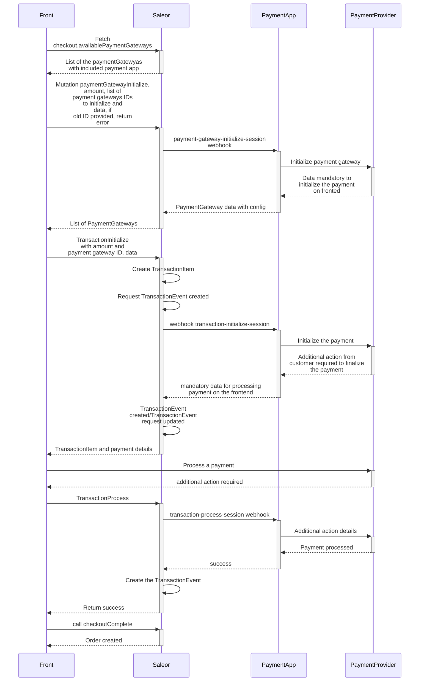

## Introduction

The below process describes the key milestones in the checkout process flow in Saleor. Additional steps may also occur along the way; however, the purpose of this instruction is to deliver a base reference for the user to work with.

You can run the code snippets in this section in the [Playground](api-usage/developer-tools.mdx) or your preferred GraphQL client.

### Why is there no cart model?

Saleor has no distinct object type for shopping carts and checkouts. We wanted the same features—like discounts, vouchers, address-specific taxes, and shipping estimates—to be available in the cart and the checkout, so we've decided to use the same object type for both.
Checkout provides the interface for standard cart operations like adding products or promo codes. It can also be completed in almost any order, for example, saving a billing address before adding any items.

### Glossary

- **Checkout**: an object which groups all the data needed for the checkout process and creating an order.
- **Checkout Line**: items added to the checkout with quantity data. Each added variant has a separate line.
- **Checkout Completion**: during this step, payments are processed and stocks reserved. If requirements are met, the order is created.
- **Payment Method**: a payment provider. E.g., Stripe, Adyen.
- **Payments**: this object contains status and additional data about payment.
- **Shipping Methods**: the way orders will be sent. E.g., DHL courier, postal service.
- **Collection Points**: places, where orders can be self-picked.
- **Delivery Methods**: set, which is an union of shipping methods and collection points.

## Multiple channels and checkout

Depending on the chosen channel, the user will have access to different objects. This will impact available:

- Products and Product Variants
- Payment Methods
- Shipping Methods
- Collection Points
- Discounts

[Learn more about using multiple channels](developer/channels.mdx).

## Permissions

If the user is assigned the checkout permission, only this user and staff users with permission `MANAGE_CHECKOUTS` can query its data. Checkouts without assigned users can be queried and modified using the token without additional permissions.

## Address Validation

The checkout's mutations that accept an address as an input have a field that can turn off the address validation. It allows assigning a partial or not fully valid address to the checkout. Providing country code is mandatory for all addresses regardless of the rules provided in this input.

The address [validation](docs/api-reference/checkout/inputs/checkout-address-validation-rules.mdx) input has two boolean fields:

- `checkRequiredFields` - signals Saleor to raise an error when the provided address doesn't have all the required fields. Set to `true` by default.
- `checkFieldsFormat` - signals Saleor to raise an error when the provided address doesn't match the expected format. Set to `true` by default.
- `enableFieldsNormalization` - determines if Saleor should apply normalization on address fields. Example: converting city field to uppercase letters. Set to `true` by default.

#### checkoutCreate

The [`checkoutCreate`](docs/api-reference/checkout/mutations/checkout-create.mdx) mutation has an optional input for providing shipping and billing addresses. If you want to provide only a part of the address, you can disable the address validation.

The mutation accepts [validationRules](docs/api-reference/checkout/inputs/checkout-validation-rules.mdx) as an [input](docs/api-reference/checkout/inputs/checkout-create-input.mdx) field.

```graphql
mutation {
  checkoutCreate(
    input: {
      channel: "default-channel"
      email: "customer@example.com"
      lines: [{ quantity: 1, variantId: "UHJvZHVjdFZhcmlhbnQ6Mjk3" }]
      shippingAddress: { country: US }
      billingAddress: { postalCode: "XX-YYY", country: US }
      validationRules: {
        shippingAddress: { checkRequiredFields: false }
        billingAddress: { checkRequiredFields: false, checkFieldsFormat: false }
      }
    }
  ) {
    checkout {
      id
    }
    errors {
      field
      code
    }
  }
}
```

The response contains the created checkout object:

```json
{
  "data": {
    "checkoutCreate": {
      "checkout": {
        "id": "Q2hlY2tvdXQ6NGY1NjI1MDQtOWE2ZS00YjRjLWJiZWYtYmNjNDhkNWMwNDVj"
      },
      "errors": []
    }
  }
}
```

#### CheckoutShippingAddressUpdate

The [`checkoutShippingAddressUpdate`](docs/api-reference/checkout/mutations/checkout-shipping-address-update.mdx) mutation has an optional field for controlling the shipping address validation: [validationRules](docs/api-reference/checkout/inputs/checkout-address-validation-rules.mdx).

```graphql
mutation {
  checkoutShippingAddressUpdate(
    id: "Q2hlY2tvdXQ6MjU1MmYxYTctN2Q3MC00ODg5LTg1OWYtNGNiNWNlMGI4Zjhk"
    shippingAddress: { postalCode: "12-333", country: PL }
    validationRules: { checkRequiredFields: false }
  ) {
    errors {
      field
      message
      code
    }
    checkout {
      id
      shippingAddress {
        id
        postalCode
        firstName
        lastName
        country {
          code
        }
      }
    }
  }
}
```

The response contains the updated checkout object:

```json
{
  "data": {
    "checkoutShippingAddressUpdate": {
      "errors": [],
      "checkout": {
        "id": "Q2hlY2tvdXQ6MjU1MmYxYTctN2Q3MC00ODg5LTg1OWYtNGNiNWNlMGI4Zjhk",
        "shippingAddress": {
          "id": "QWRkcmVzczo4Mg==",
          "postalCode": "12-333",
          "firstName": "",
          "lastName": "",
          "country": {
            "code": "PL"
          }
        }
      }
    }
  }
}
```

#### CheckoutBillingAddressUpdate

The [`checkoutBillingAddressUpdate`](docs/api-reference/checkout/mutations/checkout-billing-address-update.mdx) mutation has an optional field for controlling the billing address validation: [validationRules](docs/api-reference/checkout/inputs/checkout-address-validation-rules.mdx).

```graphql
mutation {
  checkoutBillingAddressUpdate(
    id: "Q2hlY2tvdXQ6ZTM4NjMyYzItZTg5NS00ZjE4LTg3YTMtNjIwNGU0NzlmYjUw"
    validationRules: { checkFieldsFormat: false, checkRequiredFields: false }
    billingAddress: { country: GB, postalCode: "XX YYY" }
  ) {
    checkout {
      id
      billingAddress {
        streetAddress1
        city
        cityArea
        postalCode
        country {
          code
        }
        countryArea
      }
    }
  }
}
```

The response contains the updated checkout object:

```json
{
  "data": {
    "checkoutBillingAddressUpdate": {
      "checkout": {
        "id": "Q2hlY2tvdXQ6ZTM4NjMyYzItZTg5NS00ZjE4LTg3YTMtNjIwNGU0NzlmYjUw",
        "billingAddress": {
          "streetAddress1": "",
          "city": "",
          "cityArea": "",
          "postalCode": "XX YYY",
          "country": {
            "code": "GB"
          },
          "countryArea": ""
        }
      }
    }
  }
}
```

:::note
The information about address validation can be found on the [address validation](developer/address.mdx) page.
:::

:::note
The shipping and billing addresses need to be valid when finalizing checkout by calling [checkoutComplete](docs/api-reference/checkout/mutations/checkout-complete.mdx) mutation.
:::

:::note
The fields for shipping and billing addresses will be normalized (if needed) on completing the checkout by calling [checkoutComplete](docs/api-reference/checkout/mutations/checkout-complete.mdx) mutation.
:::

## Creating a checkout session

:::note
A [`Checkout`](docs/api-reference/checkout/objects/checkout.mdx) object can be created for logged in users and for anonymous (guest) users.
:::

- If you use the [`checkoutCreate`](docs/api-reference/checkout/mutations/checkout-create.mdx) mutation including the authentication token, this checkout is assigned to the user who is authenticated by this token. For more information on how to authenticate with our API, see the [Authentication](docs/api-usage/authentication.mdx) topic.

- If no authentication token is provided, the checkout is created for an anonymous user,
  and an email address is used to identify such a [`Checkout`](docs/api-reference/checkout/objects/checkout.mdx) object,
  linking it with the anonymous user.
  User email is not required at this stage but must be provided before adding a promo code, creating a payment, and completing checkout.

To create a [`Checkout`](docs/api-reference/checkout/objects/checkout.mdx) object, use the [`checkoutCreate`](docs/api-reference/checkout/mutations/checkout-create.mdx) mutation.

This mutation takes the following [input](docs/api-reference/checkout/inputs/checkout-create-input.mdx):

- `channel`: Slug of a channel in which to create checkout.
- `email`: the user's email address.
- `shippingAddress`: the shipping address (if needed).
- `billingAddress`: the billing address.
- `lines`: a list of checkout lines, each checkout line contains a product variant ID and its quantity.
- `validationRules`: the checkout validation rules that can be changed.

The resulting [`Checkout`](docs/api-reference/checkout/objects/checkout.mdx) object contains the following fields:

- `id`: a unique checkout ID.
- `token`: similar to `id`, a unique identifier suitable for inclusion in emails and URLs, required by most checkout operations.
- `totalPrice`: the total price of the checkout lines and shipping costs.
- `isShippingRequired`: denotes whether shipping is required for this checkout.
- `availablePaymentGateways`: a list of payment gateways that are currently configured on your Saleor server and can be used to pay for the checkout. Only gateways which support the checkout currency are returned. For each gateway, API returns an ID, a name, and a config object, which for some gateways may return additional information required to process the payment in the frontend.
- `shippingMethods`: a list of all shipping methods for this checkout. If the items in the cart require shipment.
- `availableCollectionPoints`: a list of available places of self-pickup. It is calculated based on the given country and available Stocks (for Warehouses which `clickAndCollectOption` field is not set to `DISABLED`).

In addition, the following fields are available in the mutation results:

- `created`: a boolean flag indicating whether a new checkout object was created, or an existing one was used.
- `errors`: a list of errors that occurred during mutation execution.

The following example shows how the [`checkoutCreate`](docs/api-reference/checkout/mutations/checkout-create.mdx) mutation creates the [`Checkout`](docs/api-reference/checkout/objects/checkout.mdx) object and returns the checkout information:

```graphql {2-25}
mutation {
  checkoutCreate(
    input: {
      channel: "default-channel"
      email: "customer@example.com"
      lines: [{ quantity: 1, variantId: "UHJvZHVjdFZhcmlhbnQ6Mjk3" }]
      shippingAddress: {
        firstName: "John"
        lastName: "Doe"
        streetAddress1: "1470  Pinewood Avenue"
        city: "Michigan"
        postalCode: "49855"
        country: US
        countryArea: "MI"
      }
      billingAddress: {
        firstName: "John"
        lastName: "Doe"
        streetAddress1: "1470  Pinewood Avenue"
        city: "Michigan"
        postalCode: "49855"
        country: US
        countryArea: "MI"
      }
    }
  ) {
    checkout {
      id
      token
      totalPrice {
        gross {
          amount
          currency
        }
      }
      isShippingRequired
      shippingMethods {
        id
        name
        active
        message
      }
      availableCollectionPoints {
        id
        name
        clickAndCollectOption
      }
      availablePaymentGateways {
        id
        name
        config {
          field
          value
        }
      }
    }
    errors {
      field
      code
    }
  }
}
```

We get a newly created checkout object for which we return the ID, token, total price, and list of available shipping and payment methods:

```json
{
  "data": {
    "checkoutCreate": {
      "checkout": {
        "id": "Q2hlY2tvdXQ6ZmE5ZjBkMjYtMWM3NC00MDgyLTk3MzktYTIxOGE2NzVjMDZk",
        "token": "4b22fbc0-b095-4937-a08e-bd18d04c951a",
        "totalPrice": {
          "gross": {
            "amount": 20,
            "currency": "USD"
          }
        },
        "isShippingRequired": true,
        "shippingMethods": [
          {
            "id": "U2hpcHBpbmdNZXRob2Q6MTM=",
            "name": "UPS",
            "active": true,
            "message": ""
          },
          {
            "id": "U2hpcHBpbmdNZXRob2Q6MTI=",
            "name": "DHL",
            "active": false,
            "message": "Not available."
          }
        ],
        "availableCollectionPoints": [
          {
            "id": "V2FyZWhvdXNlOjU0NjliNWQ3LThmOGUtNGVmOS1iMGQxLWNhYWZmYTg4MjI1OQ==",
            "name": "Local Store"
            "clickAndCollectOption": "LOCAL"
          },
          {
            "id": "=V2FyZWhvdXNlOjU0NjliNWQ3LThmOGUtNGVmOS1iMGQxLWNhYWZmYTg4MjI1OA==",
            "name": "Company HQ"
            "clickAndCollectOption": "ALL"
          }
        ],
        "availablePaymentGateways": [
          {
            "id": "mirumee.payments.braintree",
            "name": "Braintree",
            "config": [
              {
                "field": "store_customer_card",
                "value": "false"
              },
              {
                "field": "client_token",
                "value": "example_token_value"
              }
            ]
          }
        ]
      },
      "errors": []
    }
  }
}
```

## Managing items

### Adding a product to checkout

To add an item to the cart, use [`checkoutLinesAdd`](docs/api-reference/checkout/mutations/checkout-lines-add.mdx). Total prices will be updated automatically:

```graphql {4}
mutation {
  checkoutLinesAdd(
    token: "4b22fbc0-b095-4937-a08e-bd18d04c951a"
    lines: [{ quantity: 1, variantId: "UHJvZHVjdFZhcmlhbnQ6Mjc0" }]
  ) {
    checkout {
      lines {
        id
        variant {
          name
        }
        quantity
      }
      totalPrice {
        gross {
          currency
          amount
        }
      }
    }
  }
}
```

The response contains the updated checkout object:

```json {16-17}
{
  "data": {
    "checkoutLinesAdd": {
      "checkout": {
        "lines": [
          {
            "id": "Q2hlY2tvdXRMaW5lOjI1Mw=="
            "variant": {
              "name": "XL"
            },
            "quantity": 1
          }
        ],
        "totalPrice": {
          "gross": {
            "currency": "USD",
            "amount": 5
          }
        }
      }
    }
  }
}
```

### Adding the same product to multiple lines

:::info

This feature was introduced in **Saleor 3.6**.

:::
:::caution

This feature is in the **Feature Preview** stage, which means that it is available for experimentation and
feedback. However, it is still undergoing development and is subject to modifications.

:::
The creation of multiple lines with the same variant is possible upon using the `forceNewLine` flag.
The `forceNewLine` can be used in the:

[CheckoutLineInput](docs/api-reference/checkout/inputs/checkout-line-input.mdx)
in the following mutations:

- [checkoutCreate](docs/api-reference/checkout/mutations/checkout-create.mdx)
- [checkoutLinesAdd](docs/api-reference/checkout/mutations/checkout-lines-add.mdx)

```graphql {5}
mutation {
  checkoutLinesAdd(
    token: "4b22fbc0-b095-4937-a08e-bd18d04c951a"
    lines: [
      { quantity: 1, variantId: "UHJvZHVjdFZhcmlhbnQ6Mjc0", forceNewLine: true }
      { quantity: 2, variantId: "UHJvZHVjdFZhcmlhbnQ6Mjc0" }
    ]
  ) {
    checkout {
      lines {
        id
        variant {
          name
        }
        quantity
      }
      totalPrice {
        gross {
          currency
          amount
        }
      }
    }
  }
}
```

The response contains the updated checkout object:

```json
{
  "data": {
    "checkoutLinesAdd": {
      "checkout": {
        "lines": [
          {
            "id": "Q2hlY2tvdXRMaW5lOjI1Mw==",
            "variant": {
              "name": "XL"
            },
            "quantity": 1
          },
          {
            "id": "Q2hlY2tvdXRMaW5lOjI1Mw==",
            "variant": {
              "name": "XL"
            },
            "quantity": 2
          }
        ],
        "totalPrice": {
          "gross": {
            "currency": "USD",
            "amount": 15
          }
        }
      }
    }
  }
}
```

If the variant is already added to the checkout and exists only in one line, Saleor will increase the corresponding line's quantity.
Running mutation twice will result in a checkout object with one line and the amount set to 2:

```graphql {4}
mutation {
  checkoutLinesAdd(
    token: "4b22fbc0-b095-4937-a08e-bd18d04c951a"
    lines: [{ quantity: 1, variantId: "UHJvZHVjdFZhcmlhbnQ6Mjc0" }]
  ) {
    checkout {
      lines {
        id
        variant {
          name
        }
        quantity
      }
      totalPrice {
        gross {
          currency
          amount
        }
      }
    }
  }
}
```

Response after second run:

```json {11}
{
  "data": {
    "checkoutLinesAdd": {
      "checkout": {
        "lines": [
          {
            "id": "Q2hlY2tvdXRMaW5lOjI1Mw=="
            "variant": {
              "name": "XL"
            },
            "quantity": 2
          }
        ],
        "totalPrice": {
          "gross": {
            "currency": "USD",
            "amount": 10
          }
        }
      }
    }
  }
}
```

:::caution

If the variant is already added to the checkout and exists in more than one line, Saleor will create a new line with provided quantity.

:::

### Updating a line

To modify a line, use [checkoutLinesUpdate](docs/api-reference/checkout/mutations/checkout-lines-update.mdx).

Currently, [CheckoutLineUpdateInput](docs/api-reference/checkout/inputs/checkout-line-update-input.mdx) supports `variantId` and `lineId` parameters to operate on the selected line object.
The version `3.6` featured [adding the same product to multiple lines](docs/developer/checkout/lines.mdx#adding-the-same-product-to-multiple-lines). Since then, we recommend using the `lineId` parameter, as `variantId` will be deprecated in the future.

:::caution

Is not allowed to use `variantId` and `lineId` in the same line input.

If the `variantId` parameter is used in line input and the variant exists in multiple lines, [checkoutLinesUpdate](docs/api-reference/checkout/mutations/checkout-lines-update.mdx) will return an error. In that case, you are required to use `lineId`.

:::

#### Changing the line quantity

```graphql {4}
mutation {
  checkoutLinesUpdate(
    token: "4b22fbc0-b095-4937-a08e-bd18d04c951a"
    lines: [{ quantity: 12, lineId: "Q2hlY2tvdXRMaW5lOjI1NA==" }]
  ) {
    checkout {
      lines {
        id
        variant {
          id
        }
        quantity
      }
    }
    errors {
      field
      message
    }
  }
}
```

```json {11}
{
  "data": {
    "checkoutLinesUpdate": {
      "checkout": {
        "lines": [
          {
            "id": "Q2hlY2tvdXRMaW5lOjI1NA==",
            "variant": {
              "id": "UHJvZHVjdFZhcmlhbnQ6MTcy"
            },
            "quantity": 12
          }
        ]
      },
      "errors": []
    }
  }
}
```

If the quantity is changed to 0, API will remove this line from checkout.

### Removing items from checkout

Running the [checkoutLineDelete](docs/api-reference/checkout/mutations/checkout-line-delete.mdx) mutation will remove the whole line, no matter the quantity:

```graphql
mutation {
  checkoutLineDelete(
    token: "4b22fbc0-b095-4937-a08e-bd18d04c951a"
    lineId: "Q2hlY2tvdXRMaW5lOjI1Mw=="
  ) {
    checkout {
      lines {
        id
        variant {
          id
        }
        quantity
      }
    }
    errors {
      field
      message
    }
  }
}
```

```json
{
  "data": {
    "checkoutLineDelete": {
      "checkout": {
        "lines": []
      },
      "errors": []
    }
  }
}
```

### Setting custom prices for checkout items

You can override the variant price of the item in checkout with any value.
The overridden price will be treated as the base price of a variant.
If you apply a voucher or sale in checkout, it will reduce the price.

:::note
This feature is only available for apps with `HANDLE_CHECKOUTS` permission.
:::

The custom price can be set with the use of field `price` in the
[CheckoutLineInput](docs/api-reference/checkout/inputs/checkout-line-input.mdx)
in the following mutations:

- [checkoutCreate](docs/api-reference/checkout/mutations/checkout-create.mdx),
- [checkoutLinesAdd](docs/api-reference/checkout/mutations/checkout-lines-add.mdx) - when adding
  a variant that already exists in the checkout, the corresponding line gets overridden - the quantity is incremented and the price is updated.
- [checkoutLinesUpdate](docs/api-reference/checkout/mutations/checkout-lines-update.mdx) - overrides
  the existing line with the price provided in the mutation.

The following example shows how to set a custom price with the use of `checkoutLinesAdd` mutation:

```graphql {7}
mutation {
  checkoutLinesAdd(
    token: "d6d68835-6776-4caf-8db7-72e18d04d9a4"
    lines: [
      { quantity: 1, variantId: "UHJvZHVjdFZhcmlhbnQ6MzA2", price: 16.22 }
    ]
  ) {
    checkout {
      token
      lines {
        variant {
          id
        }
        quantity
        totalPrice {
          gross {
            amount
            currency
          }
          net {
            amount
            currency
          }
        }
      }
    }
    errors {
      field
      message
    }
  }
}
```

As a response, we get an updated checkout with the new price. As the given variant was already in the checkout, the quantity was incremented, and the price was overridden.

```json
{
  "data": {
    "checkoutLinesAdd": {
      "checkout": {
        "token": "d6d68835-6776-4caf-8db7-72e18d04d9a4",
        "lines": [
          {
            "variant": {
              "id": "UHJvZHVjdFZhcmlhbnQ6MzA2"
            },
            "quantity": 2,
            "totalPrice": {
              "gross": {
                "amount": 32.44,
                "currency": "USD"
              },
              "net": {
                "amount": 32.44,
                "currency": "USD"
              }
            }
          }
        ]
      },
      "errors": []
    }
  }
}
```

## Stock reservations

While stock availability is checked at every step of the checkout process, no guarantee is made to the client that stock will not be sold out before checkout completion. In case an item with limited stock was added to multiple checkouts, it will be allocated to the first completed checkout. As a result, it will cause remaining checkouts to fail to advance to the next step even if they had been created before the completed one. The API will return the `INSUFFICIENT_STOCK` error.

Saleor implements optional stock reservations feature where stock will be eagerly allocated to the checkout for configured time.

### Enabling reservations

To enable reservations, navigate to "Site settings" page in the dashboard. Here, in the "Checkout Configuration" section you'll find controls allowing you to enable stock reservations for authenticated and anonymous checkouts.

To disable stock reservations, clear both controls.

### Mechanism of action

If user A adds the last two items to their checkout, those two items will become purchasable only by them for a given time.

Those two items will also be subtracted from the available quantity displayed to other users in the store, giving them immediate feedback that the item they are interested in is currently unavailable, preventing them from adding this item to their checkouts.

If user A completes their checkout within the given time, the temporary allocation will be converted into a permanent one. But if they don't complete their stock within the time limit, their stock reservation will expire, and the two items in their checkout will become available for other users to add to their checkouts.

If no other user adds this item to their checkout, user A will still be able to complete their checkout. But suppose another user adds one or two items to their checkout. In that case, a new reservation will be created for them, reducing the quantity available to other users and preventing user A from completing their checkout.

### Testing checkout for reservations

`Checkout` type in GraphQL API has `stockReservationExpires` field which returns datetime of stock reservation expiration in ISO-8601 format or `null` when checkout has no active reservations.

## Shipping

This step is only used if purchased items require shipping (if they are physical products). The user must select a specific shipping method to create shipping for this checkout. To signify whether shipping is required, use the `isShippingRequired` field in the [`Checkout`](docs/api-reference/checkout/objects/checkout.mdx) object.


### Adding address data

Address can be assigned using the [`checkoutShippingAddressUpdate`](docs/api-reference/checkout/mutations/checkout-shipping-address-update.mdx) mutation:

```graphql
mutation {
  checkoutShippingAddressUpdate(
    shippingAddress: {
      country: PL
      firstName: "John"
      lastName: "Smith"
      streetAddress1: "ul. Tęczowa 7"
      postalCode: "53-030"
      city: "Wroclaw"
    }
    token: "58f4ca17-9c6f-437b-8204-beb47bbee364"
  ) {
    checkout {
      shippingAddress {
        firstName
        lastName
        streetAddress1
        city
        postalCode
      }
    }
    errors {
      field
      message
      code
    }
  }
}
```

Successful response:

```json
{
  "data": {
    "checkoutShippingAddressUpdate": {
      "checkout": {
        "shippingAddress": {
          "firstName": "John",
          "lastName": "Smith",
          "streetAddress1": "ul. Tęczowa 7",
          "city": "WROCLAW",
          "postalCode": "53-030"
        }
      },
      "errors": []
    }
  }
}
```

More information about address validation can be found on the [address validation](developer/address.mdx) page.

#### Default address

Customers with accounts can set up default addresses, which will be attached automatically during the checkout creation. More information on API reference page for [accountSetDefaultAddress](docs/api-reference/users/mutations/account-set-default-address.mdx).

### Listing available shipping methods

After choosing the shipping address, API can be queried for available delivery methods in the user area:

```graphql
query {
  checkout(token: "853ca234-b113-4021-8434-b37087d652a1") {
    shippingMethods {
      id
      name
      active
      price {
        currency
        amount
      }
    }
    availableCollectionPoints {
      id
      name
      clickAndCollectOption
    }
  }
}
```

Response:

```json
{
  "data": {
    "checkout": {
      "shippingMethods": [
        {
          "id": "U2hpcHBpbmdNZXRob2Q6MTY1Nw==",
          "name": "DHL",
          "price": {
            "currency": "USD",
            "amount": 10.0
          },
          "active": true,
          "message": ""
        },
        {
          "id": "U2hpcHBpbmdNZXRob2Q6MTM=",
          "name": "UPS",
          "price": {
            "currency": "USD",
            "amount": 8.0
          },
          "active": false,
          "message": "Not available."
        }
      ],
      "availableCollectionPoints": [
        {
          "id": "V2FyZWhvdXNlOjU0NjliNWQ3LThmOGUtNGVmOS1iMGQxLWNhYWZmYTg4MjI1OQ==",
          "name": "Local Store",
          "clickAndCollectOption": "LOCAL"
        },
        {
          "id": "V2FyZWhvdXNlOjU0NjliNWQ3LThmOGUtNGVmOS1iMGQxLWNhYWZmYTg4MjI1OA==",
          "name": "Company HQ",
          "clickAndCollectOption": "ALL"
        }
      ]
    }
  }
}
```

### Selecting the delivery method

Use the [`checkoutDeliveryMethodUpdate`](docs/api-reference/checkout/mutations/checkout-delivery-method-update.mdx) mutation to effectively pair the specific [`Checkout`](docs/api-reference/checkout/objects/checkout.mdx) object with the specified delivery method selected by the user.

This operation requires the following input:

- `token`: the checkout token (the `token` field of the [`Checkout`](docs/api-reference/checkout/objects/checkout.mdx) object).
- `deliveryMethodId`: the shipping method ID or Warehouse ID (from the `shippingMethods` or `availableCollectionPoints` field of the [`Checkout`](docs/api-reference/checkout/objects/checkout.mdx) object).

In the following mutation, we assign a delivery method to the checkout using IDs from the previous example. Note that for the checkout object, we want to get back the update `totalPrice` including shipping costs:

Please note, that selecting `collectionPoint` or `shippingMethod` is mandatory for the checkout flow. In other words, setting `deliveryMethod` is mandatory.

```graphql {2-5}
mutation {
  checkoutDeliveryMethodUpdate(
    token: "fd18c322-f816-406b-a71f-d9ce6a39c768"
    deliveryMethodId: "U2hpcHBpbmdNZXRob2Q6MTM="
  ) {
    checkout {
      token
      deliveryMethod {
        __typename
        ... on Warehouse {
          name
        }
        ... on ShippingMethod {
          name
        }
      }
      totalPrice {
        gross {
          amount
          currency
        }
      }
    }
    errors {
      field
      message
    }
  }
}
```

As a result, we get an updated checkout object with a delivery method set:

```json {7}
{
  "data": {
    "checkoutDeliveryMethodUpdate": {
      "checkout": {
        "token": "fd18c322-f816-406b-a71f-d9ce6a39c768",
        "deliveryMethod": {
          __typename: "ShippingMethod"
          "name": "UPS"
        },
        "totalPrice": {
          "gross": {
            "amount": 25.99,
            "currency": "USD"
          }
        }
      },
      "errors": []
    }
  }
}
```

## Checkout email

When anonymous checkout without user email has been created, the email must be set before creating payment and completing checkout.
Use the [`CheckoutEmailUpdate`](docs/api-reference/checkout/mutations/checkout-email-update.mdx) mutation to update checkout `email`.

The operation requires the following inputs:

- `token`: the checkout token (the `token` field of the [`Checkout`](docs/api-reference/checkout/objects/checkout.mdx) object),
- `email`: the user email.

```graphql {2-4}
mutation {
  checkoutEmailUpdate(
    token: "fd18c322-f816-406b-a71f-d9ce6a39c768"
    email: "test_customer@example.com"
  ) {
    checkout {
      token
      email
    }
    errors {
      field
      message
    }
  }
}
```

As a result, we get an updated checkout object with the new checkout email set:

```json {6}
{
  "data": {
    "checkoutDeliveryMethodUpdate": {
      "checkout": {
        "token": "fd18c322-f816-406b-a71f-d9ce6a39c768",
        "email": "test_customer@example.com"
      },
      "errors": []
    }
  }
}
```

## Finalizing checkout with Saleor's payment gateways

The payment flow uses the Saleor's payment gateway or payment synchronous webhooks to process a payment.

### Payment

Depending on the selected payment gateway, you will use the payment provider's form, which can be integrated with Saleor or be redirected to an external payment page. The payment gateway returns information if the payment is successful, along with tokenized credit card payment information. This token is then used to run the [`checkoutPaymentCreate`](docs/api-reference/checkout/mutations/checkout-payment-create.mdx) mutation.


#### Listing available payment gateways

Available payment gateways can be listed from the `Checkout.availablePaymentGateways` field. Depending on the chosen gateway, you may need additional configuration. For example, public `api_key` is used by the frontend payment library. To obtain that data, run:

```graphql
query {
  checkout(token: "853ca234-b113-4021-8434-b37087d652a1") {
    availablePaymentGateways {
      id
      name
      config {
        field
        value
      }
    }
  }
}
```

Response:

```json
{
  "data": {
    "checkout": {
      "availablePaymentGateways": [
        {
          "id": "mirumee.payments.stripe",
          "name": "Stripe",
          "config": [
            {
              "field": "api_key",
              "value": "pk_test_SkWEusCNFdSgxGGmd23z7JC1FHh3uNufNuX"
            },
            {
              "field": "store_customer_card",
              "value": "false"
            }
          ]
        },
        {
          "id": "mirumee.payments.dummy",
          "name": "Dummy",
          "config": [
            {
              "field": "store_customer_card",
              "value": "false"
            }
          ]
        }
      ]
    }
  }
}
```

#### Creating payment

The [`checkoutPaymentCreate`](docs/api-reference/checkout/mutations/checkout-payment-create.mdx) mutation takes the following arguments:

- `token`: the checkout token (if required by a payment gateway).

- `input`: [PaymentInput](docs/api-reference/payments/inputs/payment-input.mdx) object:
  - `gateway`: the ID of the selected payment gateway (list of the available payment gateways can be fetched from the `Checkout.availablePaymentGateways` field). The selected gateway must support the checkout currency.
  - `token`: a client-side generated payment token (if required).
  - `amount`: the total amount of this operation.
  - `returnUrl`: URL of a storefront view where the user should be redirected after requiring additional actions. Payment with additional actions will not be finished if this field is not provided.
  - `storePaymentMethod`: the type of payment storage in a gateway. [StorePaymentMethod](docs/api-reference/payments/enums/store-payment-method-enum.mdx) value. If not provided, defaults to `NONE` (added in Saleor 3.1).
  - `metadata`: a list of [MetadataInput](docs/api-reference/miscellaneous/inputs/metadata-input.mdx) (added in Saleor 3.1).

This mutation returns the following fields:

- `checkout`: the updated checkout object.
- `payment`: the newly created payment object.
- `errors`: a list of errors that occurred during mutation execution.

In the example below, we're creating a new Braintree payment for our checkout:

```graphql {2-15}
mutation {
  checkoutPaymentCreate(
    token: "fd18c322-f816-406b-a71f-d9ce6a39c768"
    input: {
      gateway: "mirumee.payments.braintree"
      token: "tokencc_bh_s3bjkh_24smq8_6c6zhq_w4v6b9_8vz"
      amount: 25.99
      storePaymentMethod: ON_SESSION
      metadata: [{ key: "user_id", value: "#1234" }]
    }
  ) {
    payment {
      id
      chargeStatus
      metadata {
        key
        value
      }
    }
    paymentErrors {
      field
      message
    }
  }
}
```

As a result, we get the payment object:

```json
{
  "data": {
    "checkoutPaymentCreate": {
      "payment": {
        "id": "UGF5bWVudDox",
        "chargeStatus": "NOT_CHARGED",
        "metadata": [
          {
            "key": "user_id",
            "value": "#1234"
          }
        ]
      },
      "errors": []
    }
  }
}
```

### Completing the checkout

The purpose of the operation is to ensure this checkout is correct. The validation consists of checking:

1. The required addresses are valid.

2. All selected products are in stock (while making the purchase, another user could already buy the last available item).

3. The payment creation succeeded.

4. No additional actions are required by the PSP.

If these are satisfied, the checkout is transformed into an order, and the customer receives a confirmation email.

#### Without additional payment action


The [`checkoutComplete`](docs/api-reference/checkout/mutations/checkout-complete.mdx) mutation requires the following input:

- `token`: the token of the checkout to complete.
- `redirectUrl`: URL of a view where users should be redirected to see the order details. URL in RFC 1808 format.
- `paymentData`: Client-side generated data required to finalize the payment.

It returns the following output:

- `order`: an `Order` object created from the checkout object.
- `confirmationNeeded`: set to `true` if payment needs to be confirmed before checkout is complete.
- `confirmationData`: confirmation data used to process additional authorization steps, required by the PSP.
- `errors`: a list of errors that occurred during mutation execution.

Here is the example of a complete mutation:

```graphql {2-4}
mutation {
  checkoutComplete(token: "fd18c322-f816-406b-a71f-d9ce6a39c768") {
    order {
      id
      status
    }
    errors {
      field
      message
    }
  }
}
```

A successful response would look like this:

```json
{
  "data": {
    "checkoutComplete": {
      "order": {
        "id": "T3JkZXI6MjU=",
        "status": "UNFULFILLED"
      },
      "errors": []
    }
  }
}
```

Here is an example of the [`checkoutComplete`](docs/api-reference/checkout/mutations/checkout-complete.mdx) mutation where the payment gateway requires additional data to finalize the payment using the Adyen payment gateway:

```graphql {2-5}
mutation{
  checkoutComplete(
    token: "fd18c322-f816-406b-a71f-d9ce6a39c768",
    paymentData: "{\"paymentMethod\": {\"type\": \"scheme\", \"encryptedCardNumber\": \"ad...\", \"encryptedExpiryMonth\": \"18...\", \"encryptedExpiryYear\": \"18$C...\", \"encryptedSecurityCode\": \"18$...\", \"holderName\": \"S. Hopper\"}}"
){
     confirmationNeeded
     confirmationData
     order
     errors{
       field
       message
       code
     }
}
```

A response would look like this:

```json
{
  "data": {
    "checkoutComplete": {
      "order": {
        "id": "T3JkZXI6MjU=",
        "status": "UNFULFILLED"
      },
      "confirmationNeeded": false,
      "confirmationData": null,
      "errors": []
    }
  }
}
```

#### Payment requiring additional action


An example of additional action is 3D Secure confirmation required by payment providers.

An example of a complete mutation where the payment gateway requires additional steps from the user:

```graphql {2-5}
mutation{
  checkoutComplete(
    token: "fd18c322-f816-406b-a71f-d9ce6a39c768",
    paymentData: "{\"encryptedAdditionalAction\": \"eka...\"}"
){
     confirmationNeeded
     confirmationData
     order
     errors{
       field
       message
       code
     }
}
```

A response would look like this:

```json
{
  "data": {
    "checkoutComplete": {
      "order": null,
      "confirmationNeeded": true,
      "confirmationData": "{\"paymentData\":\"Ab02b4c...\", \"paymentMethodType\":\"scheme\", \"token\":\"eyJ0aHJlZURTTWV0aG9kTm9...\", \"type\":\"threeDS2Fingerprint\"}",
      "errors": []
    }
  }
}
```

:::caution

When any error is raised during the checkout completion or the payment
will become inactive, processed payment will be refunded or voided (in case the payment wasn't charged yet).

Here are the example scenarios that may end up with payment refunding:

- the shipping method became invalid
- the checkout is not fully paid
- some products became unavailable od there is not enough stock of them
- the processed payment became inactive

:::

## Finalizing checkout with Saleor App

The flow where the payment process is handled by an external Saleor App.
Saleor expects to receive a result of the payment transaction processed by Saleor App.

There are two ways to process payments with the Saleor app:

- Using the Checkout app: This external app handles the payment process and creates an order by
  using the `orderCreateFromCheckout` API. The API is protected and requires an app token.
  This flow supports two ways of processing checkout: first payments, then order and first order,
  then payments. It also supports partial payments.

- Using the Payment app: The communication between the storefront and payment app goes through
  Saleor. Based on the response, Saleor creates or updates the transaction with the proper status.
  The API is public. This flow allows you to handle the checkout process when payments are processed
  first, then the order is created. It also supports partial payments.

### Using the Payment app

:::info

This feature was introduced in **Saleor 3.13**.

:::
:::caution

This feature is in the **Feature Preview** stage, which means that it is available for experimentation and
feedback. However, it is still undergoing development and is subject to modifications.

:::

:::info
This feature is dedicated to [third-party](api-reference/apps/enums/app-type-enum.mdx#code-style-fontweight-normal-apptypeenumbthirdpartybcode) apps.
:::

The flow of communication between the storefront and payment app goes through Saleor. Based on the response, Saleor creates or updates the transaction with the proper status and returns them to the frontend.

The diagram below shows the workflow of a checkout process with a payment app:



#### Processing a payment

All details related to processing and managing payments can be found [here](payments#saleor-payment-app)

:::note
When the checkout is fully paid, the webhook [CHECKOUT_FULLY_PAID](api-reference/webhooks/enums/webhook-event-type-async-enum.mdx#code-style-fontweight-normal-webhookeventtypeasyncenumbcheckout_fully_paidbcode) will be triggered.
:::

#### Completing the checkout

The purpose of the operation is to ensure this checkout is correct. The validation consists of checking:

1. The required addresses are valid.

2. All selected products are in stock (while making the purchase, another user could already buy the last available item).

3. The payments are processed

If these are satisfied, the checkout is transformed into an order, and the customer receives a confirmation email.

The [`checkoutComplete`](api-reference/checkout/mutations/checkout-complete.mdx) mutation requires the following input:

- `token`: the token of the checkout to complete.

It returns the following output:

- `order`: an `Order` object created from the checkout object.
- `errors`: a list of errors that occurred during mutation execution.

Here is the example of a complete mutation:

```graphql {2-4}
mutation {
  checkoutComplete(token: "fd18c322-f816-406b-a71f-d9ce6a39c768") {
    order {
      id
      status
    }
    errors {
      field
      message
    }
  }
}
```

A successful response would look like this:

```json
{
  "data": {
    "checkoutComplete": {
      "order": {
        "id": "T3JkZXI6MjU=",
        "status": "UNFULFILLED"
      },
      "errors": []
    }
  }
}
```

### Using the Checkout app

The flow where the payment process is handled by an external Saleor App such as [saleor-checkout](https://github.com/saleor/react-storefront/tree/canary/apps/checkout).

:::note
This flow is recommended when the implemented checkout has custom steps that need to be handled before creating
the order or when you expect that the order needs to be created first.
:::

The below charts show the workflow of a checkout process.

#### Case: Creating order before processing payment


#### Case: Processing payment before creating an order


#### Creating order from checkout

:::info

This feature was introduced in **Saleor 3.2**.

:::

Pre-requirements for creating an order from checkout:

- The required addresses are valid.
- The shipping method is valid (if required).
- All selected products are in stock.

If these are satisfied, the checkout is transformed into an order, and the customer receives a confirmation email.
The operation requires the `HANDLE_CHECKOUTS` permission and can be called only by the App. Calling `checkoutPaymentCreate` and `checkoutComplete` is not needed for this approach.
The created order can be marked as a paid by staff customer/app with the `MANAGE_ORDERS` permission.

The chart below shows a proposed flow where this operation can be used.


The [orderCreateFromCheckout](docs/api-reference/checkout/mutations/order-create-from-checkout.mdx) mutation takes the following arguments:

- `id`: The ID of the checkout that should be used to create a new order.
- `removeCheckout`: Determines if checkout should be removed after creating an order. Default `true`.

The following example shows how the [orderCreateFromCheckout](docs/api-reference/checkout/mutations/order-create-from-checkout.mdx) mutation creates a new order and removes the checkout.

```graphql
mutation {
  orderCreateFromCheckout(
    id: "Q2hlY2tvdXQ6YTcxYjRjZDQtNzI1NS00ZjAyLWEzOTEtMDQxYWQ0MmNjZWNk"
    removeCheckout: true
  ) {
    order {
      id
    }
  }
}
```

As a result, we get an order object:

```json
{
  "data": {
    "orderFromCheckoutCreate": {
      "order": {
        "id": "T3JkZXI6MjI="
      }
    }
  },
  "extensions": {
    "cost": {
      "requestedQueryCost": 0,
      "maximumAvailable": 50000
    }
  }
}
```

#### Managing payments

Saleor uses transaction flow to manage the payments attached to the checkout by Saleor apps.
You can find more details about it [here](payments#saleor-app-with-existing-checkout-app).

## Removing old checkouts

To avoid overloading the database, unfinished checkouts are deleted.
Anonymous and unfinished checkouts are deleted after a specified period of time from its last modification:

- anonymous checkouts (neither user or email is set) after 30 days,
- user checkouts (either user or email is set) after 90 days,
- checkouts without lines after 6 hours.

## Creating checkout from order

:::info

This feature was introduced in **Saleor 3.14**.

:::

:::caution

This feature is in the **Feature Preview** stage, which means that it is available for experimentation and
feedback. However, it is still undergoing development and is subject to modifications.

:::

Saleor allows you to create a checkout from existing orders. This feature can be used when implementing the reordering functionality.

The [checkoutCreateFromOrder](docs/api-reference/checkout/mutations/checkout-create-from-order.mdx) mutation accepts the `Order`
[ID](docs/api-reference/checkout/mutations/checkout-create-from-order.mdx#code-style-fontweight-normal-checkoutcreatefromorderbidbcodeid--)
as input and returns the new [checkout](docs/api-reference/checkout/objects/checkout-create-from-order.mdx#code-style-fontweight-normal-checkoutcreatefromorderbcheckoutbcodecheckout-),
with the lines from the order attached to it. Lines that are not available (variants deleted, products deleted, variants not published, out of stock, etc.) are returned as
[unavailableVariants](docs/api-reference/checkout/objects/checkout-create-from-order.mdx#code-style-fontweight-normal-checkoutcreatefromorderbunavailablevariantsbcodecheckoutcreatefromorderunavailablevariant--).
Any discounts or custom prices attached to the order will not be carried over to the newly created checkout. The price of each checkout line will be based on the current price of the variant.

[UnavailableVariants](docs/api-reference/checkout/objects/checkout-create-from-order.mdx#code-style-fontweight-normal-checkoutcreatefromorderbunavailablevariantsbcodecheckoutcreatefromorderunavailablevariant--)
is a list of variants that could not be attached to the checkout.
Each [item](docs/api-reference/checkout/objects/checkout-create-from-order-unavailable-variant.mdx) has:

- [code](docs/api-reference/checkout/objects/checkout-create-from-order-unavailable-variant.mdx#code-style-fontweight-normal-checkoutcreatefromorderunavailablevariantbcodebcodecheckoutcreatefromorderunavailablevarianterrorcode--) that describes why Saleor could not add it to the checkout.
- [variantId](docs/api-reference/checkout/objects/checkout-create-from-order-unavailable-variant.mdx#code-style-fontweight-normal-checkoutcreatefromorderunavailablevariantbvariantidbcodeid--) that contains the ID of the unavailable variant.
- [lineId](docs/api-reference/checkout/objects/checkout-create-from-order-unavailable-variant.mdx#code-style-fontweight-normal-checkoutcreatefromorderunavailablevariantblineidbcodeid--) that contains the ID of the related `orderLine`.
- [message](docs/api-reference/checkout/objects/checkout-create-from-order-unavailable-variant.mdx#code-style-fontweight-normal-checkoutcreatefromorderunavailablevariantbmessagebcodestring--) the error message.

The following example shows how the [checkoutCreateFromOrder](docs/api-reference/checkout/mutations/checkout-create-from-order.mdx) mutation creates a new checkout:

```graphql
mutation CheckoutCreateFromOrder {
  checkoutCreateFromOrder(
    id: "T3JkZXI6OTM2ZTFlNzEtZDc4NS00MGZiLWI4OTAtYTRmMTk5MTJiOWM2"
  ) {
    errors {
      field
      message
      code
    }
    unavailableVariants {
      message
      code
      variantId
      lineId
    }
    checkout {
      id
      lines {
        quantity
        variant {
          id
        }
      }
    }
  }
}
```

The response returns an order object:

```json
{
  "data": {
    "checkoutCreateFromOrder": {
      "errors": [],
      "unavailableVariants": [],
      "checkout": {
        "id": "Q2hlY2tvdXQ6ZjIwMjE3MjAtYzI5Yy00N2NmLWFmYzYtYzZjNGZlOTIyODM2",
        "lines": [
          {
            "quantity": 1,
            "variant": {
              "id": "UHJvZHVjdFZhcmlhbnQ6NDAw"
            }
          },
          {
            "quantity": 3,
            "variant": {
              "id": "UHJvZHVjdFZhcmlhbnQ6MzU0"
            }
          },
          {
            "quantity": 1,
            "variant": {
              "id": "UHJvZHVjdFZhcmlhbnQ6Mzkw"
            }
          }
        ]
      }
    }
  }
}
```

If there are variants that cannot be attached to the checkout, the response will be as follows:

```json
{
  "data": {
    "checkoutCreateFromOrder": {
      "errors": [],
      "unavailableVariants": [
        {
          "message": "Product variant not found",
          "code": "NOT_FOUND",
          "variantId": "UHJvZHVjdFZhcmlhbnQ6NDAw",
          "lineId": "T3JkZXJMaW5lOjc2NWM2Y2JjLTZkZTktNDUwYS1hNjFlLTc5ZmQ1YjkwYmQzMg=="
        },
        {
          "message": "Cannot add lines for unpublished variants.",
          "code": "PRODUCT_NOT_PUBLISHED",
          "variantId": "UHJvZHVjdFZhcmlhbnQ6Mzkw",
          "lineId": "T3JkZXJMaW5lOmJhMGIxYTIyLWUyMGYtNDQyMC04NDgxLTA1MjgxYzdhMWE3MQ=="
        }
      ],
      "checkout": {
        "id": "Q2hlY2tvdXQ6M2VlM2Y3NjEtZTRmYi00MTE5LTgwZmUtNTZmMzQ3MTkxYTFi",
        "lines": [
          {
            "quantity": 3,
            "variant": {
              "id": "UHJvZHVjdFZhcmlhbnQ6MzU0"
            }
          }
        ]
      }
    }
  }
}
```
