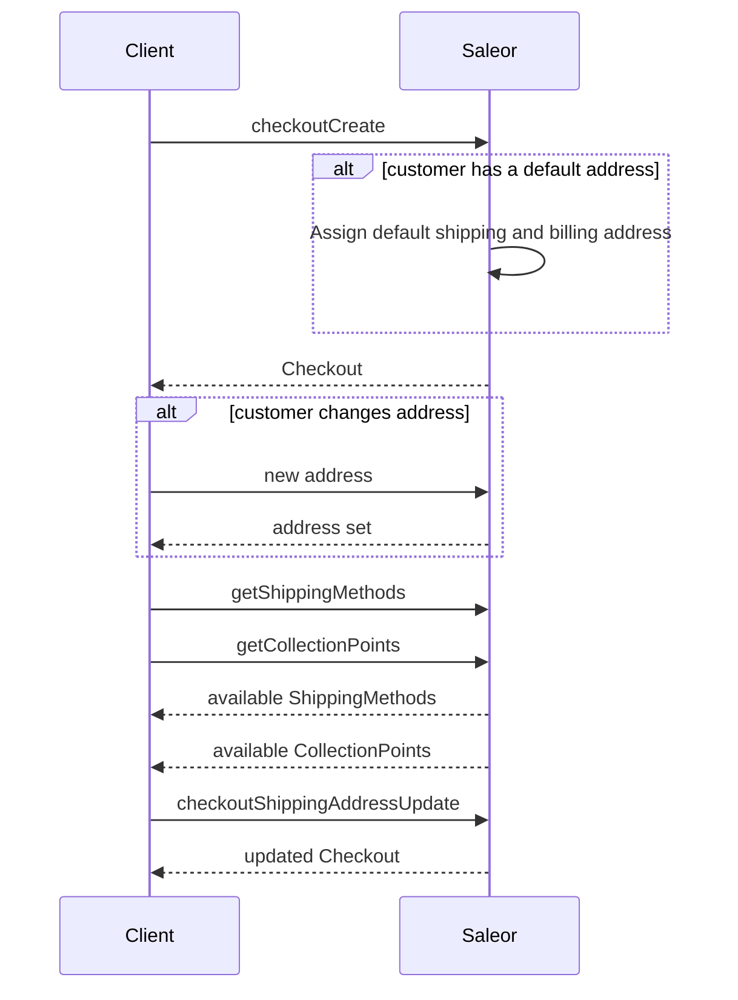

## Shipping

This step is only used if purchased items require shipping (if they are physical products). The user must select a specific shipping method to create shipping for this checkout. To signify whether shipping is required, use the `isShippingRequired` field in the [`Checkout`](docs/api-reference/checkout/objects/checkout.mdx) object.



### Adding address data

Address can be assigned using the [`checkoutShippingAddressUpdate`](docs/api-reference/checkout/mutations/checkout-shipping-address-update.mdx) mutation:

```graphql
mutation {
  checkoutShippingAddressUpdate(
    shippingAddress: {
      country: PL
      firstName: "John"
      lastName: "Smith"
      streetAddress1: "ul. Tęczowa 7"
      postalCode: "53-030"
      city: "Wroclaw"
    }
    token: "58f4ca17-9c6f-437b-8204-beb47bbee364"
  ) {
    checkout {
      shippingAddress {
        firstName
        lastName
        streetAddress1
        city
        postalCode
      }
    }
    errors {
      field
      message
      code
    }
  }
}
```

Successful response:

```json
{
  "data": {
    "checkoutShippingAddressUpdate": {
      "checkout": {
        "shippingAddress": {
          "firstName": "John",
          "lastName": "Smith",
          "streetAddress1": "ul. Tęczowa 7",
          "city": "WROCLAW",
          "postalCode": "53-030"
        }
      },
      "errors": []
    }
  }
}
```

More information about address validation can be found on the [address validation](developer/address.mdx) page.

#### Default address

Customers with accounts can set up default addresses, which will be attached automatically during the checkout creation. More information on API reference page for [accountSetDefaultAddress](docs/api-reference/users/mutations/account-set-default-address.mdx).

### Listing available shipping methods

After choosing the shipping address, API can be queried for available delivery methods in the user area:

```graphql
query {
  checkout(token: "853ca234-b113-4021-8434-b37087d652a1") {
    shippingMethods {
      id
      name
      active
      price {
        currency
        amount
      }
    }
    availableCollectionPoints {
      id
      name
      clickAndCollectOption
    }
  }
}
```

Response:

```json
{
  "data": {
    "checkout": {
      "shippingMethods": [
        {
          "id": "U2hpcHBpbmdNZXRob2Q6MTY1Nw==",
          "name": "DHL",
          "price": {
            "currency": "USD",
            "amount": 10.0
          },
          "active": true,
          "message": ""
        },
        {
          "id": "U2hpcHBpbmdNZXRob2Q6MTM=",
          "name": "UPS",
          "price": {
            "currency": "USD",
            "amount": 8.0
          },
          "active": false,
          "message": "Not available."
        }
      ],
      "availableCollectionPoints": [
        {
          "id": "V2FyZWhvdXNlOjU0NjliNWQ3LThmOGUtNGVmOS1iMGQxLWNhYWZmYTg4MjI1OQ==",
          "name": "Local Store",
          "clickAndCollectOption": "LOCAL"
        },
        {
          "id": "V2FyZWhvdXNlOjU0NjliNWQ3LThmOGUtNGVmOS1iMGQxLWNhYWZmYTg4MjI1OA==",
          "name": "Company HQ",
          "clickAndCollectOption": "ALL"
        }
      ]
    }
  }
}
```

### Selecting the delivery method

Use the [`checkoutDeliveryMethodUpdate`](docs/api-reference/checkout/mutations/checkout-delivery-method-update.mdx) mutation to effectively pair the specific [`Checkout`](docs/api-reference/checkout/objects/checkout.mdx) object with the specified delivery method selected by the user.

This operation requires the following input:

- `token`: the checkout token (the `token` field of the [`Checkout`](docs/api-reference/checkout/objects/checkout.mdx) object).
- `deliveryMethodId`: the shipping method ID or Warehouse ID (from the `shippingMethods` or `availableCollectionPoints` field of the [`Checkout`](docs/api-reference/checkout/objects/checkout.mdx) object).

In the following mutation, we assign a delivery method to the checkout using IDs from the previous example. Note that for the checkout object, we want to get back the update `totalPrice` including shipping costs:

Please note, that selecting `collectionPoint` or `shippingMethod` is mandatory for the checkout flow. In other words, setting `deliveryMethod` is mandatory.

```graphql {2-5}
mutation {
  checkoutDeliveryMethodUpdate(
    token: "fd18c322-f816-406b-a71f-d9ce6a39c768"
    deliveryMethodId: "U2hpcHBpbmdNZXRob2Q6MTM="
  ) {
    checkout {
      token
      deliveryMethod {
        __typename
        ... on Warehouse {
          name
        }
        ... on ShippingMethod {
          name
        }
      }
      totalPrice {
        gross {
          amount
          currency
        }
      }
    }
    errors {
      field
      message
    }
  }
}
```

As a result, we get an updated checkout object with a delivery method set:

```json {7}
{
  "data": {
    "checkoutDeliveryMethodUpdate": {
      "checkout": {
        "token": "fd18c322-f816-406b-a71f-d9ce6a39c768",
        "deliveryMethod": {
          __typename: "ShippingMethod"
          "name": "UPS"
        },
        "totalPrice": {
          "gross": {
            "amount": 25.99,
            "currency": "USD"
          }
        }
      },
      "errors": []
    }
  }
}
```

## Address Validation

The checkout's mutations that accept an address as an input have a field that can turn off the address validation. It allows assigning a partial or not fully valid address to the checkout. Providing country code is mandatory for all addresses regardless of the rules provided in this input.

The address [validation](docs/api-reference/checkout/inputs/checkout-address-validation-rules.mdx) input has two boolean fields:

- `checkRequiredFields` - signals Saleor to raise an error when the provided address doesn't have all the required fields. Set to `true` by default.
- `checkFieldsFormat` - signals Saleor to raise an error when the provided address doesn't match the expected format. Set to `true` by default.
- `enableFieldsNormalization` - determines if Saleor should apply normalization on address fields. Example: converting city field to uppercase letters. Set to `true` by default.

#### checkoutCreate

The [`checkoutCreate`](docs/api-reference/checkout/mutations/checkout-create.mdx) mutation has an optional input for providing shipping and billing addresses. If you want to provide only a part of the address, you can disable the address validation.

The mutation accepts [validationRules](docs/api-reference/checkout/inputs/checkout-validation-rules.mdx) as an [input](docs/api-reference/checkout/inputs/checkout-create-input.mdx) field.

```graphql
mutation {
  checkoutCreate(
    input: {
      channel: "default-channel"
      email: "customer@example.com"
      lines: [{ quantity: 1, variantId: "UHJvZHVjdFZhcmlhbnQ6Mjk3" }]
      shippingAddress: { country: US }
      billingAddress: { postalCode: "XX-YYY", country: US }
      validationRules: {
        shippingAddress: { checkRequiredFields: false }
        billingAddress: { checkRequiredFields: false, checkFieldsFormat: false }
      }
    }
  ) {
    checkout {
      id
    }
    errors {
      field
      code
    }
  }
}
```

The response contains the created checkout object:

```json
{
  "data": {
    "checkoutCreate": {
      "checkout": {
        "id": "Q2hlY2tvdXQ6NGY1NjI1MDQtOWE2ZS00YjRjLWJiZWYtYmNjNDhkNWMwNDVj"
      },
      "errors": []
    }
  }
}
```

#### CheckoutShippingAddressUpdate

The [`checkoutShippingAddressUpdate`](docs/api-reference/checkout/mutations/checkout-shipping-address-update.mdx) mutation has an optional field for controlling the shipping address validation: [validationRules](docs/api-reference/checkout/inputs/checkout-address-validation-rules.mdx).

```graphql
mutation {
  checkoutShippingAddressUpdate(
    id: "Q2hlY2tvdXQ6MjU1MmYxYTctN2Q3MC00ODg5LTg1OWYtNGNiNWNlMGI4Zjhk"
    shippingAddress: { postalCode: "12-333", country: PL }
    validationRules: { checkRequiredFields: false }
  ) {
    errors {
      field
      message
      code
    }
    checkout {
      id
      shippingAddress {
        id
        postalCode
        firstName
        lastName
        country {
          code
        }
      }
    }
  }
}
```

The response contains the updated checkout object:

```json
{
  "data": {
    "checkoutShippingAddressUpdate": {
      "errors": [],
      "checkout": {
        "id": "Q2hlY2tvdXQ6MjU1MmYxYTctN2Q3MC00ODg5LTg1OWYtNGNiNWNlMGI4Zjhk",
        "shippingAddress": {
          "id": "QWRkcmVzczo4Mg==",
          "postalCode": "12-333",
          "firstName": "",
          "lastName": "",
          "country": {
            "code": "PL"
          }
        }
      }
    }
  }
}
```

#### CheckoutBillingAddressUpdate

The [`checkoutBillingAddressUpdate`](docs/api-reference/checkout/mutations/checkout-billing-address-update.mdx) mutation has an optional field for controlling the billing address validation: [validationRules](docs/api-reference/checkout/inputs/checkout-address-validation-rules.mdx).

```graphql
mutation {
  checkoutBillingAddressUpdate(
    id: "Q2hlY2tvdXQ6ZTM4NjMyYzItZTg5NS00ZjE4LTg3YTMtNjIwNGU0NzlmYjUw"
    validationRules: { checkFieldsFormat: false, checkRequiredFields: false }
    billingAddress: { country: GB, postalCode: "XX YYY" }
  ) {
    checkout {
      id
      billingAddress {
        streetAddress1
        city
        cityArea
        postalCode
        country {
          code
        }
        countryArea
      }
    }
  }
}
```

The response contains the updated checkout object:

```json
{
  "data": {
    "checkoutBillingAddressUpdate": {
      "checkout": {
        "id": "Q2hlY2tvdXQ6ZTM4NjMyYzItZTg5NS00ZjE4LTg3YTMtNjIwNGU0NzlmYjUw",
        "billingAddress": {
          "streetAddress1": "",
          "city": "",
          "cityArea": "",
          "postalCode": "XX YYY",
          "country": {
            "code": "GB"
          },
          "countryArea": ""
        }
      }
    }
  }
}
```

:::note
The information about address validation can be found on the [address validation](developer/address.mdx) page.
:::

:::note
The shipping and billing addresses need to be valid when finalizing checkout by calling [checkoutComplete](docs/api-reference/checkout/mutations/checkout-complete.mdx) mutation.
:::

:::note
The fields for shipping and billing addresses will be normalized (if needed) on completing the checkout by calling [checkoutComplete](docs/api-reference/checkout/mutations/checkout-complete.mdx) mutation.
:::
